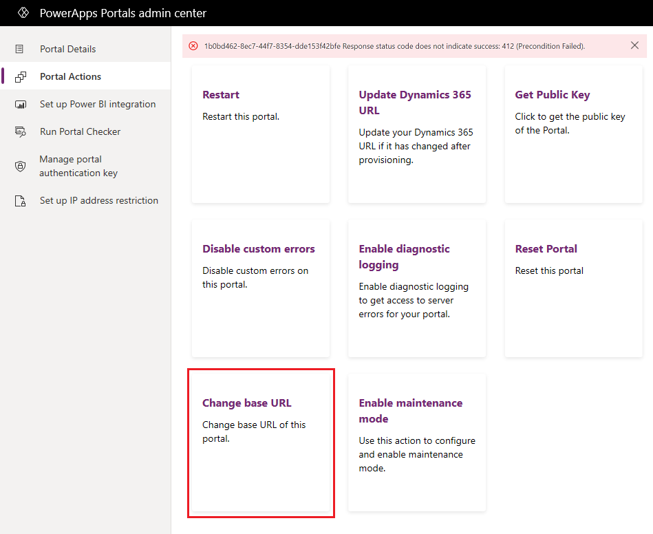

# Change the base URL of a portal

You can change the base URL of a portal after it is provisioned. For example, if you choose `contosocommunity.microsoftcrmportals.com` as the base URL when provisioning the portal, you can later change it to `contosocommunityportal.microsoftcrmportals.com` to meet your requirements.

> [!NOTE]
> Once you change the base URL of your portal, the older URL will no longer be accessible and it will become available for other customers to use for their portals.

1.	Open [Power Apps portals admin center](admin-overview.md).

2.	Go to **Portal Actions** > **Change base URL**. 

    > [!div class=mx-imgBorder]
    > 

3.	In the Change base URL window, enter the new base URL for the portal.

    > [!div class=mx-imgBorder]
    > 

4.	Select **Change URL** in the confirmation window.

## Troubleshooting

This section provides information about troubleshooting issues while changing the base URL of a portal.

### Changing the base URL fails

If changing the base URL of a portal fails, an error is displayed as shown in the following image:

> [!div class=mx-imgBorder]
> 

Typically, these are transient errors and you must select **Change base URL** to retry changing the base URL. If the issue persists, contact Microsoft support.

[!INCLUDE[footer-include](../../../includes/footer-banner.md)]