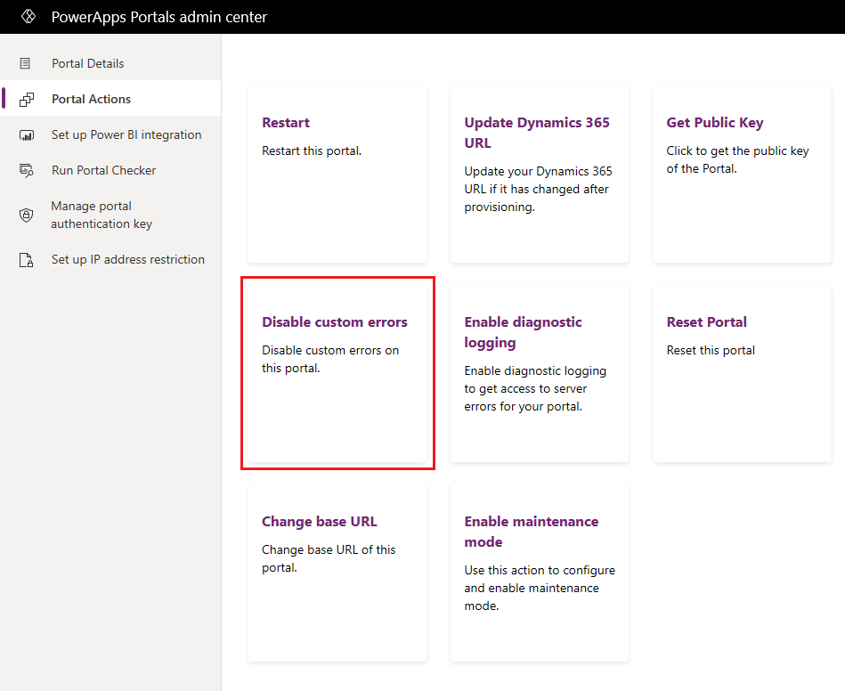
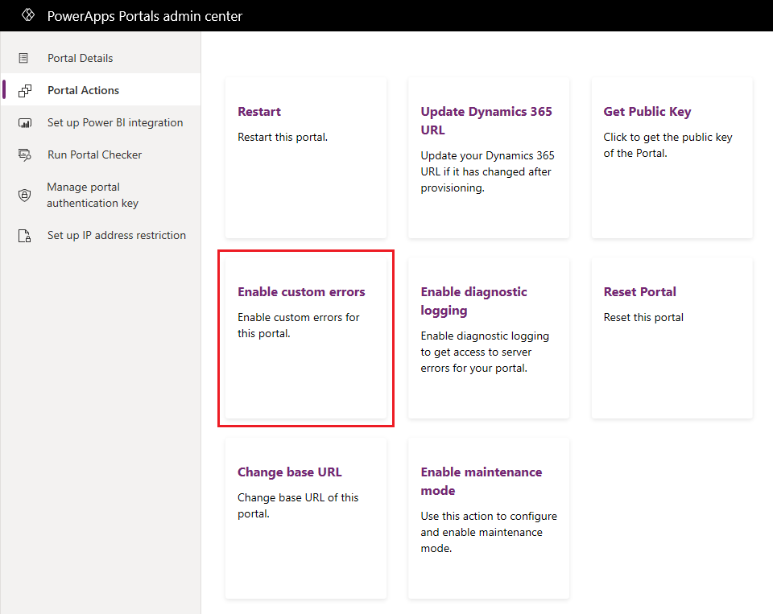
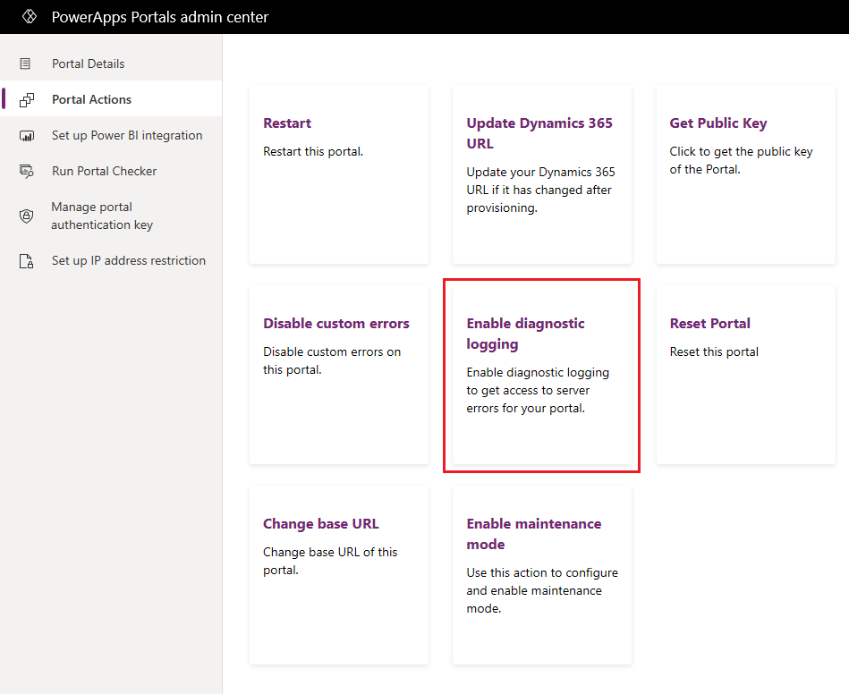
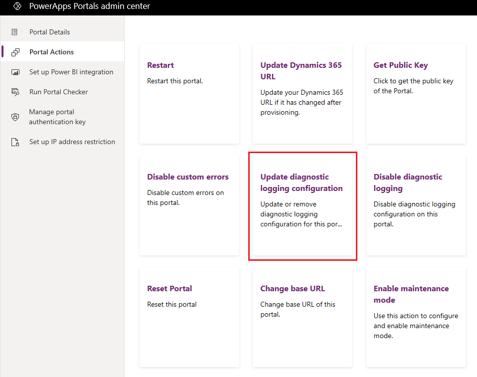
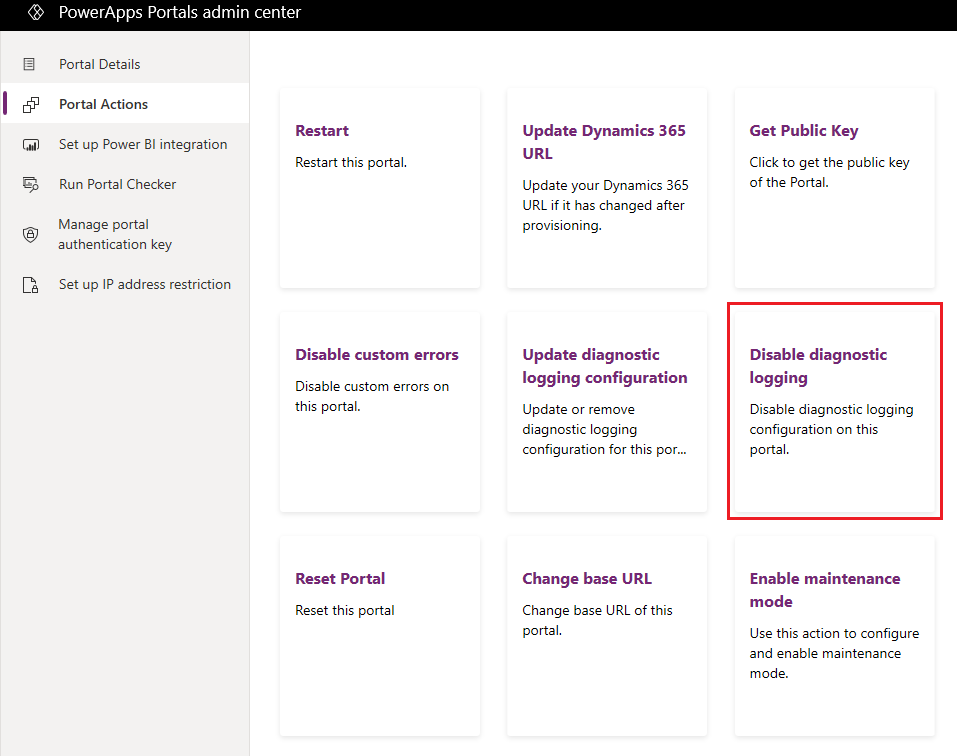

# View portal error logs

As a portal administrator or developer, you can use Power Apps portals to create a website for your customers. One common task for a developer is to debug issues while developing the portal. To help debug, you can access detailed error logs for any issues on your portal. There are multiple ways that you can get error logs for your portals.

> [!TIP]
> To learn about the roles required to perform tasks in this article, read [Admin roles required for portal administrative tasks](portal-admin-roles.md).

## Custom error

If any server-side exception occurs in your portal, a customized error page with a user-friendly error message is shown by default. To configure the error message, see [Display a custom error message](#display-a-custom-error-message).

However, it is better to see the ASP.NET detailed error page, also known as Yellow Screen of Death (YSOD), for debugging purposes. The detailed error page helps you to get the full stack of server errors.

> [!div class=mx-imgBorder]
> 

To enable YSOD, you need to [disable custom errors](#disable-custom-error) on your portal.

> [!NOTE]
> It is advisable to only disable custom errors when you are in the development phase and enable custom errors once you go live.

More information on custom error: [Displaying a Custom Error Page](https://docs.microsoft.com/aspnet/web-forms/overview/older-versions-getting-started/deploying-web-site-projects/displaying-a-custom-error-page-cs)

### Disable custom error

You can disable custom errors on portals to display the detailed exception message if any server-side exception occurs in your portal.

1. Open [Power Apps portals admin center](admin-overview.md).

2. Go to **Portal Actions** > **Disable custom errors**.

   > [!div class=mx-imgBorder]
   > 

3. Select **Disable** in the confirmation message. While custom errors are being disabled, the portal restarts and will be unavailable. A message appears when custom errors are disabled.

### Enable custom error

You can enable custom errors on portals to display a professional-looking page instead of YSOD. This page provides meaningful information if any exception occurs in the application.

1. Open [Power Apps portals admin center](admin-overview.md).

2. Go to **Portal Actions** > **Enable custom errors**.

   > [!div class=mx-imgBorder]
   > 

3. Select **Enable** in the confirmation message. While custom errors are being enabled, the portal restarts and will be unavailable. A message appears when custom errors are enabled.

> [!NOTE]
> - If you change the instance that your portal is connected to, the custom errors setting is set to enabled. You must disable the custom errors again, if required.
> - You must not enable or disable custom errors when the instance that your portal is connected to is being changed; otherwise an error message appears.

### Display a custom error message

You can configure your portal to display a professional-looking custom error instead of a generic error.

To define a custom error, use the content snippet `Portal Generic Error`. The content defined in this snippet is shown on the error page. This content snippet is not available out-of-the-box and you must create it. The content snippet **Type** can be **Text** or **HTML**. To create or edit the content snippet, see [Customize content by using content snippets](../configure/customize-content-snippets.md).

> [!NOTE]
> If liquid code is written in the content snippet, it will be skipped and not rendered.

When you enable custom errors, the message appears in the following structure on the error page:

<Content Snippet> 
<Error ID >
<Date and time>
<Portal ID>

Below is an example of a custom error message, using a content snippet of type HTML:

This is a custom error, please file a support ticket with screenshot of error by clicking here

> [!div class=mx-imgBorder]
> 

> [!NOTE]
> If the portal cannot retrieve a content snippet because it can't connect to Microsoft Dataverse or if the snippet is not available in Dataverse, an error message appears.

## Access portal error logs

After developing and publishing the portal, you still need to be able to access portal logs to debug issues reported by your customers. To access the logs, you can configure your portal to send all application errors to an Azure Blob storage account that you own. By accessing portal error logs, you can respond to customer queries efficiently because you have details of the issue. To get portal error logs into your Azure Blob storage, you must enable diagnostic logging from the Power Apps portals admin center.

> [!NOTE]
> If you change the Dataverse instance that your portal is connected to, diagnostic logging is disabled. You must enable diagnostic logging again.

### Enable diagnostic logging

1. Open [Power Apps portals admin center](admin-overview.md).

2. Go to **Portal Actions** > **Enable diagnostic logging**.

   > [!div class=mx-imgBorder]
   > 

3. In the **Enable diagnostic logging** window, enter the following values:

   - **Connection String of Azure Blob Storage service**: URL of the Azure Blob Storage service to store the portal error logs. The maximum length of the URL is 2048 characters. If the URL is longer than 2048 characters, an error message appears. More information on connection string: [Configure Azure Storage connection strings](https://docs.microsoft.com/azure/storage/common/storage-configure-connection-string)
   - **Select retention period**: Duration to keep the portal error logs in blob storage. The error logs are deleted after the selected duration. You can select one of the following values:
     - 1 day
     - 7 days
     - 30 days
     - 60 days
     - 90 days
     - 180 days
     - Always

   By default, the retention period is 30 days.
  
   > [!div class=mx-imgBorder]
   > 

4. Click **Configure**.

Once diagnostic logging is configured, a new **telemetry-logs** blob container is created in your Azure storage account and the logs are written into the blob files stored in the container. The following screenshot shows the **telemetry-logs** blob container in Azure Storage Explorer:

> [!div class=mx-imgBorder]
> 

When diagnostic logging is enabled successfully, the following action becomes available:
- **Update diagnostic logging configuration**: Allows you to update or remove diagnostic logging configuration for the portal.
- **Disable diagnostic logging**: Allows you to disable diagnostic logging configuration for the portal.
 
### Update diagnostic logging

1. Open [Power Apps portals admin center](admin-overview.md).

2. Go to **Portal Actions** > **Update diagnostic logging configuration**.

   > [!div class=mx-imgBorder]
   > 

3. In the Update diagnostic logging configuration window, enter the following values:
   - **Do you want to update the Connection string of the Azure Blob Storage service?**: Allows you to specify whether to update the connection string of the Azure Blob Storage service. By default, it is selected.
   - **Connection String of Azure Blob Storage service**: URL of the Azure Blob Storage service to store the portal error logs. The maximum length of the URL can be 2048 characters. If the URL is longer than 2048 characters, an error message appears. This field is displayed only if the **Do you want to update the Connection string of the Azure Blob Storage service?** check box is selected. More information on connection string: [Configure Azure Storage connection strings](https://docs.microsoft.com/azure/storage/common/storage-configure-connection-string)
   - **Select retention period**: Duration to keep the portal error logs in blob storage. The error logs are deleted after the selected duration. You can select one of the following values:
     - 1 day
     - 7 days
     - 30 days
     - 60 days
     - 90 days
     - 180 days
     - Always

   By default, the retention period is 30 days.

   > [!div class=mx-imgBorder]
   > 

4. Click **Update**.

### Disable diagnostic logging

1. Open [Power Apps portals admin center](admin-overview.md).

2. Go to **Portal Actions** > **Disable diagnostic logging**.

   > [!div class=mx-imgBorder]
   > 

3. Click **Disable** in the confirmation message.

## Display plugin error

Another scenario that often occurs while developing a portal is an error generated by custom plug-ins and business logic written in your Dataverse environment. These errors can generally be accessed by [disabling custom errors](#disable-custom-error) or [enabling diagnostic logging](#enable-diagnostic-logging). However, in some cases, it is faster to display these errors directly on the portal to diagnose the issue faster. To do this, you can configure your portal to display custom plugin errors from Dataverse on your portal screen.

To display custom plugin errors, create the site setting `Site/EnableCustomPluginError` and set its value to True. The custom plugin errors will be displayed on the screen instead of a generic error. The error will display only the message part of the plugin error and not the complete stack trace.

Following are the screens where custom plugin errors will appear: 
- Entity list 
    - Retrieval of records 
- Entity form 
    - Retrieve 
    - Create/Update and so on 
- Web forms 
    - Retrieve 
    - Create/Update and so on

If the site setting is not present, then it will be treated as false by default and plugin errors will not render.

### See also

[Microsoft Learn: Power App portal maintenance and troubleshooting](https://docs.microsoft.com/learn/modules/portals-maintenance-troubleshooting/)
