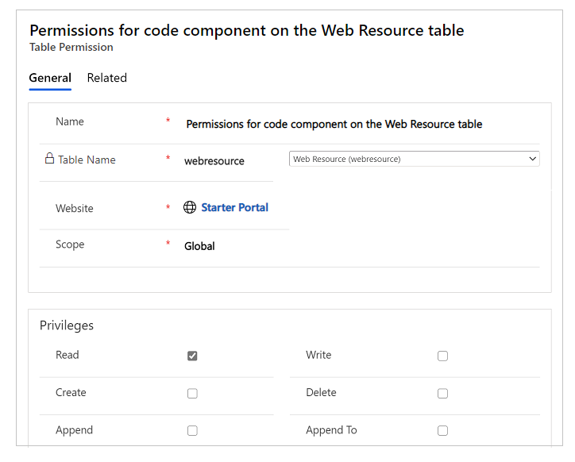
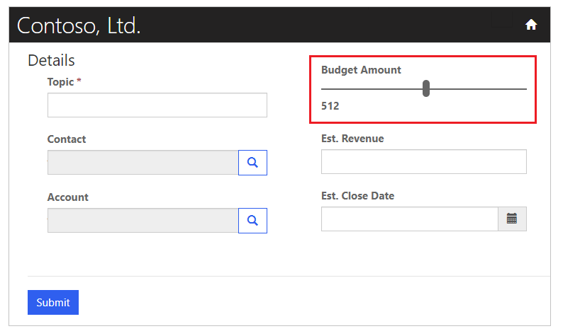

# Tutorial: Use code components in portals (Preview)

[This article is pre-release documentation and is subject to change.]

In this tutorial, you’ll create a sample component using Power Apps component
framework. You’ll then package this component to a Dataverse environment, and
then add the component to model-driven app. Then, you’ll configure Power Apps
portals to add the component to an basic form, set access for the Web Resource
table, and add the basic form to a web page. Finally, you’ll visit the portals
web page and interact with the component.

> [!IMPORTANT]
> - This is a preview feature.
> - [!INCLUDE[cc_preview_features_definition](../../includes/cc-preview-features-definition.md)]
> - Portals only supports [code components that are added to a field](../../developer/component-framework/add-custom-controls-to-a-field-or-entity.md#add-a-code-component-to-a-column) in a model-driven app currently.

## Prerequisites

- Your portal version must be [9.3.3.x](versions/version-9.3.3.x.md) or higher.
- Your starter portal package must be [9.2.2103.x](versions/package-version-9.2.2103.md) or higher.

> [!NOTE]
> This tutorial is based on the existing Power Apps component framework
tutorial that walks you through to create [TSLinearInputComponent](../../developer/component-framework/implementing-controls-using-typescript.md) for **Opportunity** table on the **Main** form. You can also use any existing or
new component, and any other table for this tutorial. In this case, ensure to
use your component and form when following the steps in this tutorial.

## Step 1. Create your first component

To create a sample component, follow the steps in the tutorial [Create your
first
component](../../developer/component-framework/implementing-controls-using-typescript.md).
At the end of this tutorial, you’ll have the component named
TSLinearInputComponent packaged and uploaded to your Dataverse environment.

## Step 2. Add a code component to a field in model-driven app

Now that you have the TSLinearInputComponent component uploaded to the Dataverse environment, follow the steps in the tutorial [Add a code component to a field in model-driven apps](../../developer/component-framework/add-custom-controls-to-a-field-or-entity.md)
to add the component to the **Opportunity** table on the **Main** form.

## Step 3. Verify the model-driven app with the new component

You can [update an existing model-driven app](../model-driven-apps/design-custom-business-apps-using-app-designer.md), or [create a new
app](../model-driven-apps/build-first-model-driven-app.md) with the form that you added the component to. For example, the following image shows how the
**Opportunity** table **Main** form looks like when using the code component in this tutorial.

## Step 4. Add code component to an basic form in portals

In this step, you’ll create a new basic form in portals. And then, add the
component to the created basic form. You can also use an existing basic form
instead.

### Step 4.1. Create a new basic form

1.  Open [Portal
    Management](configure/configure-portal.md)
    app.

2.  On the left-pane, under **Content**, select **Basic Forms.**

3.  Select **New**.

4.  Enter **Name**. For example, *Opportunities basic form with code
    component*.

5.  Select **Basic Name** as *Opportunity*.

6.  For **Form Name**, select the model-driven app form that you added the code
    component to earlier in this tutorial.

7.  Select the **Tab Name**.

8.  Select your portal **Website**.

    

9.  Select **Save & Close**.

### Step 4.2. Add code component to the basic form

1.  Open [Portal
    Management](configure/configure-portal.md)
    app.

2.  On the left-pane, under **Content**, select **Basic Forms.**

3.  Select the basic form that you created in the earlier in this tutorial.

4.  Select **Related**.

5.  Select **Basic Form Metadata**.

6.  Select **New Basic Form Metadata**.

7.  Select **Type** as **Attribute**.

8.  Select **Attribute Logical Unit Name** as *Budget Amount (budgetamount)*.

    

9.  Enter **Label**. For example, *Budget Amount*.

10. For **Control Style**, select **Code Component**.

    

11. Select **Save & Close**.

## Step 5. Allow Read access to Web Resource table

1.  Open [Portal
    Management](configure/configure-portal.md)
    app.

2.  On the left-pane, under **Security**, select **Table Permissions.**

3.  Select **New**.

4.  Enter **Name**. For example, *Permissions for code component on the Web
    Resource table*.

5.  Select **Table** as **Web Resource (webresource)**.

6.  Select your **Website**.

7.  For **Scope**, select **Global**.

8.  In **Privileges** section, select **Read**.

9.  Select **Save.**

    

10. Under **Web Roles**, select **Add Existing Web Role**.

11. Choose the web role as required. For example, choose *Authenticated Users*
    web role of a portal web site record to allow access to all authenticated
    users.

    

12. Select **Save & Close**.

## Step 6. Create a web page in portals with the basic form

1.  Open your portal in [Power Apps portals
    Studio](https://docs.microsoft.com/powerapps/maker/portals/portal-designer-anatomy).

2.  On the top-left corner, select **New page** drop-down menu.

3.  Select **Blank**.

4.  On the right-side property pane, update the webpage name. For example,
    *Opportunities.*

5.  Update partial URL. For example, o*pportunities.*

6.  Expand **Permissions**.

7.  Disable **Page available to everyone**.

8.  Select web roles that you want to allow to access this page.

9.  Inside the page editor, below the Header section, select the **Column**
    section.

10. On the left-pane, select **Components**.

11. Under **Portal components**, select **Form**.

12. On the right-side property pane, select **Use existing**.

13. Under **Name**, select the basic form that you created earlier in this
    tutorial.

    > [!TIP]
    > If you don’t see the form available, try **Sync Configuration** to
    synchronize changes from Dataverse.

14. On the top-right corner, select **Browse website**.

The web page now shows the basic form for **Opportunities** table with the code component as the slider, similar to how it appears using model-driven app for the same form.

## Next steps

[Overview: Use code components in portals](component-framework.md)

### See also

[Power Apps component framework overview](../../developer/component-framework/overview.md)  
[Create your first component](../../developer/component-framework/implementing-controls-using-typescript.md)  
[Add code components to a field or table in model-driven apps](../../developer/component-framework/add-custom-controls-to-a-field-or-entity.md)
