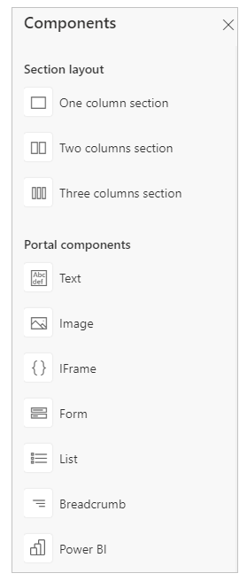

# WYSIWYG editor

[!INCLUDE[cc-pages-ga-banner](../../includes/cc-pages-ga-banner.md)]

After adding the required webpages and managing their hierarchy in the sitemap, you can add various components. The WYSIWYG (What You See Is What You Get) editor allows you to add and edit the required components on the canvas easily. You can add and edit the following components on the canvas:

- [Sections](add-sections.md)
    - One column section
    - Two columns section
    - Three columns section
- Components
    - [Text](add-text.md)
    - [Image](add-image.md)
    - [IFrame](add-iframe.md)
    - [Form](add-form.md)
    - [List](add-list.md)
    - [Breadcrumb](add-breadcrumb.md)
    - [Custom menu](add-custom-menu.md)
    - [Use code editor](use-code-editor.md)
    - [Power BI](add-powerbi.md)

> [!NOTE]
> If you customize your portal using Power Apps portals Studio, the website users would notice a performance impact. We recommended you to do the changes during non-peak hours on a live portal. 

To use the WYSIWYG editor:

1.  [Edit the portal](manage-existing-portals.md#edit) to open it in Power Apps portals Studio.  

2.  Select the page on which you want to add the component.

3.  Select an editable element on the canvas.

    > [!NOTE]
    > The editable elements are demarcated by a boundary.

4.  Select **Components**  from the left side of the screen.  

5.  Select the component to be added.

      

    The selected component is added to the canvas inside the editable element.

6.  To delete a component, select the component on the canvas and then select **Delete** on the command bar at the top of the page.

    > [!div class=mx-imgBorder]
      

## Next steps

[Add sections](add-sections.md)

### See also

- [Create and manage web pages](create-manage-webpages.md)
- [Integration with Power BI](/training/modules/portals-integration/3-power-bi)
- [Work with templates](work-with-templates.md)

[!INCLUDE[footer-include](../../includes/footer-banner.md)]
