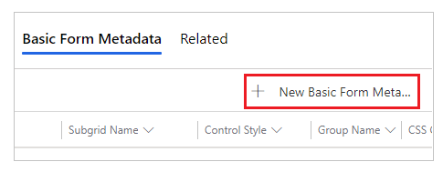
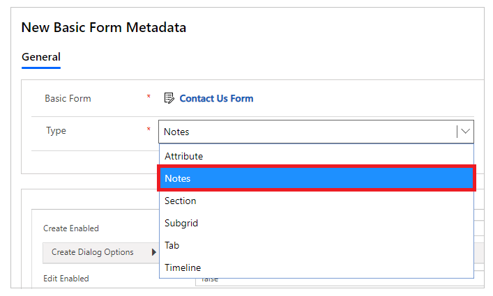
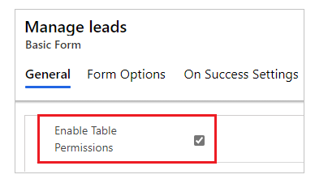
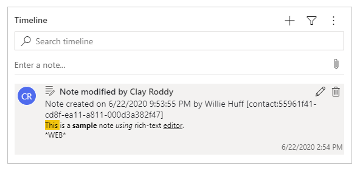
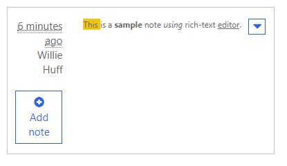
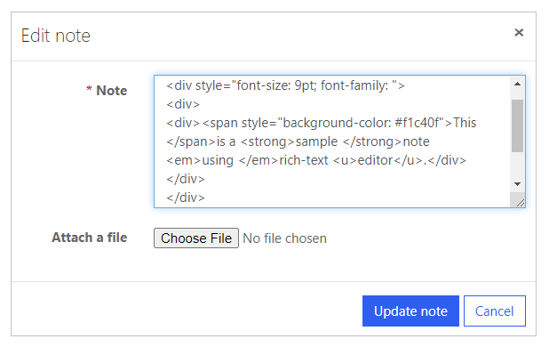
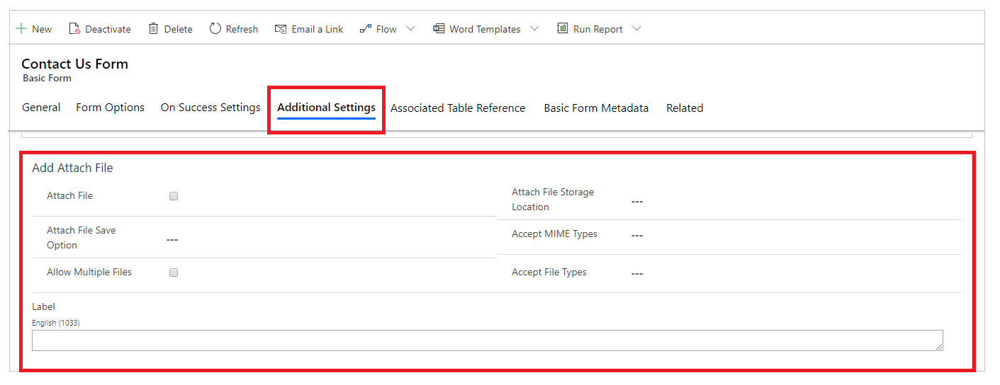
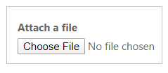

# Configure notes as attachments for basic and advanced forms

To add the ability to view notes and attachments on basic and advanced forms, you will need to complete the following steps:

- [Enable attachments for the table in Microsoft Dataverse](../data-platform/data-platform-create-entity.md#create-a-table).

- Add the [timeline control](../model-driven-apps/set-up-timeline-control.md) to the Dataverse forms through the model-driven app [form designer](../model-driven-apps/create-design-forms.md) or [Data workspace](/power-pages/configure/data-workspace-forms) if using the Power Pages design studio.

- Configure [table permissions](configure/assign-entity-permissions.md) for the notes (annotations) table.

You can further configure the behavior of the timeline control to allow site users to add, update, or delete notes and attachments by [configuring the form metadata](#notes-configuration-for-basic-forms) using the Portal Management app.

> [!NOTE]
> In order for a note to appear on the web page, the description of each note must be prefixed with **\*WEB\*** (*'WEB' keyword with an asterisk sign (\*) before and after*). Notes added through a form on a webpage will have the prefix automatically added.

## Notes configuration for basic forms

1. Open the [Portal Management](./configure/configure-portal.md) app.

1. Select **Basic Forms** under **Content** on the left pane.

    

1. From the list of forms, select to open a record of the form to which you want to add note configuration.

1. From the available tabs in form settings, select **Basic Form Metadata**.

    

1. Select **New Basic Form Metadata**.

    

1. Select **Type** as **Note**.

    

1. The notes configuration settings are displayed. Most of the settings are collapsed by default. You can expand a section to see more settings.

    

1. Fill in the fields by entering appropriate values. These settings are explained in more detail below under [Attributes](#attributes), [Create dialog options](#create-dialog-options), [Edit dialog options](#edit-dialog-options), and [Delete dialog options](#delete-dialog-options).

1. Save the form.

After adding the configuration, the note control will be rendered by using the appropriate options enabled on the portal.

### Attributes

| Name                  | Description                                                                                                                                                  |
|-----------------------|--------------------------------------------------------------------------------------------------------------------------------------------------------------|
| **Basic settings**    |                                                                                                                                                              |
| Create Enabled        | Enables the ability to add new notes to the table.                                                                                                          |
| Create Dialog Options | Contains settings for configuring the dialog box when **Create Enabled** is set to true. More information: [Create dialog options](#create-dialog-options).                                 |
| Edit Enabled          | Enables the ability to edit existing notes on the table.                                                                                                    |
| Edit Dialog Options   | Contains settings for configuring the dialog box when **EditEnabled** is set to true. More information: [Edit dialog options](#edit-dialog-options)                                         |
| Delete Enabled        | Enables the ability to delete notes from the table.                                                                                                         |
| Delete Dialog Options | Contains settings for configuring the dialog box when **DeleteEnabled** is set to true. More information: [Delete dialog options](#delete-dialog-options).           |
|File Attachment Location | Select the location of the file attachment:<ul><li>Note attachment</li><li>Azure Blob Storage</li></ul>|
|Accept MIME Type(s) | Allows you to specify a list of accepted MIME types. |
|Restrict MIME Types | Select whether to allow or restrict MIME types.|
|Maximum File Size (in KB) |Allows you to specify the maximum size of a file that can be attached. The maximum size of files that can be uploaded is determined by the *Maximum file size* setting in the [system settings email tab](/power-platform/admin/system-settings-dialog-box-email-tab) in the environment system settings dialog box. |
| **Advanced settings** |                                                                                                                                                              |
| List Title            | Overrides the title over the Notes area.                                                                                                                     |
| Add Note Button Label | Overrides the label on the Add Notes button.                                                                                                                 |
| Note Privacy Label    | Overrides the label denoting that a note is private.                                                                                                         |
| Loading Message       | Overrides the message shown while the list of notes is loading.                                                                                              |
| Error Message         | Overrides the message shown when an error occurs while trying to load the list of notes.                                                                     |
| Access Denied Message | Overrides the message shown when the user doesn't have sufficient permissions to view the list of notes.                                                    |
| Empty Message         | Overrides the message shown when the current table doesn't have any notes that can be viewed.                                                              |
| List Orders           | Allows you to set the order in which notes will be displayed. The List Orders setting allows you to set the following options: <ul><li>Attribute: The logical name of the column by which you wish to sort</li><li>Alias: The alias for the attribute in the query</li><li>Direction: Ascending (smallest to largest, or first to last), or Descending (largest to smallest, or last to first).</li></ul>      To add a sorting rule, select "Column" (4) and fill in the details. List Orders will be processed in order from the top of the list having highest priority.|
||

#### Create dialog options

| Name                               | Description                                                                                                                                 |
|------------------------------------|---------------------------------------------------------------------------------------------------------------------------------------------|
| **Basic settings**                 |                                                                                                                                             |
| Display Privacy Options Field      | Enables a checkbox in the Add Note dialog box that allows the user to mark a note as private.                                                   |
| Privacy Option Field Default Value | Specifies the default value for the Display Privacy Options Field. The default value of this field is false.                     |
| Display Attach File                | Enables a file upload field in the Add Note dialog box, allowing a user to attach a file to a note.    **Note**: Only one file can be attached using this option.                                            |
| Attach File Accept                 | The MIME type accepted by the file upload input.                                                                                            |
| **Advanced settings**              |                                                                                                                                             |
| Note Field Label                   | Overrides the label for the Note field in the Add Note dialog box.                                                                              |
| Note Field Columns                 | Sets the columns value in the Note &lt;textarea&gt;.                                                                                            |
| Note Field Rows                    | Sets the rows value in the Note &lt;textarea&gt;.                                                                                            |
| Privacy Option Field Label         | Overrides the label for the Privacy Option Field (if enabled).                                                                              |
| Attach File Label                  | Overrides the label for the attached file (if enabled).                                                                                 |
| Left Column CSS Class              | Adds the CSS class or classes to the leftmost column containing labels in the Add Note dialog box.                                                  |
| Right Column CSS Class             | Adds the CSS class or classes to the rightmost column containing field inputs in the Add Note dialog box.                                           |
| Title                              | Overrides the HTML text in the header of the Add Note dialog box.                                                                               |
| Primary Button Text                | Overrides the HTML that appears in the Primary (Add Note) button in the dialog box.                                                           |
| Dismiss Button SR Text             | Overrides the screen reader text associated with the dialog box's dismiss button.                                                               |
| Close Button Text                  | Overrides the HTML that appears in the Close (Cancel) button in the dialog box.                                                               |
| Size                               | Specifies the size of the Add Note dialog box. The options are Default, Large, and Small.  |
| CSS Class                          | Specify a CSS class or classes that will be applied to the resulting dialog box.                                                                |
| Title CSS Class                    | Specifies a CSS class or classes that will be applied to the resulting dialog box's title bar.                                                    |
| Primary Button CSS Class           | Specifies a CSS class or classes that will be applied to the dialog box's Primary (Add Note) button.                                            |
| Close Button CSS Class             | Specifies a CSS class or classes that will be applied to the dialog box's Close (Cancel) button.                                                |
|||

#### Edit dialog options

| Name                               | Description                                                                                                                                   |
|------------------------------------|-----------------------------------------------------------------------------------------------------------------------------------------------|
| **Basic settings**                 |                                                                                                                                               |
| Display Privacy Options Field      | Enables a checkbox in the Edit Note dialog box that allows the user to mark a note as private.  |
| Privacy Option Field Default Value | Specifies the default value for the Display Privacy Options Field. The default value of this field is false.   |
| Display Attach File                | Enables a file upload field in the Edit Note dialog box, allowing a user to attach a file to a note.   **Note**: Only one file can be attached using this option.                     |
| Attach File Accept                 | The MIME type accepted by the file upload input. |
| **Advanced settings**              |                                                                                              |
| Note Field Label                   | Overrides the label for the Note field in the Edit Note dialog box.|
| Note Field Columns                 | Sets the columns value in the Note &lt;textarea&gt;.                                                                                             |
| Note Field Rows                    | Sets the rows value in the Note &lt;textarea&gt;.                                                                                             |
| Privacy Option Field Label         | Overrides the label for the Privacy Option Field (if enabled).                                                                                
| Attach File Label                  | Overrides the label for the attached file (if enabled).                                                                                     |
| Left Column CSS Class              | Adds the CSS class or classes to the leftmost column containing labels in the Edit Note dialog box.                                                  |
| Right Column CSS Class             | Adds the CSS class or classes to the rightmost column containing field inputs in the Edit Note dialog box.                                           |
| Title                              | Overrides the HTML text in the header of the Edit Note dialog box.                                                                               |
| Primary Button Text                | Overrides the HTML that appears in the Primary (Update Note) button in the dialog box.                                                         |
| Dismiss Button SR Text             | Overrides the screen reader text associated with the dialog box's dismiss button.                                                                |
| Close Button Text                  | Overrides the HTML that appears in the Close (Cancel) button in the dialog box.                                                                |
| Size                               | Specifies the size of the Edit Note dialog box. The options are Default, Large, and Small. |
| CSS Class                          | Specifies a CSS class or classes that will be applied to the resulting dialog box.                                                                 |
| Title CSS Class                    | Specifies a CSS class or classes that will be applied to the resulting dialog's title bar.                                                     |
| Primary Button CSS Class           | Specifies a CSS class or classes that will be applied to the dialog box's Primary (Update Note) button.                                          |
| Close Button CSS Class             | Specifies a CSS class or classes that will be applied to the dialog box's Close (Cancel) button.                                                 |
|||

#### Delete dialog options

| Name                     | Description                                                                                                                                       |
|--------------------------|------------------------------|
| **Basic settings**       |                                                                                                                                                   |
| Confirmation             | Overrides the confirmation message to delete the note.                                                                                             |
| **Advanced settings**    |                                                                                                                                                   |
| Title                    | Overrides the HTML text in the header of the Delete Note dialog box.                                                                                  |
| Primary Button Text      | Overrides the HTML that appears in the Primary (Delete) button in the dialog box.                                                                   |
| Dismiss Button SR Text   | Overrides the screen reader text associated with the dialog box's dismiss button.                                                                     |
| Close Button Text        | Overrides the HTML that appears in the Close (Cancel) button in the dialog box.                                                                     |
| Size                     | Specifies the size of the Delete Note dialog box. The options are Default, Large, and Small.  |
| CSS Class                | Specifies a CSS class or classes that will be applied to the resulting dialog box.                                                                      |
| Title CSS Class          | Specifies a CSS class or classes that will be applied to the resulting dialog box's title bar.                                                          |
| Primary Button CSS Class | Specifies a CSS class or classes that will be applied to the dialog box's Primary (Delete) button.                                                    |
| Close Button CSS Class   | Specifies a CSS class or classes that will be applied to the dialog box's Close (Cancel) button.                                                      |
|||

### Assign table permissions

Notes, and the **Add**, **Edit**, and **Delete** buttons for the note control will be hidden on the basic or advanced form unless you create and assign the appropriate table permissions to the records as follows:

> [!IMPORTANT]
> A user must sign-in and be the creator of the note to edit or delete it using the portal. Users can't edit or delete a note created by others, even if you assign them table permissions.

1. Ensure the **Enable Table Permissions** checkbox is selected on the form for which you want notes to appear.

    

1. For the table that has the notes control enabled, create a table permission with the required privileges. The scope should be appropriately set depending on the level of access required to end users.

    For example, create a table permission for a Lead table that shows notes on the basic form, with privileges including Read, Write, Create, Append, and Append To.

    

1. [Associate the table permission with a web role](configure/assign-entity-permissions.md#add-table-permissions-to-a-web-role) for the user.

    For example, add the table permission created in the previous step to the Lead Manager web role.

    

1. Create a table permission for the **Annotation** table with the [Parental access type](configure/assign-entity-permissions.md#parental-access-type) and required privileges as explained in the table below. The **Parent Table Permission** must be set to the same table permissions created in step 2.

    | Note action | Required permissions |
    | - | - |
    | **Read** | Read |
    | **Add** | Create, Append (Append To required on Parent Table Permission) |
    | **Edit** | Write |
    | **Delete** | Delete |

    For example, create a table permission for the Annotation table, with the Leads table permission created in the previous steps set as the parent table.
    
    

### Notes created with rich-text editor

You can view the notes created using the [Rich text editor control configurations](../model-driven-apps/rich-text-editor-control.md) on your portal webpage. However, when you try to edit, you'll see the text in HTML markup format.

For example, this note shows rich-text format in the model-driven app.

The portal webpage shows the note in rich-text format.

However, when editing the note from the portal webpage, you see the note in HTML markup format.

> [!IMPORTANT]
> If you try to save a note with HTML markup using the portal, you'll receive this error: *We're sorry, but something went wrong. Please try again, and if this persists, contact the website administrator.* To save the notes with HTML markup using the portal, you'll have to disable the request validation. However, disabling request validation applies to the entire website. For the steps to disable the request validation, and to understand its impact, go to [request validation](configure/entity-forms.md#request-validation).

## Notes configuration for advanced forms

Advanced form notes are configured in the same way as [basic form notes](#notes-configuration-for-basic-forms). Create a metadata record for the Advanced Form Step that has notes first, and then add the notes configuration metadata.

## Enable file attachment on form

Enable **Attach File** option for the **Basic Form** to show the attachment option available with the notes.

To enable attachment on a basic form:

1. Open the [Portal Management](configure/configure-portal.md) app.

1. Select **Basic Forms** under **Content** on the left pane.

    

1. From the list of forms, select to open a record of the form to which you want to add note configuration.

1. Select **Additional Settings** for the form. Configure the additional settings as per the fields explained in the section below.

    

### Additional settings for file attachment

| Name | Description
| - | - 
| Attach File | Check the box to enable file attachments on the form.
| Attach File Save Option | Select **Notes** or **Portal Comments** to save file attachments. For notes attachments, select **Notes**.
| Allow Multiple Files | Check the box to allow multiple file attachments.
| Label | Specify a label for the attachment option.
| Attach File Storage Location | Select the location of the file attachment:<ul><li>Note attachment</li><li>Azure Blob Storage</li></ul>
| Accept MIME Types | Specify a list of accepted MIME types.
| Accept File Types | Specify a list of accepted file types. This option is only available when using the **Portal Comments** option for **Attach File Save Option**. 

### Attach a file option

After you configure the notes and enable notes attachments, you can see the **Attach File** option on the form.

