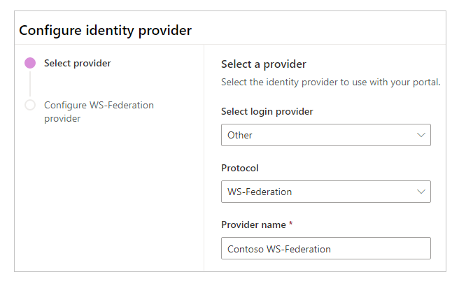
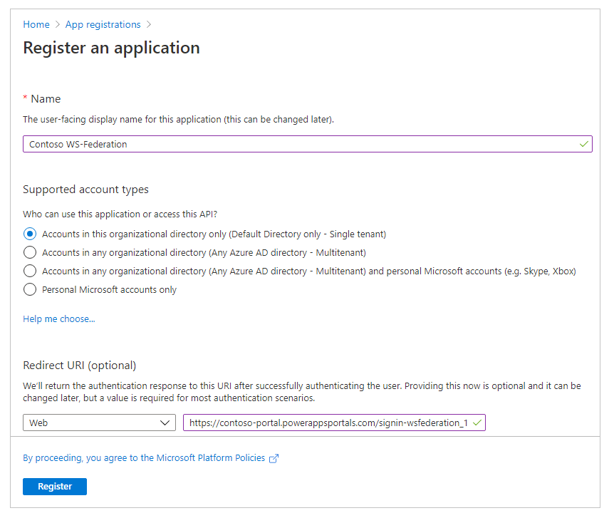
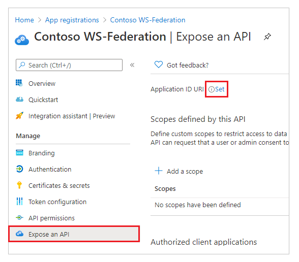
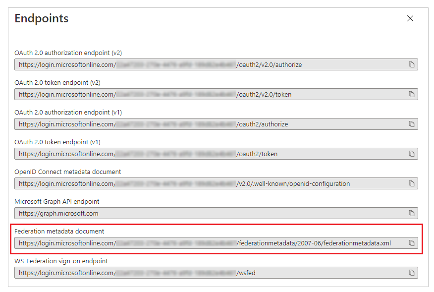
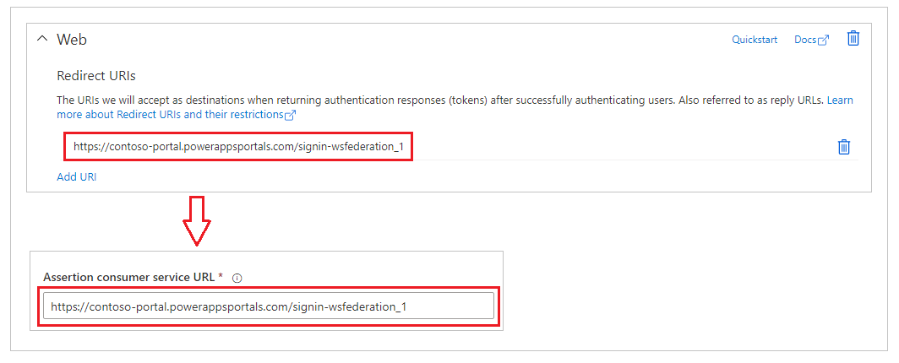
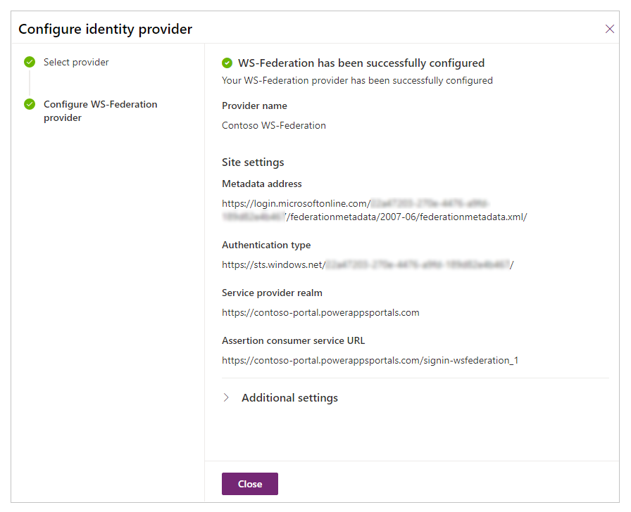

# Configure a WS-Federation provider for portals with Azure AD

In this article, you'll learn about configuring a WS-Federation provider for portals by using Azure Active Directory (Azure AD).

> [!NOTE]
> - The portals feature isn't limited to only Azure AD, multitenant Azure AD, or Azure AD B2C as the WS-Federation providers. You can use any other provider that conforms to the WS-Federation specification.
> Changes to the authentication settings [might take a few minutes](../admin/clear-server-side-cache.md#caching-changes-for-portals-with-version-926x-or-later) to be reflected on the portal. Restart the portal by using [portal actions](../admin/admin-overview.md) if you want the changes to be reflected immediately.

**To configure Azure AD as the WS-Federation provider**

1. Select [Add provider](use-simplified-authentication-configuration.md#add-configure-or-delete-an-identity-provider) for your portal.

1. For **Login provider**, select **Other**.

1. For **Protocol**, select **WS-Federation**.

1. Enter a provider name.

    

1. Select **Next**.

1. In this step, you create the application and configure the settings with your identity provider.

    

    > [!NOTE]
    > - The Reply URL is used by the app to redirect users to the portal after the authentication succeeds. If your portal uses a custom domain name, you might have a different URL than the one provided here.
    > - More details about creating the app registration on the Azure portal are available in [Quickstart: Register an application with the Microsoft identity platform](/azure/active-directory/develop/quickstart-register-app).

    1. Sign in to the [Azure portal](https://portal.azure.com).

    1. Search for and select **Azure Active Directory**.

    1. Under **Manage**, select **App registrations**.

    1. Select **New registration**.

        

    1. Enter a name.

    1. If necessary, select a different **Supported account type**. More information: [Supported account types](/azure/active-directory/develop/quickstart-register-app)

    1. Under **Redirect URI**, select **Web** (if it isn't already selected).

    1. Enter the **Reply URL** for your portal in the **Redirect URI** text box.   Example: `https://contoso-portal.powerappsportals.com/signin-wsfederation_1`

        > [!NOTE]
        > If you're using the default portal URL, copy and paste the **Reply URL** as shown in the **Create and configure WS-Federation provider settings** section on the **Configure identity provider** screen (step 6 above). If you're using a custom domain name for the portal, enter the custom URL. Be sure to use this value when you configure the **Assertion consumer service URL** in your portal settings while configuring the WS-Federation provider.   For example, if you enter the **Reply URL** in Azure portal as `https://contoso-portal.powerappsportals.com/signin-wsfederation_1`, you must use it as-is for the WS-Federation configuration in portals.

        

    1. Select **Register**.

    1. Select **Expose an API**.

    1. For **Application ID URI**, select **Set**.

        

    > [!IMPORTANT]
    > Due to a recent update, the APP ID URI must be the auto-generated URI or a verified custom domain name.

    1. To use the auto-generated URI, select **Save**. You'll need to [manually update the value](#update-app-id-uri-in-site-settings) in site settings after you configure settings using the studio.
       
    1. If you're using a custom domain name, enter the portal URL as the **App ID URI**.

        :::image type="content" source="media/authentication/custom-portal-url-for-appidURI.png" alt-text="Custom Portal URL as the application ID URI.":::

    1. Select **Save**.

    1. Keep the Azure portal open, and switch to the WS-Federation configuration for Power Apps portals for the next steps.

1. In this step, you enter the site settings for the portal configuration.

    :::image type="content" source="media/authentication/configure-wsfed-site-settings-custom.png" alt-text="Configure WS-Federation site settings.":::

    > [!TIP]
    > If you closed the browser window after configuring the app registration in the earlier step, sign in to the Azure portal again and go to the app that you registered.

    1. **Metadata address**: To configure the metadata address, do the following:

        1. Select **Overview** in the Azure portal.

        1. Select **Endpoints**.

          

        1. Copy the URL for **Federation metadata document**.

           

        1. Paste the copied document URL as the **Metadata address** for portals.

    1. **Authentication type**: To configure the authentication type, do the following:

        1. Copy and paste the **Metadata address** configured earlier in a new browser window.

        1. Copy the value of `entityID` tag from the URL document.

            

        1. Paste the copied value of `entityID` as the **Authentication type**.   Example: `https://sts.windows.net/7e6ea6c7-a751-4b0d-bbb0-8cf17fe85dbb/`

    1. **Service provider realm**: Enter the custom portal URL as the service provider realm.   Example: `https://portal.contoso.com`
    
        > [!NOTE]
        > If you selected to use the auto-generated App ID URI, leave the default value and you will need to manually update this value using the [Portal Management app](#update-app-id-uri-in-site-settings) after you save the values on this window.
        
    1. **Assertion consumer service URL**: Enter the **Reply URL** for your portal in the **Assertion consumer service URL** text box.   Example: `https://contoso-portal.powerappsportals.com/signin-saml_1`

        

        > [!NOTE]
        > If you're using the default portal URL, you can copy and paste the **Reply URL** as shown in the **Create and configure WS-Federation provider settings** step. If you're using a custom domain name, enter the URL manually. Be sure that the value you enter here is exactly the same as the value you entered as the **Redirect URI** in the Azure portal earlier.

1. Select **Confirm**.

    

1. Select **Close**.

### Update App ID URI in site settings

1. If you're using the auto-generated URI for the App ID URI, you'll need to update the value in site settings.
    
    1. Open the Portal Management app.
    1. Navigate to **Site Settings**.
    1. Update the site setting **Authentication/WsFederation/WSFederation_1/Wtrealm** with the auto-generated **APP ID URI**
    :::image type="content" source="media/authentication/site-setting-wtrealm.png" alt-text="Configure site setting for the auto-generated URI.":::

    1. Select **Save**

### See also

[Configure a WS-Federation provider for portals](configure-ws-federation-provider.md)  
[Configure a WS-Federation provider for portals with AD FS](configure-ws-federation-settings.md)

