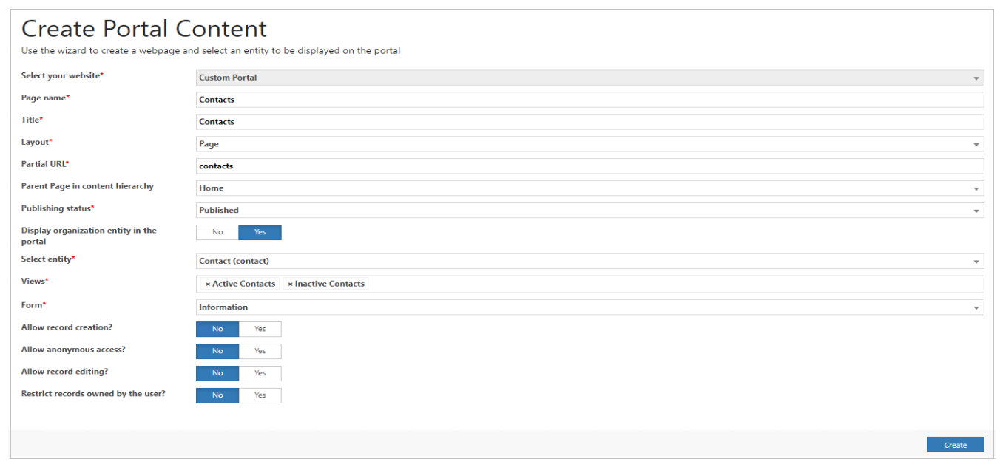

# Create and show portal content using Portal Management app

To create a webpage by using entity forms and entity lists is a complex task. **Create Portal Content** wizard simplifies this process. You can use this wizard to create and expose portal content easily by filling in the minimum required fields.

1. Open the [Portal Management](configure-portal.md) app.

1. From the left pane, under **Administration**, select **Create Portal Content**. The Create Portal Content window appears.

4. Specify the required details. If you need extra help, point to any field to read the tooltips.

    - The **Select your website** field is prepopulated if only one website is available. The list is sorted alphabetically by the website name.
    - The **Parent page in the content hierarchy** field is prepopulated with the Home page.
    - The **Partial URL** field is populated based on the page name entered. If required, you can change the value.
    - The **Layout** field is prepopulated with the layout that is marked as default.
    - If you choose to expose the entity by selecting **Expose organization entities in the portal**, a few additional fields are displayed to gather information required to expose an entity by using entity forms and entity lists. If you need extra help, hover over any field to read the tooltips. You can also select multiple views.

5. Select **Create**.

     

### See also

[Configure portal using Portal Management app](configure-portal.md)
