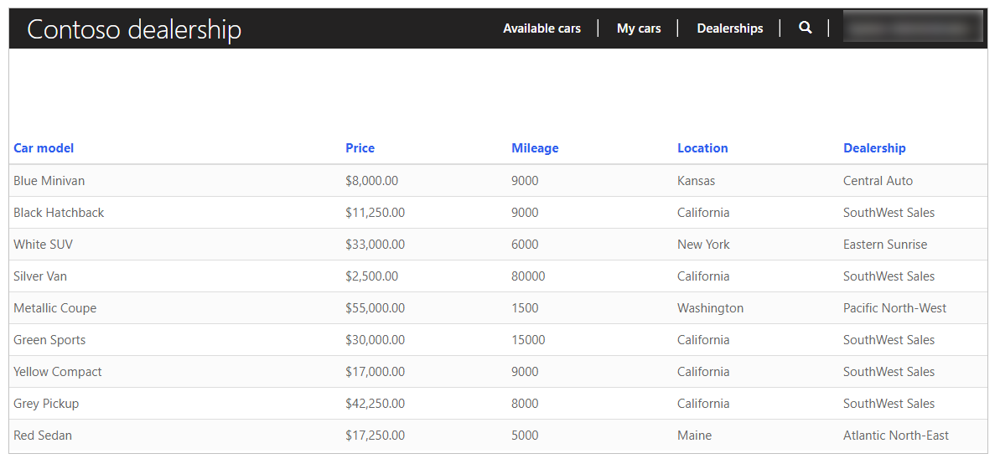
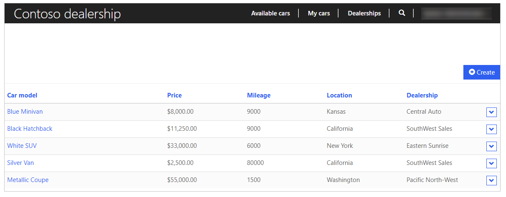
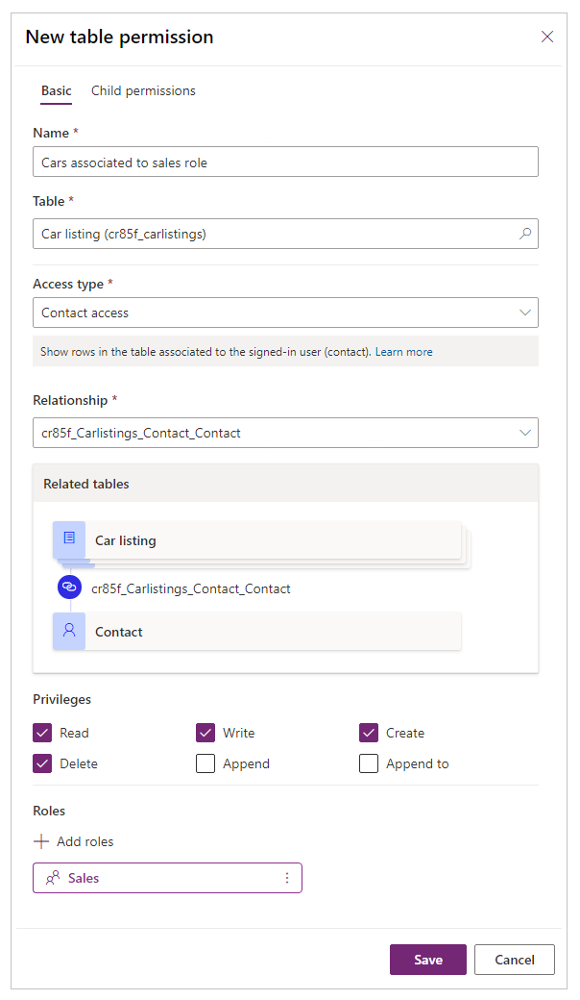
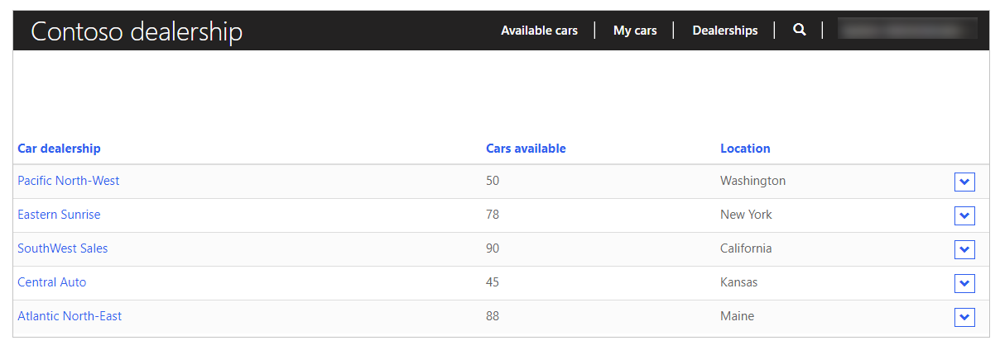
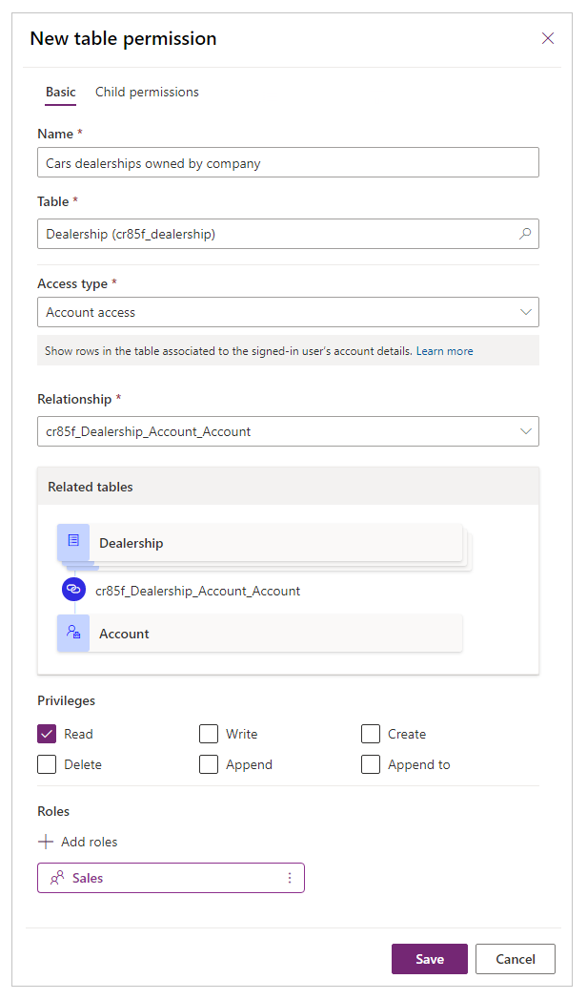

# Tutorial: Configure table permissions using portals Studio (Preview)

[This article is pre-release documentation and is subject to change.]

In the previous article, you learned about how to configure security in portals by using table permissions configuration from Power Apps portals Studio. In this article, you'll learn about configuring the table permissions using Power Apps portals Studio with a sample scenario and step-by-step tutorial.

The goal of using this scenario is to show how to use portals Studio to configure table permissions with real-world case study. The scenario showcases using each [access type available in portals Studio](entity-permissions-studio.md#available-access-types-in-studio) to match the real-world scenario with a business requirement with the relevant Microsoft Dataverse tables, and table relationships.

> [!IMPORTANT]
> - This is a preview feature.
> - [!INCLUDE[cc_preview_features_definition](../../../includes/cc-preview-features-definition.md)]

## Prerequisites

Before you begin with this scenario, understand how to use Power Apps portals Studio to configure table permissions. You'll also need a portal, and access to the Dataverse environment.

> [!NOTE]
> This tutorial does not include configuration of web pages, basic or advanced forms, or Dataverse tables. The focus of this tutorial is configuration of table permissions using Studio. To create pages and customize them, see [Build portals using portals Studio](../portal-designer-anatomy.md). To create and configure tables in Dataverse, see [Tables in Dataverse](../../data-platform/entity-overview.md).

## Scenario

For this tutorial scenario, consider an example of Contoso Limited that deals with buying and selling used cars. Contoso has a B2B (business-to-business) portal to manage the inventory posted by sales staff at the car dealerships across the country.

### Roles

Contoso has the following web roles available.

- **Authenticated users** - default role for all authenticated users.
- **Anonymous users** - default role for all anonymous users.
- **Admin** - IT Administrators for Contoso.
- **Sales** - Sales staff to manage car sales across dealerships.
- **Managers** - Managers of the sales and dealership staff.

### Tables

Contoso uses the following Dataverse tables for this configuration.

- **Car listings** - contains listings of all cars in Contoso inventory across all dealerships.
- **Dealerships** - contains details about all car dealerships along with the address and inventory summary.

Along with the above tables, this scenario also uses existing tables such as **Contact**, and **Account**.

### Relationships

Contoso has the following relationships configured between tables in Dataverse.

- **Account (One) to Dealerships (Many)** - One account can own multiple dealerships.
- **Contact (One) to Car listings (Many)** - One sales staff (contact) can have multiple car listings.
- **Dealership (One) to Car listings (Many)** - One dealership can have multiple car listings.

### Customizations

Contoso has the following customizations configured for this scenario.

- Web pages have table permissions enabled. More information: [Manage page permissions](webpage-access-control.md)
- Web pages have [lists](entity-lists.md) configured with the tables, views, and the ability to create/view/edit/delete records as appropriate.
    - To show [all car listings to all authenticated users](#view-all-car-listings), the web page has list with a view from the **Car listings** table with only View record permission.
    - To show, update, and delete [owned car listings](#view-update-and-delete-owned-car-listings), the web page has list with a view from the **Car listings** table having View, Create, Edit, and Delete records permissions.
    - To show [all car dealerships](#view-all-car-dealerships), the web page has list with a view from the **Dealerships** table having View, Create, Edit, and Delete records permissions.
    - To show [car listings for an associated dealership](#view-car-listings-for-associated-dealership), the web page has a list with a view from the **Dealerships** table. This list can be used to view the dealership details, with view having subgrid that shows the car listings associated to the selected dealership with View, Create, Edit, and delete records permissions.

## View all car listings

Contoso has a web page with a basic form that shows all current car listings in the inventory to all authenticated users.

To configure table permissions for global access to all authenticated users:

1. Sign in to [Power Apps](https://make.powerapps.com).

1. Select **Apps** on the left-pane.

1. Select your portal.

1. Select **Edit** to open portals Studio.

1. Select **Settings** (:::image type="icon" source="media/entity-permissions-studio/settings.png":::) on the left pane inside portals Studio.

1. Select **Table permissions**.

1. Select **New permission**.

1. Enter table permission name as "All available cars".

1. Select **Car listings** table.

1. Select **Global access** for access type.

1. Select **Read** privilege.

1. Select **Add roles**.

1. From the list of available roles, select **Authenticated users**.

    

1. Select **Save**.

## View, update and delete owned car listings

Contoso has a web page with a basic form that allows sales staff to view, update, and delete car listings that they have created.

To configure table permissions for contact access to owning sales staff:

1. Sign in to [Power Apps](https://make.powerapps.com).

1. Select **Apps** on the left-pane.

1. Select your portal.

1. Select **Edit** to open portals Studio.

1. Select **Settings** (:::image type="icon" source="media/entity-permissions-studio/settings.png":::) on the left pane inside portals Studio.

1. Select **Table permissions**.

1. Select **New permission**.

1. Enter table permission name as "Cars associated to sales role".

1. Select **Car listings** table.

1. Select **Contact access** as the access type.

1. Select relationship between the Contact, and the Car listings table.

1. Select **Read**, **Write**, **Create**, and **Delete** privileges.

1. Select **Add roles**.

1. From the list of available roles, select **Sales**.

    

1. Select **Save**.

## View all car dealerships

Contoso has a web page with a basic form that allows sales staff to view all the car dealerships owned by their company.

To configure table permissions for account access to sales staff for dealerships:

1. Sign in to [Power Apps](https://make.powerapps.com).

1. Select **Apps** on the left-pane.

1. Select your portal.

1. Select **Edit** to open portals Studio.

1. Select **Settings** (:::image type="icon" source="media/entity-permissions-studio/settings.png":::) on the left pane inside portals Studio.

1. Select **Table permissions**.

1. Select **New permission**.

1. Enter table permission name as "Cars dealerships owned by company".

1. Select **Dealerships** table.

1. Select **Account access** as the access type.

1. Select relationship between the Account, and the Dealerships table.

1. Select **Read** privilege.

1. Select **Add roles**.

1. From the list of available roles, select **Sales**.

    

1. Select **Save**.

## View car listings for associated dealership

Contoso has a web page with a basic form that allows sales staff to view car listings from the dealerships that the sales staff is associated to.

To configure table permissions for sales staff to view associated dealership's car listings:

1. Sign in to [Power Apps](https://make.powerapps.com).

1. Select **Apps** on the left-pane.

1. Select your portal.

1. Select **Edit** to open portals Studio.

1. Select **Settings** (:::image type="icon" source="media/entity-permissions-studio/settings.png":::) on the left pane inside portals Studio.

1. Select **Table permissions**.

1. Select **Car dealerships owned by company** table permission created earlier.

1. Select **Add child permission**.

1. Enter table permission name as "Cars in dealerships".

1. Select **Car listings** table.

1. Select relationship between the Dealerships, and the Car listings table.

1. Select **Read** privilege.

1. From the list of available roles, select **Sales**.

    

    > [!NOTE]
    > **Sales** role is inherited from the parent table permission.

1. Select **Save**.

## Summary

Now that you have all the table permissions configured, this is how the permissions look like inside portals Studio.

- **All available cars** - This table permission allows all authenticated users to view all car listings across all dealerships using **Global access** access type.
- **Cars associated to sales role** - This table permission allows each sales staff to view the car listings created by themselves using **Contact access** access type.
- **Car dealerships owned by company** - This table permission allows sales staff to view all dealerships across the company using **Account access** access type.
- **Cars in dealerships** - This child permission with is associated to the **Car dealerships owned by company** table permission. And allows sales staff to view car listings associated to their assigned dealership using **Associated access** access type (through child permission).

This scenario explained how to configure table permissions in a real-world scenario to achieve business goals. You can now use the learnings from this tutorial to configure table permissions for your portal to meet your business requirements.

### See also

[Assign table permissions](assign-entity-permissions.md)  
[Table permissions using portals Studio](entity-permissions-studio.md)
