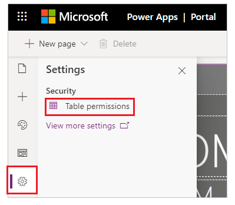
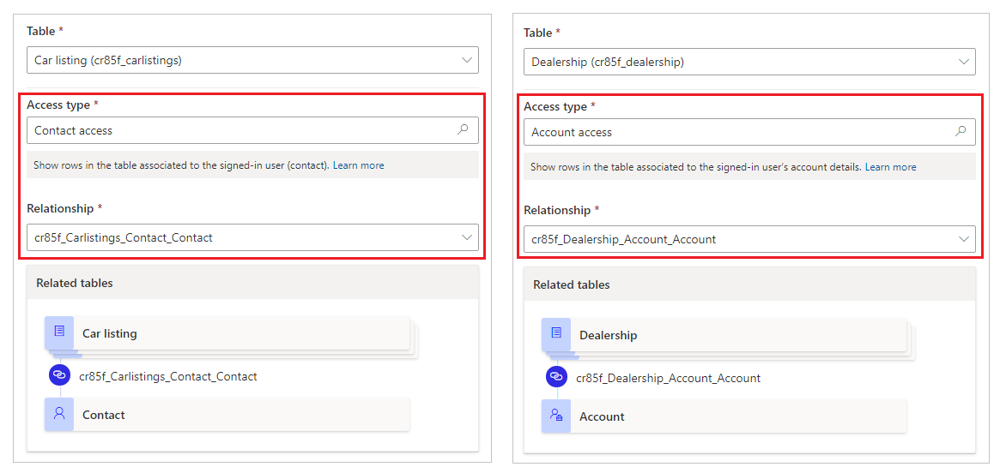
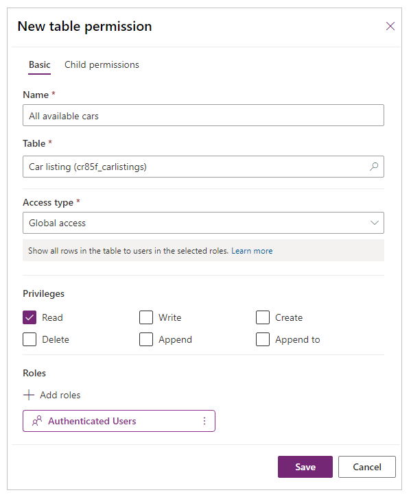
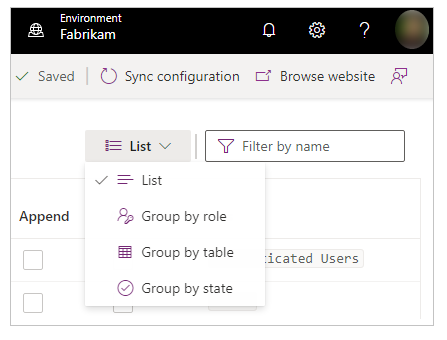

# Table permissions using portals Studio (Preview)

[This article is pre-release documentation and is subject to change.]

In the previous article, you learned about how to configure security in portals by using table permissions configuration from the Portal Management app. In this article, you'll learn about configuring the table permissions using Power Apps portals Studio.

> [!IMPORTANT]
> - This is a preview feature.
> - [!INCLUDE[cc_preview_features_definition](../../../includes/cc-preview-features-definition.md)]

## Available access types in Studio

Portals Studio shows four different **Access types**. Depending on the access type you select, the selected table permission and privileges apply to the users from the selected roles for the following tables.

1. **Global access** - Applies the selected table permission and privileges to the users from the selected roles for *all records*.
1. **Contact access** - Applies the selected table permission and privileges to the users from the selected role *associated to the signed-in user*.
1. **Account access** - Applies the selected table permission and privileges to the users from the selected role *associated to the signed-in user's account*.
1. **Self access** - Applies the selected table permission and privileges to the users from the selected role *for only their own contact record*.

> [!NOTE]
> - **Parent access type** is only available in the Portal Management app. Instead of creating a table permission with the access type as **Parent**, directly add child permission to existing table permissions when using portals Studio.
> - Ensure you enable table permissions on web pages for permissions to take effect. More information: [Manage page permissions](webpage-access-control.md)

## Configure table permissions using portals Studio

In this section, you'll learn about how to create, view, edit, and deactivate/activate or delete table permissions using portals Studio.

### Create table permissions using portals Studio

To create a table permission using portals Studio:

1. Sign in to [Power Apps](https://make.powerapps.com).

1. Select **Apps** on the left-pane.

1. Select your portal.

1. Select **Edit** to open portals Studio.

1. Select **Settings** (:::image type="icon" source="media/entity-permissions-studio/settings.png":::) on the left pane inside portals Studio.

1. Select **Table permissions**.

    

1. Select **New permission**.

1. Enter table permission name.

1. Select a table.

1. Select an access type. More information: [Available access types in Studio](#available-access-types-in-studio)

1. If you select **Contact**, or **Account** access type, select the relationship between the selected Contact/Account, and the table that you selected for the table permission.

    

1. Select privileges that you want to grant.

1. Select **Add roles** to add the roles that this table permission will apply to.

    > [!TIP]
    > If you have not created a web role yet, you can select **Manage roles** from the roles flyout to open Portal Management app and create roles.

1. Select **Save**.

    

### View table permissions in portals Studio

To view table permissions using portals Studio:

1. Sign in to [Power Apps](https://make.powerapps.com).

1. Select **Apps** on the left-pane.

1. Select your portal.

1. Select **Edit** to open portals Studio.

1. Select **Settings** (:::image type="icon" source="media/entity-permissions-studio/settings.png":::) on the left pane inside portals Studio.

1. Select **Table permissions** to view table permissions.

    

1. To group, or filter table permissions, select a view (List/Group by roles/Group by table/Group by state), or enter a table permission name in the filter text box.

    

### Edit table permissions using portals Studio

To edit a table permission using portals Studio:

1. Sign in to [Power Apps](https://make.powerapps.com).

1. Select **Apps** on the left-pane.

1. Select your portal.

1. Select **Edit** to open portals Studio.

1. Select **Settings** (:::image type="icon" source="media/entity-permissions-studio/settings.png":::) on the left pane inside portals Studio.

1. Select **Table permissions**.

1. Select the table permission that you want to edit.

1. Change table permission details, such as the name, table, access type, privileges, and applicable roles. More information: [Create table permissions using portals Studio](#create-table-permissions-using-portals-studio)

1. Select **Save**.

### Deactivate/activate or delete table permissions using portals Studio

To deactivate/activate or delete a table permission using portals Studio:

1. Sign in to [Power Apps](https://make.powerapps.com).

1. Select **Apps** on the left-pane.

1. Select your portal.

1. Select **Edit** to open portals Studio.

1. Select **Settings** (:::image type="icon" source="media/entity-permissions-studio/settings.png":::) on the left pane inside portals Studio.

1. Select **Table permissions**.

1. Select the table permission that you want to deactivate/activate or delete.

1. Select **Deactivate**, **Activate**, or **Delete**.

1. Confirm when prompted.

## Configure child permissions using portals Studio

To add a child permission to an existing table permission using portals Studio:

1. Sign in to [Power Apps](https://make.powerapps.com).

1. Select **Apps** on the left-pane.

1. Select your portal.

1. Select **Edit** to open portals Studio.

1. Select **Settings** (:::image type="icon" source="media/entity-permissions-studio/settings.png":::) on the left pane inside portals Studio.

1. Select **Table permissions**.

1. Select the table permission that you want to add the child permission to.

1. Select **Add child permission**.

1. Create the child permission with the following details:

    1. Name - child permission name.
    
    1. Table - table that the child permission is for.
    
    1. Relationship - relationship between the table for primary table permission, and the selected table for the child permission.
    
    1. Privileges - grant privileges for the child permissions.
    
    1. Roles - roles for a child permission are inherited from the parent table permission. To add/remove roles, edit the parent table permission instead.

1. Select **Save**.

To view, edit, deactivate/activate or delete child permissions using portals Studio, follow the steps explained in the earlier section to [configure table permissions using portals Studio](#configure-table-permissions-using-portals-studio).

## Next steps

[Tutorial: Configure table permissions using portals Studio](entity-permissions-studio-walkthrough.md)

### See also

[Assign table permissions](assign-entity-permissions.md)
