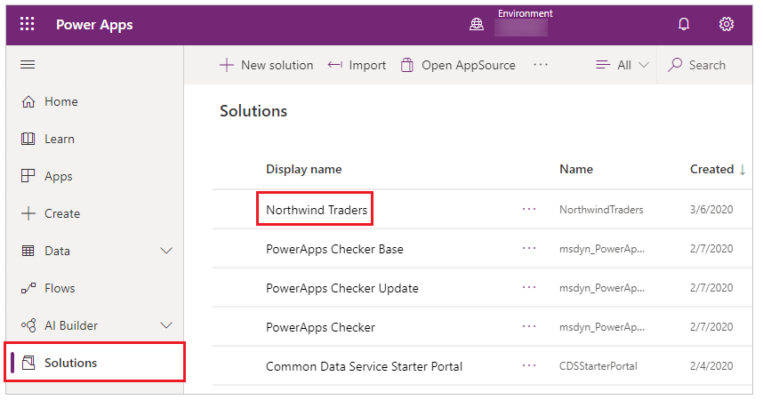
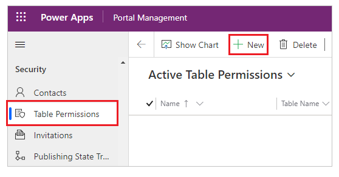

# Walkthrough: Configuring additional entities for global search  

## Overview

You can enable additional entities for search functionality. Configuring search for additional entities requires additional actions, which are described in this article. These explicit configuration steps ensure that no records will accidentally be made available using global search.

## Steps to configure search for additional entities

To configure search for additional entities:

1. [Enable additional entities search](#step-1-add-or-update-search-site-settings) for the first time by adding a new setting [Search/EnableAdditionalEntities](#site-setting-for-additional-entities) and set it to *true*. This is a one-time step that enables search for all additional out-of-the-box and custom entities.

1. [Create Portal Search view](#step-2-create-or-verify-the-portal-search-view) for each additional table with the required filters and columns that needs to be searchable.

1. [Configure table permissions](#step-3-create-entity-permissions) for each additional table with a Web Role to have at least read privilege. Skip this step if you already have the read permissions configured for each table.

1. [Create a record details page](#step-4-add-record-details-webpage) for each table to show the [details of the selected record](#site-marker-for-record-details-page) from the search results page. Skip this step if you already have created separate results record details page for each table.

1. [Create a site marker](#step-5-add-a-site-marker-for-record-details-webpage) named `<entitylogicalname>_SearchResultPage` for each table with the associated [record details page](#site-marker-for-record-details-page).

1. [Rebuild the search index](#step-6-rebuild-the-search-index).

1. [Verify the search results](#step-7-verify-that-global-search-works-with-the-custom-entity).

> [!WARNING]
> If you don't create a record details page, or if you don't bind the record details page with site marker for search, you won't be able to select the additional table records from search results page to view the record details.

### Site setting for additional entities

The site setting **Search/EnableAdditionalEntities** is required when configuring additional entities for search.

> [!IMPORTANT]
> **Search/EnableAdditionalEntities** is explicitly for enabling search for additional entities. The main search site setting **Search/Enabled** must be set to **true** when using search functionality.

You can also configure other related site settings similar to the search configuration for default entities. For example, you can use the **Search/Filters** setting to configure additional entities and add a drop-down filter option to the global search. More information: [Site setting](search.md#related-site-settings).

### Site marker for record details page

The record details page is configured using a **Site Marker** named `<entitylogicalname>_SearchResultPage`.

For example, if your table logical name is *nwind_products*, the site marker will be `nwind_products_SearchResultPage`. The value of the site marker is the record details page that you want to open when that search result is selected. By default, a record ID is passed in the *id* querystring parameter to the record details page. For more information about adding forms on a page, go to [Compose a page](../add-form.md).

> [!IMPORTANT]
> Ensure that your record details page has an basic form, or has logic written to show the search result details. For example, [Step 4 - Add record details page](#step-4-add-record-details-webpage) in the following walkthrough.

The following walkthrough explains each step in detail with a sample database and solution to configure search for additional entities.

> [!NOTE]
> - This walkthrough explains how to enable search for the **Order Products** table in the sample database **Northwind**, available with Microsoft Dataverse. For more information about sample databases, see [Install Northwind Traders database and apps](../../canvas-apps/northwind-install.md).
> - You can follow the walkthrough with a table of your choice by replacing the *nwind_products* table name with your table's logical name.

## Step 1: Add or update search site settings

1. Sign in to [Power Apps](https://make.powerapps.com).

1. Ensure that you're in the appropriate environment where your portal exists.

1. Select **Apps** in the left navigation pane, and locate the **Portal Management** model-driven app.  

    

    >[!NOTE]
    > The Portal Management app might be named **Dynamics 365 Portals** if you're in an environment where Dynamics 365 applications are installed.

1. Select to open the **Portal Management** app, and then go to **Site Settings** in the left navigation pane.

1. Create a new setting, **Search/EnableAdditionalEntities**, and set its value to **true**.

    

1. Create or update the **search/filters** setting, and add the value **Products:nwind_products**.

    

## Step 2: Create or verify the Portal Search view

> [!NOTE]
> The following steps require the [Northwind Traders solution](../../canvas-apps/northwind-install.md) to be installed. If you want to use another table, use the appropriate solution or use the Default solution.

1. Go to [Power Apps](https://make.powerapps.com), and select **Solutions** from the left navigation pane.

1. Select **Northwind Traders**.

    

1. Search for the **Order Product** table.

    

1. Select the **Order Product** table, and then select **Views**.

    

1. Ensure that you see **Portal Search** in the views list.

    

    If the Portal Search view doesn't already exist, select **Add view**, enter the name as **Portal Search**, and then select **Create**.

    

    

1. Ensure appropriate columns are added to the view for search.

    

1. If you edited the view, be sure to select **Save**, and then **Publish** before you continue.

    

## Step 3: Create table permissions

1. Sign in to [Power Apps](https://make.powerapps.com).

1. Select **Apps** in the left navigation pane, and then select to open the **Portal Management** model-driven app.  

1. Select **Table Permissions** in the left navigation pane.

1. Select **New**.

    

1. Enter the name as **Northwind Products Read All**, and then select the appropriate **Access Type** and the **Read** privilege.

    For this example, the **Global** access type is provided to the **nwind_products** table.

    

1. Select **Save & Close**.

1. Select and open **Northwind Products Read All**.

1. Scroll down to the **Web Roles** section, and then select **Add Existing Web Role**.

    

1. Search for **Authenticated Users**, and then select **Add**:

    

## Step 4: Add record details webpage

1. Go to [Power Apps](https://make.powerapps.com), and select **Apps** in the left navigation pane.

1. Select **More Commands** (…) for the portal, and then select **Edit** to open the portal in Power Apps Studio.

1. Select **New Page** from the menu in the upper-left corner, and then select the **Blank** layout for the page.

    

1. Enter the webpage name as **Order Products**. 

    > [!NOTE] 
    > This page will be shown when users select a record from the search results page to view the details of the selected record.

1. Select **Components** in the left navigation pane, and then add a **Form** component to this webpage.

    

1. Select the **Use existing** option on the right side of your workspace, choose the **View Products** form for the **nwind_products** table, and then set **Mode** to **ReadOnly**.

    

## Step 5: Add a site marker for record details webpage

1. Sign in to [Power Apps](https://make.powerapps.com).

1. Select **Apps** in the left navigation pane, and select to open the **Portal Management** model-driven app.  

1. Select **Site Marker** from the left navigation pane.

1. Select **New**, and then create a new site marker by using the following details:

    - **Name:** **nwind_products_SearchResultPage**
    - **Page:** **Order Products**
    
    

## Step 6: Rebuild the search index

1. Browse your portal by using a user account that has the Administrator web role assigned.

1. Append the URL in the address bar with **/_services/about**, and then select **Enter**.

   

1. Select [Clear cache](https://docs.microsoft.com/powerapps/maker/portals/admin/clear-server-side-cache).

1. After clearing the cache, select [Rebuild search index](search.md#rebuild-full-search-index).

## Step 7: Verify that global search works with the custom table

1. Browse to the portal with a user that has *Authenticated* **Web Role** assigned.

1. Go to the search toolbar or the search page, and search for a known record.

   For example, use the search keyword **Northwind Clam Chowder** to get the results associated with the **nwind_products** table.

   

## Next steps

[Remove a table from global search](search.md#remove-an-entity-from-global-search)

### See also

[Search related site settings](search.md#related-site-settings)

[!INCLUDE[footer-include](../../../includes/footer-banner.md)]