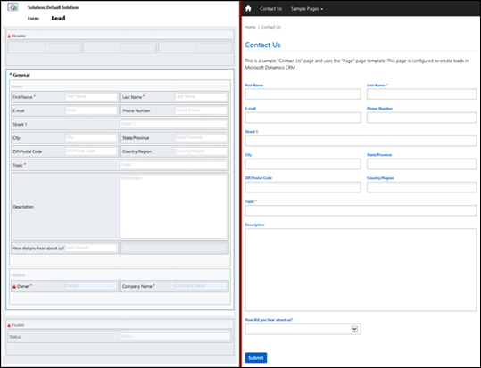
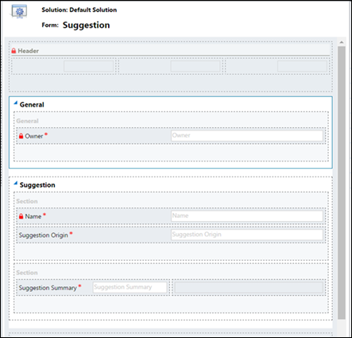
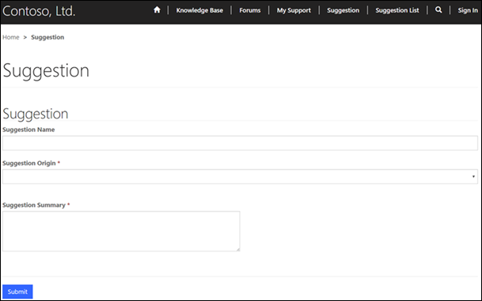
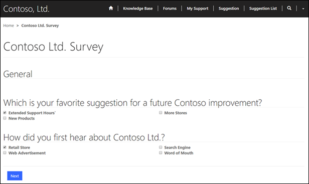
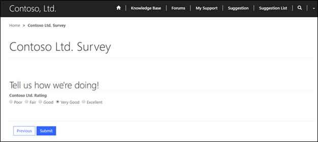

# Get data from customer engagement apps on the portal

Power Apps portals has the ability to render&mdash;and allow the manipulation of&mdash; data on an internally facing or externally facing portal website. In this section, we will profile the tables that provide the foundation of this functionality and discuss the steps necessary to achieve it.

## Basic forms
An basic form record allows an administrator to render a Power Apps form on a portal to edit, display, or capture a customizable set of data from its users. This is a relatively easy and straightforward process, and it eliminates the need for any code customizations that would have otherwise been required to achieve such a result before deploying a portal.

This functionality can be taken advantage of for many reasons and use cases, but a common example of how this can be leveraged would be to build a new form under the Lead table within the **Customize the System** interface, then create an basic form record that can be surfaced on the portal to capture lead data through a contact page or some type of information request page. In fact, this specific example is used for the default **Contact Us** page within portals by default. Other examples include using an basic form for profile management or a single page survey.

Basic forms contain relationships to webpages and additional properties to control the initialization of the form within the portal. The relationship to a webpage allows dynamic retrieval of the form definition for a given page node within the portal website.

When you create a new basic form, the first step is to decide which table and form name that you will be rendering and the mode: Insert, Edit, or Read Only. The mode you select will determine if you are creating a new record from the portal, editing an existing record, or just displaying information about a record on the portal.

For this demonstration, let’s consider a scenario in which Contoso, Inc. would like to create a custom table in Power Apps linked to a form rendered on their [Customer Self-Service Portal](../portal-templates.md#environment-with-customer-engagement-apps) that will allow users to submit suggestions for improvement that they would like to see the company introduce. The steps that the administrator at Contoso, Inc. would take to achieve this include the following:

1. Create the custom table using [Power Apps](https://make.powerapps.com). More information: [Create a table](../../data-platform/data-platform-create-entity.md).   In this example, we’ll call the table “Suggestion.”

1. Create two custom fields underneath the Suggestion table that pertain to the information that should be captured on the form.  In this example, we’ll create **SuggestionOrigin** (Option Set) and **SuggestionSummary** (Multiple Lines of Text) fields.  Both fields will be set to **Business Required**.

3. [Create a new main form](../../model-driven-apps/create-edit-main-forms.md) underneath the Suggestion table:
   1. Insert a one-column tab, and change its section’s properties to two columns.  

   2. Add the custom fields in addition to the existing **Name** field.

   3. Name the tab **Suggestion**.

   4. In **Form Properties**, name the form **Suggestion Form**.

   5. Save and publish the changes.

      

4. Open [Portal Management app](configure-portal.md) > **Basic Forms** and create a new basic form record. Name it **Suggestion**, set its **Table Name** field to **Suggestion (new_suggestion)**, set its **Form Name** to **Suggestion Form**, set its **Tab Name** to **Suggestion**, set its **Form Type** as **Insert**, and modify any of the other options as needed.

5. Using [portals Studio](../portal-designer-anatomy.md), create a new child page named **Suggestions**. Set its **Page Template** value to **Advanced Form**, set its **Basic Form** value to **Suggestion**, and add an introduction to the form. 
   > [!Note]
   > The child page can also be created, depending on the user’s preference.

6. To allow users to easily navigate to the form: In the portal, edit the Primary Navigation and then select the **+** icon to add a new web link to the form. Name the web link **Suggestions** and assign it to the **Suggestions** page.

When a user visits the Contoso portal, navigates to this form, and enters the relevant data and submits it, a new record will automatically be generated with the submitted information.

### Basic form metadata
Basic form metadata records contain additional behavior modification logic to augment or override the functionality of form fields that you otherwise could not modify by using the native basic form editing capabilities.

These records allow for additional configuration and manipulation of specific elements on the form, including fields, subgrids, or entire sections or tabs. Each element of the form that requires some type of modification requires a separate metadata record, which in turn is associated with the basic form record.

To add metadata records to an basic form, you can go to the **Basic Form Metadata Associated View** from the navigation menu, or you can create these records directly from the basic form itself by using the Basic Form Metadata subgrid toward the bottom of the record’s form.

Basic form metadata records can be used for a variety of scenarios, including controlling the style of a field, prepopulating a field with a specific value, setting values on the form upon save, validating user-entered values, and more.

## Lists

While an Basic form record allows a portal administrator to expose a Power Apps form to portal users, lists provide administrators with the ability to add a webpage to their portal that will render a list of records without the need for a developer to surface the view on the portal by using custom code.

Lists support sorting and filtering and will be paginated if the number of records is larger than the **Page Size** value specified on the List record. If a **Web Page for Details View** has also been specified, each record will contain a link to the page and the ID of the record will be appended to the query string along with the ID Query String Parameter Name.

Lists also support multiple views and actions. If more than one view has been specified, a drop-down menu will be rendered to the end user that allows them to toggle between various views. Likewise, if actions such as **Edit** or **Delete** have been added as action buttons, users with the correct permissions will see these options rendered in the view.

Building on the previous example of the administrator of Contoso, Inc. creating an basic form to collect user suggestions, we will now cover the steps that the administrator would take to (very simplistically) expose the submitted records on the portal for other users to review and for easy access for submitting new ones:

1. [Edit the view](../../model-driven-apps/create-edit-views-app-designer.md) named **Active Suggestions** for the **Suggestions** table and dd the columns that should be exposed on the portal to this view.

1. Open [Portal Management app](configure-portal.md) > **Lists** and create a new List record.  
   1. Enter a name of **Suggestions List**, set its **Table Name** to **Suggestion (new_suggestion)**. 

   2. Add the default **Active Suggestions** view or the custom-created view to the **Views** list. 

   3. Set **Web Page for Create** to **Suggestions**, and add a create button or empty list text as needed.

3. Using [portals Studio](../portal-designer-anatomy.md), create a new child page named **Suggestions List**. Set **Page Template** to **Full Page**, set **List** to **Suggestions List**, and add an introduction to the exposed view.

4. If you want, in the portal, edit the **Primary Navigation** and then select the **Add** button (+) to add a new web link to the list. Name the web link **Suggestions List** and assign it to the **Suggestions List** page. You can drag the previously created **Suggestions** form link underneath the new list link to become a child.

Beyond the simplistic setup that was discussed earlier, Lists support many other options, including (but not limited to):
- Allow users to filter and search the records within that respective table on the portal.
- Allow users to create, edit, or delete records, and download the records to an Excel Worksheet.
- Allow users to execute an on-demand workflow against a record selected in the list.
- Display the records from the list by using a Bing Maps view of the data 
- Display the records from the list by using a Calendar View of the data.

## Advanced Forms

Advanced Forms allow users to define basic forms and custom logic to render data entry forms on a portal without the need for custom code. Advanced forms support single-step and multiple-step navigation, in addition to branching logic. Advanced forms are commonly used to produce surveys, such as the out-of-the-box “Case Satisfaction Survey” advanced forms, or to facilitate requests, such as the out-of-the-box “Open New Support Request” advanced form.

Advanced forms differ from basic forms in that they provide the ability for an administrator to specify one or more forms that are to be loaded to produce a single form or a wizard-style, multiple-step process with conditional branching logic. Advanced forms also have additional properties that can be specified to override some of the default behaviors and overcome some table metadata and form designer limitations.

The best way to fully grasp how a advanced form is used within a portal is to provide an example of a use case scenario, and then go through the process of constructing the form and all its underlying parts. Earlier in this document, we went through the process of creating a custom basic form for users to submit suggestions and a custom list to expose these suggestions within a view on the portal. Let’s now assume that Contoso wants to survey its users on which of the submitted suggestions they would prefer to be implemented, and other information about their user base at the same time. The steps that the administrator would take to set up such a survey on the portal would be as follows:

1. Create a custom table using [Power Apps](https://make.powerapps.com). More information: [Create a table](../../data-platform/data-platform-create-entity.md)  .  For this example, we’ll call the table **Survey**.  

3. Create several custom fields underneath the **Survey** table to represent the answers that will be available for the user to choose on the survey:

    1. Three custom fields named **Extended Support Hours**, **New Products**, and **More Stores** for a multiple-choice question that the administrator has planned: “Which is your favorite suggestion for a future Contoso improvement?” Each field is set to a data type of **Two Options**.

    2. Four custom fields named **Retail Store**, **Search Engine**, **Web Advertisement**, and **Word of Mouth** for a multiple-choice question that the administrator has planned:  “How did you first hear about Contoso Ltd.?” Each field is set to a data type of **Two Options**.

    3. A custom field named **Contoso Ltd. Rating** of data type **Option Set**. For **Use Existing Option Set**, select **Yes** and from the drop-down list, select **Likert Scale Quality**.
    4. To track the current portal user filling out the survey, a custom field named **Regarding Contact** of data type **Lookup** and target record of **Contact**.

4. Open the main **Information** form underneath the **Survey** table, select the **General** tab, and then select **Change Properties**. On the **Formatting** tab, select **One Column**, and then select **OK**. More information: [Create or edit a form](../../model-driven-apps/create-edit-main-forms.md)

5. Switch to the **Insert** tab of the **Information** form, select **Section**, and choose **Two Columns**. Move the default Name and Owner fields to this section and delete the old one.  Open the properties of the Name field and clear the **Visible by default** option on the **Display** tab.

6. Save the form, then select **Save As** in the ribbon to create a copy of the form named **Survey Step 2**. Select **Save As** again to create another copy named **Survey Step 1**.
7. Open the **Survey Step 1** form, switch to the **Insert** tab, and then select **Section** > **Two Columns**.  

8. [Open](../../model-driven-apps/create-edit-main-forms.md) the properties of the new section, change its label to “Which is your favorite suggestion for a future Contoso improvement?”, and select the check box for **Show the label of this section on the form** option.  

9. Drag the **Extended Support Hours**, **New Products**, and **More Stores** fields to this section.  

10. Repeat the step of adding a new two-column section, but this time change the label to “How did you first hear about Contoso Ltd.?” and drag the **Retail Store**, **Search Engine**, **Web Advertisement**, and **Word of Mouth** fields to this section. 

11. Open the properties of each field. On the **Formatting** tab, set the **Control Formatting** to **Check box**. Save and close the form.

12. [Open](../../model-driven-apps/create-edit-main-forms.md) the **Survey Step 2** form, switch to the **Insert** tab, and select **Section** > **One Column**.  

13. Drag the **Contoso Ltd. Rating** field to the new section, and then open the properties of the field on the form and change its label to “Tell us how we're doing!  Please rate the quality of Contoso Ltd.’s various series of products.” Save and close the form.

14. Within the **Survey forms** area, choose **Form Order** > **Main Form Set**. This will allow you to configure the form order to work in a sequence of Information > Survey Step 1 > Survey Step 2.

15. On the main **Information** form and the **Insert** tab, select **Section** > **Two Columns**.  

16. Open the properties of the new section, change its label to “Which is your favorite suggestion for a future Contoso improvement?”, and select the **Show the label of this section on the form** check box. Drag the **Extended Support Hours**, **New Products**, and **More Stores** fields to this section.

    Repeat the step of adding a new two-column section, but this time change the label to “How did you first hear about Contoso Ltd.?” and drag the **Retail Store**, **Search Engine**, **Web Advertisement**, and **Word of Mouth** fields to this section. Open the properties of each of the seven fields added to the form to this point, select the **Formatting** tab, and set the Control Formatting to Check box.  

    Repeat the step of adding a section, but this time choose a one-column section.  Drag the **Contoso Ltd. Rating** field to this section, then open the properties of the field on the form and change its label to “Tell us how we're doing! Please rate the quality of Contoso Ltd.’s various series of products.”

    Finally, drag the **Regarding Contact** field to the first section of the **General** tab to track which user filled out the survey. Save and close the form, and then select **Publish All Customizations**.

17. Open [Portal Management app](configure-portal.md) > **Advanced Forms** and create a new advanced form named **Contoso Ltd. Survey**.  Set the **Authentication Required** field to **Yes** and the **Multiple Records Per User Permitted** field to **No**. Save the form, but keep it open.

18. On the “Contoso Ltd. Survey” Advanced Form record:
    1. Open the **Start Step** lookup field, and select **New** to create a new Advanced Form Step.
    2. Name the step **Survey Step 1**.
    3. Set the **Target Table Logical Name** to **Survey (new_survey)**.
    4. Set the **Form Name** to **Survey Step 1**.
    5. Select the **Associate Current Portal User** check box.
    6. Set the **Portal User Lookup Column** to **Regarding Contact (new_regardingcontact)**.
    7. Save the form, but keep it open.

19. On the “Survey Step 1” Advanced Form Step record:
    1. Open the **Next Step** lookup field, and select **New** to create a new Advanced Form Step.
    2. Name the step **Survey Step 2**.
    3. Set the Advanced Form to **Contoso Ltd. Survey**.
    4. Set the **Target Table Logical Name** to **Survey (new_survey)**.
    5. Set the **Mode** to **Edit**.
    6. Set the **Form Name** to **Survey Step 2**.
    7. Set the **Source Type** to **Result From Previous Step**.
    8. Set the **Success Message** to “Thank you for taking the time to complete this survey!
    9. Make sure that the **Next Step** field is blank, and then save the form, but keep it open.

20. On the “Survey Step 2” Advanced Form Step record:
    1. Select the rightmost chevron in the main navigation and select **Metadata** to open the Advanced Form Metadata Associated View underneath the “Survey Step 2” record.
    2. Select **Add New Advanced Form Metadata** and set the **Attribute Logical Name** on this new record to **Contoso Ltd. Rating (new_contosoltdrating)** and the **Style** to **Option Set as Horizontal Radio Button List**.
    3. Save and close all the open forms.

21. In the [Portal Management app](configure-portal.md), go to **Web Pages** and create a new Web Page named **Contoso Ltd. Survey**.  Set the **Website** to **Contoso Ltd.”**, the **Parent Page** to **Home**, the **Partial URL** to **contoso-ltd-survey**, the **PageTemplate** to **Full Page**, the **Publishing State** to **Published**, and the Advanced Form to the “Contoso Ltd. Survey” that was created earlier.  Save the record.

Granted, these steps are very complex and require several records to work in tandem with one another to achieve the result. However, after the process is complete, users can navigate to the page that you’ve created on the portal and fill out the survey as intended.

Each completed survey that is submitted will become a record within the **Portals** > **Survey** table, and this record will contain the contact who completed the advanced form along with all their responses for tabulation.

## Form elements rendering

Although most forms can be successfully rendered in a portal, note that some features aren't supported by the BasicFormView control that handles the actual rendering of the basic form.

|                                 Supported form elements                                 |                                Supported, but with caveats form elements                                 |                         Unsupported form elements                          |
|-----------------------------------------------------------------------------------------|----------------------------------------------------------------------------------------------------------|----------------------------------------------------------------------------|
| All field validation rules  |  All field types, except Party List fields   |         Form headers and footers won't be displayed in the portal          |
|                          Both single and multi-column layouts                           |                 Only “Webpage (HTML)” and image-related Web Resource types are supported                 |                                  iFrames                                   |
| Label language translations |             Record filtering in a lookup field is supported, but only for N:1 relationships              | Form scripting |
|                              Notes (inserted on the form)                               | Lookup fields are supported, but creating a new record through a lookup view on the form isn't supported |                                                                            |
|                            Sub-Grids (inserted on the form)                             |                                                                                                          |                                                                            |

Finally, it’s worth mentioning that the Basic Form record has an assortment of options that allow for it to be fine-tuned as needed, including a section for **Attach File** options.  If a form requires the attachment of files, select the **Attach File** check box and configure the **Attach File Storage Location** option for either **Note Attachment** or **Azure Blob Storage**. More information: [Configure notes as attachments](../configure-notes.md)

### See also

[About basic forms](entity-forms.md)  
[Define advanced form steps](web-form-steps.md)

[!INCLUDE[footer-include](../../../includes/footer-banner.md)]