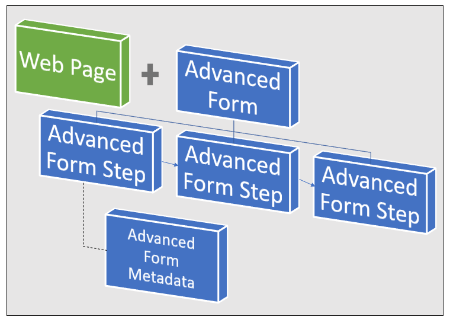

# Define advanced form steps for portals

[!INCLUDE[cc-pages-ga-banner](../../../includes/cc-pages-ga-banner.md)]

The Advanced Form Step provides the flow logic of the form's user experience such as steps and conditional branching. It also provided details about the rendering of a form and additional behavior.

> [!NOTE]
> Advanced Forms persists the history of the steps a user has visited in an object on an Advanced Form Session table. If an Advanced Form's steps have been modified, previously created history data could now be stale. Anytime steps are changed, it is recommended that you delete all Advanced Form Session records to eliminate miss match between sequence of steps logged in history and the current sequence.

Each Advanced Form will be presented on the portal has one or more steps. These steps share some common properties, outlined below. Each Step contains a pointer (a lookup) to the next step, except for terminal steps. Terminal steps don't have a next time, and are thus the last step of the Advanced Form (because of conditional branching, there can be multiple terminal steps).

  

| Name     | Description                                    |
|----------|------------------------------------------------|
| Name     | A title used for reference.                    |
| Advanced Form | The Advanced Form associated with the current step. |
|Type|Available types: [Load Form/Load Tab step type](load-form-step.md): displays properties of forms. <ul><li>[Load Form/Load Tab step type](load-form-step.md): displays properties of tabs.</li><li>[Conditional step type](add-conditional-step.md): displays properties for specifying expressions to be evaluated for conditional branching. </li><li>[Redirect step type](add-redirect-step.md): displays the settings appropriate for configuring a website redirection.</li></ul> For more information on the settings for these advanced form step types, see their corresponding sections later. **Note**: The first step can't be of type "Condition".|
| Next Step                 | The step that will follow the current step. This option will be blank for single-step single form.                                                                                                            |
| Target Table Logical Name | The logical name of the table associated with the form.                                                                                                                                               |
| Move Previous Permitted    | Indicates whether the user is given an option to navigate to the previous step in a multiple step advanced form. Default is true. Uncheck to prevent the user from being able to move to the previous step. |
||

> [!NOTE]
> The step type of **Load User Control** is retired and no longer supported.

## Considerations for advanced form steps

Advanced form steps can't be reused. If you try to use advanced form step again, you'll see the following message:

"The step \<advanced form step name\> has already been used earlier in this form. Update the Advanced Form to use each step only once, and try again."

When that happens, ensure you use don't reuse advanced form steps in an Advanced Form.

The following conditions are exempt from the limitation of advanced form step reuse:

- When using "Next step if Condition fails" option in step type "Condition".
- When using different&mdash;Yes/No&mdash;branches.

### See also

[Configure a portal](configure-portal.md)  
[Define table](entity-forms.md)  
[Load Form/Load Tab step type](load-form-step.md)  
[Redirect step type](add-redirect-step.md)  
[Conditional step type](add-conditional-step.md)  
[Add custom JavaScript](add-custom-javascript.md)  

[!INCLUDE[footer-include](../../../includes/footer-banner.md)]
