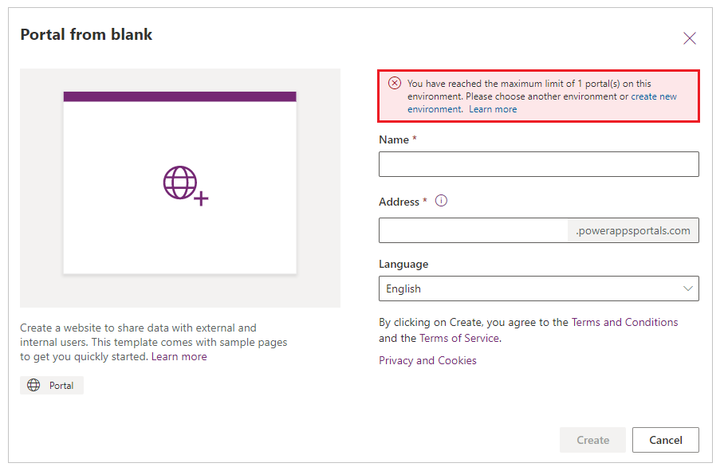

# Create additional portals in an environment

An environment can have one portal of each type and for each language. Environments with Dataverse have [starter portal template](portal-templates.md#environment-with-dataverse) available. If you already have a starter portal for such an environment, you can't create another starter portal for the same language. Similarly, environments with customer engagement apps (Dynamics 365 Sales, Dynamics 365 Customer Service, Dynamics 365 Field Service, Dynamics 365 Marketing, or Dynamics 365 Project Service Automation) have several [portal templates](portal-templates.md#environment-with-customer-engagement-apps) available. If you have a portal from one of the templates already created in a language, you can't create a new portal with the same template type and language. New portal must have either a different portal type, or a different language.

For example, consider a scenario where you have a Dataverse environment without the Dynamics 365 Apps. In this environment, you have a portal with *English* language created with the template type of *Starter portal*. You want to create a new portal in this environment.

In this scenario, the following table explains which additional portal template and language combination is allowed when creating additional portals:

| Template type and language of existing portal  | Template type and language of the new portal that you want to create | Allowed |
| - | - | - |
| *Starter portal* in English | *Starter portal* in English | &cross; |
| *Starter portal* in English | *Starter portal* in French | &check; |

Similarly, the following table explains the allowed template type and language combination for a portal that can be created if you have a Dataverse environment with Dynamics 365 Apps. In this example, you have a portal with the template *Portal from blank* created in *English* language. You want to create a new portal in this environment.

| Template type and language of existing portal | Template type and language of the new portal that you want to create | Allowed |
| - | - | - |
| *Portal from blank* in English | *Portal from blank* in English | &cross; |
| *Portal from blank* in English | *Community portal* in English | &check; |
| *Portal from blank* in English | *Portal from blank* in French | &check; |

When an environment already has a portal of the available template type created, and if the environment doesn't have any additional languages enabled, you'll see this error message: *You have reached the maximum limit of 1 portal(s) on this environment. Please choose another environment or create new environment.*

For more information about enabling languages in an environment, go to [Enable language for an environment](https://docs.microsoft.com/power-platform/admin/enable-languages#enable-the-language).

## Create new environment

Follow these steps when you create an environment using the option provided in the **Portal from blank** window.

1.  In the **New environment** pane, enter a name for the environment, and then select a region and environment type from the drop-down lists. You can't change the region once the environment is created. When you're done, select **Create environment**.

    > [!div class=mx-imgBorder]
    >   

2.  Once the environment is created, you'll receive a confirmation message in the dialog box, and you'll be prompted to create a database. Select **Create database** to enable access to Dataverse.

    > [!NOTE]
    > The prompt to create a database might not be displayed automatically. In this case, you must go to the new environment and select the **Portal from blank** tile again.

    > [!div class=mx-imgBorder]
    >   

3.  Select the currency and language for the data stored in the database. You can't change the currency or language once the database is created. When you're done, select **Create my database**. The database is created with the starter portal that enables you to quickly get started with sample content once the portal is provisioned.

    > [!NOTE]
    > The **Include starter portal** option is available only when you create an environment using the option provided in the **Portal from blank** window. This option is not available when you create an environment from Power Platform admin center.

    > [!div class=mx-imgBorder]
    >  

    It might take several minutes to create the database on Dataverse. Once the database is created, the new environment is selected in the list of environments on the Power Apps home page and the Portal Management app is created. This app isn't the actual portal but a model-driven companion app that allows you to perform advance configuration activities. You can now continue with creating the portal for designing the external-facing website.

    > [!div class=mx-imgBorder]
    > 

4. After creating the environment and database, under **Make your own app**, select **Portal from blank**. 

    > [!NOTE]
    > If the database is created and you are still getting the create database prompt, you must refresh the Power Apps home page before selecting the **Portal from blank** tile.

After you enter the portal name, address, and choose the language, the portal creation begins. For portal creation notification information, see [Portal provisioning notifications](create-portal.md#portal-provisioning-notifications).

### See also

[Available portal templates](portal-templates.md)  
[Microsoft Learn: Administer Power Apps portals](https://docs.microsoft.com/learn/paths/administer-portals/)  
[Microsoft Learn: Access Dataverse in Power Apps portals](https://docs.microsoft.com/learn/modules/portals-access-data-platform/)
