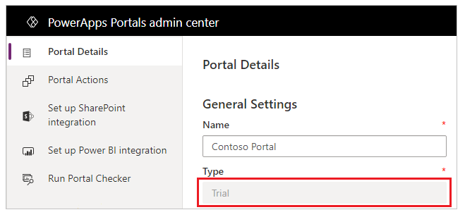

# What is Power Apps portals?

> [!NOTE]
> - Based on the [terminology changes in Dataverse](https://go.microsoft.com/fwlink/?linkid=2147247), customer feedback, and data from user research, effective March 2021, we're updating some terminology in Power Apps portals to be more intuitive and make its usage more productive. More information: [Terminology changes in Power Apps portals](terminology-changes.md)
> - We're in the process of rolling out the terminology changes in Power Apps portals. Documentation for portals will be updated soon to reflect the latest terminology.

Power Apps makers can now create a powerful new type of experience: external-facing websites that allow users outside their organizations to sign in with a wide variety of identities, create and view data in Microsoft Dataverse, or even browse content anonymously. The full capabilities of Dynamics 365 Portals, previously offered only as an add-on to customer engagement apps (Dynamics 365 Sales, Dynamics 365 Customer Service, Dynamics 365 Field Service, Dynamics 365 Marketing, and Dynamics 365 Project Service Automation), are now available standalone in Power Apps.  

These capabilities feature a revamped end-to-end experience for makers to quickly create a website and customize it with pages, layout, and content. Makers can reuse page designs through templates, add forms and views to display key data from Dataverse, and publish to users.

## Power Apps portals, Dynamics 365 portals and add-on portals

After the launch of Power Apps portals on October 1, 2019, Dynamics 365 portals are called as Power Apps portals. In other words, all portals are referred to as **Power Apps portals**.

One of the major changes introduced in portals after October 1, 2019 is the licensing model. Earlier, portals were licensed add-ons to Dynamics 365 apps while certain Dynamics 365 licenses included a default portal add-on. After October 1, 2019, portals are [licensed based on usage](https://docs.microsoft.com/power-platform/admin/powerapps-flow-licensing-faq#can-you-share-more-details-regarding-the-new-power-apps-portals-licensing). All existing portals will be part of a transition period based on current customer contract after which they'll need to be converted to a new licensing model.

You can check the type of a portal from the [Power Apps Portals admin center](./admin/admin-overview.md):

Additional differences between Power Apps portals with capacity-based licenses and add-on based licenses:

- For add-on portals, the portal type has 'add-on' suffix added. For example, a production add-on portal type lists as 'Production (add-on)'.
- Power Apps portals have a [different caching mechanism](admin/clear-server-side-cache.md) in comparison with add-on based licenses portals.
- Provisioning method is different for portals with capacity-based licenses from add-on based licenses.

You can create Power Apps portal with capacity-based license using steps described in following articles:

- [Create a Dataverse starter portal](create-portal.md)
- [Create a portal with Dynamics 365 environment](create-dynamics-portal.md)

To create Power Apps portal with add-on based license, see [provisioning a portal using portal add-on](provision-portal-add-on.md).

See [Power Apps portals licensing FAQ](https://docs.microsoft.com/power-platform/admin/powerapps-flow-licensing-faq#what-is-the-difference-between-power-apps-portals-and-dynamics-365-portals-in-terms-of-licensing) for licensing differences between add-on based licenses and capacity-based licenses.

## Next steps

[Creating a starter portal](create-portal.md)

### See also

[Terminology changes in Power Apps portals](terminology-changes.md)  
[Microsoft Learn: Get started with Power Apps portals](https://docs.microsoft.com/learn/paths/get-started-power-apps-portals/)  
[Power Apps portals lifecycle](admin/portal-lifecycle.md)  
[Available portal templates](portal-templates.md)  
[Portals connectivity to a Microsoft Dataverse environment](admin/connectivity.md)  
[Server-side cache in portals](admin/clear-server-side-cache.md)

[!INCLUDE[footer-include](../../includes/footer-banner.md)]