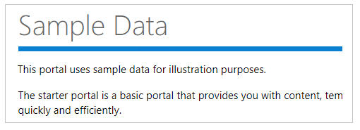

# Tutorial: Use Power Apps CLI with portals

[This article is pre-release documentation and is subject to change.]

In this example walkthrough, you’ll see how to get started with Power Apps CLI
to update sample portals configuration.

**NOTE:** This walkthrough focuses on the required Power Apps CLI commands for
Power Apps portals use. For more information about commands used in Power Apps
CLI, read [common
commands](../../developer/data-platform/powerapps-cli.md#common-commands).

> [!IMPORTANT]
> - This is a preview feature.
> - [!INCLUDE[cc_preview_features_definition](../../includes/cc-preview-features-definition.md)]

Visual Studio Code
------------------

To connect to Power Apps portals, and to use Power Apps CLI commands, use
[Visual Studio Code](https://code.visualstudio.com/docs) and the [integrated
terminal](https://code.visualstudio.com/docs/editor/integrated-terminal). The
integrated terminal makes it easy to connect to the Dataverse environment and to
download/change/upload the portals configuration. You can also use Windows
PowerShell instead.

Step 1: Authenticate
--------------------

Before you connect, list, download or upload any changes for a Power Apps
portal, you must authenticate to the Dataverse environment first. For more
information about authentication using Power Apps CLI, read [Power Apps CLI –
Auth](../../developer/data-platform/powerapps-cli.md#auth).

To authenticate, open Windows PowerShell, and run the following command using
your Dataverse environment URL.

*pac auth create -u [Dataverse URL]*

Example:

*pac auth create -u* <https://contoso-org.crm.dynamics.com>

Follow the prompts of authentication to sign into the environment.

Step 2: List available portals
------------------------------

Use the **list** command to list the available Power Apps portals in the
Dataverse environment you connected to using the previous step.

*pac paportal list*

Step 3: Download portals content
--------------------------------

Download portal website content from the connected Dataverse environment.

*pac paportal download --path [PATH] -id [WebSiteId-GUID]*

Example:

*pac paportal download --path c:\\pac-portals\\downloads -id
d44574f9-acc3-4ccc-8d8d-85cf5b7ad141*

For the **id** parameter, use the **WebSiteId** returned from the output of the
previous step.

Step 4: Change portals content
------------------------------

Change the configuration using Visual Studio Code and save your changes.

**NOTE:** Ensure you update only the supported entities for use with Power Apps
CLI. More information: [Supported entities](#prerequisites)

For example, the default portal page shows the text such as this:

This text is visible from the web page html:

You can change this text, and save the changes:

**TIP:** You can change the location of the folder path in PowerShell/integrated
terminal to the downloaded location, and enter “*code .”* to open the folder
directly in Visual Studio Code.

Step 5: Upload the changes
--------------------------

After making the required changes, upload them using the following command.

*pac paportal --path [Folder-location]*

Example*:*

*pac paportal upload --path C:\\pac-portals\\downloads\\custom-portal\\*

**NOTE:** Ensure the path for the portals content you entered is correct. By
default, a folder named by the portal (friendly name) is created with downloaded
portals content. For example, if the portal’s friendly name is *custom-portal,*
the path for the above command (--path) should be
*C:\\pac-portals\\downloads\\custom-portal*.

The upload only happens for content that has changed. In this example, since the
change is made to a web page, content is uploaded only for the adx_webpage
entity.

Step 6: Confirm the changes
---------------------------

To confirm the changes made to the portal webpage:

1.  Clear the [server-side
    cache](admin/clear-server-side-cache.md),
    or use [Sync
    Configuration](portal-designer-anatomy.md)
    by using Power Apps portals Studio.

2.  Browse to the portal webpage to see the change.

    

This concludes the walkthrough. You can repeat the above steps and change the
portals content for other [supported entities](#prerequisites).

Preview disclaimer
==================

Preview features are features that aren’t complete but are made available on a
“preview” basis so customers can get early access and provide feedback. Preview
features are not supported by Microsoft Support, may have limited or restricted
functionality, aren’t meant for production use, and may be available only in
selected geographic areas.

Copyright
=========

This document is provided "as-is". Information and views expressed in this
document, including URL and other Internet web site references, may change
without notice.

Some examples depicted herein are provided for illustration only and are
fictitious. No real association or connection is intended or should be inferred.

This document does not provide you with any legal rights to any intellectual
property in any Microsoft product. You may copy and use this document for your
internal, reference purposes. This document is confidential and proprietary to
Microsoft. It is disclosed and can be used only pursuant to a non-disclosure
agreement.

© 2021 Microsoft. All rights reserved.

Microsoft is trademark of the Microsoft group of companies. All other trademarks
are property of their respective owners.
