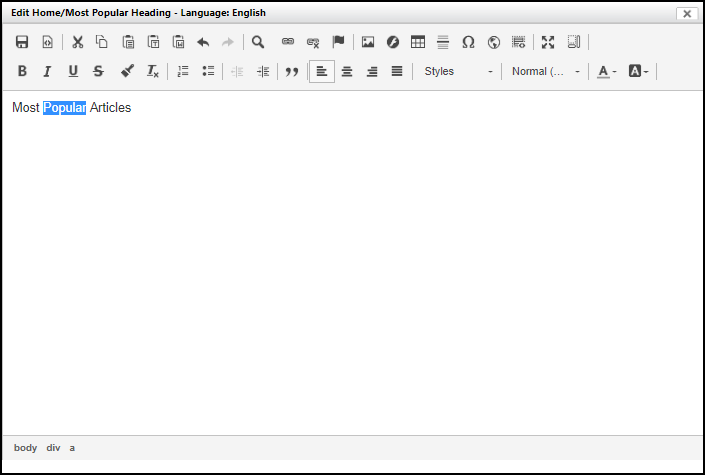
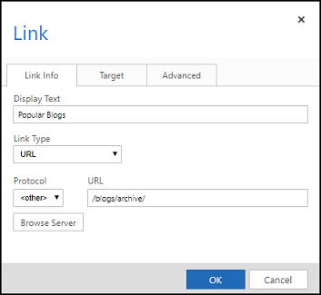
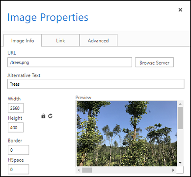

# Use the content editor to edit page content

You can use the portal content editor to edit text, create links, and display images on webpage. To use the portal content editor, you need the appropriate permissions and the content to be modified must be in the page template.

To modify the content, point to the content to be modified, and then select the edit button that appears.

> [!IMPORTANT]
> We recommend that you use [Power Apps portals Studio](portal-designer-anatomy.md) to edit the portal.

## Content editor commands and controls

The editor toolbar has a number of buttons to help with content editing. Move the mouse cursor over a button to see a tool tip for the buttons function. The table below also has more detail about the available buttons, listed in the order they appear in the toolbar.

|                          Button                          |                                                                                                                  Description                                                                                                                  |
|----------------------------------------------------------|-----------------------------------------------------------------------------------------------------------------------------------------------------------------------------------------------------------------------------------------------|
|                           Save                           |                                                                                         Saves the changes made to the content and closes the editor.                                                                                          |
|                          Source                          | Opens a dialog containing the HTML source for the content. The HTML can be directly modified and updated from this window. This dialog will not validate the HTML! It is recommended that only users with knowledge of HTML use this feature. |
|                     Cut, Copy, Paste                     |                                                                                     Cuts, copies, or pastes the selected text to and from the clipboard.                                                                                      |
|                   Paste as Plain Text                    |                                                                                    Pastes text from the clipboard with all formatting and styling removed.                                                                                    |
|                     Paste from Word                      |                                        Pastes text from the clipboard while trying to maintain formatting and styling that originated from Microsoft Word.                                        |
|                        Undo, Redo                        |                  Will undo the previous change or redo an undone change. Only changes that have been done since the editor was opened can be undone. Changes that have been saved or canceled cannot be undone, or re-done.                   |
|                           Find                           |                                                                            Opens a dialog for searching content. It also allows you to replace the found content.                                                                             |
|                           Link                           |                                                                      Inserts or edits a hyperlink for selected text. More information: [Create a link](#create-a-link).                                                                       |
|                          Unlink                          |                                                                                                       Changes a hyperlink back to text.                                                                                                       |
|                          Anchor                          |                                                                                              Inserts or edits an anchor link for selected text.                                                                                               |
|                          Image                           |                                                                      Inserts or edits an image into the content. More information: [Insert an image](#insert-an-image).                                                                       |
|                          Flash                           |                                                                                               Inserts or edits a flash object into the content.                                                                                               |
|                          Table                           |                                                                                        Inserts or edits tables and their rows, cells, and properties.                                                                                         |
|                  Insert Horizontal Line                  |                                                                                                 Inserts a horizontal line at the text cursor.                                                                                                 |
|                 Insert Special Character                 |                                                                      Opens a dialog containing special characters and inserts the selected character at the text cursor.                                                                      |
|                          IFrame                          |                                                                                                Inserts or edits inline frames in the content.                                                                                                 |
|                     Insert template                      |                                                                                                    Inserts a pre-defined content template.                                                                                                    |
|                         Maximize                         |                                                                                       Resizes the editor to the size of the containing browser window.                                                                                        |
|                       Show Blocks                        |                                                                    Displays the block-level elements and their element name at the top-left corner of the surrounding box.                                                                    |
|          Bold, Italic, Underline, Strikethrough          |                                                                          Makes selected text bold, italic, underline, or strikethrough as well as newly typed text.                                                                           |
|                     Copy Formatting                      |                                                                                            Copies the formatting and styling for the selected text                                                                                            |
|                      Remove Format                       |                                                                                           Removes the formatting and styling for the selected text.                                                                                           |
| Insert/Remove Bulleted List, Insert/Remove Numbered List |                                      Inserts a bulleted or numbered list for selected text or at the text cursor if the list isn't already present. If the list is already present, it will be removed.                                       |
|             Decrease Indent, Increase Indent             |                                                                                       Reduces or increases the indentation of the text or a list item.                                                                                        |
|                       Block Quote                        |                                                                                      Places the selected text or newly typed text within a quote block.                                                                                       |
|         Align Left, Center, Align Right, Justify         |                                                                           Aligns selected text to the left, center, right, or justify as well as newly typed text.                                                                            |
|                    Formatting Styles                     |                                                                           Changes the selected text as well as newly typed text to the pre-defined style selected.                                                                            |
|                     Paragraph Format                     |                                                                      Changes the selected text as well as newly typed text to the pre-defined paragraph format selected.                                                                      |
|                        Text Color                        |                                                                                      Changes the color of the selected text as well as newly typed text.                                                                                      |
|                     Background Color                     |                                                                                Changes the background color of the selected text as well as newly typed text.                                                                                 |
|                                                          |                                                                                                                                                                                                                                               |

> [!NOTE]
> - When in full screen mode, the **Save** button will not be available. To save the changes, select **Minimize** to return to the regular mode where the buttons are available.
> - If you have a webpage with more than 500 characters in length, and you edit the page using the content editor, the *Language content* tab in the editor may appear blank. If you review the browser for script errors, you may notice an HTTP response with `400 Bad Request` error. When this happens, ensure you truncate the URL so that you don't exceed 500 characters maximum length.

## Create a link

1. Select **Edit** near the area that you want to edit.

2. Select the text to make a hyperlink for.

3. Select **Link**. The Link dialog box appears.

4. Enter the properties for the hyperlink and select **OK**.

    

5. Select **Save** in the portal content editor to save the changes.

### Link properties and commands

| Name           | Description    |
|----------------|-----------------|
|Display Text|Displays the selected text for the hyperlink.|
|Link Type|Select the type of link to be created:<ul><li>**URL**:Create a hyperlink to an URL.</li><li>**Link to anchor in the text**:Create a hyperlink to an anchored text.</li><li>**E-mail**:Create a hyperlink to send an email to the defined email address.</li></ul> |
|Protocol|Select the appropriate protocol|
|URL       | The URL to link to. It can be any properly formatted URL, external to the website or within the same website. If within, it can be relative and it can be looked up using **Browse Server**. |
| Browse Server        | Opens a file picker for the website. The URL for the selected page or file will be placed into the Link URL field when selected. See [Using the File Picker](#browse-pages-and-files-by-using-the-file-picker).        |
| Target (Tab)        | Specifies whether the link will be opened in the same or a new browser window when selected. If not set, the link will open in the same window by default.                                                                  |
| Advanced (Tab)          | Specify advance properties for the link.   |
|||

## Insert an image

1. Select **Edit** near the area that you want to edit.

2. Place the text cursor where you want to insert an image.

3. Select **Image**. The Image Properties dialog box appears.

4. Enter the properties for the image and select **OK**.

    

5. Select **Save** in the portal content editor to save the changes.

### Image properties and commands

| Name              | Description                |
|-------------------|---------------------------------|
| URL         | The URL for the image. It can be any properly formatted URL to an image, external to the website or within the same website. It's recommended that the URL be within. When within, it can be relative and it can be looked up using **Browse Server**. |
| Browse Server     | Opens a file picker for the website. The URL for the selected image file will be placed into the Image URL field when selected. See [Using the File Picker](#browse-pages-and-files-by-using-the-file-picker).   |
| Alternative Text | Specifies the alt attribute for the image. It's read by screen readers, and is typically seen when the image doesn't load properly.  |
| Preview           | Displays a preview of the image being inserted or updated.               |
| Alignment  | Select whether to align the image left or right.         |
| Advanced (Tab)    | Specify advance properties for the image. |
|||

## Browse pages and files by using the file picker

The file picker provides a way to browse pages and files that belong to the same website. New files can be uploaded using the file picker as well. The file picker is available when adding a link or an image through the portal content editor. Select **Browse Server** to open the file picker. Browse to a page or file by using the left tree view and double-click the page or file in the rightmost list view to select it.

To upload new files:

1. Navigate to the folder to upload the file to and select the disk icon with a green plus on it.
2. In the dialog box that opens, select **Choose File** and pick a file to upload. Do the same in the next field to add more than one file.
3. Select **Ok** to upload the selected files.

### File picker commands

The table below has more detail about the available buttons, listed in the order they appear in the toolbar.

| Name                    | Description                                                                                                                                  |
|-------------------------|----------------------------------------------------------------------------------------------------------------------------------------------|
| Back                    | Move to the folder that was being viewed previously.                                                                                         |
| Reload                  | Refresh the folder's view.                                                                                                                   |
| Select file             | Use the selected page or file's URL.                                                                                                         |
| Open                    | View the page or file in a new browser window.                                                                                               |
| Upload files            | Opens a dialog for uploading new files. Select **OK** to upload new files immediately to the folder. |  
| Copy               | Disabled                                                                                                                                     |
| Remove                  | Deletes the selected file. Only files can be removed and not pages. Pages should be removed by using the **Delete** button in the content publishing toolbar. |  
| Get Info                | Displays additional information about the selected page or file.                                                                             |
| Preview with Quick Look | View the file and some information about it in a small overlay window.                                                                       |
| View as icons           | Displays the folder contents as icons.                                                                                                       |
| View as list            | Displays the folder contents as a table with more details about each item.                                                                   |
| Help                    | Opens a dialog about elFinder: Web file manager.                                                                                             |
|||

### See also

[Get started with the portal content editor](portal-content-editor.md)   
[Create and customize portal using Power Apps portals Studio](portal-designer-anatomy.md)
