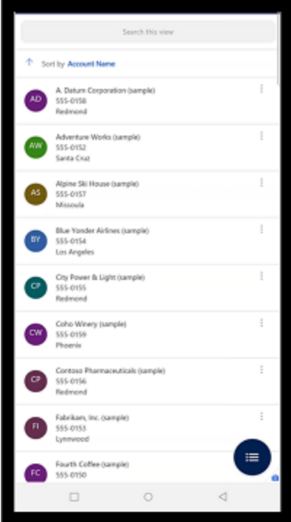
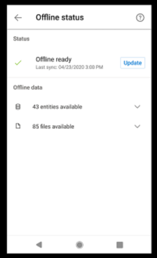
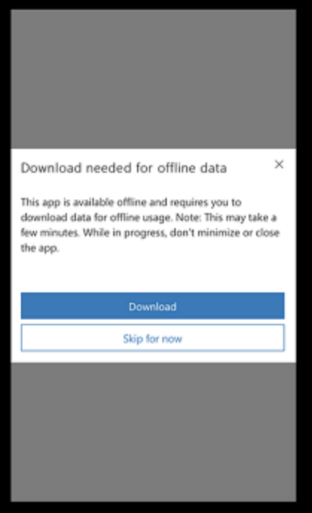
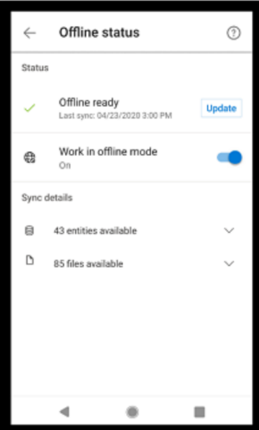

# Mobile offline overview

Wouldn't it be great to use your mobile app without worrying about spotty internet connectivity? With model-driven apps made with Power Apps and the new mobile offline-first experience, it's possible. People who need to work from remote locations can continue to work seamlessly without worrying about their internet connection.

With the new mobile offline experience enabled for your model-driven apps, not only can you continue working in offline mode, you'll also have better device performance, a more responsive app, and less drain on the battery because fewer connections are being made to the server.

Note, an internet connection is required to sync data between your mobile device and Microsoft Dataverse.

To get started with mobile offline, an app maker needs to enable and define the tables that are available for offline by using the [modern app designer](../maker/model-driven-apps/app-designer-overview.md). For more information, go to [Set up mobile offline](setup-mobile-offline.md).

## Mobile offline is offline-first by default

_Offline-first_ means that all the data you may need when offline is copied to your mobile device. This requires initial network access to download the data. Once you have your data, you only work with the data on your local device all the time. This is true both when your device is connected and disconnected to the network.

Moving in and out of network access does not affect performance of the app because it is using local data. Power Apps monitors network access and automatically syncs the changes you have made locally with the server, and downloads any updates made on the server. The offline features automatically handle spotty network connections, download data, upload data, and handle conflict detection and more. The built-in offline features minimize system resources and are highly performant.

When offline is configured and enabled for your model-driven app, anyone who uses the [Power Apps mobile app](run-powerapps-on-mobile.md) can also use the app in offline mode. By default, the Power Apps mobile app runs offline-first, either with or without an internet connection. This functionality optimizes offline performance and creates a consistent experience for users as they change locations:

- **Online**: Occurs when an internet connection is available, but offline mode isn't set up. The mobile app functions similar to using the app with an internet connection on your PC. When the internet connection is lost, the mobile app is unusable. Not recommended.
- **Offline-first without an internet connection**: Data is downloaded, and all changes are saved to your mobile device. When the internet connection is restored, the changes are automatically synced to the server.
- **Offline-first with an internet connection**: Data is downloaded to the device, and all changes are saved locally. Because there's an internet connection, the app will automatically attempt to sync every few minutes.

> [!IMPORTANT] 
> For more information about how to set up mobile offline for canvas apps, go to [Develop offline-capable canvas apps](../maker/canvas-apps/offline-apps.md)

## Offline-first vs. classic offline

With the offline-first experience, it's important to understand the key benefits of the *offline-first experience* versus the *classic offline experience*.

| **Offline-first** | **Classic offline** |
|-------------------------|-------------------------|
| <ul> <li>Your data is always the same, regardless of your network connection.</li> </ul> <blockquote>  </blockquote> <ul> <li>There's no toggle for users to switch from offline to online mode. A user will never forget to sync their changes back to the server because the app will do it automatically.</li> </ul> <blockquote>    </blockquote> | <ul> <li>Users have the option to skip the initial offline sync and stay online, which means that users in your organization might not have the same experience.</li> </ul> <blockquote>  </blockquote> <ul> <li>Users have to remember to disable the Work in offline mode toggle before they can sync changes with the server.</li> </ul> <blockquote>  </blockquote> <ul> <li>To save your changes in offline mode, you need to set the Work in offline mode toggle to On. Otherwise, when you're working on a row and suddenly lose internet connection your changes will be lost.</li> <li>The rows you see in offline mode are listed from the local database. Which means, the rows you see in offline mode vs. online can be different.</li> </ul> |

