# Run model-driven apps and canvas apps on Power Apps mobile

When you create an app, or someone shares an app with you&mdash;either a canvas app or model-driven app&mdash;you can run that app on iOS and Android devices by using the Power Apps mobile app. If you're on a Windows device, you can only run canvas apps; model-driven apps aren't supported on the Power Apps mobile app for Windows devices. In this topic, you'll learn how to get started and run a canvas app and a model-driven app on your mobile device. 

To learn how to use model-driven apps running on the Power Apps mobile app, see [User Guide for model-driven apps running on the Power Apps mobile app](use-custom-model-driven-app-on-mobile.md).

> [!IMPORTANT]
> - Customer engagement apps (such as Dynamics 365 Sales and Dynamics 365 Customer Service) don't run in the Power Apps mobile app. Instead, you use the Dynamics 365 for phones and tablets apps. More information: [User Guide for Dynamics 365 for phones and tablets](https://docs.microsoft.com/dynamics365/mobile-app/dynamics-365-phones-tablets-users-guide).
> - Power Apps mobile app for Windows isn't supported if you have the [Power Apps per app plan](/power-platform/admin/about-powerapps-perapp).

## Early access feature

If you have enabled early access then you will have a different navigation experience. This topic calls out both experiences.

|**Current**  |**Early access** |
|---------|---------|
|      |     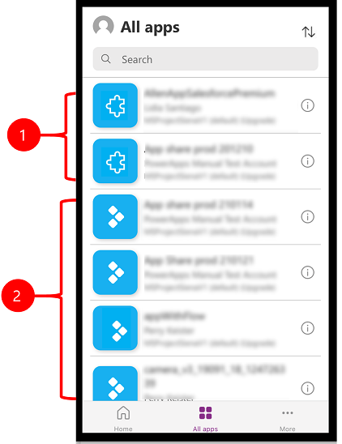  |

Legend:

1. **Model-driven apps**
2. **Canvas apps**

### Use the early access design

To use the early access you will need to enable the **New design (preview)**. There is two ways to do this:

- When you're on the latest version of the app, you'll get a notification to use the new design. Select **Try now** to start using the new design.

  > [!div class="mx-imgBorder"]
  >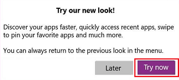 

- Or, go to **Settings** menu  and turn on the toggle for **New design (preview)**.

## Required privileges

For privileges required to run model-driven apps on Power Apps Mobile app, see [Required privileges](/dynamics365/mobile-app/set-up-dynamics-365-for-phones-and-dynamics-365-for-tablets#required-privileges).

## Supported devices 

These are the supported devices for running model-driven apps and canvas apps on the Power Apps mobile app.

| Android 7 or later |Android 7 or later |
| Windows 8.1 or later (PC only) |Windows 10 Fall Creators Update with at least 8 GB of RAM)|

> [!NOTE]
> - On October 16, 2020 we will no longer support iOS 12. After October 16, 2020 iOS 13 or later will be supported. 
> - We currently don't support new features on Windows platform for [Power Apps mobile app](/powerapps/user/run-app-client). Features such as the Improved Microsoft Dataverse option and guest access are not available on this platform. We recommend using a web player on Windows to leverage the full set of capabilities. Updates to the Power Apps mobile app for Windows platform will be announced in future.

## Install Power Apps mobile app

To follow this procedure, if you're not signed up for Power Apps, [sign up for free](https://make.powerapps.com/signup?redirect=marketing&email=).  Also, make sure you have access to a model-driven app or canvas app that you created or that someone else created and shared with you. 

Choose the download link for your device:

- For iOS (iPad or iPhone), go to the [App Store](https://itunes.apple.com/app/powerapps/id1047318566?mt=8).

- For Android, go to [Google Play](https://play.google.com/store/apps/details?id=com.microsoft.msapps). 

## Open Power Apps, and sign in

Open Power Apps on your mobile device, and sign in by using your Azure Active Directory credentials.

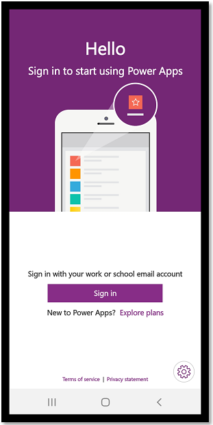

If you have the Microsoft Authenticator app installed on your mobile device, enter your username when prompted, and then approve the notification sent to your device.

## Find the app

The apps that you used recently wil show on the default screen when you sign in to Power Apps mobile.

| **Current** | **Early access** |
| --- | --- |
|  When you sign in to the app, the My apps filter is set by default. If you don't find the app you're looking for, you can open the **Power Apps** menu, and then select a different filter.  

 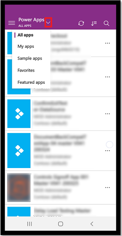 |  The **Home** is the default sceen when you sign in. It shows the apps that you used recently and the apps that have marked as favorites. 

 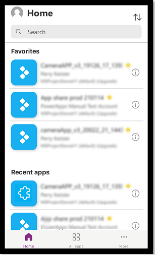|

## Filter apps 

If you don't have any apps then when you sign in, the app will take you to the the **All apps** screen. The list of apps are organized in alphabetical order. Type in an app name in the search bar to find an app.

|Current  |Early access  |
|---------|---------|
|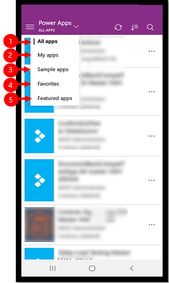 

  

  <ol><li>**All apps**: Displays all canvas apps and model-driven apps to which you have access, including apps you created and apps that others shared with you.</li> <li>**My apps**: For canvas apps, this displays canvas apps that you've opened, apps that you're the owner of, and apps that you can edit. For model-driven apps, this displays all model-driven apps that you have access to. </li> <li>**Sample apps** (canvas apps only): Displays sample canvas apps from Microsoft that showcase real application scenarios with fictitious data to help you explore design possibilities.</li> <li>**Favorites** (canvas apps only): Diispalys canvas apps that you have pinned to favorite.</li> <li>**Featured apps** (canvas apps only): Displays canvas apps that your admin has marked as featured apps.</li>|     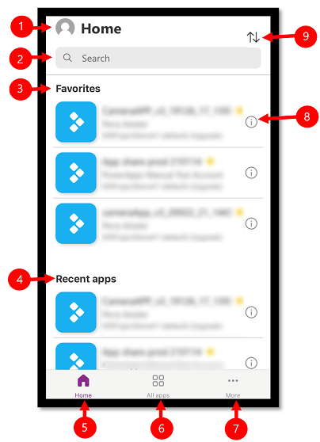  

 

  <ol><li> **Settings**: Access app settings and sign out. </li> <li> **Search**: Use the search to search for apps. When you run a search it will only search for apps that are on the screen you're on. </li> <li>**Favorites** (canvas apps only): Dispalys canvas apps that you have pinned to favorites. </li> <li>**Recent apps**: Displays both model-driven and canvas apps that you have recently used. </li> <li>**Home**: Displays favorite apps and recently accessed apps sorted by open date.</li> <li>**All apps**: Displays all canvas apps and model-driven apps to which you have access, including apps you created and apps that others shared with you.</li> <li>**More** (canvas apps only): Displays featured and sample apps. </li> <li>**Details**: View information about the app including open the app, add a shortcut for the app, and add to favorites. </li> <li>**Sort apps**: You can short by the app name or modified date. </li> 
  
## Add to favorites

You can only add canvas apps to your list of favorite apps.

|**Current**  |**Early access**  |
|---------|---------|
| <ul><li> Select the ellipsis (...) on the app tile, and then select **Favorite**. </li><li> To remove an app from this list, select the ellipsis (...) on the app tile, and then select **Unfavorite**.   

 

 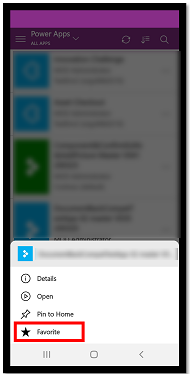 | <ul><li> Swipe left and then select **Favorite**. A yellow star will appear next to app name when it's added to favorites. </li><li> To remove the app from the list, swipe left again and then select **Unfavorite**.</li>   

 

 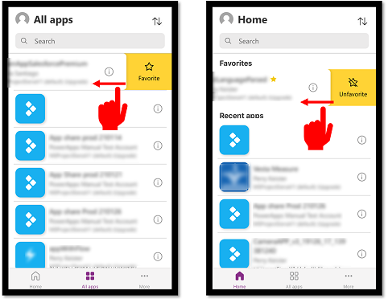     |

## Sort apps

You can sort both canvas apps and model-driven apps.

| **Current** | **Early access** |
| --- | --- |
|  After you filter your apps, you can sort the filtered list by the date the apps were most recently opened or modified, or alphabetically by name. These preferences are retained when you close and reopen apps. You can sort both canvas apps and model-driven apps.  

  | You can short apps alphabetically by name or by modified date. The short option is aviliable on **Home**, **All apps**, **Featured apps** and **Sample apps** screen. 

 |

## Search apps

If you know the name of the app that you want to run, then then use search to quickly find the app. You can search for both canvas apps and model-driven apps.
 
| **Current** | **Early access** |
| --- | --- |
|  To find an app, select the search icon at the top, and then type part of its name in the search box. If you filtered your apps, the filtered list will be searched.  

 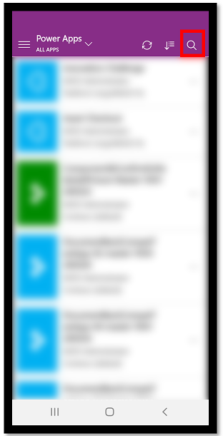 | To find an app, select the **All apps** and then enter the app name in the search field to find the app. 

 |

## Refresh the list of apps

- **Current**: Select the refresh icon  to refresh the list of apps. This will refresh the lists of both the canvas apps and model-driven apps. 

- **Early access**: On the **Home**, **All apps** or any other screen with a list of apps, swipe down to refresh the app list.

   > [!div class="mx-imgBorder"]
   >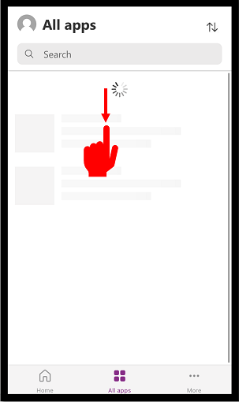

## Add shortcuts

You can add a shortcut for both canvas apps and model-driven apps to the home screen of your device for quick access.

### Use Safari to add a shortcut (iOS 13 or earlier)

1. Do one of the following depending on if you're on the current release or eary acccess:

  - **Current**: Select the ellipsis (...) on the app tile, select **Pin to Home**.

     > [!div class="mx-imgBorder"]
     > 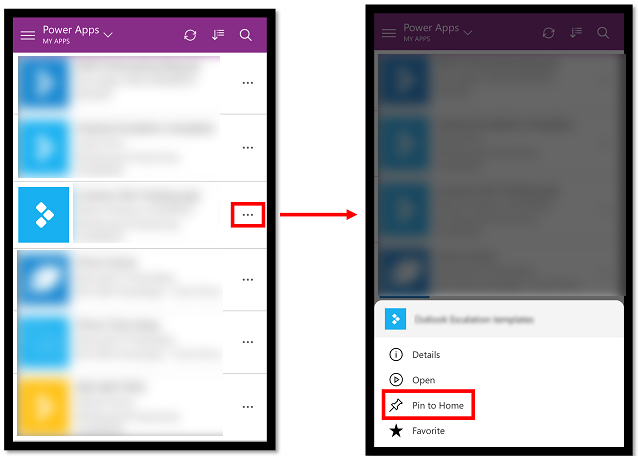 
   
  - **Early access**: On the app that you want to create a shortcut for, swipe to the right and select **Shortcut**.

     > [!div class="mx-imgBorder"]
     >  

2. Select .
 
   > [!div class="mx-imgBorder"]
   >  
   
3. Scroll down and select **Add to Home Screen**   

   > [!div class="mx-imgBorder"]
   >  
   
4. Select **Add**.   

   > [!div class="mx-imgBorder"]
   > 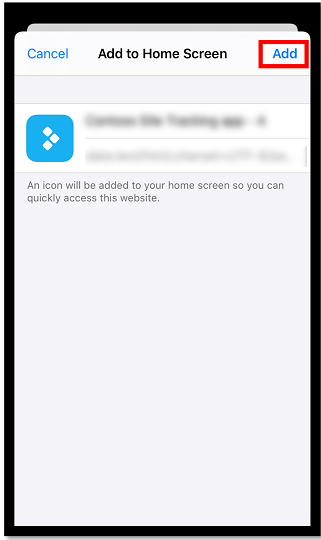 
   
> [!NOTE]
> For iOS devices that have multiple browsers installed, use Safari when pinning an app to home. 

### Use Siri shortcuts to add a shortcut to the Home screen (iOS 14 or later) 

The Power Apps mobile app is now integrated with Siri shortcuts, which gives you the ability to add a shortcut to the Home screen, launch apps with Siri, and create new workflows. For more information on how shortcuts work on iOS, see [Shortcuts User Guide](https://support.apple.com/guide/shortcuts/welcome/ios). This feature requires Power Apps mobile version 3.20092.x or later.

Users on iOS 14 or later can use Siri Shortcuts to pin an app to the home screen. The new experience works for both model-driven and canvas apps. When you add a Siri shortcut, the app is added to the iOS **Shortcuts** app and from there you can add the app to your home screen.

1. Do one of the following depending on if you're on the current release or eary acccess:

 - **Current**: To adda shortcut to the home screen for an app, select the ellipsis (...) on the app tile and then select **Add shortcut to Siri**.

    > [!div class="mx-imgBorder"]
    > 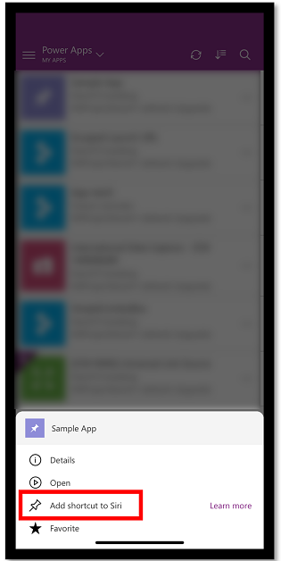
    
 - **Early access**: On the app that you want add a shortcut for, swipe to the right and select **Shortcut**.

    > [!div class="mx-imgBorder"]
    >  
   
3. Add a custom phrase to open the app using voice commands and then select **Add to Siri**.

   > [!div class="mx-imgBorder"]
   >

   
4. The app is added to the **Shortcuts** app on your mobile device. Open the **Shortcuts** app and select the ellipsis (...) above the app name.

   > [!div class="mx-imgBorder"]
   > 

5. Select **Add to Home Screen**.

   > [!div class="mx-imgBorder"]
   > 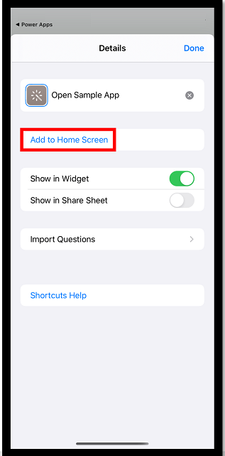
   
6. On the upper right corner, select **Add** and then select **Done**. 

   > [!div class="mx-imgBorder"]
   >
   

7. Go to your home screen to find the pinned app.   
  
   > [!div class="mx-imgBorder"]
   > 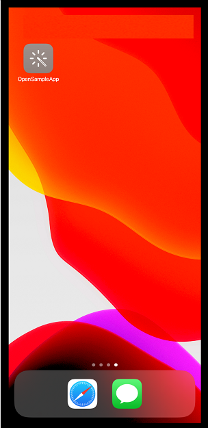

You can customize the shortcut icon but it is limited to the customization options in iOS. For more information, go to [Modify shortcut icons](https://support.apple.com/guide/shortcuts/modify-shortcut-icons-apd5ad5a2128/ios).

### Pin to home on Android 

Select the ellipsis (...) on the app tile, select **Pin to Home**, and then follow the instructions that appear.

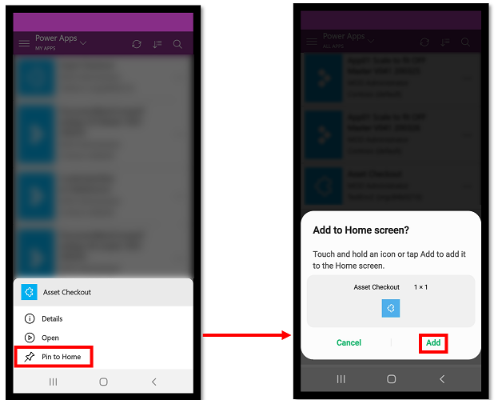  

## See non-production apps

By default, only production model-driven apps are shown in the list of apps.

To see model-driven apps from non-production environments, select the **Settings** menu (**Current**:     **Early access**: ), and then turn on **Show non-production apps**. Follow the instructions that appear.

## Run an app

To run an app on a mobile device, select the app tile. If someone else created an app and shared it with you in an email, you can run the app by selecting the link in the email.

### Run a canvas app

If this is the first time you're running a canvas app by using the Power Apps mobile app, a screen shows the swipe gestures.

#### Close a canvas app

Use your finger to swipe from the left edge of the app to the right to close an app. On Android devices, you can also press the Back button and then confirm that you intended to close the app.

#### Pinch and zoom in on a canvas app

#### Give consent to a canvas app

If an app requires a connection to a data source or permission to use the device's capabilities (such as the camera or location services), you must give consent before you can use the app. Typically, you're prompted only the first time you run the app.

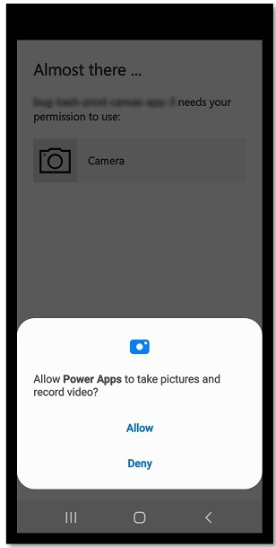

### Run a model-driven app 

The following image shows an example of a model-driven app screen after you've signed in. To learn how to use model-driven apps running on the Power Apps mobile app, go to [User Guide for model-driven apps running on the Power Apps mobile app](use-custom-model-driven-app-on-mobile.md). 

#### Give consent to a model-driven app

If an app requires a connection to a data source or permission to use the device's capabilities (such as the camera or location services), you must give consent before you can use the app. Typically, you're prompted only the first time you use the app.

#### Close a model-drive app

Select the site map , and then select **Apps**.

## See also

[Troubleshoot issues for the Power Apps mobile app](https://docs.microsoft.com/powerapps/user/powerapps_mobile_troubleshoot)

