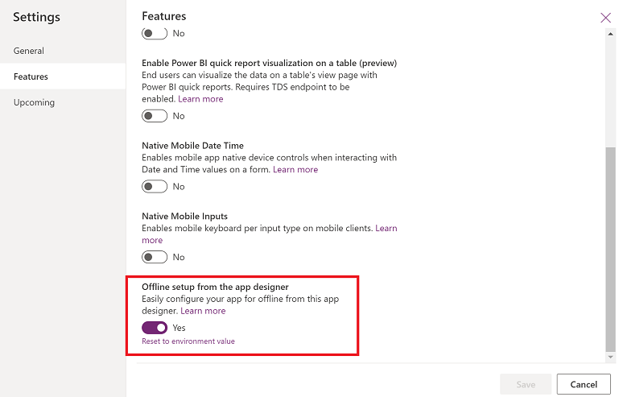
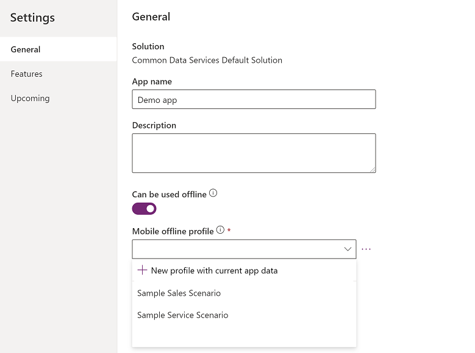
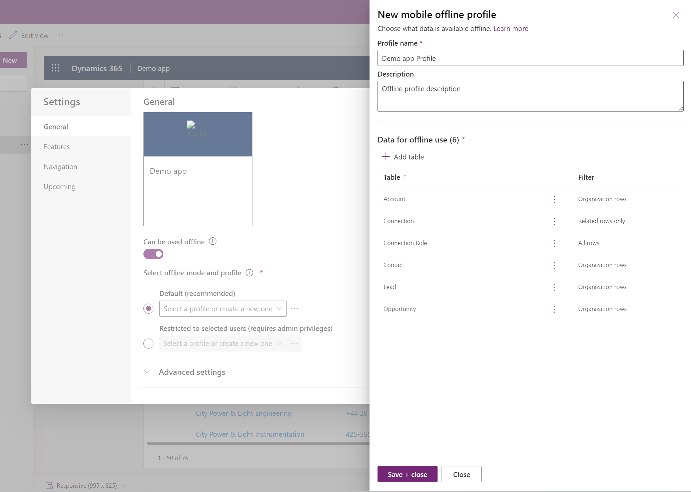
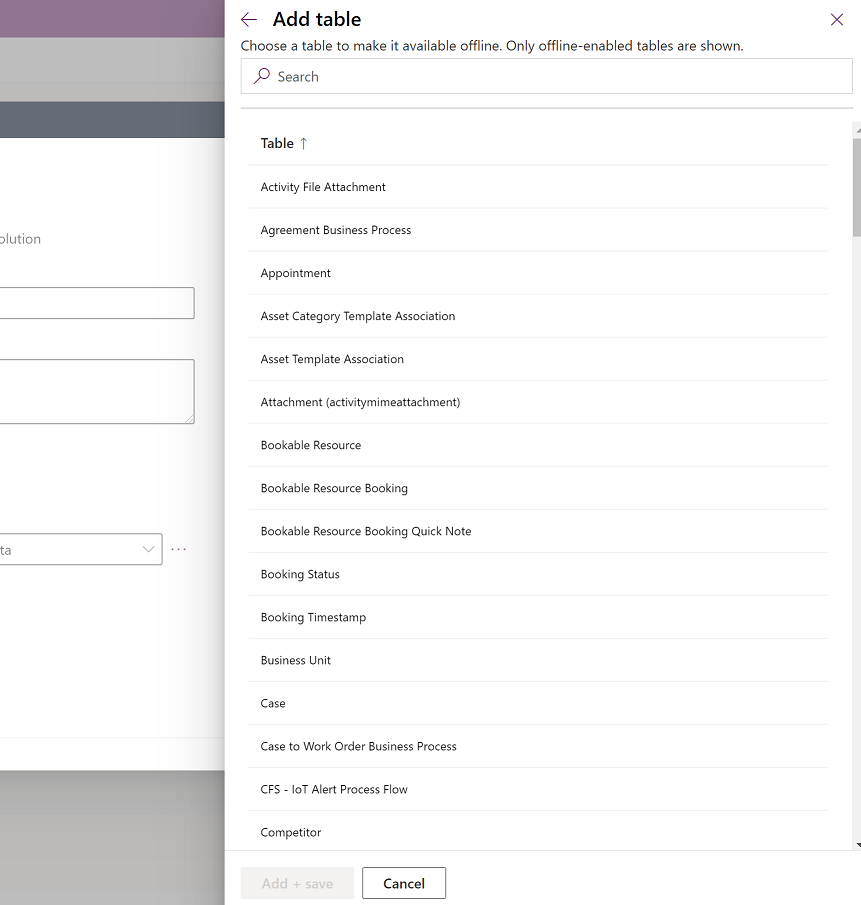

# Set up mobile offline (preview)

[This topic is pre-release documentation and is subject to change.]

Use the [modern app designer](../maker/model-driven-apps/app-designer-overview.md) to enable your model-driven apps for offline use on a mobile device. When offline mode is enabled, users can interact with their data without internet connectivity on the [Power Apps mobile app](https://powerapps.microsoft.com/downloads/).

## Prerequisites 

Verify the following prerequisites before you enable mobile offline: 

- Environment maker, system administrator, or system customizer role is needed to configure offline mode for model-driven apps. These roles have Create, Read, Write, Delete and Share privileges on the **mobile offline profile** table. More information: [About predefined security roles](../maker/model-driven-apps/share-model-driven-app.md#about-predefined-security-roles)

- Users with the **basic user** role can open and use an offline application. This role has the Read privilege for the **mobile offline profile** table.

   If you have a custom security role, make sure you have the Read privilege for **Mobile Offline profile**. For more information, go to [Miscellaneous privileges - Core Records tab](/power-platform/admin/miscellaneous-privileges).

  > [!div class="mx-imgBorder"] 
  > 

## Optimize your app for mobile offline 

Mobile apps run on smaller screens with limited connectivity. Before you enable offline mode, make sure your model-driven app is optimized for offline and mobile use. Consider the number of user scenarios that you want to cover and the amount of data the app will use. Create an app that's simple and lightweight.

If you have desktop and remote mobile users, optimize the user experience by creating two separate apps. Create an online app for your office users and another app for your mobile users who might have limited connectivity.

Follow these best practices when building an app for mobile offline use:

- Identify the on-the-go scenarios that are functionally related, such as tasks that are performed by users who work in the field.
- Reduce the complexity of your app by limiting the amount of app metadata that needs to be downloaded on a user's device. Only add the tables and views that are needed for your mobile users. For more information, go to [Add pages to your app](../maker/model-driven-apps/create-a-model-driven-app.md#add-pages-to-your-app).
- Only keep views that are necessary, and remove any that aren't needed on a day-to-day basis. For example, keep the **My active accounts** view and remove the **All accounts** view. Keep your forms lightweight for a smooth and intuitive experience on small-screen devices. The following are possible optimizations for forms on mobile:

  - Build dedicated forms for mobile use.

  - Share forms across the mobile and desktop experience, but disable some fields on mobile.

   
      > [!div class="mx-imgBorder"]
      > 

## Enable your app for offline use (preview)

Set up the new mobile offline experience in the [modern app designer](../maker/model-driven-apps/app-designer-overview.md).

1. Sign in to [Power Apps (preview)](https://make.powerapps.com/?utm_source=padocs&utm_medium=linkinadoc&utm_campaign=referralsfromdoc) 

2. On the left pane, select **Apps**, and then select the model-driven app that you want to enable for offline.

3. Select **More (...)** > **Edit** > **Edit in preview** to open the modern app designer.

    > [!div class="mx-imgBorder"]
    > 
 
4. On the command bar, select **Settings**.

    > [!div class="mx-imgBorder"]
    > 

5. On the **Features** tab, set the **Offline setup from the app designer** toggle to **Yes**.

    > [!div class="mx-imgBorder"]
    > 

6. On the **General** tab, set the **Can be used offline** toggle to **On**.

    > [!div class="mx-imgBorder"]
    > 

7. Select an existing offline profile, or select **New profile with current app data**. To set up a new offline profile, go to the following section, [Set up a mobile offline profile](setup-mobile-offline.md#set-up-a-mobile-offline-profile).
    
    > [!NOTE]
    >  If you edit an app that has more than one offline profile, that was created using the [classic offline experience](/dynamics365/mobile-app/setup-mobile-offline#step-2-create-a-mobile-offline-profile-to-determine-what-data-will-be-available-while-offline), then you will get this message: **There is more than one mobile offline profile associated with this app, so you can't edit it here.** To use the new offline experience, your app can only have one offline profile.
    
    > [!div class="mx-imgBorder"]
    > 

8. Close the **Settings** dialog, and then save and publish your app. When you're done, the app will be set up for offline use.

## Set up a mobile offline profile

The mobile offline profile represents the dataset that's synced on a user's device. The profile contains the tables, including related filters, that are applied when data is synced to a user's device.

### Prerequisite: Enable a table for offline

A table needs to be enabled for offline to add it to a offline profile. Some tables are enabled for offline by default. Follow these steps to verify whether a table is enabled for offline.

1. Sign in to [Power Apps (preview)](https://make.powerapps.com/?utm_source=padocs&utm_medium=linkinadoc&utm_campaign=referralsfromdoc) 

2. On the left pane, select **Data** > **Tables**. 
3. Select the table that you want to add to an offline profile, and then on the command bar, select **Settings**

    > [!div class="mx-imgBorder"]
    > 
    
4. In the **Edit table** settings, select **Advanced options**, and in the **Rows in this table** section, select **Can be taken offline**.

   > [!NOTE]
   > An app can only be linked to one profile, but a profile can be shared between multiple apps. This can be useful when different apps share the same dataset, which then only needs to be downloaded once on the device and between the apps.
   
    > [!div class="mx-imgBorder"]
    > 

### Generate a default profile

The modern app designer can generate a default offline profile that's based on how the app is configured.

> [!NOTE]
> The default offline profile is a starting point to help you quickly build an offline profile. The default profile won't compute the optimal filters for each table. If you have a complex app, the auto-generated profile might be partially successful because only part of the app might be set up correctly for offline use. With this in mind, it's important that you review and adjust the proposed filters based on your organization's needs.

1. Select **New profile with current app data**. 

    > [!div class="mx-imgBorder"]
    > 

2. Review the proposed filters for each table. Make sure that the data downloaded on the users' devices is limited to only what's necessary. Focus on the most-often-used tables in your app, which in most cases have the **Organization rows** filter set.

    > [!div class="mx-imgBorder"]
    > 

  The tables that are added to the profile also have the **Related rows only** filter. These are tables that are used in some views and need to have related information available, so you might not need to modify them based on your organization's needs.

### Add a table to an offline profile and apply filters

Applying an appropriate filter for each of the tables configured in the offline profile is critical to limit the amount of data that's downloaded on users' devices.

1. Select **Add table**.

    > [!div class="mx-imgBorder"]
    > 

2. Choose a table, and then define the filters. 
 
    > [!div class="mx-imgBorder"]
    > 

3. Set the following filters:

   1. Choose the row that you want to make available offline. For the **Custom** option, use the [expression builder](../maker/model-driven-apps/create-edit-view-filters.md) to set up advanced conditions.
   2. **Relationships** lists the different relationships available between the current table and other tables added in the offline profile. Selecting a relationship will ensure that related rows following that relationship will be downloaded and made available offline.
   3. **Files** and **Images** define which columns for a file or image need to be downloaded offline. For files, you can choose to download every column or none at all. For images, you can select each column you want to download granularly.
   4. **Sync interval** defines the sync frequency to be applied on the device to sync the data with the server. If a table's data doesn't change frequently—like a catalog or a product table—you might want to focus on only syncing data when necessary, for example refreshing only once a day.
   
     > [!NOTE]
     > You can only have up to ten related tables in an profile. In custom filters and in relationships, you also cannot have more than ten related tables. For example, when you add one relationship in table A concerning table B, this can increase the count by one. If table B has two relationships, then this means you have two relationships in the profile. You will get an error and won't be able to publish the offline profile if you exceed the limit. 
      
      > [!div class="mx-imgBorder"]
      >

4. Select **Add + save** to add your table and filters to the profile.

5. When all tables are properly configured for the profile, select **Done** > **Publish your application**.

When the app is published, the app will be enabled for offline use. All your users who have access to the app can also use it in offline mode.

[!INCLUDE[footer-include](../includes/footer-banner.md)]
