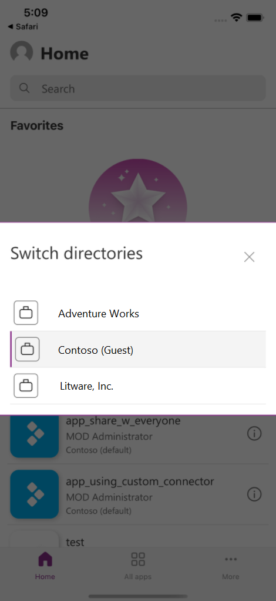

# Switch to a different directory in the Power Apps mobile app

When a user signs into the Power Apps mobile app, they sign into their *home tenant*, which is the Azure Active Directory (Azure AD) tenant where their credentials are provisioned. After signing in, a user can change the *directory*, or organization with which they intend to use the app. 

Users can now easily switch to a different directory, without having to log out of Power Apps, when using Power Apps on mobile devices. Users can specify the directory they want to work in on the user profile page.  This means that:

- Users no longer need to sign out of Power Apps to switch directories.
- Users can now access shared apps from a list on the user profile page.

> [!Important]
> The ability to easily switch to a different directory is available on only Android devices at this time.

To switch to a different directory in the Power Apps mobile app:

1. Open Power Apps on your mobile device.
2. From the **Home**, **All apps**, or **More** page, select your profile image. Your user profile page appears.

  > [!Note]
  > Users signing in to Power Apps with a Microsoft account cannot switch directories from their user profile page. They must use a [deeplink](mobile-deep-links.md).

3. Select the directory you're signed in to. A list of directories appears.
    
    > [!div class="mx-imgBorder"] 
    > 
   
4. Select the directory you want to switch to.

