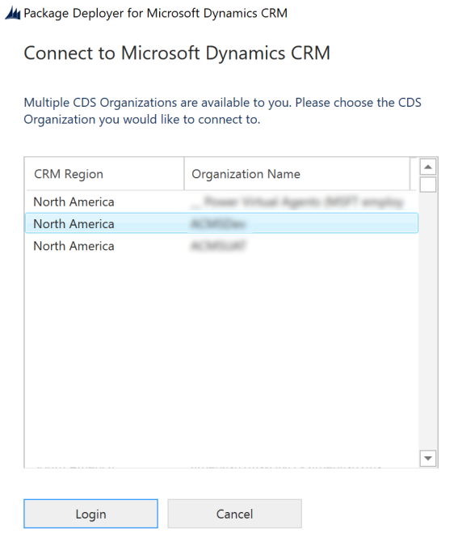
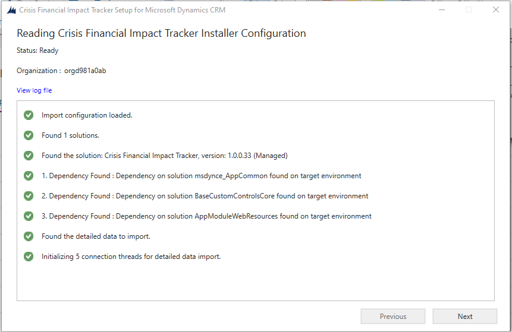
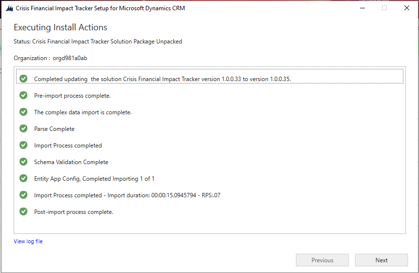
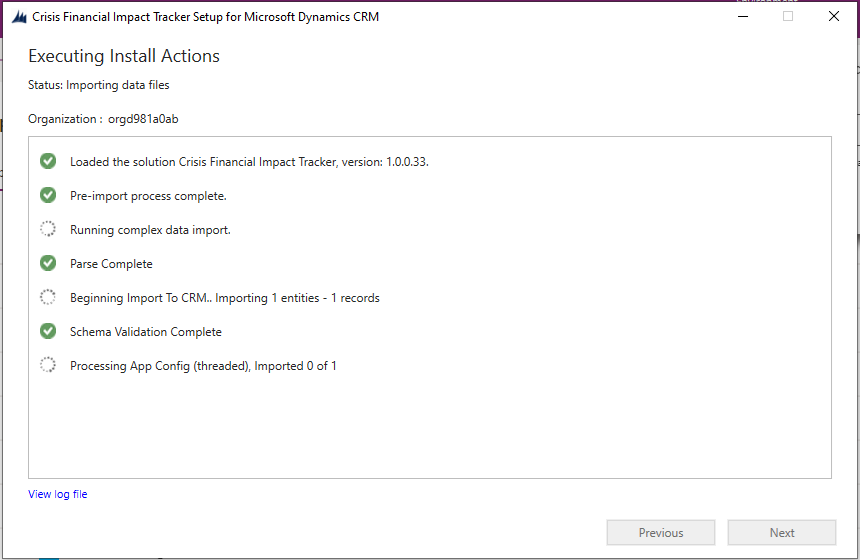
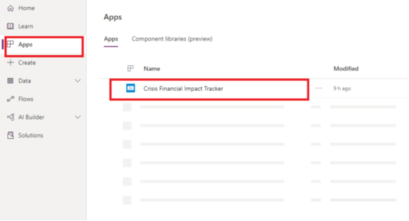
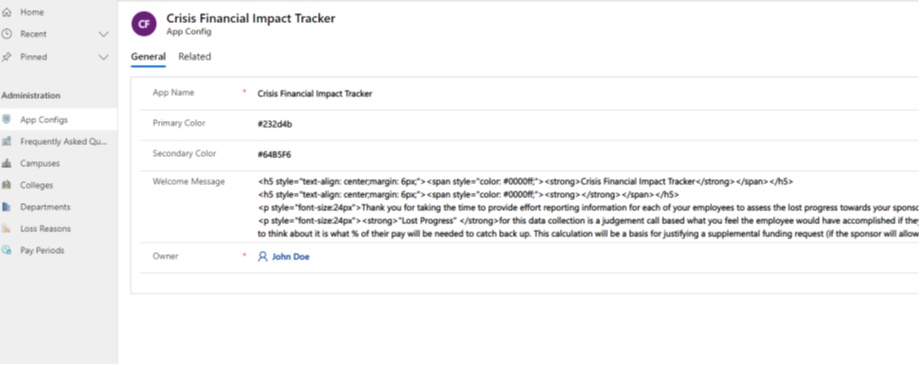
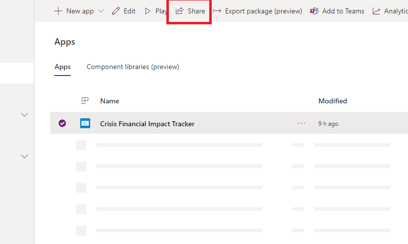
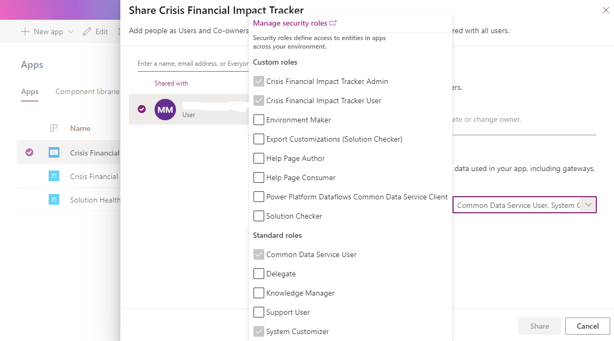

# Deploy the Higher Education Crisis Financial Impact Tracker app

The Higher Education Crisis Financial Impact Tracker app requires a small amount of setup to adapt to your needs. This article provides step-by-step instructions for university IT admins to deploy and configure the app for their organization.

See the overview video about how to download and deploy the solution, or follow the steps in this article. Estimated time to complete these steps: **30–35 minutes**

## Demo: Quick overview of how to download and deploy the solution

Watch a quick overview about how to download and deploy the solution.

 

> [!VIDEO https://www.youtube.com/embed/IZhgSWfRh4g]

## Step 1: Download the deployment package

Download the latest deployment package (.zip) from [here](https://aka.ms/HECFIT). Before extracting the .zip file, ensure that you unblock it. 

To unblock the .zip file:

- Right-click to select the .zip file, and then select **Properties**.

- In the **Properties** dialog box, select **Unblock**, and then select **Apply** followed by **OK**.

When you extract the .zip file, you see the following components in the extracted folder.

|Component|	File name |Description
|-------|-------|------|
| AppIcons | Higher Education Crisis Financial Impact Tracker.png| Sample app icon.|
| Data|Import Templates  | Individual entity template for data load files in .xlsx (Excel) format. The files are arranged in the order in which they should be imported.|
| Data|Sample Data  | Individual entity sample data in .xlsx (Excel) format. The files are arranged in the order in which they should be imported.|
| Package |Higher Education Crisis Financial Impact Tracker app package-related files.|Complete list of files required to deploy the app.|
| Power BI Template | PBITemplate.pbix | A sample Power BI template to connect to the app's Microsoft Dataverse instance.|

## Step 2: Sign up for Power Apps, and create an environment

Sign up for [Power Apps](https://docs.microsoft.com/power-platform/admin/signup-for-powerapps-admin) if you don't have it already, and purchase an appropriate license. More information: [Power Apps pricing](https://powerapps.microsoft.com/pricing/)

After you purchase Power Apps, create an environment with a Dataverse database.

1. Sign in to the [Power Platform admin center](https://aka.ms/ppac).

1. Create a Dataverse environment with a database. More information: [Create and manage environments](https://docs.microsoft.com/power-platform/admin/create-environment)

    > [!IMPORTANT]
    > If you select a security group for the database while creating it, remember that any apps can be shared only with users who are members of that security group.

1. Create users, and assign appropriate security roles. More information: [Create users and assign security roles](https://docs.microsoft.com/power-platform/admin/create-users-assign-online-security-roles)

## Step 3: Install the app

Follow the steps below to install and configure the Higher Education Crisis Financial Impact Tracker app.

### Install the app from the deployment package

1. Go to the folder where you extracted the deployment package (.zip file). You'll find a **Package** folder. Open the **Package** folder, and then double-click to select **PackageDeployer.exe**.

1. On the next screen, select **Continue**.

1. You'll be prompted to connect to your environment. Select **Office 365** as the **Deployment Type**, select **Show Advanced**, and then enter your credentials to connect to your environment.

   > [!div class="mx-imgBorder"]
   > 

1. Select **Login** to continue.

1. If you have access to more than one Dataverse environment, the next screen prompts you to select from the list of available environments where you want to install the package. Select the environment you want, and then select **Login**.

    > [!div class="mx-imgBorder"]
    > 

1. On the next screen, select **Next.**

1. The next screen displays the environment name where the package is installed. Review the information, and then select **Next**.

1. The next screen validates whether the package can be installed on your environment. Select **Next** to continue with the installation.

   > [!div class="mx-imgBorder"]
   > 

1. The next screen displays the installation status of the package. After the installation is complete, select **Next**.

   > [!div class="mx-imgBorder"]
   > 

   > [!div class="mx-imgBorder"]
   > 

   > [!NOTE]
   >  It might take a while for the package installation to be completed.

1. On the next screen, select **Finish** to complete and close the setup.

1. After the app is installed, go to [Power Apps](https://make.powerapps.com/) and select your environment from the upper-right corner. You'll see the new app under **Apps**.

   > [!div class="mx-imgBorder"]
   > 

The installation also adds the configuration data for the Higher Education Crisis Financial Impact Tracker app.

Select **Higher Education Crisis Financial Impact Tracker App** to open the model-driven app and configure the rest of the deployment settings. This app has several entities where you can add and manage data for your university system. You can use the area picker on the lower part of the left pane to select a different area.

## Step 4: Update the app branding and tracking level

You can change the app icon, color scheme, or display name to match the branding of your organization. You use the **App Configs** entity in the **Administration** area.

1. Open the admin app, and on the left pane, select **Administration** from the area picker, and then select **App Configs**. This shows all the records that you imported from the **AppConfig.xlsx** file.

   > [!div class="mx-imgBorder"]
   > 

1. Select the **Higher Education Crisis Financial Impact Tracker** record.

    > [!div class="mx-imgBorder"]
    > 

1. On the app details page, do the following:

   - Double-click to select the app icon, and then select an icon file for the app from the **AppIcons** folder. The image files are named intuitively so that you can easily select the correct icon. For example, select the `Higher Education Crisis Financial Impact Tracker.png` file for **Higher Education Crisis Financial Impact Tracker**. You can also select a custom image in accordance with your organization's branding.

   - If necessary, update the **App Name**.

   - If necessary, update the **Primary and secondary color** value of the app to set the display colors of the app in the app list.

   - If necessary, update the welcome message in HTML format that you want your users to see on initial sign-in.

1. Select **Save**.

## Step 5: Share canvas apps with the users in your organization

For users to use and consume the data by using the apps on their mobile devices, the apps must be shared with them. It's easiest to use Azure Active Directory (Azure AD) groups
to share apps with groups of users.

1. Sign in to [Power Apps](https://make.powerapps.com/).

1. On the left pane, select **Apps** to view the list of all your apps.

1. Select the app you want, and then select **Share**.

   > [!div class="mx-imgBorder"]
   > 

1. Specify the Azure AD group or users who you want to share this app with. Because the app connects to Dataverse data, you also need to provide permissions to the entities. The sharing panel prompts you to manage security for the entities. Assign the **Higher Education Crisis Financial Impact Tracker User** and **Common Data Service User** security roles to the entities used by this app, and then select **Share**.

   > [!div class="mx-imgBorder"]   
   > 

## Step 6: Share the model-driven app with admins in your organization

For admin users to use the admin app (the model-driven app), it must be shared with them. It's easiest to use Azure AD groups to share apps with a group of admin users.

1. Sign in to [Power Apps](https://make.powerapps.com/).

2. On the left pane, select **Apps** to view a list of all your apps.

3. Select the model-driven app **Higher Education Crisis Financial Impact Tracker App**, and then select **Share** on the banner.

4. Specify the Azure AD group or admin users who you want to share this app with, assign them the **Higher Education Crisis Financial Impact Tracker App User** security role, and then select **Share**.

## Issues and feedback 

- To report an issue with the Higher Education Crisis Financial Impact Tracker app, visit <https://aka.ms/crisis-financial-impact-tracker-issues>.
- For feedback about Higher Education Crisis Financial Impact Tracker app, visit <https://aka.ms/crisis-financial-impact-tracker-feedback>.

