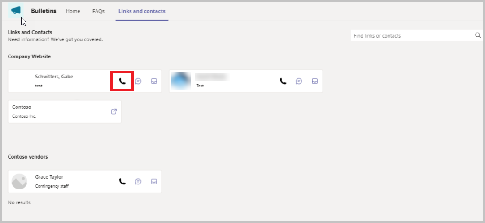

# Add contact phone in Links and Contacts section

The Bulletins Power Apps sample app for Microsoft Teams provides a central location for all company communication such as broadcasts, memos, announcements, and company news. The app allows you to create, categorize, bookmark, search and read bulletin posts.

The Bulletins app solution consists of two apps:

[**Manage bulletins app**](https://docs.microsoft.com/powerapps/teams/bulletins#manage-bulletins-app)

-   Manager experience for managing **Bulletins** app.

-   Allows managers to create, edit, and categorize posts read through the Bulletins app.

[**Bulletins app**](https://docs.microsoft.com/powerapps/teams/bulletins#bulletins-app)

-   Central location for all company communication such as memos, broadcasts, and news.

-   Shows bulletins, FAQs, links, and contacts created using the **Manage bulletins** app.

In this topic we will learn how to enable users to initiate a call to their contacts from within the app using Teams.

The Bulletins app provides links to relevant contacts in the organization and external to the organization that are relevant to specific categories. For example, if you want to know who is responsible for health insurance benefits, you can add the appropriate contact under the category of health insurance.

By default there is no phone number to call the person. In this topic we will add the ability to call the person from within the app.

NOTE: before starting this topic, please review **How to customize Bulletins** (insert link).

## Prerequisites

To complete this lesson, we would need the ability to login into Microsoft Teams which will be available as part of select Microsoft 365 subscriptions and will also need to have the Bulletins Power Apps template for Microsoft Teams installed. This app can be installed from aka.ms/TeamsBulletins (confirm link). Also, we would need to complete lesson 82 Add "notify me" settings to category (confirm link). We will use steps followed in that lesson and build up on those in this topic.

>NOTE\*\*: The following steps need to be performed on both the Bulletins and the Manage Bulletins apps separately (basically wherever/in whichever app you want the Call contact functionality enabled)

## Add a Call image media file 

1.  Download the call image to your local desktop.
2.  Select the Power Apps button from the left navigation menu in Teams.
3.  Go to the Build tab and select Installed apps.
4.  Open the Bulletins app.
5.  Select Media from the left navigation menu.
6.  Select Upload below the Search box and upload the image downloaded above.
7.  The icon gets added to the media list.

## Add the Call Icon to the contact card

1.  From the tree view open Links and Contacts Screen and select galLinksContacts_Contacts.
2.  Select imgGalLinksContacts_Contacts_IM from the tree view and press Ctrl + C to copy it.
3.  Press down on Ctrl +V to paste this image.
4.  The image gets saved on the screen.
5.  Cut it from the screen and paste it on to the gallery **galLinksContacts\_Contacts**.
6.  Update the following on the pasted image
	- Name = imgGalLinksContacts_Contacts_Call
	
	- X property = Parent.TemplateWidth - Self.Width\*3
	
    - Image = 'call icon'
    
    - OnSelect = Launch("msteams://teams.microsoft.com/l/call/0/0?users="&
        ThisItem.Email,{},LaunchTarget.New)
        
        > NOTE: This is will launch the Teams call option and will open a pop-up and ask if you would like to call the contact via Teams

7. Update the Wrap Count of the gallery **galLinksContacts\_Contacts**
   - Width = 'Links and Contacts Screen'.Size – 1

8. Update the Width of the button **btnGalLinksContacts_Contacts\_Select**

   - Width = imgGalLinksContacts_Contacts_Call.X - Self.X

     > NOTE: This button only exists in the Manage Bulletins app and not the Bulletins app

9. Save the changes by hitting the Save button on the top right.

## Publish the Manage Bulletins App

1.  All the changes to the Bulletins app are completed.
2.  The app can now be published by selecting the Publish to Teams button on the top right.

## Test the app

1.  Login into Teams and navigate to Team where the Bulletins app is installed.
2.  Select  the Bulletins tab on the top.
3.  The Bulletins app opens.
4.  Select the Links and Contacts tab on the top ribbon.
5.  Verify that the Call icon shows on the Contact card.

6. If you do not have a Contact from your organization that exists in the list of contacts already, you can add one by selecting the Add contact button on the top right.
7. Select the Office contact from the Select a contact dropdown and enter a Description and hit the Save button on the top right.
8. Select the Back icon to go to the Links and contacts screen.
9. The contact just added shows up on this screen.
10. Select the newly added Call image button to call the contact.
11. A popup opens asking to start a call.
12. Select Start call to call the contact.
13. The call gets connected and you are able to call the contact from the Manage Bulletins app using Teams.
14. Repeats steps 1-13 for the Manage Bulletins app

