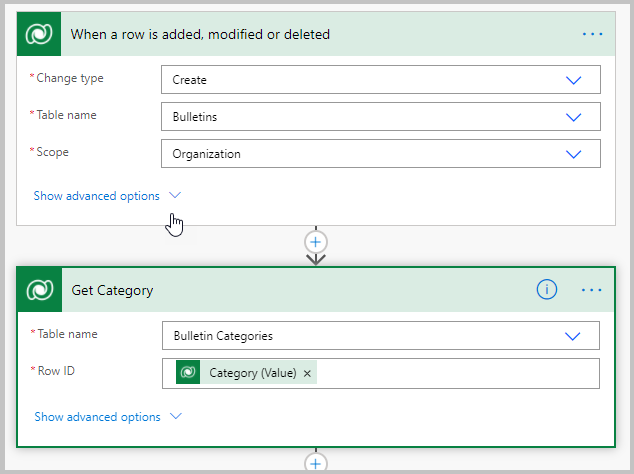
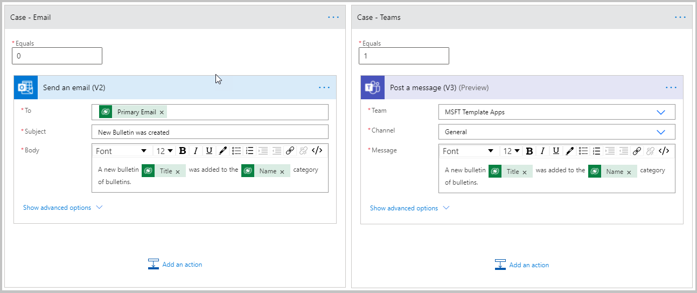
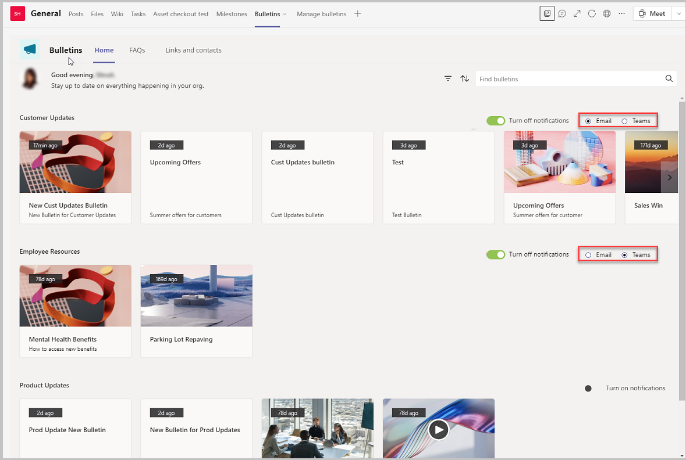

# Customize apps for end user to add notification preferences

The Bulletins Power Apps template for Microsoft Teams provides a central location for all company communication such as broadcasts, memos, announcements, and company news. The app allows you to create, categorize, bookmark, search and read bulletin posts.

The Bulletins app solution consists of two apps:

[**Manage bulletins app**](https://docs.microsoft.com/en-us/powerapps/teams/bulletins#manage-bulletins-app)Manager experience for managing **Bulletins** app.

-   Allows managers to create, edit, and categorize posts read through the Bulletins app.

[**Bulletins app**](https://docs.microsoft.com/en-us/powerapps/teams/bulletins#bulletins-app)

-   Central location for all company communication such as memos, broadcasts, and news.
    
-   Shows bulletins, FAQs, links, and contacts created using the **Manage bulletins**  app.

In this topic we will learn how to enable users to set notification preferences per category for which they want to get notified when new bulletins get added.

> NOTE: before starting this topic, please review **How to customize Bulletins** (insert link).

## Prerequisites

To complete this lesson, we would need the ability to login into Microsoft Teams which will be available as part of select Microsoft 365 subscriptions and will also need to have the Bulletins Power Apps template for Microsoft Teams installed. This app can be installed from aka.ms/TeamsBulletins (confirm link). Also, we would need to complete lesson 82 Add "notify me" settings to category (confirm link). We will use steps followed in that lesson and build up on those in this topic.

## Add a column to the Bulletin Notifications table

1.  Select the Power Apps button from the left navigation menu in Teams.

2.  Go to the Build tab and select Installed apps.

3.  Open the Bulletins app.

4.  Select the Data icon from the left navigation menu.

5.  Find the Bulletin Notifications table and hit the three dots and select Edit data option *(Bulletin Notifications table was created as part of the* **Add
    "notify me" settings to category** *lesson).*
    
6.  The table opens.

7.  Select +Add column to add a new column.

8.  Set Name = Preference.

9.  Select Type = Choice.

10. Enter choices – Choice 1 = Email, Choice 2 = Teams.

11. The new column gets added to the table.

## Turn on the Classic Controls Setting

1.  Select the Settings button on the top ribbon.

2.  Select Upcoming features from the left menu.

3.  Select the Experimental tab.

4.  Scroll to the bottom and turn on the Classic Controls setting and close the Settings.
    
5.  Now if you selecton the + Insert icon on the left navigation menu, Classic controls should appear at the bottom.

## Add a Dropdown control to select Notification Preference

1.  From the Tree view, select the Home screen.

2.  Select galBulletins_ByCategory from the tree view to select the gallery control.
    
3.  Now, select the gallery galBulletins_ByCategory from the tree view again.

4.  Select the Insert option from the left navigation menu.

5.  Select Classic -\> Radio button.

6.  The Combo box control gets added to the gallery.

7. Set the following properties on the List box

   - Width = 208

   - Height = 40

   - Padding Top = 10

   - Padding Bottom = 10

   - X = Parent.Width - Self.Width - 20.

   - Y = lblGalBulletins_ByCategory_Name.Y

   - Items = Choices('Preference (Bulletin Notifications)')

   - Tooltip = "Notification Preference"

   - Visible = Toggle1.Checked

   - OnChange = Patch('Bulletin Notifications',LookUp('Bulletin Notifications',Category.'Bulletin Category'=ThisItem.appCategoryGUID&&'User
     ID'.User=gblUserRecord.User),{Preference:Self.Selected.Value})

   *(This Patch function is to save the selected preference on the record in the Bulletin Notifications table)*  

   1.  Default = LookUp('Bulletin Notifications',Category.'Bulletin Category'=ThisItem.appCategoryGUID&&'User 
       ID'.User=gblUserRecord.User).Preference

8.  Now, select the Toggle1 control *(that was added as part of the* **Add "notify me" settings to category** *lesson)*
    
9. Adjust the following properties

   - X = If(Self.Checked, Parent.Width - Self.Width - Radio1.Width - 20, Parent.Width - Self.Width - 20)

   - OnCheck = Patch('Bulletin Notifications',{Category:LookUp('Bulletin Categories','Bulletin Category'=ThisItem.appCategoryGUID),'User
     ID':gblUserRecord,Preference:'Preference (Bulletin Notifications)'.Email})

## Publish the Bulletins App

1.  All the changes to the Bulletins app are completed.

2.  The app can now be published by selecting the Publish to Teams button on the top right.

## Update the Power Automate Flow to send email notification

1.  Navigate to flow.microsoft.com.

2.  Open the flow **Send notification based on notify me flag when a new bulletin is created** *(that was created as part of the* **Add "notify me"
    settings to category** *lesson)*.
    
3.  Verify that the flow was created in the environment with the same name as the team in which the app was installed.
    
4.  The current flow sends an email notification to the user when a new bulletin is added for a category, they have chosen to get notified for.
    
5.  As a part of this topic, we will add a couple more steps where the system would look at the notification preference selected by the user whether email or teams message and send out the notification accordingly.

6. In the Apply to each step below, add a Switch case step to check if the Preference on the record is Email(0) or Teams(1).

7. Move the Send and email step under the Email case.

8. Add a step under the Teams case as shown below – Make sure to select the Team where you would like to receive the notification.

## Test the app

1.  Login into Teams and navigate to Team where the Bulletins app is installed.

2.  Select the Bulletins tab on the top.

3.  The Bulletins app opens.

4.  Verify that the Turn on notifications toggle show up on the top right of each row of the categories gallery.
    
5.  Verify that the Email/Teams Radio button shows up only when the Toggle button is set to On.
    
6.  Select the Turn on notifications toggle to turn notifications on for the particular categories.
    
7.  Set the Notification preference to Email for one and Teams for the other.

8. Now, select the Manage Bulletins tab on the top.

9. Select the New Bulletin button on the top right.

10. The New bulletin screen appears.

11. Select the Category for which you want the bulletin created – Customer Updates.

12. Enter a title in the Add title text box – New Cust Updates Bulletin.

13. Enter a subtitle in the Add subtitle text box – New Bulletin for Customer Updates.

14. Enter a description in the Description box – New Bulletin for Customer Updates.

15. Select Upload cover image and select and image.

16. Hit the Save button on top.

17. Then hit the Publish button.

18. In a few minutes, an email as shown in the image below should appear in the inbox of the primary email address of all the users who registered for email notifications of the selected category.

19. Now we will run another test to verify the Teams notification scenario.

20. Select the New Bulletin button on the top right.

21. The New bulletin screen appears.

22. Select the Category for which you want the bulletin created – Employee Resources.

23. Enter a title in the Add title text box – New Emp Resources Bulletin.

24. Enter a subtitle in the Add subtitle text box – New Bulletin for Employee Resources.

25. Enter a description in the Description box – New Bulletin for Employee Resources
26. Select Upload cover image and select and image.
27. Hit the Save button on top.
28. Then hit the Publish button.
29. In a few minutes, a Teams message should appear in the Teams channel in which the App is installed as shown in the image below.

