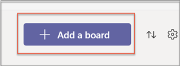
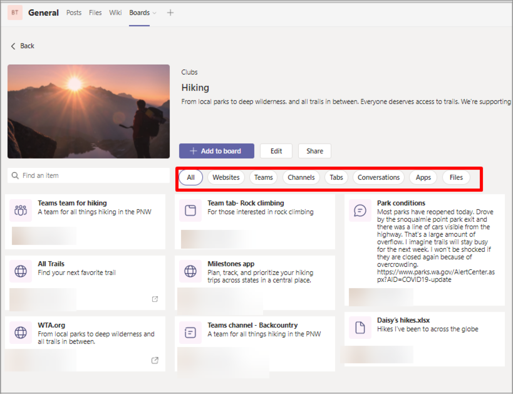
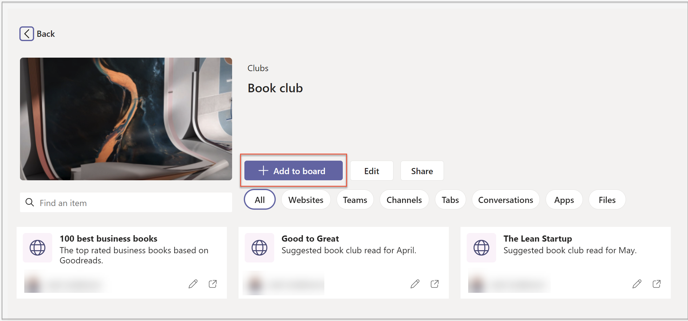
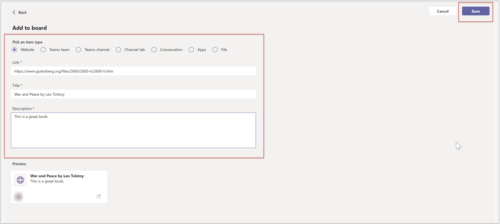
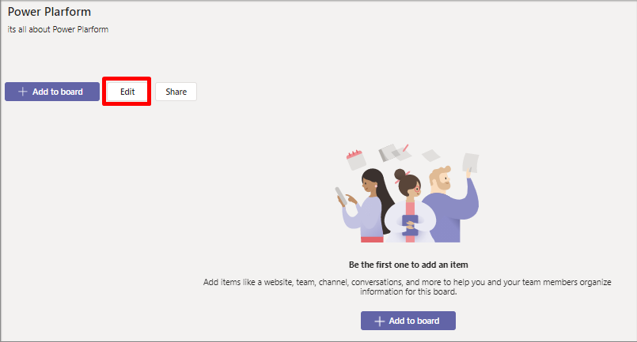
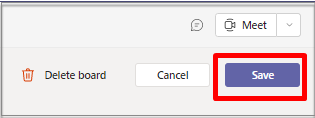
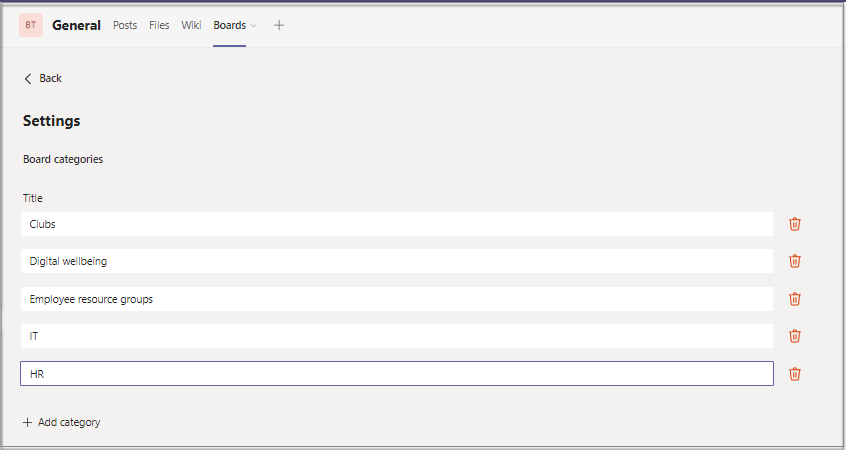
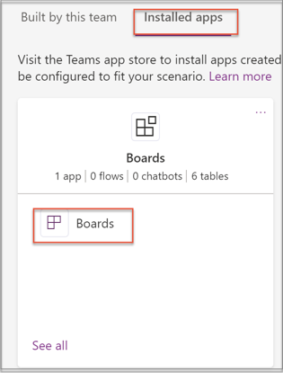
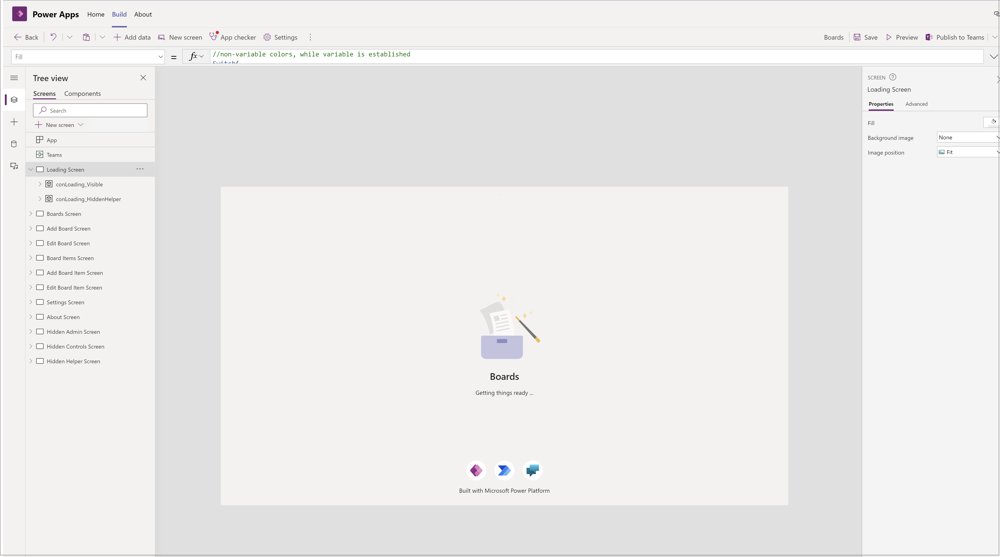

# Boards sample app (preview)

[This article is pre-release documentation and is subject to change.]

In this tutorial, you'll learn about configuring and using the **Boards** sample app.

## Overview

The Boards template app for Microsoft Teams provides a simple way to connect and share with people in your organization with similar interests.

Benefits of using the Boards app:

-   Pin relevant information in one place.
-   Organize pins by topic.
-   Discover items pinned by colleagues.

> [!NOTE]
> - Before you can use this app, you may be asked for your permissions to use the connection. More information: [Allow connections in sample apps](use-sample-apps-from-teams-store.md#step-1---allow-connections)
> - This app is available in three different Teams themes: Default, Dark and High contrast. When you [change the theme in Teams](https://support.microsoft.com/en-us/office/change-settings-in-teams-b506e8f1-1a96-4cf1-8c6b-b6ed4f424bc7), the app automatically updates to match the selected theme. More information: [Get the Teams theme using the Teams integration object](use-teams-integration-object.md#get-the-teams-theme)

> [!IMPORTANT]
>-   This is a preview feature.
>-   Preview features aren’t meant for production use and may have restricted functionality. These features are available before an official release so that customers can get early access and provide feedback.

## Prerequisites

Before using this app:

1. Find the app in Teams store.
2. Install the app.
3. Set up the app for the first use.

For details about the above steps, go to [Use sample apps from the Teams store](use-sample-apps-from-teams-store.md).

## Using Boards

In this section, you'll learn about the following capabilities in the Boards app:

- [Open the Boards app](#open-the-boards-app)

- [Understanding the Boards app interface](#understanding-the-boards-app-interface)

- [Add a board](#add-a-board)

- [Open a board](#open-a-board)

- [Pin an item to a board](#pin-an-item-to-a-board)

- [Sort boards](#sort-boards)

- [Edit a board](#edit-a-board)

- [Add categories](#add-categories)

- [Edit the Boards app in Power Apps](#edit-the-boards-app-in-power-apps)

  

## Open the Boards app

To open the Boards app:

1.  Sign in to Teams.
2.  Select the Team in which the app was installed.
3.  Select the channel where you installed the **Boards** app.
4.  Select the **Boards** tab.
5.  Select **Allow** if the app asks for your permissions to use the connectors.
6.  You can learn more about extending this app's capabilities on the splash
    screen. Select **Got it** to close the screen, and go to the app. To hide
    this message while opening this app again, select **Don't show this again**
    before you select **Got it**.

    

## Understanding the Boards app interface

The Boards app displays boards grouped by category. A Board is a collection of pinned items for a topic.

## Add a Board

1.  In Teams, go to the team in which Boards is installed

2.  Select the Boards tab

3. In right corner, select **Add a board**.

   

4. Enter the title, category, and a description of the board.

   

5. Select **Save**.

6. New board is created.

    

## Open a board

From the Boards app, you can search for board topics that interest you and open them to view the pinned items. For example, if you're interested in hiking, you could search for hiking-related boards and see what your colleagues have pinned regarding hiking.

1. In the Boards app in Teams, select the **Find a Board** search field.

2. Type the name of the board or category you want to find.

   

3. Boards in your organization that match the search words will be displayed. Select the board you want.

4. The selected board will be displayed. From this screen you can see information about the websites, Teams, channels, and conversation chats related to the board.

5. Search results are organized by category, or you can select **All** to view all returned results.

   

## Pin an item to a board

If you want to share an item with your colleagues, you can easily pin it to the appropriate board for the item category.

For example, you might want to share a link to a book written by an author with the Book Club.

1. Open the board you want. In this example, we open the sample board **Book Club.**

   

2. Select **Add to board.**

   

3. Select the appropriate item type.

4. Add a link to the website.

5. Enter title and description

6. You'll see  a preview of what the card will look like.

7. Select **Save.**

## Sort boards

You can sort the order in which board categories are displayed on the main Boards screen.

1. Select the Sort button.

2.  From the pop-up, select arrows up or down to make categories sorted and
    displayed in that order. 
    
    
    
    
    
3. To hide a category from the boards screen, select the visibility button.

4. Select **Apply**.

5. Boards matching the selected sort order will be displayed.  

     

## Edit a board

You can Edit the boards under your organization under the Boards app.

To edit the boards:

1.  In Teams, go to the team in which Boards is installed.

2.  Select the Boards tab.

3.  Select a Board.

4. Select **Edit**.

   

5. Change the Title, Category, and Description.

6. Add relevant Image.

7. Select **Save**.  

   

## Add categories

You can add the categories under your organization under the Boards app. 

To add categories:

1.  In Teams, go to the team in which Boards is installed.

2.  Select the Boards tab.

3.  Select Settings gear in upper right corner.

4. Select **Add Category**.

   

5. Change the title, category, and description.

   

6. Add an image.

7. Select **Save**.  

   

## Edit the Boards app in Power Apps

1. In Teams, add the Power Apps app from the Teams store by selecting the ellipses in the app menu, searching for Power Apps, and then selecting **install.**

2. Right-click on Power Apps icon and select **Pop out app** to open the app in a new window. This pop-out action will ensure that you don't lose your changes if you browse somewhere else in Teams.

   

3. Select **Build** tab.

4. Select the team in which the Boards app is installed, then select **Installed apps.**

5. In the Boards tile, select the Boards app to open it in Power Apps in Team.

   

6. You may get prompted to authorize the app's connectors to connect. Select **Allow**.

7. You can now customize the app.

### See also

- [Understand Boards (preview) sample app architecture](boards-architecture.md)
- [Customize sample apps](customize-sample-apps.md)
- [Sample apps FAQs](sample-apps-faqs.md)
- [Use sample apps from the Microsoft Teams store](use-sample-apps-from-teams-store.md)

[!INCLUDE[footer-include](../includes/footer-banner.md)]