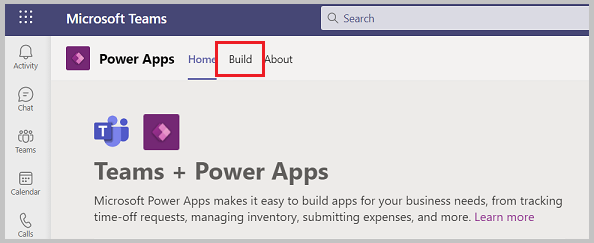
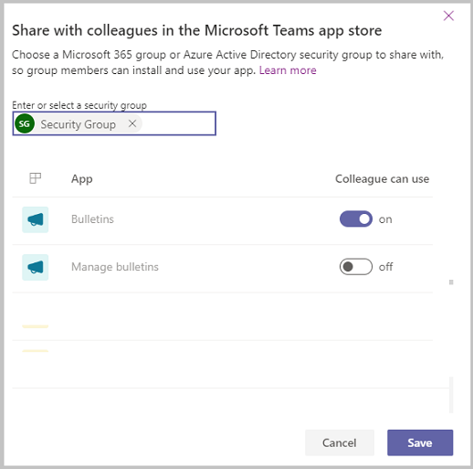
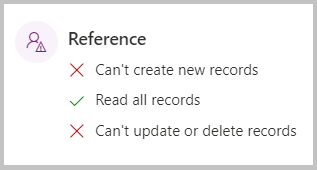
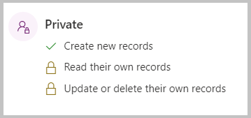
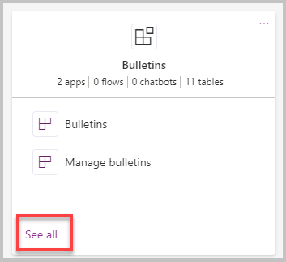
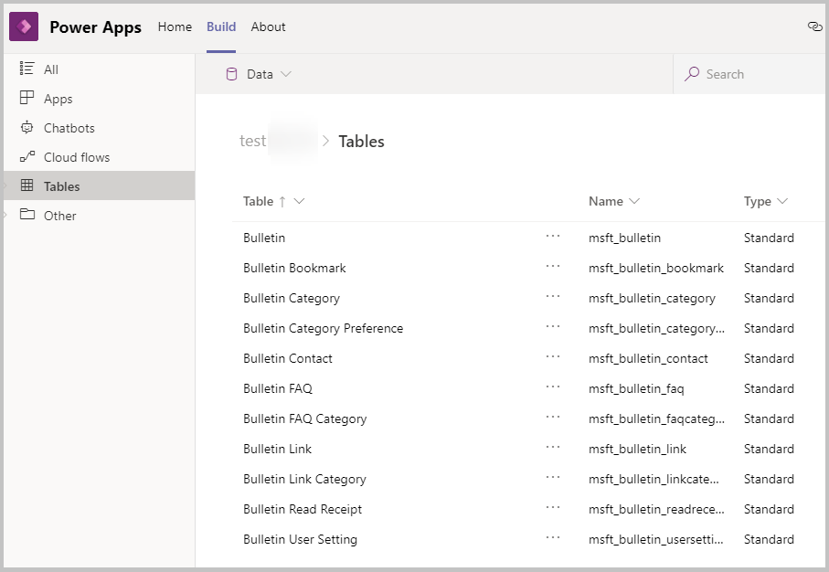
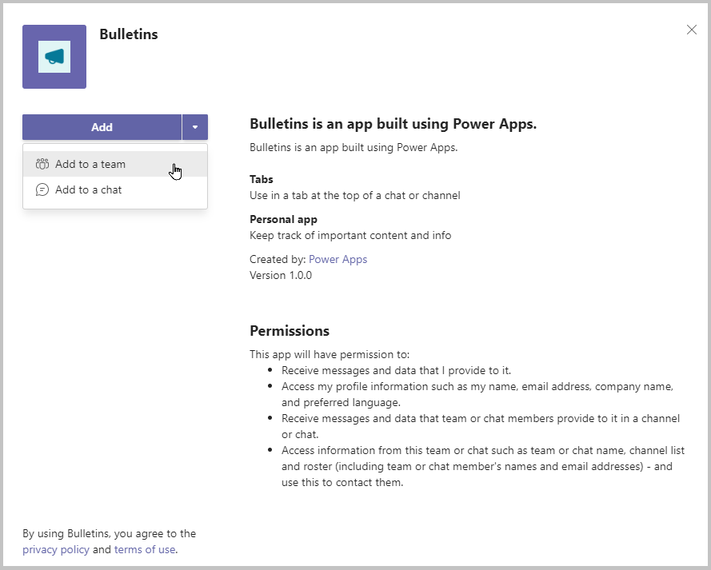
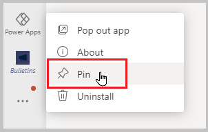

# Deploy Bulletins app broadly in your organization

The Bulletins sample app for Microsoft Teams is designed to provide a central location for all company communication. The solution includes two apps: Bulletins and Manage Bulletins.

The app addresses the following personas:

- **Bulletin Manager**&mdash;this persona creates Bulletins, FAQ’s, and contacts/link. Managers also view metrics about bulletin reads and bookmarks. The manager uses the Manage Bulletins app and should be a member of the team in which the Bulletins solution is installed.

- **Bulletins User**&mdash;this persona views Bulletins, FAQ’s, and contacts/links. This persona uses the Bulletins app.

Consider that you want everyone at in your org, department, or location to be able to view bulletins. These users are people outside of the Teams team where the app is installed. In this article, we'll learn how to share the Bulletins app with them.

Watch this video to learn how to deploy Bulletins app as a broad distribution app:
> [!VIDEO https://www.microsoft.com/videoplayer/embed/RWLxVq]

## Prerequisites

You must be an owner of the Team in which the app is installed to share the app.

### Action required to share an app with colleagues for broad distribution

1. [Share the app with colleagues](#share-app-with-colleagues)
1. [Grant security permissions to the tables used in the app](#grant-permissions-to-the-tables)

## Share app with colleagues

This process begins by opening the app in **Power Apps**. You may have Power Apps pinned to your Teams already.

1. In Teams, select the **…** (ellipsis) from the left-pane.

1. Search for **Power Apps** in the search field.

    

1. Select Power Apps app from the list to open the app.

1. We recommended that you “pop out” Power Apps so that if you need to go somewhere else in Teams, you won’t lose your app configuration. To pop out the Power Apps app, right-click on Power Apps, and select **Pop out app**.

    

1. Right-click on **Power Apps**, and select **Pin** to lock the app to the side menu so it's easy to get to in the future.

    

1. Now that you've loaded the Power Apps app, select **Build**.

    

1. This screen will show all the teams that have Power Apps installed in them. Select the team that contain the app you want to share. Select **Share with colleagues**.

    

1. Enter an Azure Active Directory (AD) security group, or a different team that you'd like to share access to the app.

1. Set the **on/off** toggle to **on** for Bulletins.

    

1. Select **Save**.

## Grant permissions to the tables

Understanding and assigning permissions to tables are vital to ensure proper security of your shared data. Here are the four permissions available for use.

- **Full Access**&mdash;allows end users to see and edit all records in the table.

    

- **Collaborate**&mdash;allows end users to see all records, but they can only edit their own records.

    

- **Reference**&mdash;provides a read-only view of data for end users.

    

- **Private**&mdash;allows end users to only view and edit their own data.

    

### Configure table permissions

By default, all of the table permissions for colleagues not in the team are set to **none.** If you leave it that way, colleagues that you share the app with won't be able to use the app, as they won’t have permission to the tables in
the app.

Follow these steps to set permissions for the tables in the app for the colleagues outside of the team:

1. In Teams, open the **Power Apps** app.

1. Select **Build**.

1. Select the team that contains the app you want to share.

1. Select **Installed apps** to show all apps installed in the team.

1. Select **See all** in the **Bulletins** tile.

    

1. Select **Tables** from the solution components bar.

    

1. Select the tables listed individually, and then select **Manage Permissions**.

1. Select the security group that the app was shared with. The initial permission will show none. Select the wanted permission, and select **Save**

1. Repeat step 8 for each additional table in the app.

The following table explains the recommended table permissions:

| Table                         | Permission                                                                                                                                                                                                                                |
|-------------------------------|-------------------------------------------------------------------------------------------------------------------------------------------------------------------------------------------------------------------------------------------|
| Bulletins                     | Since colleagues outside of the team should be able to read bulletins but not edit them, give colleagues outside of the team **Reference** permissions to the Bulletins table.                                                 |
| Bulletin Bookmark             | Since colleagues outside of the team need to be able to bookmark bulletins, they need to be able to create Bulletin Bookmarks. Give colleagues outside of the team **Collaborate** permissions to the Bulletin Bookmark table. |
| Bulletin Category             | Colleagues outside of the team should be able to view categories but not create or edit categories, so give colleagues outside of the team **Reference** permission to the Bulletin Category table.                            |
| Bulletins Category Preference | Colleagues outside of the team should be able to set their preferences for category order and display preferences, so give colleagues outside of the team **Private** permission to the Bulletins Category Preference table.   |
| Bulletin Contact              | Since colleagues outside of the team should be able to view contacts but not create or edit them, give colleagues outside of the team **Reference**  permission to the Bulletin Contact table.                                 |
| Bulletin FAQ                  | Since colleagues outside of the team should be able to view FAQs but not create or edit them, give colleagues outside of the team **Reference** permission to the Bulletins FAQ table.                                        |
| Bulletin FAQ Category         | Since colleagues outside of the team should be able to view FAQ Categories but not create or edit them, give colleagues outside of the team **Reference** permission to the Bulletin FAQ Category table.                       |
| Bulletin Link                 | Since colleagues outside of the team should be able to view FAQ Categories but not create or edit them, give colleagues outside of the team **Reference** permission to the Bulletin FAQ Category table.                       |
| Bulletin Link Category        | Since colleagues outside of the team should be able to view Bulletin Link Categories but not create or edit them, give colleagues outside of the team **Reference** permission to the Bulletin Link Category table.            |
| Bulletin Read Receipt         | When users of the Bulletins app read a Bulletin, they should be able to create Bulletin Read Receipt records. Give colleagues outside of the team **Collaborate** permission to the Bulletin Read Receipt table.               |
| Bulletin User Setting         | Since users of the Bulletins app need to be able to create or edit their user setting record, give colleagues outside of the team **Private** permission to the Bulletin User Setting table.                                   |

### Rename the app

Large organizations might have multiple people sharing the same app with colleagues. If multiple departments are using Bulletins, you can make it easier for your colleagues to find the app by renaming it.

1. Open **Bulletins** in Power Apps in Teams.

1. In the upper-right corner, select the app name in Power Apps Studio.

1. Enter a new name for the app. For example, you may want to rename the app **Company News**.

1. Save and publish the app.

## Accessing shared apps

So now that you have shared Bulletins with colleagues outside of your team, here's how they'll acquire the app.

1. In Teams, select **...** (ellipsis).

1. Select **More apps**.

1. Select **Built for your org**.

1. When the app information screen appears, select **Add** to add the app to the main teams app menu.

    

1. After adding the app to the Teams app menu, select the icon for the app to open it full screen in Teams.

1. If you want to make the app always appear in the app menu so you can easily find it, right-click on the Bulletins button on the app menu and select **Pin**.

    

1. If you would prefer to add the app to another team, select the drop-down by the **Add** button, and select **Add to a team**.

    

## Limitations

Currently, Teams apps can only be shared with a single Azure Active Directory group.

### See also

- [Understand Bulletins sample app architecture](bulletins-architecture.md)
- [Customize Bulletins app](customize-bulletins.md)
- [Sample apps FAQs](sample-apps-faqs.md)
- [Use sample apps from the Teams store](use-sample-apps-from-teams-store.md)

[!INCLUDE[footer-include](../includes/footer-banner.md)]