# Inspections App – Customize inspection steps

The Inspections Power Apps template allows users to create and perform inspections in the app. There are three apps, one per persona to perform,
manage, and review Inspections. The three apps are – Inspections, Manage Inspections and Review Inspections.

In this topic we will learn how to customize inspection steps in the user app e.g. removing the ability to add pictures to checklist steps. This is important
because just deleting the particular control can cause issues with responsiveness and the look and feel of the app can get affected.

## Prerequisites

To complete this lesson, we would need the ability to login into Microsoft Teams which will be available as part of select Microsoft 365 subscriptions and will also need to have the Inspections Power Apps template for Microsoft Teams installed. This app can be installed from aka.ms/TeamsInspection.

## Login into the Inspections app

1.  Login into Teams and right click Power Apps from the left menu and select **Pop out app**.
2.  Select Build from the top ribbon.
3.  Select the Team in which the Inspections app is installed.
4.  Select Inspections to open the app in the editor.

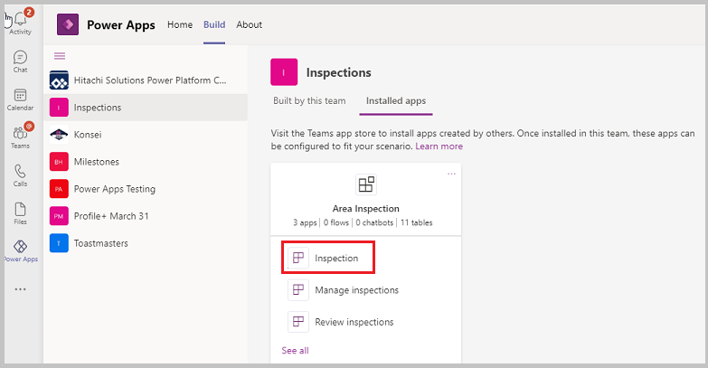

5. The Inspections app opens.

6. Select the tree view from the left menu.

7. Select to open the Items screen.

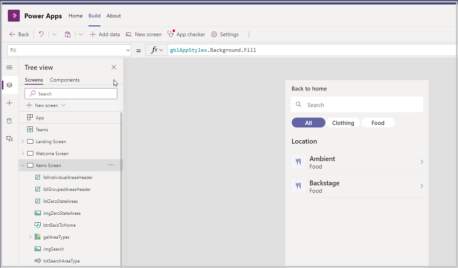

8. Press Alt and select Ambient or Backstage to open the record.

9. The Food Inspection checklists page opens.

10. Press Alt and select any one of the options (Detailed Walk/Morning Store Walk).

11. The Inspection Overview screen appears.

12. Press Alt and select the Begin Inspection button.

13. The Inspection list screen opens.

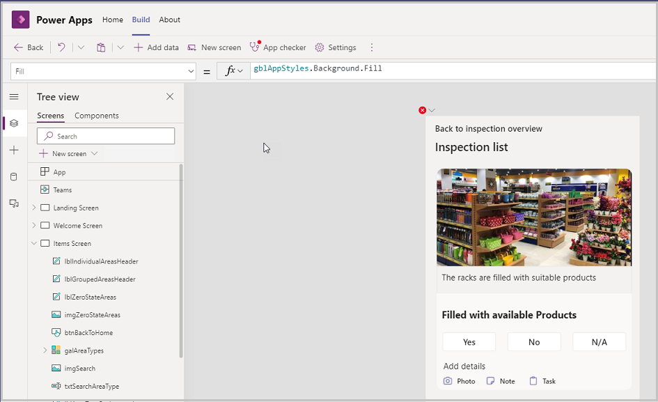

1. The three scenarios we will be covering in this topic are

   - **Hiding the Add details section completely**

   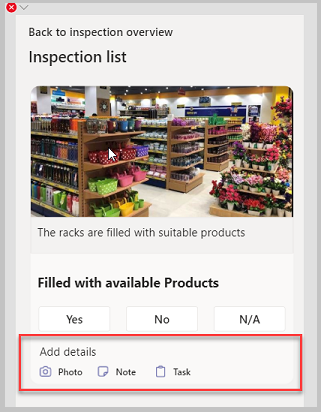

   - **Hiding just the Photo option**

   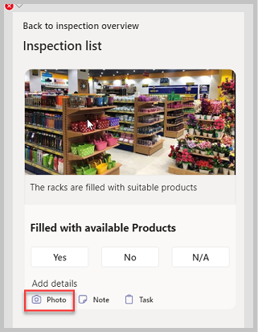

   - **Hiding the Task option**


## Customizing Inspection Steps

### Hiding the Add Details section completely

1.  Hiding the Add Details section completely is not as easy as just setting the Visible property of all those controls to False.
    
2.  First, set the Visible property for the Add details label and the other labels (Photo, Note and Task) and their icons to False.

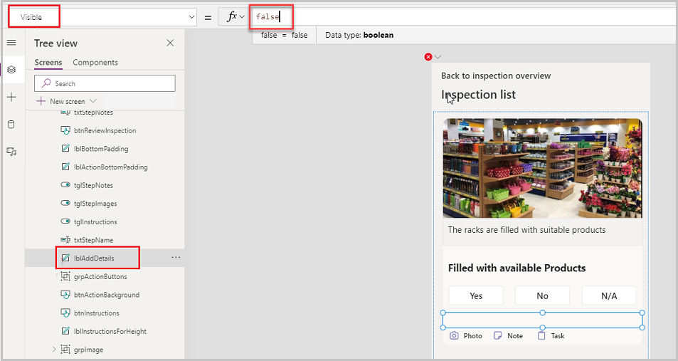

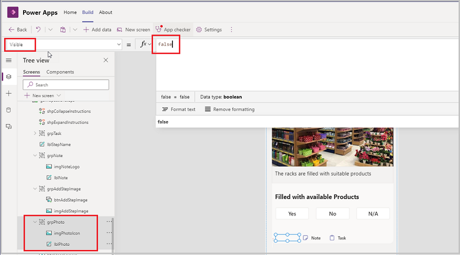

3. Thus, set the Visible property for grpNote, grpTask and grpPhoto to false – and all the options get hidden.


4. Then, we will also need to shrink the white space containing the Photo, Note and Task buttons to avoid wasting any extra space – select btnActionBackground control from the tree view or just click somewhere on the white space to highlight the box space.

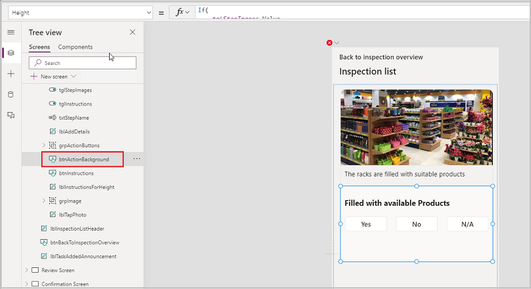

5. Open the Height property of the control and comment the existing formula.

6. Then add the following formula – btnOK.Y + btnOK.Height - Self.Y + 20.

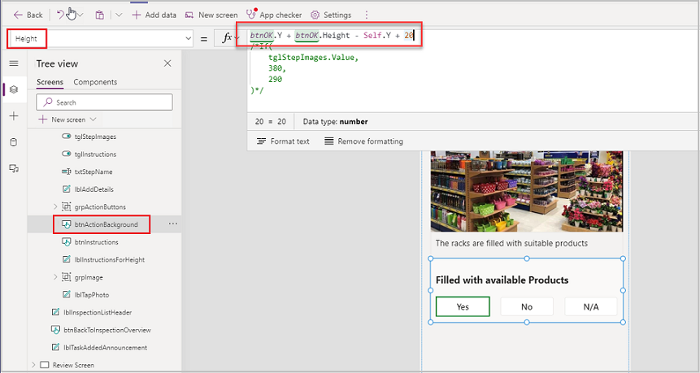

7. The white space shrinks and leaves no extra space/wastage.

8. Thus, the entire Add Details section is hidden.

### Hiding just the Photo Option

1.  For this scenario (assuming all the changes made above were undone), we will have to set the Visible property of the Photo option label and icon to false and then move the Note option and the Task Options to the left. 
2.  To hide the Photo option, we will select grpPhoto from the tree view and set Visible = false.

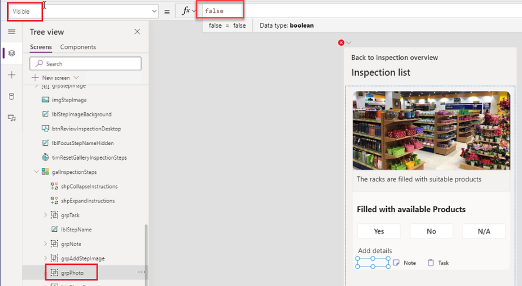

3. The Note option needs to move to the left in place of the Photo option – for this copy the X property of the Photo Icon and paste it in the X property of the Note icon (Notice that the label also moves along with the icon – this is because the Note label’s X property is dependent on the Note icon’s X
   property and changes accordingly thus leaving no empty spaces – the Task option also reacts similarly) 

```
btnImageBackground.X+18
```

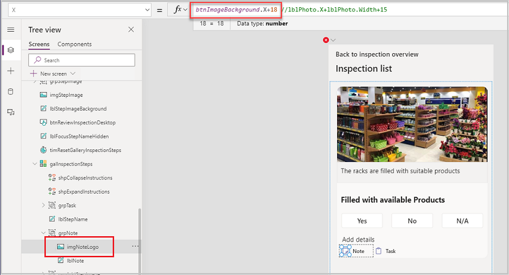

### Hiding the Task Option Only

1.  For this scenario (assuming all the changes made above were undone), we only want to hide the Task section.
    
2.  Since there are no other controls dependent on the Task control it is a fairly straightforward change to make where we would change the Visible
    property for grpTask to false.
    
3.  This was an easy change and did not need any additional changes as hiding the Task option does not really affect anything else.


### Publish the Inspection app

1.  All the changes to the Inspection app are completed.

2.  The app can now be published by selecting the Publish to Teams button on the top right.


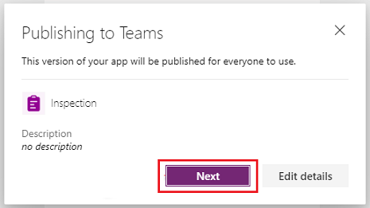


## Test the app

1.  On the Inspection list screen, once you make the change for any of the above listed scenarios, hit the Preview button to run the app.
    
2.  Make sure to check for responsiveness by shrinking the size of the screen when testing in the Window mode.

### See also

- [Understand Inspection sample apps architecture](inspection-architecture.md)
- [Customize Inspection sample app](customize-inspections.md)
- [Customize sample apps](customize-sample-apps.md)
- [Sample apps FAQs](sample-apps-faqs.md)
- [Use sample apps from the Microsoft Teams store](use-sample-apps-from-teams-store.md)

[!INCLUDE[footer-include](../includes/footer-banner.md)]