# Customize the Inspection app

The Inspection sample app for Microsoft Teams is designed to be a complete app experience but allow makers to easily extend it for their own purposes. In this article, we'll go over how to customize the Inspection app using Power Apps in Teams.

Watch this video to learn how to customize the Inspection app:
> [!VIDEO https://www.microsoft.com/videoplayer/embed/RWLn9E]

> [!NOTE]
> Before you can customize the app:
> 1. You must install it from the Teams store. You can get the app at <https://aka.ms/TeamsInspection>.
> 1. Ensure you review and understand the [customization considerations](#customization-considerations).

Once the app is installed, you can then customize the app using the following steps.

## Open Power Apps app in Teams

1. In Teams, select **…** (ellipsis) from the left-pane.

1. Search for and select **Power Apps**.

    

1. Right-click on **Power Apps**, and select **Pin** to lock the app to the left-pane so it's easy to locate the app later.

    

1. We recommended that you “pop out” Power Apps so that if you need to go somewhere else in Teams, you won’t lose your app configuration. To pop out the Power Apps app, right-click on Power Apps, and select **Pop out app**.

1. Now that you've loaded the Power Apps app, select **Build**.

    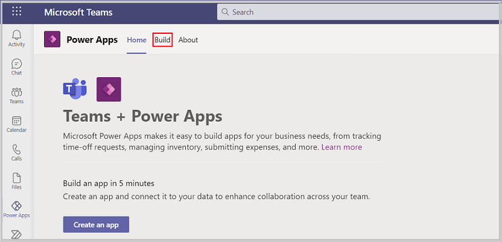

    This screen will show all the teams that have Power Apps installed in them.

1. Select the team in which you installed the Inspection app.

1. Select **Installed apps** to show all apps installed in the team.

    Inspection solution includes three apps&mdash;**Inspection** for users to use to complete inspections, **Review inspections** for supervisors to use to review and approve inspections, and **Manage inspections** for managers to use to analyze inspection history and create or modify inspection checklists.

1. Select **See more** in the **Inspection** tile.

    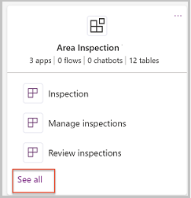

    You'll see all apps, tables, flows, and chatbots in the team.

    

## Extend the Inspection data model

If you're modifying or adding any fields to your app, you'll want to first update or add these columns in their Dataverse tables. In this section, we'll explore the data model for Inspection app and how to modify it in Power Apps in Teams. Below is the data model for Inspection app.

Before modifying the fields, you need to first decide where the fields you want to add should go. What are the users doing when they should see or interact with these fields?

To understand the Inspection data model, there are two primary table groups in Inspection&mdash;**checklist tables** and **inspection tables**. Checklist tables create a template for inspection form and related steps, and when a user completes an inspection, a copy of the checklist and checklist steps are copied to Area Inspection and Area Inspection Step.

**Checklist tables**

-   Area Inspection Checklist

-   Area Inspection Checklist Step

**Inspection tables**

-   Area Inspection

-   Area Inspection Step

**Other tables**

-   Area Inspection Location&mdash;what we are inspecting—can be a location, area, store, asset, or anything. Inspections are related to Area Inspection Location records.

-   Are Inspection Location Type&mdash;used to group and filter locations.

-   Area Inspection Image&mdash;stores images captured during the inspection.

## Inspection Screens

From the list of apps, chatbots, flows, and tables, select the **Inspection** app.

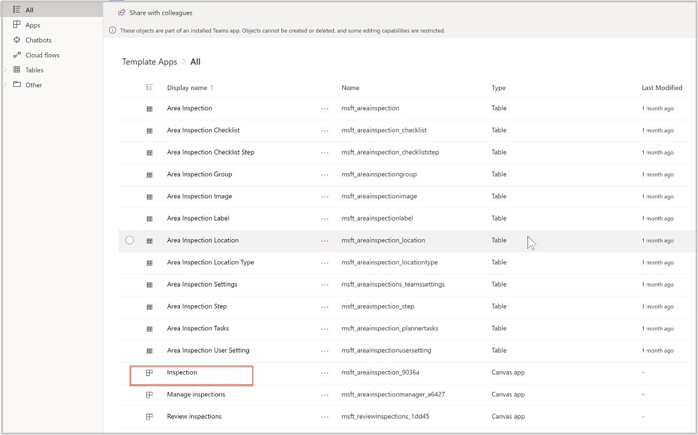

Now that Inspection is open in Power Apps in Teams, select the **Tree View**.

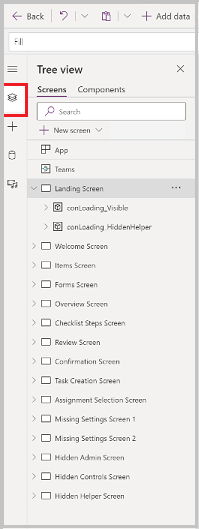

From the Tree View, you can see the screens included in the app. Selecting the arrow to the left of a screen will expand the contents of the screen, giving you access to the components of the screen, including galleries, buttons, text labels, and text input controls.

The following are the screens in Inspection:

| Screen                      | Description                                                                                                                                                                          |
|-----------------------------|--------------------------------------------------------------------------------------------------------------------------------------------------------------------------------------|
| Landing Screen              | This screen displays an image the app title as the app is loading.                                                                                                               |
| Hidden Admin Screen         | This screen is a helper screen for admins to try to understand the way that theming works in the app and support for dark mode and high contrast. This screen isn't visible to app users. |
| Welcome Screen              | This screen is the first screen that users see after the landing screen, giving them access to perform an inspection and view tasks and recent inspection history.                          |
| Items Screen                | From this screen, the user selects the wanted location type and location for the inspection.                                                                                         |
| Forms Screen                | From this screen, the user selects the wanted inspection form.                                                                                                                       |
| Overview Screen             | This screen provides detail about the checklist questions before starting the inspection.                                                                                            |
| Checklist Steps Screen      | This screen displays a gallery of inspection steps for the selected inspection form.                                                                                                 |
| Review Screen               | This screen provides a final review of the inspection before submitting the inspection.                                                                                            |
| Confirmation Screen         | This screen confirms that the inspection form has been submitted.                                                                                                                    |
| Task Creation Screen        | When an issue is reported, the user can create a task for follow-up on the reported issue. This screen is used to create the task.                                                   |
| Assignment Selection Screen | This screen provides the ability to select the user that the task should be assigned.                                                                                             |
| Missing Settings Screen     | This screen is displayed when the app hasn't been configured to use Planner and a user attempts to submit a task.                                                                   |
| Hidden Controls Screen      | Hidden admin screen used for testing of different languages, dark mode, and high contrast mode.                                                                                      |
| Hidden Helper Screen        | Screen used for gallery of icons.                                                                                                                                                    |

## Manage Inspection Screens

Now let’s look at the screens in the **Manage inspections** app. This screen is where you would make changes that should be seen by the inspection manager:

1. In Power Apps, select the **Build** tab.

1. Select the team in which you installed the Inspection app.

1. Select **Installed apps** to show all apps installed in the team.

1. Select **Manage inspections** in the **Area Inspection** tile.

    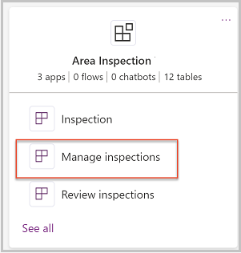

1. Manage inspections will open in the designer.

1. Select the **Tree view** and review the screens in the Manage inspections app.

    

The following are the screens in the Manage Inspections app:

| Screen                   | Description                                                                                                                                                                                                          |
|--------------------------|----------------------------------------------------------------------------------------------------------------------------------------------------------------------------------------------------------------------|
| Landing Screen           | Displays an image and the app name as the app loads                                                                                                                                                                  |
| Hidden Admin Screen      | This screen isn't visible to users of the app&mdash;it's designed to make it easy for makers to simulate scenarios within the designer. For example, you can toggle dark mode on and see how the app looks in dark mode. |
| Items Screen             | The primary screen of the app, displays list of locations and allows user to create new locations.                                                                                                                   |
| Inspection Forms Screen  | From this screen, managers can create new inspection forms and associate them with location types.                                                                                                                    |
| Settings Screen          | Screen from which an administrator can manage application settings like restricting the manage app to owners or selecting the Team and Planner where tasks will be created.                                          |
| About Screen             | Screen that displays more details about the app.                                                                                                                                                                     |
| Incorrect Context Screen | This screen displays when a user tries to launch the app outside of Teams or in mobile.                                                                                                                    |
| Hidden Admin Screen      | Screen to use when testing dark mode, high contrast mode, and different languages.                                                                                                                                   |
| Hidden Controls Screen   | Screen for makers to use to test controls and theming formulas.                                                                                                                                                      |
| Hidden Helper Screen     | Hidden screen that contains galleries for icons and other galleries used in the background.                                                                                                                          |

## Review Inspection Screens

Now let’s look at the screens in the **Review inspections** app. This screen is where you would make changes that should be seen by the inspection manager:

1. In the Power Apps app, select the **Build** tab

1. Select the team in which you installed the Inspection app.

1. Select **Installed apps** to show all apps installed in the team.

1. Select **Review inspections** in the **Area Inspection** tile.

    

1. Review inspections will open in the designer.

1. Select the **Tree view** and review the screens in the Review inspections app.

    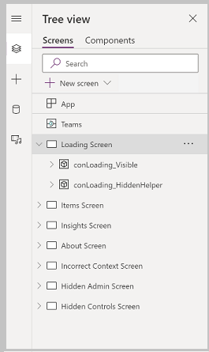

The following are the screens in the Review inspections app:

| Screen                   | Description                                                                                                                                                                                                          |
|--------------------------|----------------------------------------------------------------------------------------------------------------------------------------------------------------------------------------------------------------------|
| Landing Screen           | Displays an image and the app name as the app loads                                                                                                                                                                  |
| Hidden Admin Screen      | This screen isn't visible to users of the app&mdash;it's designed to make it easy for makers to simulate scenarios within the designer. For example, you can toggle dark mode on and see how the app looks in dark mode. |
| Items Screen             | The primary screen of the app, displays list of locations and the pending inspections for each location.                                                                                                             |
| Insights Screen          | This screen displays a dashboard of metrics about inspection history.                                                                                                                                                |
| About Screen             | Screen that displays more details about the app.                                                                                                                                                                     |
| Incorrect Context Screen | This screen displays when a user tries to launch the app outside of Teams or in mobile.                                                                                                                    |
| Hidden Admin Screen      | Screen to use when testing dark mode, high contrast mode, and different languages.                                                                                                                                   |
| Hidden Controls Screen   | Screen for makers to use to test controls and theming formulas.                                                                                                                                                      |

## Common customization scenarios

In this section, we'll discuss common customization/extension scenarios for Inspection, and where you would make these changes

### Add hierarchy to locations

The inspection app is designed for a single organization; however, if you have multiple sites and need to have your areas, equipment, or other inspection items filtered based on location, add a site or store table and link the inspections to the store.

### Add info about person being inspected

Some organizations use the Inspection app as a verification check on an employee—perhaps validation that a job was completed correctly, and if not, notify the manager of the user so they can provide coaching to the employee.

### Customize inspection steps

If you want to change inspection steps, such as removing tasks, images, or other capabilities, you can do so by updating the Inspection app **Inspection Checklist Screen** screen. For example, the add image button is in the checklist item gallery, and you can disable taking photos on inspections by  disabling the photo button.

## Publish changes

When you're done making modifications to the apps, select **Save** to save your changes.

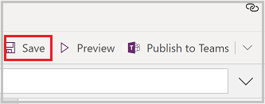

- To preview your changes, select the **Preview**. The app launches in preview mode, where you can test the user experience when running the app. Press **Escape** on your keyboard or select the **X** in the upper-right corner when you're done with the preview.

    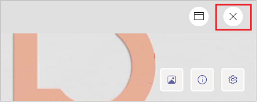

- To publish your app changes, select **Publish to Teams**. Publishing the app makes your changes visible to users of the app. A dialog will open confirming that you want to publish.

    

- To change app settings, such as icon and background color, select **Edit details**.

- To publish the app, select **Next**.

- On the next screen, confirm the channel you want the app to appear. You can add to other channels in the Team by pressing the **+** button.

    

- To complete publishing your changes, select **Save and close**.

## Customization considerations

Before modifying the Inspection app, note the following considerations.

- Where are my table customizations?
  Columns and tables added by you'll go to **Built by this team** section of the Power Apps app. You can also add new tables in the **See all** area.

    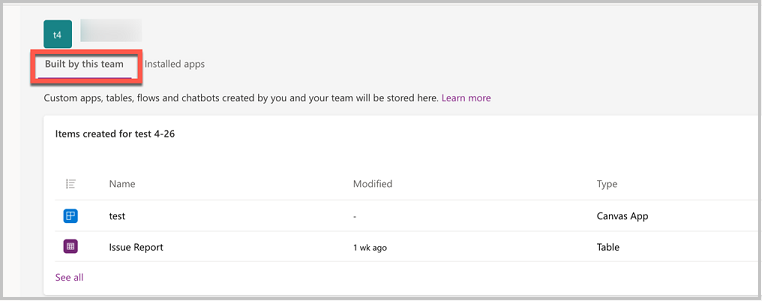

- Changes made to an app will be added as a new version of the app. If you get a new version from store, your customizations won't be overridden. You'll get a new version that has the latest features, but the new version won't be published.

    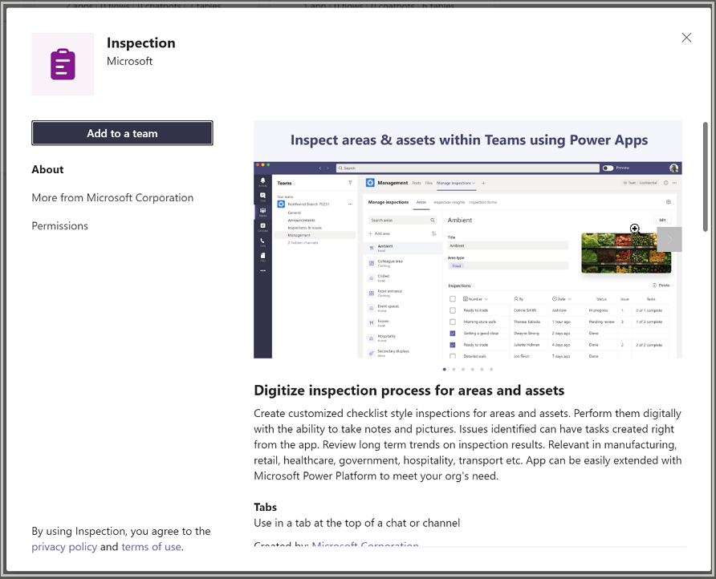

    After upgrading the solution, your current app version will still be "Live". The updated version of the app is available from the version history of the app.
    
    
    
    Selecting **Details** from the app list will display the versions of the app and allow you to publish the new version.
    
    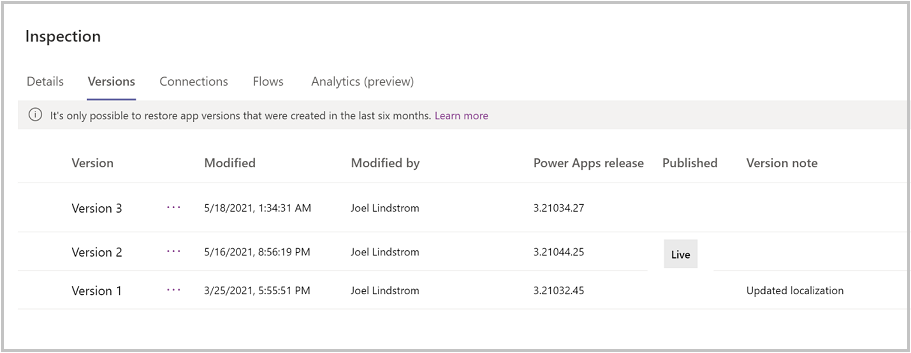
    
    You can choose to publish the new version or keep using the older one.

- When customizing the app, pop out the Power Apps app in Teams so you don’t lose your changes when you navigate to other parts of Teams.

- The app theming has been developed to support dark and high contrast mode in Teams. Changing the fill color of screens may break dark and high contrast modes

### See also

- [Understand Inspection sample apps architecture](inspection-architecture.md)
- [Sample apps FAQs](sample-apps-faqs.md)
- [Use sample apps from the Microsoft Teams store](use-sample-apps-from-teams-store.md)

[!INCLUDE[footer-include](../includes/footer-banner.md)]
