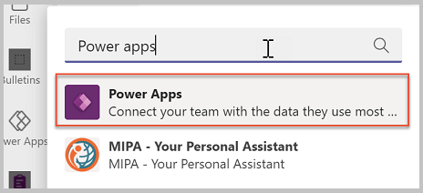
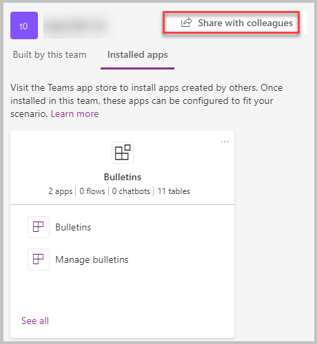
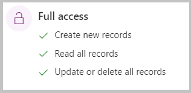

# How to deploy Bulletins app as broad distribution app

The Bulletins Power Apps template for Microsoft Teams is designed to provide a central location for all company communication. The solution includes two apps: Bulletins and Manage Bulletins.

The app addresses the following personas:

-   Bulletin Manager: this persona creates Bulletins, FAQ’s, and contacts/link. Managers also view metrics about bulletin reads and bookmarks. The manager uses the Manage Bulletins app and should be a member of the team in which the Bulletins solution is installed.
    
-   Bulletins User: this persona views Bulletins, FAQ’s, and contacts/links. This persona uses the Bulletins app.

You want everyone at in your org, department, or location to be able to view bulletins. These are people outside of the Teams team. We will share the
Bulletins app with them.

## Prerequisites 

You must be an owner of the Team in which the app is installed to share the app.

## Limitations

You can only share the app with a single Active Directory group.

### Action required to share an app with colleagues for broad distribution

1.  Share the app with colleagues.

2.  Grant security permissions to the tables used in the app.

# Sharing App with Colleagues

This process begins by opening the app in the **Power Apps** app. You may have Power Apps pinned to your Teams App Bar.

1.  In Microsoft Teams, select the **…** button from the left menu.

2.  Type **Power Apps** in the search field.

    

3.  Select the Power Apps app from the list to open the app. Power Apps will open inside of teams.
    
4.  It is recommended that you “pop out” Power Apps so that if you need to navigate somewhere else in Microsoft Teams you won’t lose your app
    configuration. To pop out the Power Apps app, right mouse click on the Power Apps logo and select **Pop out app**.

5. Right click on the **Power Apps** logo and select **Pin** to lock the app to the side menu so it is easy to get to in the future.

 

6. Now that you have loaded the Power Apps app, select **Build**.

7. This screen will show all the teams that have Power Apps installed in them. Select the team that contain the app you want to share. Select **Share with colleagues** .

8. Enter an AD security group or a different team with which you would like to share access to the app.

9. Set the **on/off** toggle to **on** for Bulletins.

10. Select **Save**

# Granting Permissions to the tables

Understanding and assigning permissions to tables are vital to ensure proper security of your shared data. Here are the four permissions available for use.

-   Full Access – Allows end users to see and edit all records in the table.

    

-   Collaborate – Allows end users to see all records, but they can only edit their own records.
    
    
    
-   Reference – Provides a read-only view of data for end users.

    

-   Private – Allows end users to only view and edit their own data.

    

## Granting Permissions to the tables

By default, all of the table permissions for colleagues not in the Team are set
to **none.** If you leave it that way, colleagues that you share the app with
will not be able to use the app, as they won’t have permission to the tables in
the app. Follow these steps to set permissions for the tables in the app for
colleagues outside of the team:

1.  In Microsoft Teams, open the **Power Apps** app.

2.  Select the **Build** tab.

3.  Select the team that contain the app you want to share.

4.  Select **Installed apps.** This will show all apps installed in the Team.

5.  Select **See All** in the **Bulletins** tile.

6. Select **Tables** from the solution components bar.

7. Select the tables listed individually then **Manage Permissions.**

8. Select the security group with which the app was shared. The initial permission will show none. Select the desired permission and select **Save.**

9. Repeat step 8 for each additional table in the app.

The following is recommended table permissions:

| Table                         | Permission                                                                                                                                                                                                                                |
|-------------------------------|-------------------------------------------------------------------------------------------------------------------------------------------------------------------------------------------------------------------------------------------|
| Bulletins                     | Since colleagues outside of the team should be able to read bulletins but not edit them, you should give colleagues outside of the team **Reference** permissions to the Bulletins table.                                                 |
| Bulletin Bookmark             | Since colleagues outside of the team need to be able to bookmark bulletins, they need to be able to create Bulletin Bookmarks. You should give colleagues outside of the team **Collaborate** permissions to the Bulletin Bookmark table. |
| Bulletin Category             | Colleagues outside of the team should be able to view categories but not create or edit categories, so you should give colleagues outside of the team **Reference** permission to the Bulletin Category table.                            |
| Bulletins Category Preference | Colleagues outside of the team should be able to set their preferences for category order and display preferences, so you should give colleagues outside of the team **Private** permission to the Bulletins Category Preference table.   |
| Bulletin Contact              | Since colleagues outside of the team should be able to view contacts but not create or edit them, you should give colleagues outside of the team **Reference**  permission to the Bulletin Contact table.                                 |
| Bulletin FAQ                  | Since colleagues outside of the team should be able to view FAQ’s but not create or edit them, you should give colleagues outside of the team **Reference** permission to the Bulletins FAQ table.                                        |
| Bulletin FAQ Category         | Since colleagues outside of the team should be able to view FAQ Categories but not create or edit them, you should give colleagues outside of the team **Reference** permission to the Bulletin FAQ Category table.                       |
| Bulletin Link                 | Since colleagues outside of the team should be able to view FAQ Categories but not create or edit them, you should give colleagues outside of the team **Reference** permission to the Bulletin FAQ Category table.                       |
| Bulletin Link Category        | Since colleagues outside of the team should be able to view Bulletin Link Categories but not create or edit them, you should give colleagues outside of the team **Reference** permission to the Bulletin Link Category table.            |
| Bulletin Read Receipt         | When users of the Bulletins app read a Bulletin, they should be able to create Bulletin Read Receipt records. You should give colleagues outside of the team **Collaborate** permission to the Bulletin Read Receipt table.               |
| Bulletin User Setting         | Since users of the Bulletins app need to be able to create or edit their user setting record, you should give colleagues outside of the team **Private** permission to the Bulletin User Setting table.                                   |

### Rename the app

In a large organization, you might have multiple people sharing the same
template app with colleagues. If multiple departments are using Bulletins, you
can make it easier for your colleagues to find the app by renaming it.

1.  Open **Bulletins** in Power Apps in Microsoft Teams.

2.  From the designer, in the upper right corner select the app name.

3.  Enter a new name for the app. For example, you may want to rename the app **Company News**.
    
4.  Save and publish the app.

# Accessing shared apps

So now that you have shared Bulletins with colleagues outside of your team, here is how they will acquire the app.

1.  In Microsoft Teams, select the elipses (…) button on left.

2.  Select **More apps**.

3.  Select **Built for your org**.

4.  When the app information screen appears, select **Add** to add the app to the main teams app menu.
    
    
    
5.  After adding the app to the Microsoft Teams app menu, select the icon for the app to open it full screen in Microsoft Teams.
    
6.  If you want to make the app always appear in the app menu so you can easily find it, right click on the Bulletins button on the app menu and select
    **Pin**.
    
    
    
7.  If you would prefer to add the app to another team, select the drop-down by the **Add** button and select **Add to a team**.
    
    

