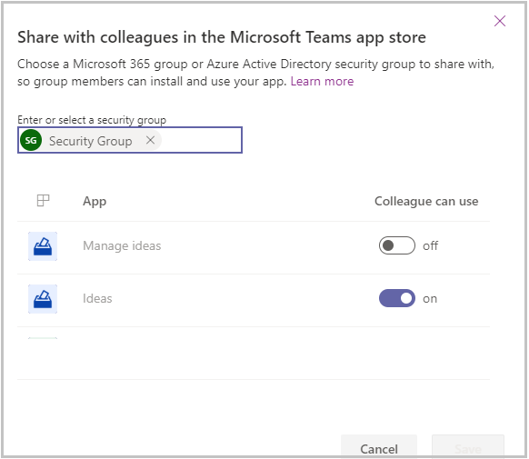
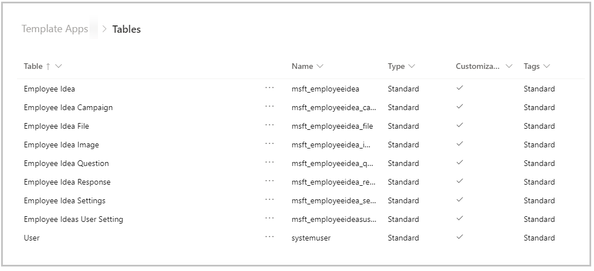
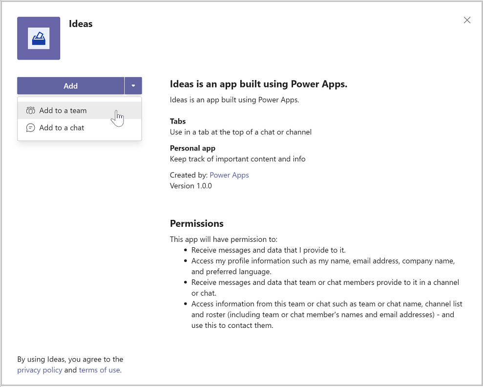

# Deploy Employee Ideas app as broad distribution app

The Employee Ideas sample app for Microsoft Teams is designed to capture ideas and suggestions from your employees and facilitate engagement from others who vote on the ideas that they like. This solution contains two apps: Ideas and Manage Ideas.

The app addresses the following personas:

- **Idea Manager**: Creates campaigns, updates app settings, view metrics for submitted ideas and idea votes. This personal will use the Manage Ideas app, which is designed to be used from within a Team.
- **Idea user**: This persona submits ideas and votes on ideas. They use the ideas app.

There are a couple of ways to deploy the app. Within the Teams team where only the members of the team can use the app. But what if you want to deploy this application more broadly&mdash;to a large group such as every front line store employee in your company, or every field technician in a region, or even every employee in the organization? And you don't want to create a new team just for this group.

You can use **Share with Colleague** feature to accomplish this. In this case, you'd want to create a Teams team only for those members in the organization who will administer the campaigns, and developers who would extend the app to meet your unique business needs. And then, we'll share the app to be used by an external group outside the team.

In this article, we'll explain how to share the app with colleagues outside of the team.

Watch this video to learn how to deploy Employee Ideas app as a broad distribution app:
> [!VIDEO https://www.microsoft.com/videoplayer/embed/RWLkvR]

## Prerequisites

You must be an owner of the Team in which the app is installed to share the app.

### Action required to share an app with colleagues for broad distribution

1. Share the app with colleagues.
2. Grant security permissions to the tables used in the app

> [!NOTE]
> Apps are installed in a team in Microsoft Teams. People who develop and extend the app or managers who manage the ideas app should use the app in a Team. For people who create ideas or users who aren't managers, sharing the app with colleagues outside of the team will enable them to use the app without having to be a member of the Team.

### Rename the app

In a large organization, you might have multiple people sharing the same template app with colleagues. If multiple departments are using. Ideas, you can make it easier for your colleagues to find the app by renaming it.

1. Open **Ideas** app in Power Apps in Microsoft Teams.
2. From the designer, in the upper-right corner, select the app name.
3. Enter a new name for the app. For example, you may want to rename the app **Suggestions**.
4. Save and publish the app.

## Sharing App with colleagues

This process begins by opening the app in the **Power Apps** app. You may have Power Apps pinned to your Teams App Bar.

1. In Teams, select the **…** button from the left menu.

1. Type **Power Apps** in the search field.

    

1. Select the Power Apps app from the list to open the app. Power Apps will open in teams.

1. Right-click on the **Power Apps** logo, and select **Pin** to lock the app to the side menu to pin the app.

    

1. We recommended that you **pop out** Power Apps so that if you need to navigate somewhere else in Teams you won't lose your app configuration. To pop out the Power Apps app, right-click on the Power Apps logo, and select **Pop out app**.

    

1. Now that you've loaded the Power Apps app, select **Build**.

1. This screen will show all the teams that have Power Apps installed in them. Select the team that contain the app you want to share. Select **Share with colleagues**.

    

1. Enter Azure AD security group or a different team with which you would like to share access to the app.

1. Set the **on/off** toggle to **on** for Ideas.

   

1. Select **Save**.

## Granting Permissions to the tables

Understanding and assigning permissions to tables are vital to ensure proper security of your shared data. Here are the four permissions available for use.

- **Full Access** – Allows end users to see and edit all records in the table.

- **Collaborate** – Allows end users to see all records, but they can only edit their own records.

- **Reference** – Provides a read-only view of data for end users.

- **Private** – Allows end users to only view and edit their own data.

### Configure table permissions

By default, all of the table permissions for colleagues not in the Team are set to **none.** If you leave it that way, colleagues that you share the app with won't be able to use the app, as they won't have permission to the tables in the app. Follow these steps to set permissions for the tables in the app for colleagues outside of the team:

1. In Teams, open the **Power Apps** app.

1. Select the **Build** tab.

1. Select the team that contain the app you want to share.

1. Select **Installed apps.** This will show all apps installed in the Team.

1. Select **See All** in the **Employee Ideas** tile.

   

1. Select **Tables** from the solution components bar.

   

1. Select the tables listed individually then **Manage Permissions.**

1. Select the security group with which the app was shared. The initial permission will show none. Select the desired permission and select **Save.**

1. Repeat the previous step for each extra table in the app.

The following is recommended table permissions:

| **Table** | **Permission** |
| --- | --- |
| Employee Idea | Since colleagues outside of your team need to submit ideas, and when they vote for ideas, the app updates a vote count on the idea, you'll want to give colleagues outside of your team **Full** access to the Employee Idea table. |
| Employee Idea Campaign | Since colleagues outside of your team need to view campaigns, but not edit or create them, you should give colleagues outside of your team **Reference** permission to Employee idea Campaign table. |
| Employee idea File | Since colleagues outside of your team need to read and create new files, you should give colleagues outside of your team **Collaborate** permission to Employee idea File table. |
| Employee idea image | Since colleagues outside of your team need to read and add new idea images, you should give colleagues outside of your team **Collaborate** permission to the Employee Idea Image table. |
| Employee Idea Question | Since colleagues outside of your team need to read questions but shouldn't add or edit question records, you should give colleagues outside of your team **Reference** permission to the Employee Idea Question table. |
| Employee Idea Response | Since colleagues outside of your team need to create responses when submitting ideas, you should give colleagues outside of your team **Collaborate** permission on the Employee Idea Response table. |
| Employee idea Settings | Since colleagues outside of your team need to read app settings but not edit them, you should give colleagues outside of your team **Reference** permission to the Employee Idea Settings table. |
| Employee Idea User Setting | Since colleagues outside of your team need to be able to create and edit their own user setting records, you should give colleagues outside of your team **Private** permission to the Employee Idea User Setting table. |

## Accessing shared apps

So now that you have shared. Ideas with colleagues outside of your team, here's how they'll acquire the app.

1. In Teams, select **...** (ellipsis) button on left-pane.

1. Select **More apps**.

1. Select **Built for your org**.

   

1. When the app information screen appears, select **Add** to add the app to the main teams app menu.

1. After adding the app to the Teams app menu, select the icon for the app to open it full screen in Teams.

1. If you want to make the app always appear in the app menu so you can easily find it, right-click on the Ideas button on the app menu and select **Pin**.

   

1. If you would prefer to add the app to another team, select the drop-down by the **Add** button, and select **Add to a team**.

   

## Limitations

Currently, Teams apps can only be shared with a single Azure Active Directory group.

### See also

- [Understand Employee ideas app architecture](employee-ideas-architecture.md)
- [Customize employee ideas app](customize-employee-ideas.md)
- [Sample apps FAQs](sample-apps-faqs.md)
- [Use sample apps from the Microsoft Teams store](use-sample-apps-from-teams-store.md)

[!INCLUDE[footer-include](../includes/footer-banner.md)]
