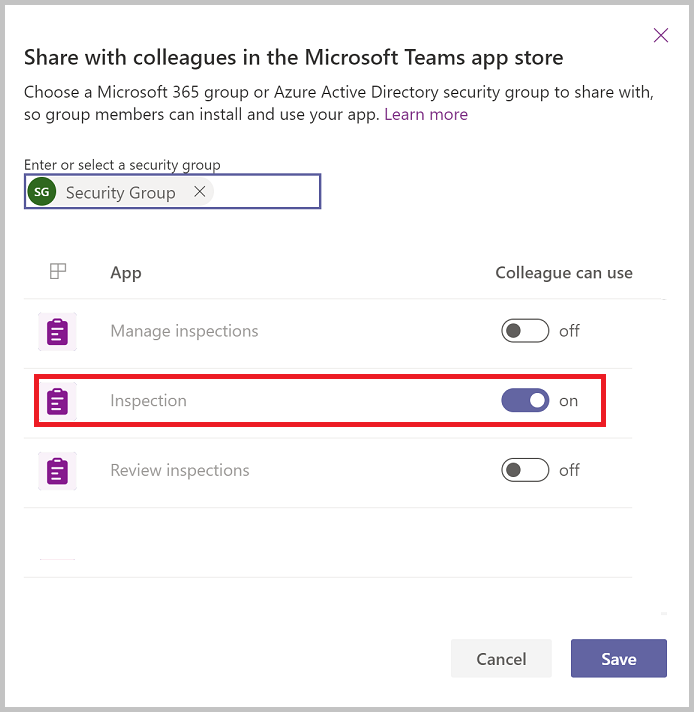
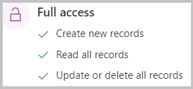
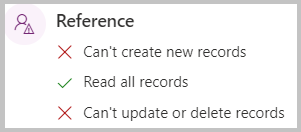
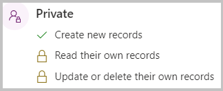
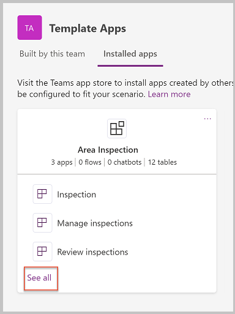
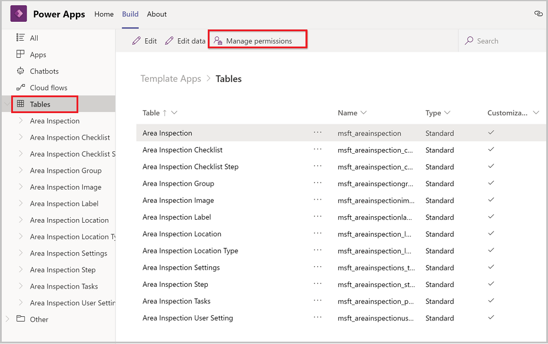
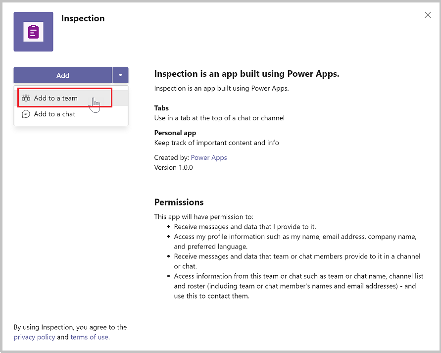

# How to deploy Inspection app as broad distribution app

The Inspection Power Apps template app for Microsoft Teams is designed to make it easy to track and perform inspections of your assets, equipment, facility, or store.

The inspection solution addresses the following personas:

-   Inspection Manager: This user creates Inspection forms and manages the list of areas or assets. Inspection Managers use the Manage Inspections app.
    
-   Inspection Reviewer: This user reviews and approves submitted inspections. Inspection Reviewers use the Review Inspection app.
    
-   Inspection User: This user submits inspections and uses the Inspection app.

You want everyone at in your org, department, or a certain location to be able to submit inspections. These are people outside of the Teams team. We will share the inspection app with them.

The people responsible for managing and reviewing submitted inspections should be added as members of the team where the app is installed, as these apps are designed to be used from within a team.

> NOTE: By default, when an issue is logged in an inspection, a task is created in Microsoft Planner in the team in which the app is installed, so you should also share access to the Team Planner environment with the group for which the app is shared for broad distribution.

## Prerequisites 

You must be an owner of the Team in which the app is installed to share the app.

## Limitations

At the time of this recording, you can only share the app with a single Active Directory group.

### Action required to share an app with colleagues for broad distribution

1.  Share the app with colleagues.

2.  Grant security permissions to the tables used in the app.

> NOTE: apps are installed inside of a tab in a Teams channel. People who develop and extend the app or managers who create or manage the inspection forms should use the app in a Team. For people who complete inspections or users who are not managers, sharing the app with colleagues outside of the team will enable them to use the app without having to be a member of the Team.

## Sharing App with Colleagues

This process begins by opening the app in the **Power Apps** app. You may have Power Apps pinned to your Teams App Bar.

1.  In Microsoft Teams, select the **…** button from the left menu.

2.  Type **Power Apps** in the search field.

    

3.  Select the Power Apps app from the list to open the app. Power Apps will open inside of teams.
    
4.  It is recommended that you “pop out” Power Apps so that if you need to navigate somewhere else in Microsoft Teams you won’t lose your app
    configuration. To pop out the Power Apps app, right mouse click on the Power Apps logo and select **Pop out app**.

5. Right click on the **Power Apps** logo and select **Pin** to lock the app to the side menu so it is easy to get to in the future.

6. Now that you have loaded the Power Apps app, select **Build**.

7. This screen will show all the teams that have Power Apps installed in them. Select the team that contain the app you want to share. Select **Share with
   colleagues** 

8. Enter an AD security group or a different team with which you would like to share access to the app.

9. Set the **on/off** toggle to **on** for **Inspection**.

10. Select **Save**.

## Granting Permissions to the tables

Understanding and assigning permissions to tables are vital to ensure proper security of your shared data. Here are the four permissions available for use.

-   Full Access – Allows end users to see and edit all records in the table.

    

-   Collaborate – Allows end users to see all records, but they can only edit their own records.
    
    
    
-   Reference – Provides a read-only view of data for end users.

    

-   Private – Allows end users to only view and edit their own data.

    

### Granting Permissions to the tables

By default, all of the table permissions for colleagues not in the Team are set to **none.** If you leave it that way, colleagues that you share the app with
will not be able to use the app, as they won’t have permission to the tables in the app. Follow these steps to set permissions for the tables in the app for
colleagues outside of the team:

1.  In Microsoft Teams, open the **Power Apps** app.

2.  Select the **Build** tab.

3.  Select the team that contain the app you want to share.

4.  Select **Installed apps.** This will show all apps installed in the Team.

5.  Select **See All** in the **Area Inspection** tile.

6. Select **Tables** from the solution components bar.
7. Select the tables listed individually then **Manage Permissions.**

7. Select the security group with which the app was shared. The initial permission will show none. Select the desired permission and select **Save.**

9. Repeat step 8 for each additional table in the app.

The following is recommended table permissions:

| Table                          | Permission                                                                                                                                                                                                                                                                                  |
|--------------------------------|---------------------------------------------------------------------------------------------------------------------------------------------------------------------------------------------------------------------------------------------------------------------------------------------|
| Area Inspection                | Since colleagues outside of your team will need to create their own inspections but not read other users inspections, you should give them **Private** permission for Area Inspection table.                                                                                                |
| Area Inspection Checklist      | Area Inspection Checklist is the header for inspection forms. Since colleagues outside of your team will need to read all inspection checklists but not create or edit records, you should give them **Reference** permission for Area Inspection Checklist table.                          |
| Area Inspection Checklist Step | Area Inspection Checklist Steps are the checklist steps for inspection forms. Since colleagues outside of your team will need to read all inspection checklist step but not create or edit records, you should give them **Reference** permission for Area Inspection Checklist Step table. |
| Area Inspection Group          | Area Inspection Groups are not actively used in the Inspection app, so you should select **None** for the permission for Area Inspection Group.                                                                                                                                             |
| Area Inspection Image          | Area Inspection Images are not actively used in the Inspection app, so you should select **None** for the permission for Area Inspection Image.                                                                                                                                             |
| Area Inspection Label          | Since colleagues outside of your team will need to read inspection labels but should not create or edit records, you should give them **Reference** permission for Area Inspection Label table.                                                                                             |
| Area Inspection Locations      | Since colleagues outside of your team will need to read inspection locations but should not create or edit records, you should give them **Reference** permission for Area Inspection Location table.                                                                                       |
| Area Inspection Location Type  | Since colleagues outside of your team will need to read inspection location types but should not create or edit records, you should give them **Reference** permission for Area Inspection Location Type table.                                                                             |
| Area Inspection Settings       | Since colleagues outside of your team will need to read inspection app settings but should not create or edit records, you should give them **Reference** permission for Area Inspection Settings table.                                                                                    |
| Area Inspection Step           | Area Inspection Steps store the user input for inspections. Users will need to be able to create and edit inspection step records, so you should give them **Collaborate** permission on Area Inspection Step table.                                                                        |
| Area Inspection Tasks          | Area inspection tasks are created when users log an issue during an inspection, so you should give them **Collaborate** permission on Area Inspection Task table.                                                                                                                           |
| Area Inspection User Settings  | Since colleagues outside of your team need to create and edit their user setting record for Inspection but should not be able to view or edit other users’ setting records, you should give them **Private** permission to the Area Inspection User Settings table.                         |

### Rename the app

In a large organization, you might have multiple people sharing the same template app with colleagues. If multiple departments are using Inspection, you
can make it easier for your colleagues to find the app by renaming it.

1.  Open **Inspection** in Power Apps in Microsoft Teams.

2.  From the designer, in the upper right corner select the app name.

3.  Enter a new name for the app. For example, you may want to rename the app **Store Inspection**.
    
4.  Save and publish the app.

## Accessing shared apps

So now that you have shared Inspection with colleagues outside of your team, here is how they will acquire the app.

1.  In Microsoft Teams, select the elipses (…) button on left.

2.  Select **More apps**.

3.  Select **Built for your org**.

4.  When the app information screen appears, select **Add** to add the app to the main teams app menu.
    
    
    
5.  After adding the app to the Microsoft Teams app menu, select the icon for the app to open it full screen in Microsoft Teams.
    
6.  If you want to make the app always appear in the app menu so you can easily find it, right click on the Inspection button on the app menu and select
    **Pin**.
    
    
    
7.  If you would prefer to add the app to another team, select the drop-down by the **Add** button and select **Add to a team**.
    
    
