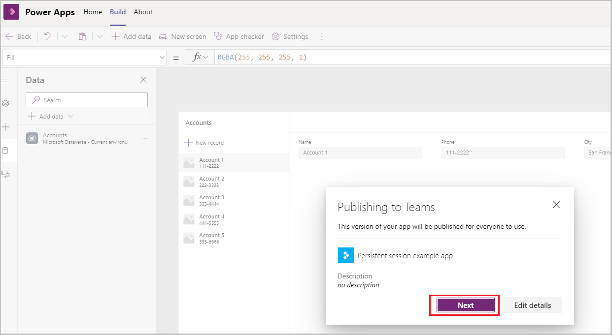
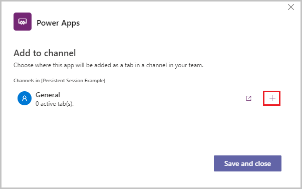
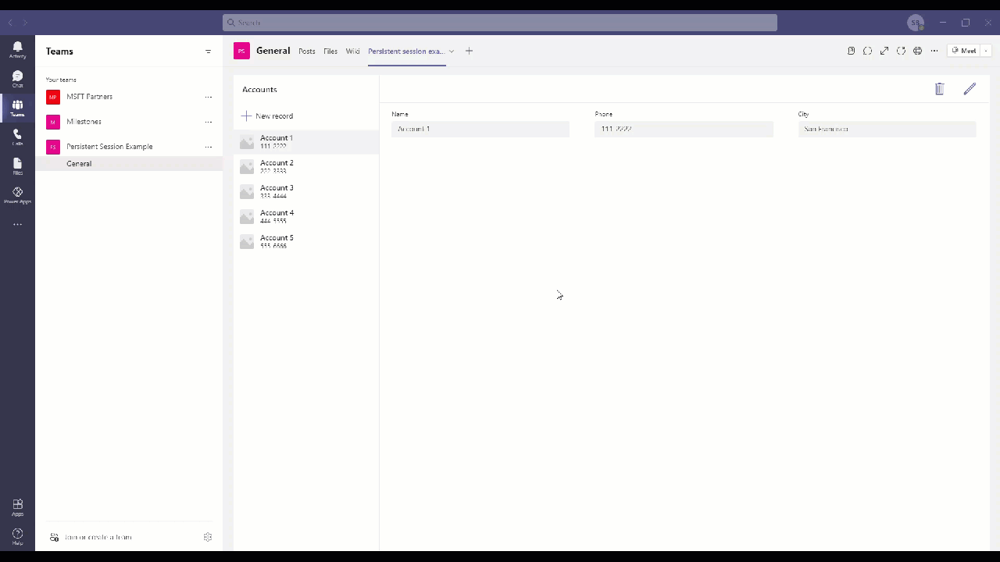
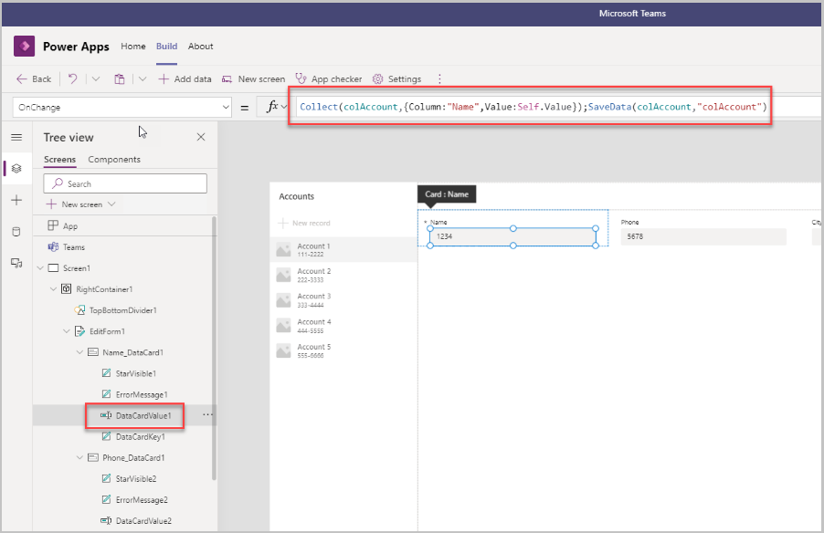
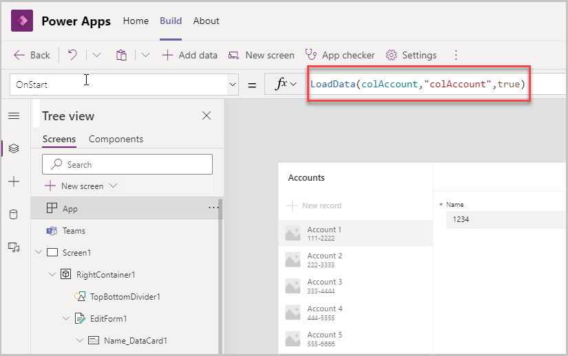
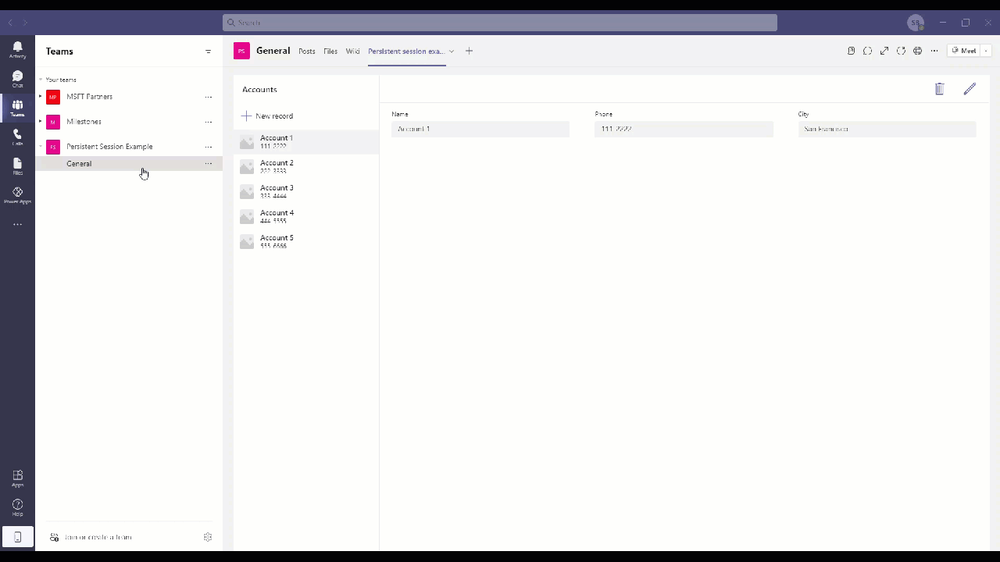

# Enable consistent experience across sessions using Load data/Save data

Microsoft Dataverse for Teams delivers a built-in, low-code data platform for Microsoft Teams. It provides relational data storage, rich data types, enterprise-grade governance, and one-click solution deployment. Dataverse for Teams enables everyone to easily build and deploy apps.

While there are a lot of advantages of using Power Apps in Teams, one of the biggest design considerations, while using an app, we switch a tab in teams to look at wiki or planner or even chat with someone, the session data of the app is lost and we would have to start the session from scratch e.g., if we are in the middle of an inspection using the Inspections app and we switch tabs even for a second, all the data that was captured on the inspection would be lost and we will have to recapture all that information.

In this topic we will learn how to use load data and save data functions to store session data in canvas apps in Microsoft Teams so that switching tabs does not result in any rework because of data getting lost.

## Prerequisites

To complete this lesson, we would need the ability to create apps within Microsoft Teams License which will be available as part of select Microsoft 365 subscriptions

## Login into Microsoft Teams

Login into Microsoft teams using either the Desktop app (not supported in the web app)

## Create a new Team

To create a new team, select the Teams tab and then select **Join** or create a team on the left bottom of the screen -\> then select Create Team -\> From Scratch -\> Public and give the team a name – MSFT Partners in our example and select Create

The new team gets created and is listed under the Teams tab


## Create a Power App in Teams

To create a Power Apps app in teams, we need to open the Power Apps studio in Teams as shown below


1. Select Power Apps from the list of apps and pin it to the left navigation and then select it to open it

 

2.  Select **Start now** to create the first app

3.  Select the Team for which this app is to be created – the Power Apps environment is installed for that team (there is one Power Apps environment per team)

4.  It creates the app in the background – close the dialog box that says it is getting things ready

5.  Select the Build tab on top and in a few seconds the app created should appear in the list

6.  Open the app and notice it gets created in the tablet layout/form factor by default


7. Enter a name for the app **Persistent session example** app and select **Save**


8. The app gets created with a gallery


9. Select the** Create new table** button to create a new table and add data to it

10. Add a Table name – Accounts and select Create


11. Add columns – Phone (data type – Phone) and City (data type – Text)


12. Then add Data to the three columns

13. Repeat to add at least 5 records

14. Select ** Close**


15. The accounts table gets added as a data table

16. Select the **Tree View** -\> Select **BrowseGallery1** -\> Select **Accounts** as the Data source


## Publish the Power App in Microsoft Teams

1.  Select the Publish to Teams button on the top right corner


2.  Select the Next button in the dialog box



3.  Select the + to add the app to the General channel




4.  Now, navigate to the Persistent Session Example team and notice the Persistent session example app shows up on the top as a tab


## Testing the issue

1.  Open the Persistent session example app from the Persistent Session Example team


2.  Select **New Record** to create a new Account record in the app

3.  Enter the name and phone number

4.  But before you enter **City** and save the record, navigate to a different tab (like Files or Wiki on top or a different team) and then come back to the app

4.  Notice that the data entered in the two columns is no longer available on the screen and is lost



## Solution – Use Save Data and Load Data functions

To resolve the above issue, we will use **SaveData** and **LoadData** functions (insert link) – we will create a collection for the data entered on a form as and when data is entered and keep saving the data in the collection until the record has been committed or saved. So that if the record has not been saved and we must tab out of the screen for some reason, the collection would have the saved data which would get loaded once we are back in the app. We will also clear the collection once the record has been saved so that the collection is ready to capture new data when the next new record is being created.

1.  First step is to make sure that the changes we are applying are applicable only in the case of a New record and so we are updating the variable newMode that will be used as a condition on the edit form to figure out what data needs to be displayed.  Select the New record button and add the following formula on the OnSelect property of the button:

```
NewForm(EditForm1);
UpdateContext({newMode: true})
```


2.  Next, we will add data from individual input controls to a collection and then we will save data to a local file from that collection.  Select the text input box – in our example it will be the DataCardValue1 of the Name_DataCard1 on EditForm1 for the Name field – enter the following formula in the OnChange property of the input field:

```
Collect(
    colAccount,    
    { Column:"Name",Value:Self.Value}
);
SaveData(colAccount,"colAccount").
```

By doing this we are adding the data to a local cache so that if the user leaves the app, their data will not be lost.



Similarly enter the following code in the OnChange property for:

Phone (DataCardValue2):

```
Collect(colAccount, {Column:"Phone",Value:Self.Value});
SaveData(colAccount,"colAccount");
```

City (DataCardValue3)

```
Collect(colAccount {Column:"City", Value:Self.Value});
SaveData(colAccount, "colAccount");
```

3.  Then we will update the App OnStart so that if there is any data saved in the collection, that would get loaded on the start of the app.

Go to the App – OnStart property and add the following formula

```
LoadData(colAccount,"colAccount", true)
```



4.  Next, we need to update the Default property of the data fields so that when the page loads once we come back to the app, if data exists in the collection, it should show the data from the collection by default.

Select the field DataCard and update the Default property of the data card to the following formula

For Name field enter **Name_DataCard1:**

```
If(
    newMode && !IsBlank(
        Last(
            Filter(colAccount, Column = "Name")
        ).Value
    ),
    Last(
        Filter(colAccount, Column = "Name")
    ).Value,
    If(newMode, Blank(), ThisItem.Name)
)
```


Similarly, enter the following in the Default property formula for Phone (Phone_DataCard1):

```
If(
    newMode && !IsBlank(
        Last(
            Filter(colAccount, Column ="Phone")
        ).Value
    ),
    Last(
        Filter(colAccount, Column = "Phone")
    ).Value,
    If(newMode, Blank(), ThisItem.Phone)
)
```

Also, use this code for City (City_DataCard1):

```
If(
    newMode && !IsBlank(
        Last(
            Filter(colAccount, Column = "City")
        ).Value
    ),
    Last(
        Filter(colAccount, Column = "City")
    ).Value,
    If(newMode,Blank(), ThisItem.City)
)
```

5.  We need to clear the collection in two scenarios –

    a.  When the user submits the form, and the changes get saved

    b.  When the user selects the cancel button to cancel the changes

    Use the following formula in the OnSelect property of the submit button
```
SubmitForm(EditForm1);
UpdateContext({editMode: false, newMode: false});
Clear(colAccount);
SaveData(colAccount, "colAccount");
```


Select the Cancel button and enter the following formula

```
ResetForm(EditForm1);
UpdateContext({editMode: false, newMode: false});
Clear(colAccount);
SaveData(colAccount, "colAccount");
```


6.  Publish the apps after making all the above changes by selecting the Publish to Teams button on the top right

## Test the app again

1.  Go to the Team and run the app

2.  Select **+New** record and add the Name and Phone for the new record

3.  Now select another tab to move out of the app

4.  Come back to the app – it shows details of the first account

5.  Now when we select the +New record button again, we will see the Name and Phone details populated in those text input fields and we can resume adding the account we were adding before we had to tab out of the app



## How we use load data and save data in the Inspection app

In the Inspection Power Apps template for Microsoft Teams, we use load data and save data on the inspection form—if a user is in the middle of an inspection, and they navigate away from the apps in Teams (like to send someone a message), we don’t want them to lose their place in the inspection. When they return to the app tab in Microsoft Teams, the app gives them the option to resume the in-progress inspection.

## Caveats

In Dataverse for Teams, there are some limits to the load data/save data capabilities

- 1 MB limit on Teams desktop

- Does not work in browser

- Apps in mobile are limited by the amount of local storage available to the app.