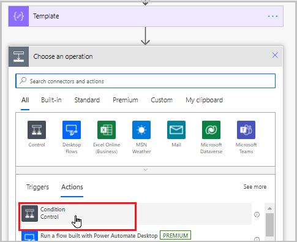
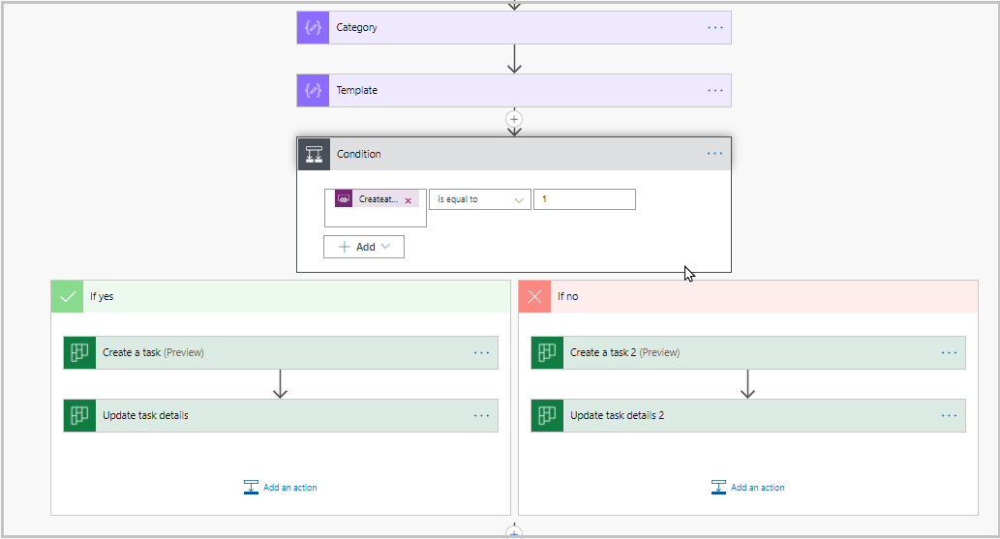
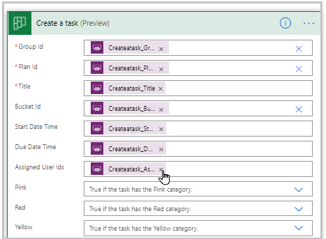
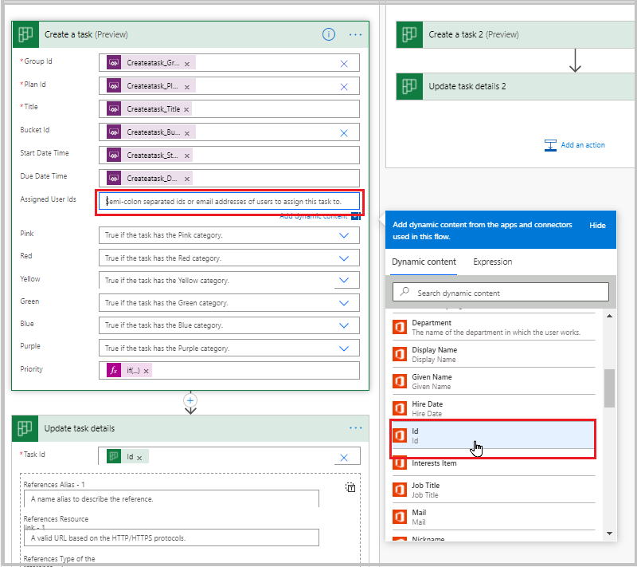
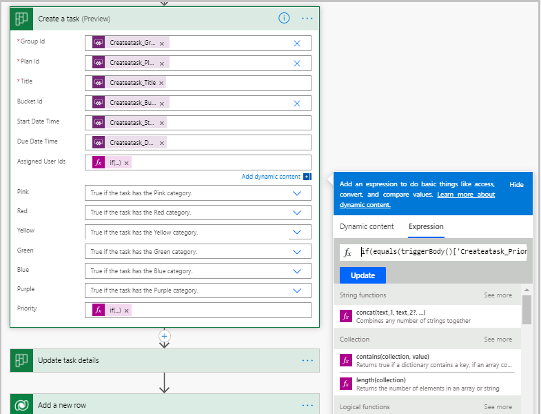

# Add business logic for automated task assignment in Issue reporting sample app

In the Issue Reporting template Power App for Microsoft Teams, you can specify a specific user for a type of issue. This will make tasks for that issue type automatically assigned in Planner to that user.

But what if you want additional logic to further automate issue assignment?

Let’s say you want any urgent issues to be automatically assigned to a manager. Power Automate is a great option to automate conditional logic like task creation.

## Open Power Automate

In this step we will open Power Automate to edit the Flow we previously created.

1.  Log in to [Power Automate](http://www.powerautomate.com) and select the environment for your Team.

2.  Select **My flows**.

3.  Open the flow **Create Planner Task**.

4.  Select **Edit**.

## Retrieve the assigned user’s manager

We are going to use the Office 365 Users connector to get the manager of the user to whom the task is assigned.

1.  In Power Automate hover your mouse under the Power Apps trigger.

2.  Select **Insert a new step.**


3.  Select **Add an action.**

4.  In the operation picker, type in **Office 365 Users** and select the **Get manager (V2)** action.
    
5.  In the Get manager (V2) action, select the **User (UPN)** field.

6.  Select the variable for assigned users from the dynamic field selector. In our example it is called **Createtask_AssignedUserIds**. This was the
    variable created when we added the **Ask in Power Apps** option in the Assigned field.
    
7.  Save your flow.

    Our flow now will get the manager of the assigned user to use for escalation.

## Escalate urgent issues to a manager

In this step we will add logic to the flow to conditionally assign tasks to managers if the task is urgent. There are multiple ways to perform conditional
logic in Power Automate. In this lesson we will cover two options:

-   Using condition step

-   Using an expression

>NOTE 
>Each of the following two expressions modify the flow, you should select one of these methods.

### Easy: use a condition action

If you are a beginning flow maker, you may find using a condition step to be the easiest approach as it does not involve any formulas.

1.  Under the **Template** step in your flow, add a new action

2.  Select **Condition**

    

3.  In the condition action, select the **Choose a value** field.

4.  In the dynamic field selector, select the **Createtask_Priority** variable.

5.  Select the **Choose a value** field and enter **1**.

6.  Drag the **Create a task** and **Update task details** actions to the **If yes** box.
    
    
    
7.  Select the **…** on the right of the **Create a task** action and select **Copy to my clipboard (preview)**.
    
8.  Select the **…** on the right of the **Update task details** action and select **Copy to my clipboard (preview)**.
    
9.  In the **If no** box, select **Add an action**.

10. Select **My clipboard** and select **Create a task (Preview)**.

11. Select **My clipboard** and select **Update task details**.

    Your flow should now look like this:

    

    Next we will update the task creation action in the **If yes** path to assign the task to the manager.
    
12. In the **If yes** box, expand the **Create a task (preview)** step.

13. Clear the **Assigned to id** by selecting the X on the field reference.

    

14. From the dynamic content panel, select the **ID** field from the Office 365 Users step.



15. In the **If no** box, expand the **Update task details 2**  step

-  Clear the **Task id** field.

-  In the Dynamic content panel, select the ID from the Create a Task (Preview) 2 step.
16.  Save the flow.

Your flow will now assign the task to the manager if priority is urgent, and assign it to the person specified in the app when the priority is not urgent.

### Advanced: use a conditional expression

The first method used a condition step to conditionally set the properties of the task. This is effective, but there are more efficient methods you can use to conditionally set values in power Automate.

In this step we will use an expression to conditionally set the value of the Assigned on the task.

Benefits of using an expression:

-   By using a conditional expression, we don’t need to duplicate the create task step—this means that if we make further changes to the task creation
    step we only need to make it one place.
-   Expressions may be faster than conditional branches.

Set the assignment logic using the following steps:

1.  Open the Create Planner Task flow.

2.  Expand the **Create a task (Preview)**  step.

3.  Clear the **Assigned user Id** field.

4.  In this step we are going to use an **if** formula to set the Assigned user ID. This is going to be similar to the expression used in the priority field, but instead of setting the value to a numeric value we will be setting it to the manager if the task is urgent.
    
5.  Select **Expression** in the Dynamics content panel

6.  Enter the following expression:

```PowerFX
if(equals(triggerBody()'Createatask_Priority'],1),outputs('Get_manager_(V2)')?['body/id'],triggerBody()['Createatask_AssignedUserIds'])
```



>NOTE
>If you want to know how to refer to a field value in an expression, add the field to your step, then select the three dots in the upper right corner of the step definition and select **Peek code.** This will reveal the expression syntax for referencing the field value.

## Test your flow

1.  In the Teams environment in which you modified the flow, run the Issue reporting app.
    
2.  Create an issue.

3.  Check the **Urgent** checkbox.

4.  Wait a few seconds then verify that the task is created.

5.  Verify that the task was assigned to the manager of the person you selected in the app.

>NOTE 
>This flow will work if a single assigned to was selected for the task in the Issue reporting app. The selected person must also have a manager defined in Active Directory.

## Next steps:

You can use this method to add other conditional business logic to Issue Reporting. Some examples include:

-   Conditionally assigning based on time of day.

-   Conditionally assigning based on responses to issue form questions.

-   Conditionally assigning to a manager if the original assignee is out of the office (the Outlook connector can check to see if there is an OOF message on the person’s mailbox).
    
-   Conditionally assigning based on the location of the user submitting the issue.
    
-   Conditionally assigning based on who is on shift (using Teams Shifts connector).
