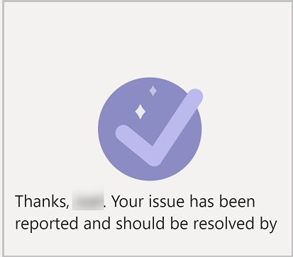
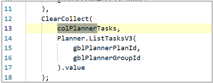
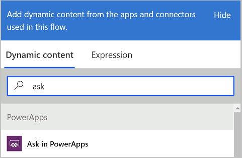
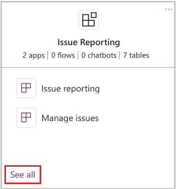

# Remove the Planner dependency for task creation in the Issue reporting sample app

In the Issue reporting sample app, you can share the app for broad distribution. When you do this, the users outside of the Microsoft Teams team may not have access to the Planner. If this case is true, creation of tasks will fail because the users submitting the issue.

Watch this video to learn how to remove the Planner dependency for task creation in the Issue reporting sample app:
> [!VIDEO https://www.microsoft.com/videoplayer/embed/RWLiBZ]

Issue reporting is heavily dependent on Planner, and the users of the app must have access to the Planner that the app uses to create issues. Planner is referenced in multiple places in the app:

1. During the app OnLoad, the app checks to see if Planner environment has been set in the app settings, and that the user of the app has access to that Planner environment.

1. The Insights screen shows statistics of issues created and completed—this is read from Planner.

1. On create of issues, a task is created in Planner, and the planner bucket, category, and plan IDs are retrieved from Planner.

1. The app checks to see if the bucket still exists in Planner, and if not, creates it.

## Current process design

In the lesson [Add urgency flag to reported issues](extend-issue-urgency.md), we created a flow to replace the task creation process, and then extended it to automate task assignment. Our process currently uses a Power Automate flow to create the task in Planner:

1. Create Planner task.

1. Create Issue Report record in Microsoft Dataverse issue Report table.

1. Return the Planner ID to the app.

Since the complete process is run as an instant flow, the user executing the flow must have permission to create the task.

## Removing Planner dependency

So if you wanted to remove the Planner dependency altogether so the users of the app don't need access to planner, there are multiple parts of the app that you would need to modify:

1. The app has a timer control that runs at the app OnLoad. At the end of the timer, the app checks to see if the user has access to the Planner environment, and if not, navigates to an error screen.

1. The Insights screen displays metrics of issues created and closed from Microsoft Planner.

1. The Submit issue button On Select formula has many references to Microsoft Planner.

1. The Issue submission confirmation has a button for the user to view the created task in Microsoft Planner.

In this lesson, we'll go through the steps required to remove the requirement to have access to planner, and replace it with tasks being created directly in Microsoft Dataverse. We'll also discuss how you can further extend the process to create tasks in the task management system of your choice.

## Remove check for access to Planner

During the app OnLoad, a timer control is started. At the end of the timer, the app checks to see if the user has access to the Planner instance for the app, and if not, sends the user to a screen telling them that planner must be configured. Since we're modifying the app to work for users who don't have access to the Planner, we'll remove this feature.

1. In Power Apps in Teams, select the **Tree view.**

1. Expand the **Landing Screen.**

1. Expand **conLoading_HiddenHelper**.

1. Select the timer control tmrLoadingDelay.

    

1. Select **OnTimerEnd** property and expand the formula bar.

1. Replace formula with the following:

   ```powerapps-dot
   Navigate('Insights Screen',ScreenTransition.None)
   ```

1. Save and publish your app.

### Remove View Task button from Issue Submission Screen

Since the tasks in Planner will be created by a different account and the users submitting them won’t have access to Microsoft Planner, we'll need to remove the button on the submission confirmation screen that navigates to the task in Planner.

1. In Power Apps in Teams, select the **Tree view**.

1. Select **Issue Submission Screen.**

1. Select the **View task** button.

1. Select **Delete**.

1. Save and publish your app.

    The Issue Submission screen should now look like this:

    

### Update Insights Screen Planner task collection

The Insights Screen's **OnVisible** formula collects the tasks from Planner to display task history in the Last 7 Days section of the screen. If app users won’t have access to the Planner, they won't see any statistics on this screen.

1. In Power Apps in Teams, select **Tree view**.

1. Select **Insights Screen**.

1. Select **OnVisible** property.

1. The following part of the formula is where the tasks are collected:

    

    Update this to the task system of your choice.

1. Expand **Insights Screen** in **Tree view.**

1. Expand **ConWeekAtGlance**.

1. Select **galWeekAtGlance.**

1. The **Items** property formula references "colPlannerTasks". If you're switching to another task management system, you'll need to update this formula to correctly display summary information from that system.

### Update Issue Report Screen

The Issue Report Screen contains many dependencies with Planner that will need to be updated for users without access to Planner to be able to create issues. To make the app work with other task management systems, we'll remove the OnSelect property of the Submit issue button

1. In Tree view, select **Issue Report Screen**.

1. Select the **Submit issue** button.

1. Select **OnSelect** property.

1. Clear the formula.

Now that we've removed the current OnSelect formula, we're going to create a flow. This flow will directly update the Issue Report table in Dataverse.

1. While in the **OnSelect** property of the **Submit issue** button, select the vertical three dots in the Power Apps menu and select **Power Automate.**

1. Select **Create new flow**.

1. Select **Power Apps** for the trigger of the flow.

1. The new flow window will open. Select the flow name field and enter **Create task in Dataverse** for name.

1. Select **New step**.

1. Search connectors for **Compose** and add a Compose step.

    In the following steps, we will set values to **Ask in PowerApps**. When you set a value in a Power Automate flow that is triggered from Power Apps to **Ask in PowerApps**, a parameter is created in your flow and Power Apps will pass a value to this parameter when the flow is called from an
    app.

    

1. Rename the compose step **Category**.

    > [!NOTE]
    > Always rename your compose steps before setting their value to **Ask in Power Apps** so that the parameter created will include the appropriate name, rather than a generic name.

1. Select the dynamic content panel and select the **Ask in PowerApps** action.

1. Add another compose step.

1. Rename the new compose step **Template**.

1. Set input for the template step to **Ask in PowerApps**.

1. Search connectors for **Dataverse** and select the **Add a new row** action.

1. Select **Issue Reports** for table.

1. Set the following field mapping:

    | Column           | Value                                                        |
    | ---------------- | ------------------------------------------------------------ |
    | Category         | Set to msft_issuereport_categories() then between the parenthesis, select the category_inputs in the dynamic content panel. |
    | Name             | Ask in Power Apps                                             |
    | Task Assignment  | Ask in Power Apps                                             |
    | Task Description | Ask in Power Apps                                             |
    | Task Due Date    | Ask in Power Apps                                             |
    | Template         | Set to msft_issuereport_templates() then between the parenthesis, select the template compose step output value. |

1. Select **Save** to save your flow.

1. Once flow is saved, return to Power Apps.

1. Wait a few seconds and you'll see your new flow in the list of flows. Select it.

1. Your formula for OnSelect will now be **CreatetaskinDataverse.Run(**.

1. Position your cursor directly in front of the "Createtask…" expression. And then, paste in the following formula (this is needed to create variables like the assigned to string and the description, which combines the questions from the issue form with the answers provided by the user for the task description).

    ```powerapps-dot
    UpdateContext({locSavingRecord: true});
    // Create Task
    With({varHasLocation: !IsBlank(txtLocation.Text) Or tglLocation.Value,varHasDescription: !IsBlank(txtDescription.Text),varHasQuestions: !IsBlank(colCdsIssueQuestions), varBusinessDaysDue: If(IsBlank(gblRecordTemplate.'Business Days until Due'),1, gblRecordTemplate.'Business Days until Due')}), With({varDescriptionPart_Location: If(varHasLocation, Concatenate("Location: ", txtLocation.Text, If( tglLocation.Value, Concatenate(Char(10), "Address: ", lblLocation_Address.Text))), Blank()),varDescriptionPart_Description: If(varHasDescription, Concatenate("Description:",Char(10),txtDescriptionText),Blank()),varDescriptionPart_Questions: If(varHasQuestions,Concat(colCdsIssueQuestions,Concatenate(Instructions,Char(10),If(IsBlank(appResponse),"(No Response)",appResponse)),Char(10) & Char(10),Blank()),varDueDate: With({varBusinessDaysBaseline: varBusinessDaysDue,varWeekEndDaysThisWeek: If((Weekday(gblTodayStartOfWeek.Monday) + varBusinessDaysDue) \> 5,2,0),varWeekEndDaysFuture: If(varBusinessDaysDue \> 5,RoundDown(Value(varBusinessDaysDue) / 5,0) \* 2,0),varTodayOffset: If(Hour(Now()) \< 9,\-1,0)},DateAdd(gblToday,Max(varBusinessDaysBaseline + varWeekEndDaysThisWeek  + varWeekEndDaysFuture + varTodayOffset,1),Days))},
    UpdateContext({locNewTask: {appTitle: gblRecordTemplate.Title, appBucket: locPlannerBucketForTask,
    appStart: Now(),appDue: varDueDate,appDescription: Concatenate(If(varHasDescription,varDescriptionPart_Description,
    Blank()),If(varHasDescription And varHasLocation,Char(10) & Char(10),Blank()), If(varHasLocation,varDescriptionPart_Location,Blank()),If((varHasLocation And varHasQuestions) Or (varHasDescription And varHasQuestions), Char(10) & Char(10), Blank()),If(varHasQuestions,varDescriptionPart_Questions,Blank())),appAssignments: Concat(colCdsIssueAssignments,appEmailAddress,";")}})));
    ```

1. Position the cursor after the "CreatetaskinDataverse.Run(" (right parenthesis), then enter the values to pass to the flow. If you updated the flow fields in the order provided in this lesson, the formula should be as follows:

    ```powerapps-dot
    CreatetaskinDataverse.Run(gblRecordCategory.'Issue Report Category',gblRecordTemplate.'Issue Report
    Template',locNewTask.appTitle,locNewTask.appAssignments,locNewTask.appDescription,locNewTask.appDue,locNewTask.appStart)
    ```

1. Add a semicolon after the flow run formula.

1. Add the following to the end of the formula to navigate to the task creation confirmation.

    ```powerapps-dot
    Navigate('Issue Submission Screen',ScreenTransition.Fade,{locDueDate: locNewTask.appDue});
    UpdateContext({locSavingRecord: false});
    ```

1. Save and publish your app.

### Test your flow

Now that we've created a new flow to create the task directly in Dataverse, test the process:

1. Go to the team in which the Issue reporting app is installed.

1. Submit a new issue.

1. Validate that the task was created successfully by opening the Power Apps app in Teams (remember to right-click and pop out the app).

1. Select **Build** tab, then select the **Installed apps** tab.

    

1. Select **See all** on the **Issue reporting** tile.

    

1. Select the ellipses (…) by the Issue Report table and select **Edit data**.

    

1. Verify that the issue you reported appears in the table. If you don’t see it, log in to Power Automate and see if there are any flow errors.

## Next steps

Now that you've updated the app to create the task directly in Dataverse, you can further extend the process to create the task in virtually any task management system. The following is a list of task management apps and services for which connectors exist for Power Automate:

- Microsoft To-Do
- Outlook Tasks
- Project Online
- Google Tasks
- Metatask
- Todoist
- Jira
- Asana
- Trello

To integrate the process, you can add an action to the flow created earlier to create a record in the task system of your choice. If any required fields aren't provided in the standard Issue reporting configuration, add them to the app and then update the flow to pass those values to the flow.

### See also

- [Understand Issue Reporting sample app architecture](issue-reporting-architecture.md)
- [Customize issue reporting app](customize-issue-reporting.md)
- [Sample apps FAQs](sample-apps-faqs.md)
- [Use sample apps from the Microsoft Teams store](use-sample-apps-from-teams-store.md)


[!INCLUDE[footer-include](../includes/footer-banner.md)]

