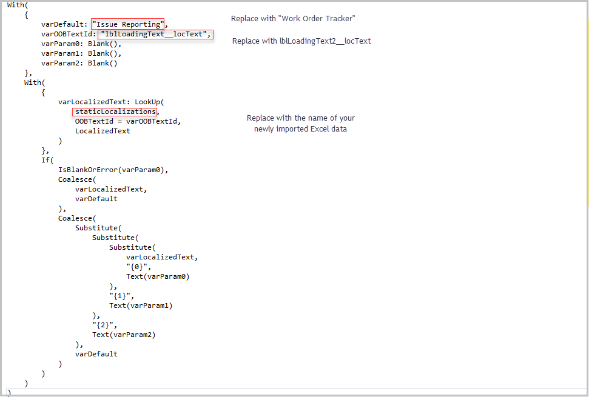
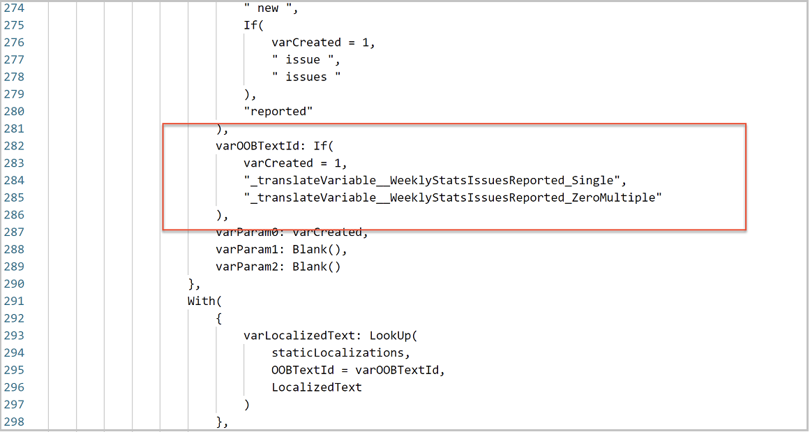
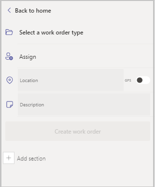
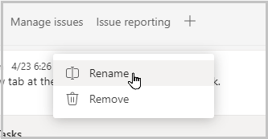

# Convert Issue reporting sample app to a work order management app

The Issue Reporting template Power App for Microsoft Teams is designed to be flexible and extendable, including for scenarios other than tracking issues.

For example, in a simple work scheduling scenario, you may want to use it as a work order management app. There are many similarities between issues and work order—assigned users, task descriptions, and due dates.

In this lesson we will walk through changing the app to a work order management
app.

1.  Open the Power Apps app in Microsoft Teams. We recommend you right click on the icon for Power Apps in Microsoft Teams and pop out the app so you won’t lose your changes if you navigate somewhere else in Teams.


2.  Select the **Build** tab.

3.  Select the team in which the app is installed.

4. Select **Installed apps** tab.

5. Select **Issue reporting** in Issue reporting tile.

   

   The app will open in the designer with the Landing Screen displayed.

   5. Select the text label control under the image that says **Issue Reporting** and expand the formula bar.

### Understanding localization
Before we continue, it is important to understand localization in canvas apps. All text labels in Issue reporting leverage localization variables to localize text language to 8 different languages. If you overwrite this formula with just static text,  the app will not be localized for other languages.   

To maintain localization, create a spreadsheet with these three columns:
-   OOBTextID—this is the identifier for the text control.
-   LocalizedText—this is the text to display.
-   LanguageTag—this is the code for the language

For example, in the current expression for the label on the Landing Screen sets the OOBTextID of the text label to **lblLoadingText\_\_locText**. Since static data in the app is not modifiable, we will designate a new OOBTextID for the control so the original one will no longer be displayed.

The spreadsheet we would import would look like this:

| **OOBTextID**            | **LocalizedText**  | **LanguageTag** |
|--------------------------|--------------------|-----------------|
| lblLoadingText2__locText | Work Order Tracker | en-US           |

Add another rows for each additional language that you will use, and add rows for each additional control for which you will be updating the text. Then import to the app. Update the following parts of the expression formula:



The app loading screen now displays **Work Order Tracker**


## Update the other screens in the app

Let’s update the other references to **Issue Reporting** to change to **Work order**

### Update Insights screen

1.  On the left of the designer, select **Tree View**

2.  Select **Insights Screen.**

    

3.  Select the **Report an issue** button and select the **Text** property.

4.  Following the steps in the previous section, add a row to the spreadsheet for a new OOBTextId with the LocalizedText **Create a Work Order** and
    update the button text formula to reference the new OOBTextId.
    
5.  Select the **Issues reported by you**  text label and select the **Text** property.
    
6.  Following the steps in the previous section, add a row to the spreadsheet for a new OOBTextId with the LocalizedText **Work orders you created** and
    update the text expression to reference the new OOBTextId.
    
7.  The **Last 7 days** area is a component that combines text and dynamic content for record counts. The text is set in the **Items** property. In the
    area highlighted in the below image there are two text strings, one for singular and the second for plural. Following the steps in the previous
    section, add a row in the spreadsheet with a new OOBTextIID with localized text, one for Work item and the other for Work items.
    
    

### Update Issue Report screen

The issue report screen is the screen that users see when the create an item, such as an issue or a work order. We will use the same method to update the field text as we did on the Insights screen.

1.  Select the **Tree view**

2.  Select **Issue Report Screen**

3.  Update the following properties:

    1.  Change **Select an issue type** Text property to **Select a work order type**.
    
2.  Change **Submit Issue** button Text property to **Create work order**.



### Update Template Selection Screen

The template selection screen is what users use to select the type of issue. Since we are changing the purpose of the app to a work order tracker, we will
want to change the **Back to issue** link at the top of the screen to say **Back to work order.**

The header of this screen is a component as it is re-used between multiple screens.

1.  In **Tree view** select **Template Selection Screen**.

2.  Select **Back to issue**.

3.  Select the **InputHeaderText** property.

4.  Change text to **Back to work order**.

### Update Assignment Selection Screen

The assignment selection screen is what users use to select the person to whom the item should be assigned.

1.  In **Tree view** select **Assignment Selection Screen**.

2.  Select **Back to issue**.

3.  Select the **InputHeaderText** property.

4.  Change text to **Back to work order**.

### Update Issue Submission Screen

The issue submission screen is the screen that users see after an issue has been submitted. This has a text display control that displays a mixture of localized text and dynamic data for first name.

1.  In **Tree view** select **Issue Submission Screen**.

2.  Select the text label with the text **Thanks, (first name). Your issue has been reported and should be resolved by”**.
    
3.  In the **HtmlText** property, find this section:

    

4.  In your spreadsheet, define a new OOBTextId and set the text to

```
Thanks, {0}, your work order has been created.
```

The 0 will be replaced with the first name of the user.

5.  Update the highlighted part of the formula to reference your new OOBTextId.

## Rename the Issue Reporting tab

We have now changed all of the references to “issue reporting” in the app, so now we want to change the name of the app so that users will see the correct name in Microsoft Teams.

1. In Microsoft Teams, navigate to the channel in which the app is installed.

2. Right mouse click on the app tab and select **Rename**.

3. Change the name of the tab to **Work order tracker**.

   

## Rename the app

We will also want to change the name of the app so that users who select the app for general distribution from the Teams store can find it.

1.  Open Issue Reporting in the **Power Apps** app in Microsoft Teams.

2.  In the upper right corner, select the app name.

3.  Enter **Work Order Tracker**  and select **Save**.

## Next steps

To complete the scenario, consider making similar changes to the Manage Issues app so that the administrator experience also follows the same logic.
