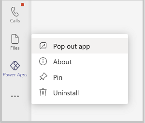
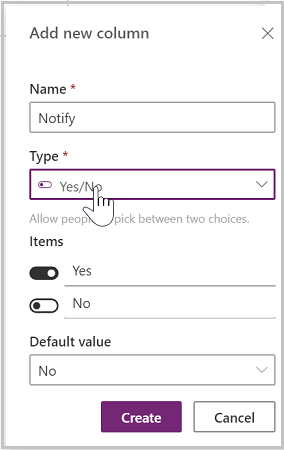
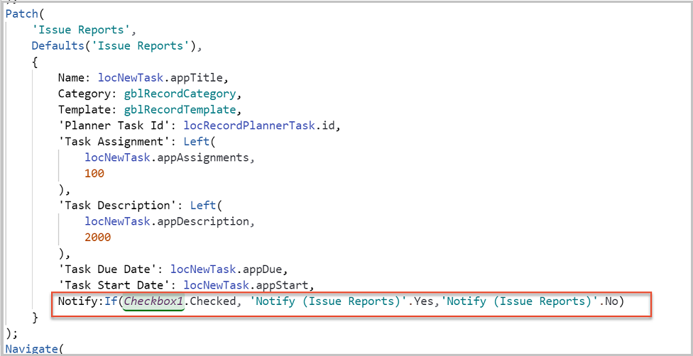
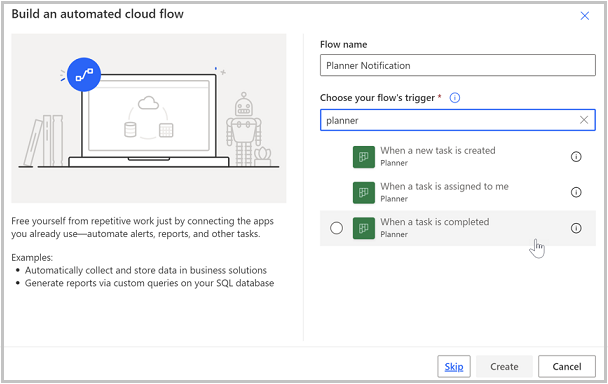
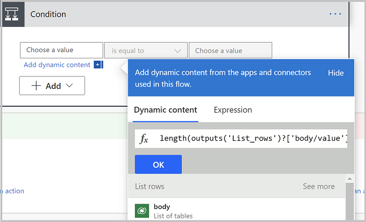
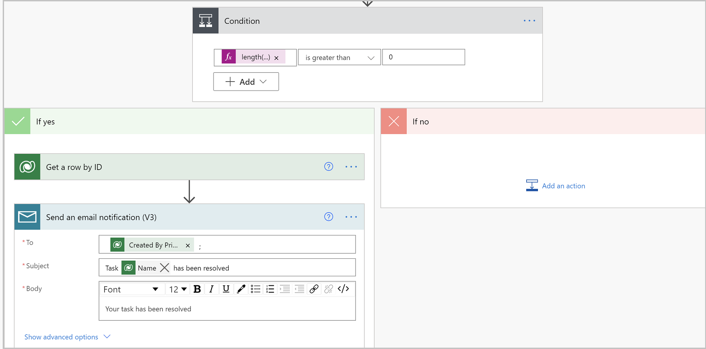

# Add the ability to be notified when an issue is resolved in the Issue reporting sample app.

NOTE: This lesson customizes the Issue Reporting Power App template for Microsoft Teams. Before customizing Issue Reporting, we recommend that you first review **Introduction to customizing Issue Reporting** (Insert Link).

In the Issue Reporting Power App for Microsoft Teams, tasks are created in Microsoft Planner. By default, there is no notification when the issue is closed, but you can easily add one with Power Automate.

> NOTE
>  in previous lessons we modified Issue Reporting—for this example we are using the standard Issue Reporting configuration, but you could also add this to the modified version if you have made modifications.

1.  Open the Power Apps app in Microsoft Teams. We recommend right clicking on the Power Apps app button in Microsoft Teams and popping out the app so you won’t lose your changes when you navigate somewhere else in Microsoft Teams.



2.  Select the **Build** tab.

3.  Select a team with Issue Reporting app installed.

4.  Select the **Installed apps** tab.

5.  Select **See all**.

    

6.  Select **Tables**.

7.  Select the three dots by **Issue Report** and select **Edit data**.

8.  On the right side of the data grid, select **+** to add a new column to the Issue Report table.
    
9.  In the **Add new column** dialog, enter **Notify** in the Name field and **Yes/No** in the Type column.
    
    
    
10.  Select **Create.**

11. Select **Close** in the lower right corner.

## Add notify field to the Issue report screen

Now that we have created the field, we will add the Notify column to the Issue Report screen:

1.  Open Issue Reporting in Power Apps app in Microsoft Teams.

2.  Select **Tree view**.

3.  Select **Issue Report Screen** in Tree view.

4.  Select **Submit issue** button.

5.  Drag button down to make room for the notify checkbox.

6.  Select **Insert +** on left.

7.  Expand **Input**.

8.  Select **Check box**.

9.  Change checkbox label to **Notify**.

10. Change the LabelFontSize value to gblAppStyles.Checkbox.Size.

11. Select the **Submit issue** button.

12. Select the **OnSelect** property.

13.  Update the highlighted section of the formula and add setting the **Notify** column value to the value of Checkbox1.


    
14. Save and publish the app.

## Test population of the notify checkbox

Now we want to verify the Notify field is populated correctly when creating an issue.

1.  In Microsoft Teams, open the team channel in which the Issue Reporting app is installed.
    
2.  Select the **Issue Reporting** tab.

3.  Select **Report an issue** button.

4.  Verify that you see the **Notify** checkbox.

5.  Create a task, checking the **Notify** checkbox.

6.  Select **Submit issue**.

### Verify that Dataverse Issue Report record notification is set to yes

Next, check the recently created record in Dataverse and verify that the **Notify** yes/no field is set to **yes**.

1.  Open the Power Apps app in Microsoft Teams.

2.  Select the **Build** tab.

3.  Select the team with Issue Reporting app installed.

4.  Select the **Installed apps** tab.

5.  Select **See all**


6.  Select **Tables.**

7.  Select the three dots by **Issue Report** and select **Edit data**.

8.  Verify that the row for the newly created Issue report **Notify** column is set to **yes.**


## Add Power Automate flow to notify creating user when task is resolved

Now that the Notify column is being set correctly in Dataverse, we will create a flow to send a notification email to the user who created the issue when the issue is resolved.

1.  Log on to [Power Automate.](https://powerautomate.microsoft.com)

2.  Select the environment for your Team from the environment drop down in the upper right corner.
    
3.  Select **My flows**.

4.  Select **New flow** and select **Automated cloud flow.**


5.  Enter **Planner Notification** for Flow name and **When a task is completed** for trigger.



6.  In the next screen, select your Group and Plan id. Group should be the name of your team. If you don’t see your group in the drop-down, you can get the Group ID from the URL of your Planner environment.


7.  Select **New step**.

8.  Search for Dataverse and select **List rows.**

9.  Select **Issue Reports** for the table name.

10.  We want to filter the results to those where the task ID equals the ID of the task closed and where notify equals **Yes**. For this you will need the schema name of the notify field you created. You can find this by going back to the table list and viewing the fields in the table. In our example, the Notify field schema name is cr7c9_notify.

11. Enter the following in the **Filter rows** field:

```
msft_planner_taskid eq @{triggerOutputs()?['body/id']}and cr7c9_notify eq true*
```

Replace the cr7c9_notify with whatever the name of your notify field is.

12. Add Condition step.

13. On Dynamic content window select **Expression**.

14. Type **length()**.

15. Select inside of the parenthesis.

16. Select the **Dynamic content** tab.

17. Select the List rows **value** option.

18. The expression should look like this.



19. Select **OK**.

20. From the middle field in the Condition step, select **is greater than.**


This means that if there is at least one matching Issue Report record, then do what is in the **Yes** column.

21. In the **Yes** box, select **Add an action**.

22. Select Dataverse **Get a row by ID** action.

23. Select **Issue Reports** for table name.

24. Select **Row ID** field and select the **fx** expression editor button.

25. Enter the following expression:

```
first(body('List_rows')?['value'])?['msft_issuereportid
```

26. Select **Show advanced options**.

27. In **Expand Query** enter **createdby**.

28. Under the **Get a row by ID** step, select **Add an action**.

29. Select the Outlook **Send mail (v2)** action.

30. Set the To field to **Created by Primary Email.**

31. Set the Subject field to **Task [dynamic content reference to Issue Report Name field] has been resolved**.

32. Enter **Your task has been resolved.** in the Body field.

33. Save your flow.



## Test your flow

Now that your flow is published, test the process.

1.  Open Issue Reporting app.

2.  Create an issue.

3.  Check the **Notify** checkbox.

4.  Submit the issue.

5.  In Planner, complete the task.

6.  Verify that the flow runs successfully and the email is received.