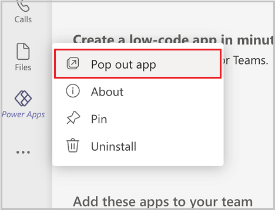
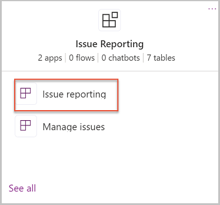
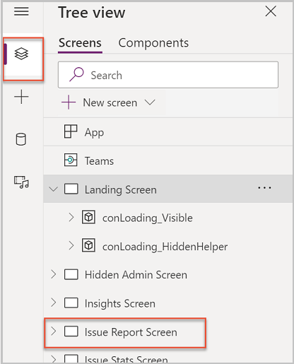
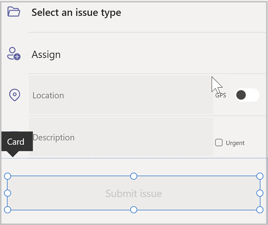
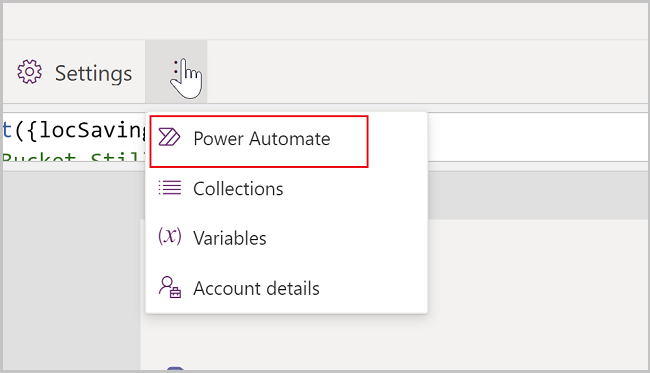
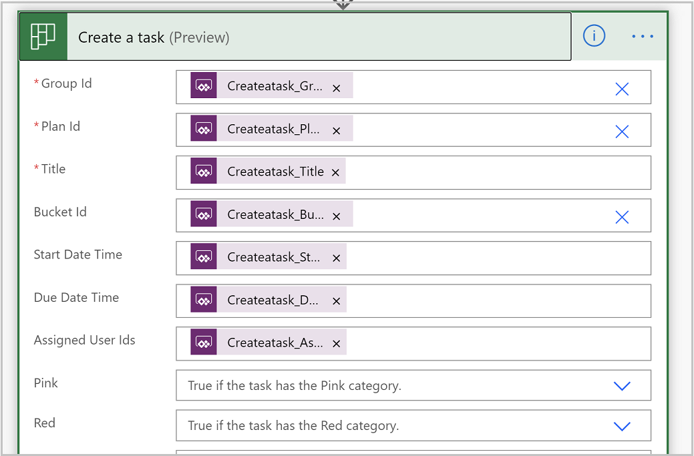
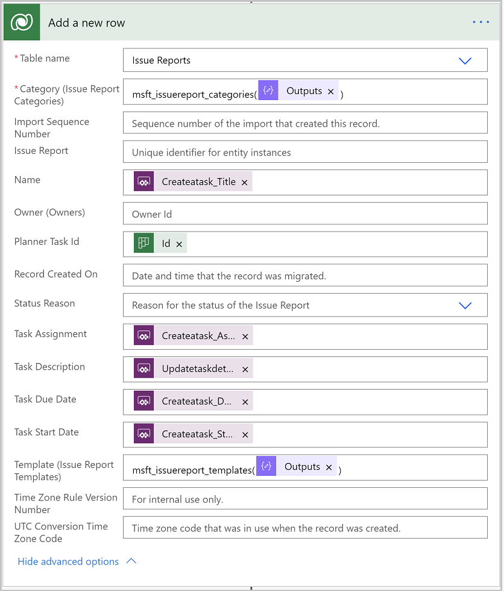
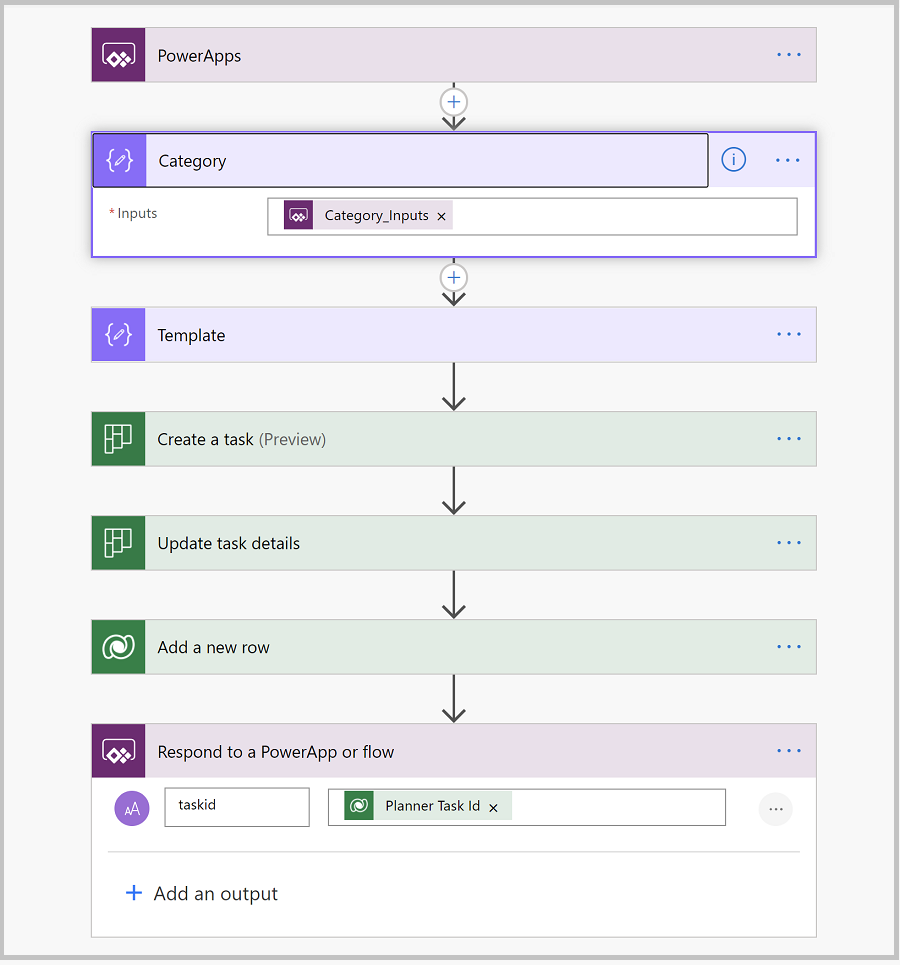
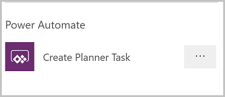
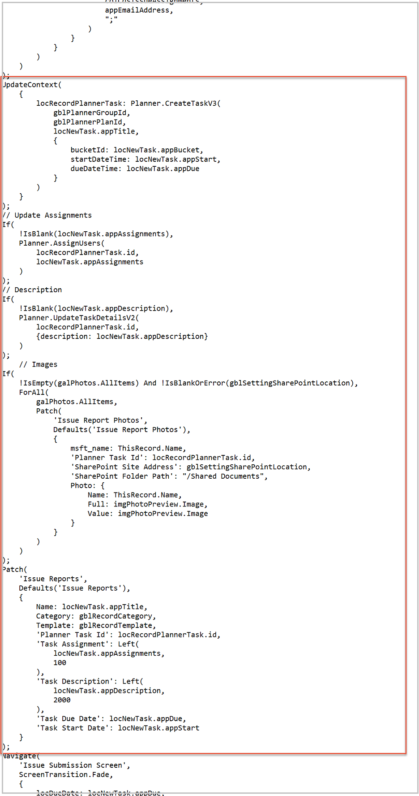

# Add urgency flag to reported issues

As a user of the Issue reporting sample app for Microsoft Teams, you may want to modify the logic of how reported issues are create in Planner. We've included many of the standard fields in Planner in the standard app, but based on your specific requirements, you may want to make further changes.

Watch this video to learn how to add urgency flag to reported issues:
> [!VIDEO https://www.microsoft.com/videoplayer/embed/RWLkWO]

## Create tasks in app vs using Power Automate

When you create or update a record in another service, like Planner/Tasks, you have a choice of how to create or update the record:

- Create the record from the app.

    The primary benefit of creating the record from the app records is that it's created synchronously, which can result in the records being created more quickly. Also for simple operations, creating the record from the app can be simpler because the operation is all contained within the app. The drawback of creating the records from the app is that if the operation is long running or creates or modifies many records, asynchronous processes like Power Automate flow can result in faster app performance.

- Create the record with a Power Automate flow called from the Power App.

    The benefits of using Power Automate to create records from your app include reduced delays for longer running operations. Also, by separating the record creation and update logic to Power Automate flow for frequently changing logic, an admin can change the logic of the record creation without having to modify and republish the app. For complex record updates, moving your record creation to flow may be easier for some makers to manage and extend compared to complex patch formulas. Another benefit of using Power Automate to create records is there's a log of each flow run, giving a detailed history of when records were created or update.

    The drawbacks of using flow to create records from an app are that you must remember to share access to the flow with the app users, and since flows are executed asynchronously, they may take slightly longer to complete.

- Create the record with a Power Automate flow triggered by data updates (like a record creation).

When creating records, like tasks, you can have your app directly trigger the flow. In that case, the flow is run in the context of the user running the app, and the flow must be shared with them. In some cases it can be better to have the flow triggered by a data update, such as when a record is updated in Dataverse&mdash;this can be a good idea if your flow is in one of the following categories.

- Flow needs to update something for which the user doesn't have access to update.

- Process is needed for multiple apps&mdash;for example, say you have a flow to notify someone and that notification can be triggered by multiple apps or other processes.

- Having flows triggered from data updates can simplify deployment as you don’t need to share the flow with the app.

The primary shortcoming of a data triggered flow vs a flow called from the app is the records created or modified by the flow will show created by and modified by the user who owns the flow.

In this lesson, we'll update the Issue reporting app to use a Power Automate flow to create tasks in Microsoft Planner and populate the priority field for urgent tasks.

## Enable users to set urgency of issue being reported

In this lesson, we want to extend the functionality of the Issue reporting app by adding the ability for users to flag an issue as urgent. The reason you might want to do this is so that urgent issues can be prioritized or notify a supervisor.

The outcome of this exercise will include:

- Urgency flag added to the Issue reporting form.

 Urgent task created in Microsoft Planner with priority set to urgent.

## Add urgency flag in Issue reporting app

In this step, we'll update the Issue reporting app to add a checkbox to flag urgent tasks. This process assumes that you've installed the Issue reporting template app in Teams and configured it to use Microsoft Planner/Tasks.

> [!TIP]
> For architecture details of the app and the data model, see [Issue reporting architecture](issue-reporting-architecture.md).

1. Open the Power Apps app in Teams.

1. Select **...** (ellipsis) from the left-pane.

1. Search for, and select Power Apps.

    

1. Right-click on Power Apps to pop out the Power Apps app so that if you need to go somewhere else in Teams, you won’t lose your work.

    

1. Select the team in which the Issue reporting app is installed, and select the **Installed apps** tab.

    

1. On the Issue reporting tile, select **Issue reporting**.

   

    Issue reporting app will open in Power Apps in Teams.

   On left side of screen, select the **Tree View**, then select the Issue Report screen

   

1. On the canvas, double-click on the **Description** field. Description is in a data card, so if you just select it, the whole data card will be selected.

1. Select the **Width** property and enter the following formula in the formula bar:

   ```powerapps-dot
   If(
   true,//locLocationEnabled,
   tglLocation.X - Self.X,
   Parent.Width - Self.X - gblPadding.Page
   )
   ```

   This formula will maintain responsiveness on this field.

1. Add a checkbox control by the Description card.

1. Change Checkbox label to **Urgent**.

1. Change formula for **X** property of checkbox to:

   ```powerapps-dot
   Parent.Width - Self.Width - gblPadding.Page
   ```

   This formula will make the checkbox position relative to the width of the app.

1. Change the LabelSize property of the checkbox to:

   ```powerapps-dot
   gblAppStyles.Label.Size.Small
   ```

## Create Power Automate flow to create Planner task and set urgency

In this section we'll be creating a flow and replacing the app logic that creates Planner tasks and Dataverse records. We recommend saving the app at this point.

1. Double-click on the **Submit issue** button. Make sure the button is selected, not the data card.

    

1. In the formula bar, select the OnSelect formula. Copy the formula and paste in a notepad. This will help you retrieve it when you need it.

    > [!NOTE]
    > The reason we're copying the formula is because when we add a flow to the button, the formula will be cleared. We want to be sure that we copy the formula so we can restore it after we have linked the flow to the app.

1. In the top menu, select the three horizontal dots and select **Power Automate**.

   

1. Select **Create Flow**.

1. Power Automate window will open in browser.

1. Select **PowerApps** from the triggers list.

   

1. In upper left corner, select **Untitled** and rename flow **Create Planner Task**.

   

    > [!NOTE]
    > In the following steps, we'll set values to **Ask in PowerApps**. When you set a value in a Power Automate flow that is triggered from Power Apps to **Ask in PowerApps**, a parameter is created in your flow and Power Apps will pass a value to this parameter when the flow is called from an app.

    

1. Select **New Step**.

    Next, we'll add two Compose steps. A compose step is a type of variable that can be used to capture any type of value and then use that value later in your flow.

1. Enter **Compose** into the finder and select the **Compose** action.

1. Rename the compose step **Category**.

    > [!NOTE]
    > Always rename your compose steps before setting their value to **Ask in Power Apps** so that the parameter created will include the appropriate name, rather than a generic name.

1. Select the dynamic content panel and select the **Ask in PowerApps** action.

1. Add another compose step.

1. Rename the new compose step **Template**.

1. Set input for the template step to **Ask in PowerApps**.

1. Add a Planner **Create a task (preview)** action.

1. Set the following fields to **Ask in Power Apps**.

    - Group ID
    - Plan ID
    - Title
    - Bucket ID
    - Start Date Time
    - Due Date Time
    - Assigned User Ids
    - Priority

    

1. Select the **Priority** field and clear it. The reason we set this field to **Ask in PowerApps** and then clear it's so that the parameter is created, and then we'll reference it in an expression.

1. In the Dynamic content panel for the Priority field, select **Expression**, and enter the following expression:

    ```powerapps-dot
    if(equals(triggerBody()['Createatask_Priority'],1),1,5)
    ```

    This formula means that if urgent value from the Power Apps task is 1 (urgent), set the priority to 1 (urgent), otherwise set it to 5 (not urgent).

1. Add a Planner **Update task details** step.

   

    - Set the value of Task ID to the ID value from the Create task step using the dynamic content panel.

    - Set the **Description** field to **Ask in Power Apps**.

1. Add a Dataverse **Add a new row** action.

1. Select **Issue Reports**  for the table.

    > [!NOTE]
    > The Issue Reports table includes two lookup fields. When populating lookup fields, you must enter the value as **table name(record ID)**. The two compose steps added earlier will contain the record ID’s for the category and the template. To enter these values, type the entity name with parenthesis, then inside the parenthesis, select the appropriate value from the dynamic content pane.

1. Enter the following values in this step:

    | Column           | Value                                                        |
    | ---------------- | ------------------------------------------------------------ |
    | Category         | msft_issuereport_categories() then between the parenthesis, select the category compose step output value. |
    | Name             | Ask in Power Apps                                            |
    | Planner task ID  | ID value from create task step                               |
    | Task assignment  | Ask in Power Apps                                            |
    | Task description | Ask in Power Apps                                            |
    | Task due date    | Ask in Power Apps                                            |
    | Task start date  | Ask in Power Apps                                            |
    | Template         | msft_issuereport_templates() then between the parenthesis,<br/>select the template compose step output value |

   The result should look like this:

   

1. Add a final step to respond to a Power Apps or flow.

   In this step, add a text output called **tasked** set to the value of the Planner task ID from the create task step.

   

   Your flow should now look like this:

   

1. Save the flow and return to the Power Apps.

1. In the panel where you selected **Create a new flow**, you should now see your flow listed. If you don’t see it, close the data panel, select the **Submit issue** button, and select the **Power Automate** button again.

1. Select your **Create Planner Task** flow from the data panel.

    

    > [!NOTE]
    > Selecting a flow will associate this flow with the Power Apps and also clear your OnSelect property&mdash;this is why we copied the formula contents earlier in this lesson.

1. In your backup copy of the original OnSelect formula, we now want to remove the section that creates the planner task since it now is handled by flow. First, remove this section:

    

1. Copy the modified formula from your backup copy, and replace the contents of the OnSelect property of the **Submit issue** button with the modified formula.

1. Near the bottom of the formula locate the **Navigate** expression. Paste the following directly before the Navigate expression:

    ```
    Set(gblPlannerTask,CreatePlannerTask.Run(gblPlannerGroupId,gblPlannerPlanId,locNewTask.appTitle,locPlannerBucketForTask,locNewTask.appStart,locNewTask.appDue,locNewTask.appAssignments,Checkbox1.Checked,locNewTask.appDescription,gblRecordCategory.'Issue Report Category',gblRecordTemplate.'Issue Report Template'));
    ```

    > [!NOTE]
    > The CreatePlannerTask.Run() formula triggers the Create Planner Task flow, and the values in the parenthesis are the values passed to the parameters in the flow created when we added the **Ask in PowerApps** value.
    >
    > The order in which these are specified are based on the order in which you added them to the flow—if you added them in the order specified, this formula will work. If you did not add them in the same order, intellisense will guide you in the proper field order. The variables we are specifying in the formula like locNewTask.appTitle are context variables set earlier in the OnSelect formula.
    >
    > This formula is then wrapped in a **set()** formula—this sets the outcome of this flow to a global variable so we can reference the created task id.

1. In the **Navigate()** part of the formula, change the value for **locTaskId** to gblPlannerTask.taskid.

1. Save and publish your app.

## Test your app

You've now created a flow to create Planner tasks and replaced the in-app task creation with the flow. In the process, we added additional functionality by conditionally setting the **Priority** field. But you don’t have to stop there, you can enhance the flow to set additional planner task properties or do other actions, such as having the flow create the task in some other task management system like **Microsoft To-Do**.

1. To test the app, in Teams, go to the team in which your Issue reporting app is published and report an issue.

2. In Power Automate, view the execution log for your flow. Verify the flow executed successfully.

    

3. If the flow failed, select the start date for the execution and view the error details, then check the Planner tab used by your app and verify that you see the task created by the flow and that all values are correctly populated.

### See also

- [Understand Issue reporting sample app architecture](issue-reporting-architecture.md)
- [Customize sample apps](customize-sample-apps.md)
- [Sample apps FAQs](sample-apps-faqs.md)
- [Use sample apps from the Teams store](use-sample-apps-from-teams-store.md)


[!INCLUDE[footer-include](../includes/footer-banner.md)]