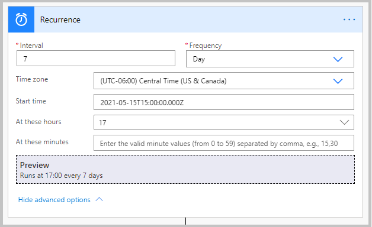

# Send weekly report on project status from the Milestones sample app

The Milestones sample app allows users to create milestones for a team and track their progress using work items and work item status. The app can be extended further to send weekly emails to project managers or person creating the project with a list of all the work items and their status.

In this article, we'll learn how to create a Power Automate flow to send a project weekly report to the person who created the project with the work items listed along with their status.

Watch this video to learn how to send weekly report on project status from Milestones app:
> [!VIDEO https://www.microsoft.com/videoplayer/embed/RWLiBU]

## Prerequisites

To complete this exercise, we'd need the ability to log in into Teams that will be available as part of select Microsoft 365 subscriptions, and will also need to have the Milestones sample app for Teams installed. This app can be installed from <https://aka.ms/TeamsInspection>.

## Create the Power Automate flow

1. Sign in to [Power Automate](https://flow.microsoft.com).

1. Select the environment that has the same name as the Team in which the app is installed.

1. Select **+Create** to create a new flow.

1. Select **Start from blank – Automated cloud flow**.

1. Select **Skip** to go to the next screen.

1. Update the flow title, and select **Recurrence** as the flow trigger.

    

1. Update the **Recurring** trigger values as shown below.

    

1. Add the following steps to the flow.

1. List rows steps – renamed to List Projects.

    - Table Name – "Projects"

    - Expand Query – "createdby"

    

1. List rows – renamed to List Work Items.

    - Table Name – "Project Work Items"

    - Filter Rows – "\_msft_project_id_value eq @{items('Apply_to_each_2')?['msft_projectid']}"

    - Expand Query – "msft_WorkItemStatus_id(\$select=msft_name)"

> [!NOTE]
> As soon as we select the Project ID in the Filter Rows field, the flow would put the List Work Items step into an Apply to Each container in which we would add more steps that would be needed.

1. Create HTML table – renamed to Create HTML table – Work Items.

    - From – the value from the previous step –  "@{outputs('List_Work_Items')?['body/value']}"

    - Columns – "Custom"

    - Add the columns to the table:

        | Header | Value |
        | - | - |
        | WorkItemName | Name from the List Work Items step |
        | WorkItemStatus | Work Item Status from the List Work Items step |

    

1. Send an email (v2).

    - To: "Created by Primary Email from the List Projects step."

    - Subject: "Project Work Item Status for [Name](Name from the List Projects step)."

    - Body: Output from the Create HTML table step.

    

1. Save the flow.

1. Select the Test button on the top right and select manually.

## Data set up before testing the Power Automate Flow

1. Before testing the flow, we need to make sure we have some data with projects and work items within each project in the Milestones app.

1. Open Teams and run the Milestones app.

1. Create a new project.

1. Create Work Items under that project.

## Test the Power Automate Flow

1. Go back to https://powerautomate.microsoft.com and open the flow.

1. Select Test on the top right.

    

1. Run the flow.

1. Check inbox for emails with weekly status – We should see one or more emails in the inbox for each Project.

    

### See also

- [Deploy Milestones sample app broad distribution app](milestones-broad-distribution.md)
- [Customize Milestones sample app](customize-milestones.md)
- [Understand Milestones sample app architecture](milestones-architecture.md)
- [Customize sample apps](customize-sample-apps.md)
- [Sample apps FAQs](sample-apps-faqs.md)
- [Use sample apps from the Microsoft Teams store](use-sample-apps-from-teams-store.md)

[!INCLUDE[footer-include](../includes/footer-banner.md)]