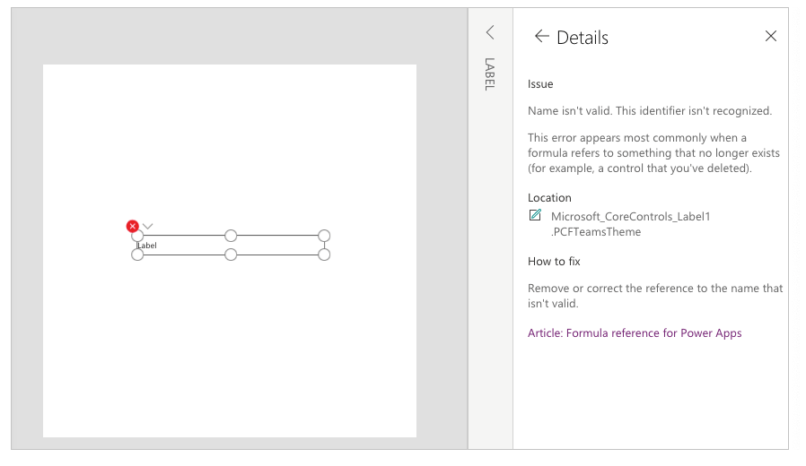

# Known issues and limitations

This article provides details about the known issues and limitations when using [**Dataverse for Teams environments**](/power-platform/admin/about-teams-environment).

## Additional components

The following components aren't supported:

- Model-driven apps
- AI Builder

> [!NOTE]
> Custom connectors are supported only if both of these conditions are met:
> - The app or flow is running in the context of Microsoft Teams.
> - And, the custom connector points at an APIM endpoint in Azure. 

## Component library

[Component library](../maker/canvas-apps/component-library.md) isn't supported.

## Controls

To learn about the limitations of controls in Dataverse for Teams environments, go to [Limitations of controls in Power Apps](../maker/canvas-apps/control-limitations.md).

## Government Community Cloud (GCC)

Dataverse for Teams currently isn't available in:

- Power Apps Government Community Cloud – High (GCC High)
- Power Apps Department of Defense (DoD)
- Power Apps operated by 21Vianet in China

## Hidden membership groups

Dataverse for Teams doesn't support [hidden membership groups](/graph/api/resources/group?preserve-view=true&view=graph-rest-1.0#group-visibility-options). You'll receive the following error when you try to create an app in a team that has the group visibility set to *Hiddenmembership*.

`Existing limits on this team`  
`You're unable to continue due to an administrative setting on this team. You can try again with another team.`

The group may have hidden membership enabled by your administrator. Try using Dataverse for Teams on a new Teams team, an existing team that doesn't have hidden membership enabled, or contact your administrator.

## Localization

Localization of [Power Apps Studio](understand-power-apps-studio.md) isn't supported.

## Power Apps component framework

[Power Apps component framework](/powerapps/developer/component-framework/overview) isn't supported.

## Required fields

There's no enforcement of user-created required table fields. Rows that have empty values in those fields can be saved successfully. System required fields are enforced and cannot be saved without a value.

## Studio

### Classic controls

Enabling [classic controls](understand-power-apps-studio.md#classic-controls) requires a refresh of Power Apps Studio.  

### Fluent UI date picker control

The Fluent UI date picker control doesn't yet support format string.  If you need to support special formatting, you'll need to enable classic controls and use the classic Date Picker.

### Canvas components

You may see red errors while using the modern controls in canvas components. These errors won't functionally impact your app, and you can ignore them.

### New connections

Connections in the Power Apps Studio that require an authentication dialog fails in the [Teams desktop client](/microsoftteams/get-clients#desktop-client). Open the Studio in the [Teams web client](/microsoftteams/get-clients#web-client) to add these connectors.

### Studio and visual editor synchronization

Power Apps Studio doesn't reflect the changes to tables after:

1. Renaming tables.
1. Adding relationships within the inline [visual editor](understand-power-apps-studio.md#visual-editor).

To see the new changes, refresh Power Apps Studio.

### Studio version

It's currently not possible to change your Studio version.

### Visual editor

Currency, Duration, Language, Ticker, and Timezone fields can't be added using visual editor. To create these fields, use the experience to work with tables as available using [solution explorer](create-table.md).

## Load time limit

Apps embedded in Teams are required to load within 30 seconds as per Teams requirements. If an app exceeds this 30 seconds limit, Teams assumes that the app has timed-out, and will display an error screen. If your app is encountering this 30 second timeout, review [tips to improve performance](../maker/canvas-apps/performance-tips.md) for boosting your app’s performance.

## Theme

Power Apps Studio and apps currently don't support **Dark theme**.

## Others

-	If a user is an owner of the Azure Active Directory (Azure AD) group associated with a team but isn't also a member of that group, they may not be able to see that team in the Power Apps and Power Virtual Agents apps.

-	It may take up to 2 hours for deleting, renaming, or restoring a team to reflect correctly within the Power Apps and Power Virtual Agents apps.

-	It may take up to 15 minutes for new team users to be able to see the team within the Power Apps and Power Virtual Agents apps.

[!INCLUDE[footer-include](../includes/footer-banner.md)]
