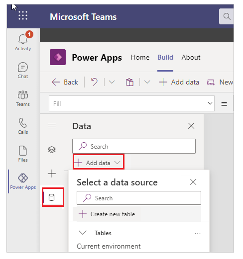
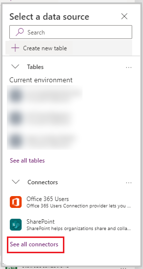
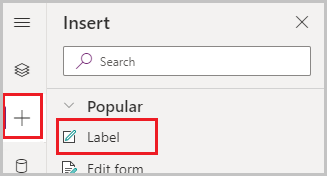
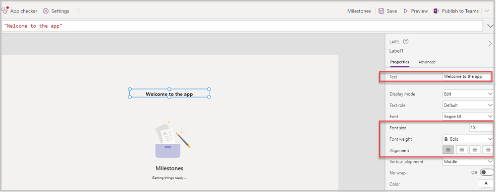

# Localization of Power Apps template app for Microsoft Teams

The Power App template apps for Microsoft Teams have been localized to support eight different languages so that they can be used by people with different languages. Depending on the user’s language, you can see the text in an app in the appropriate language, if that language has been included in the app localization.

Say, for example, that you use the Russian language. Russian is not a language included in the standard localization; however, you can still use the app in Russian, if you add that language and localize the app labels.

This topic covers the approach used for localization of the Power Apps templates for Microsoft Teams, and how to extend it to add support for another language (such as Russian). In this example we will use the Milestones app (aka.ms/TeamsMilestones), but this same approach is used consistently across all of the Teams template Power Apps, and you can follow the same approach for localization of your own canvas apps.

## Prerequisites

To complete this lesson, we would need the ability to create Power Apps within Microsoft Teams which is available as part of select Microsoft 365 subscriptions.

## Understanding localization in Power Apps

In canvas Power Apps, text labels and other visual text components can be localized by loading a static Excel data source to your app containing the localized value for each text string in each language. For more information about this process, see [Language function - Power Apps \| MicrosoftDocs](https://docs.microsoft.com/powerapps/maker/canvas-apps/functions/function-language).

For example, Milestones app contains an Excel data source called StaticLocalizationsjon with 3 columns: OOBTextID, LanguageTag, and LocalizedText. 

-   **OOBTextID** is the identifier of the text that is to be localized.

-   **LanguageTag** is the identifier of the language in which the text is to be localized – Language tag is a standard abbreviated text defining a language and the country its being used in (E.g., en-US = English-United States etc).

-   **LocalizedText** is the text in the appropriate language that needs to be displayed

| **OOBTextID**                         | **LanguageTag** | **LocalizedText**                     |
|---------------------------------------|-----------------|---------------------------------------|
| lblLoadingText\_AppLoading\_\_locText | en-US           | Getting things ready ...              |
| lblLoadingText\_AppLoading\_\_locText | de-DE           | Dinge fertig machen ...               |
| lblLoadingText\_AppLoading\_\_locText | es-ES           | Preparando las cosas ...              |
| lblLoadingText\_AppLoading\_\_locText | fr-FR           | Préparer les choses ...               |
| lblLoadingText\_AppLoading\_\_locText | it-IT           | Preparare le cose ...                 |
| lblLoadingText\_AppLoading\_\_locText | ja-JP           | 準備をする..。                        |
| lblLoadingText\_AppLoading\_\_locText | nl-NL           | Dingen klaarmaken ...                 |
| lblLoadingText\_AppLoading\_\_locText | pt-BR           | Preparando as coisas ...              |
| lblLoadingText\_AppName\_\_locText    | en-US           | Milestones                            |
| lblLoadingText\_AppName\_\_locText    | de-DE           | Meilensteine                          |
| lblLoadingText\_AppName\_\_locText    | es-ES           | Hitos                                 |
| lblLoadingText\_AppName\_\_locText    | fr-FR           | Jalons                                |
| lblLoadingText\_AppName\_\_locText    | it-IT           | Passaggi fondamentali                 |
| lblLoadingText\_AppName\_\_locText    | ja-JP           | マイルストーン                        |
| lblLoadingText\_AppName\_\_locText    | nl-NL           | Mijlpalen                             |
| lblLoadingText\_AppName\_\_locText    | pt-BR           | Etapas                                |
| lblLoadingText\_BuiltWith\_\_locText  | en-US           | Built with Microsoft Power Platform   |
| lblLoadingText\_BuiltWith\_\_locText  | de-DE           | Erstellt mit Microsoft Power Platform |
| lblLoadingText\_BuiltWith\_\_locText  | es-ES           | Creada con Microsoft Power Platform   |
| lblLoadingText\_BuiltWith\_\_locText  | fr-FR           | Créé avec Microsoft Power Platform    |
| lblLoadingText\_BuiltWith\_\_locText  | it-IT           | Creata con Microsoft Power Platform   |
| lblLoadingText\_BuiltWith\_\_locText  | ja-JP           | Microsoft Power Platform でビルド     |
| lblLoadingText\_BuiltWith\_\_locText  | nl-NL           | Gebouwd met Microsoft Power Platform  |
| lblLoadingText\_BuiltWith\_\_locText  | pt-BR           | Criado com o Microsoft Power Platform |

*NOTE\*\*: The table above is the master file that contains localized text for ALL the screens in the app. But it has been filtered to show only the rows we talked about above*

## Tip: How to use Excel as a static data source in Power Apps

Static data is data loaded into a Power App from Excel. This data is not editable in the app. If you want to add a static data source to your Power app, perform the following steps

1.  In Microsoft Teams, right mouse click on the Power Apps icon and pop out the app.

2.  Select the **Build** tab.

3.  Open the desired app—in our example, we will use Milestones.

4.  Open the app editor and select the Data tab.

5.  Then select the **Add data** dropdown arrow.


6.  Then select **Connectors**.

7.  Select **See all connectors**.




8.  Select Import from Excel option – the browse file dialog box opens.

9.  Select the **LocalizationMilestones_AllLanguages** file and select **Open**.

10.  Then on the right of the screen it asks you to choose a table – select the table staticLocalizations and sellect **Connect**.

11.  The table gets added as a data source and can be used in the app:


 

## Adding a new language to a Power Apps template app

Now that you understand how localization is handled in Power Apps, if you want to add an additional language to the app, you don’t have to update every text control in the app—the text formulas are built to dynamically display the appropriate localized copy of text strings based on the user’s language.

To add Russian, you would first add Russian translation to the spreadsheet for each OOBTextID.

In our example, we will show how we can add localized text for the text on the first page of the app.

1.  Open the **LocalizationMilestoes_AllLanguages.xlsx**.

2.  Add the following rows to the Excel:

| OOBTextID                             | LanguageTag | LocalizedText                                 |
|---------------------------------------|-------------|-----------------------------------------------|
| lblLoadingText\_AppName\_\_locText    | ru-RU       | Вехи                                          |
| lblLoadingText\_BuiltWith\_\_locText  | ru-RU       | Создано на платформе Microsoft Power Platform |
| lblLoadingText\_AppLoading\_\_locText | ru-RU       | Готовимся ...                                 |

1.  To add Russian text for all pages, we would have to add rows for all the OOBTextIDs as they exist for any other language, then add **ru-RU** as the Language tag and then add the Russian translation for each of those OOBTextIDs.
    
2.  Save the Excel.

> NOTE 
> Since the Excel already exists as a data source in the data sources list for the app, we will have to remove the excel from the list of data sources and then re-add it as shown above

3.  Update the app OnStart gblUserLanguage to include the language that you
    added to the Excel file. In the example below we have added Russian:

    ```
    
    //user language
    
    Set(
    
    gblUserLanguage,
    
    Switch(
    
    Left(
    
    Language(),
    
    2
    
    ),
    
    "de",
    
    "de-DE",
    
    "en",
    
    "en-US",
    
    "es",
    
    "es-ES",
    
    "fr",
    
    "fr-FR",
    
    "it",
    
    "it-IT",
    
    "ja",
    
    "ja-JP",
    
    "nl",
    
    "nl-NL",
    
    "pt",
    
    "pt-BR",
    
    “ru-RU”,
    
    //default
    
    "en-US"
    
    )
    
    );
    
    //build localization collection, with user's language
    
    ClearCollect(
    
    colLocalization,
    
    Filter(
    
    staticLocalizations,
    
    LanguageTag = gblUserLanguage
    
    )
    
    );
    
    Collect(
    
    colLocalization,
    
    Filter(
    
    staticLocalizationsNewMessages,
    
    LanguageTag = gblUserLanguage
    
    )
    
    );
    
    ```
    
    
    
4. Save and publish the app.

Since the formulas dynamically retrieve the localized content, there is no need to update the formulas to reflect the newly added language.

## Adding and localizing a new label

As an extension to the OOB Milestones app, we will add a new label and learn how to localize it.

Let us add a label to the Loading screen:

2.  Select the + sign below the Tree view button and select label to insert a label.

.

3.  Update the Text and properties of the label



For now, we will set the text to “Welcome to the app” until it is ready for localization.

4.  Open the excel to add rows for this text:

5. Create 8 rows in the Excel with OOBTextID value lblLoadingText_Welcome_locText and LanguageTag for the 8 rows:

| en-US |
|-------|
| de-DE |
| es-ES |
| fr-FR |
| it-IT |
| ja-JP |
| nl-NL |
| pt-BR |

6. Now for the third column – LocalizedText, translate the text “Welcome to the app” in the 8 different languages *(***en-US** *= English,* **de-DE** *>   German,* **es-ES** *= Spanish,* **fr-FR** *= French,* **it-IT** *= Italian,* **ja-JP** *= Japanese,* **nl-NL** *= Dutch,* **pt-BR** *= Portuguese)*
1.  Update the spreadsheet with all the translated text as shown below:

    
    
2.  Save the spreadsheet.

3.  Go back to the app editor in Microsoft Teams.

4. We need to refresh the excel data source since we updated it so select the Data icon then select the three dots next to the staticLocalizations Excel spreadsheet and hit **Remove**.


5.  This will cause some errors in the app but only for a minute since we will re-add the updated excel in our next step

6.  Re-add the spreadsheet as a connector and select **staticLocalizations** table as the data source (make sure to select the correct excel file that was updated).

7.  Select the label with the text “Welcome to the app”

8. Open the Text property of the label and paste the following formula:

   ```
   With(
   
   {
   
   varDefault: "Welcome to the app";
   
   varOOBTextId: "lblLoadingText_Welcome_locText"
   
   };
   
   With(
   
   {
   
   varLocalizedText: LookUp(
   
   colLocalization;
   
   OOBTextID = varOOBTextId;
   
   LocalizedText
   
   )
   
   };
   
   Coalesce(
   
   varLocalizedText;
   
   varDefault
   
   )
   
   )
   
   )
   ```

9. To test the localization of the label we just created, lets change the language of our user in Microsoft Teams to one of the languages that is in our localization excel spreadsheet. You can change your Microsoft Teams language by selecting your photo in the upper right corner and selecting settings.

10. Select Milestones to open the app and the **Welcome to the app** label has been localized to the language that was selected in the previous step. You can verify the same by going to the specific Team channel where the app was installed and playing the published app.
