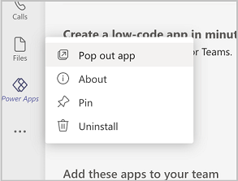
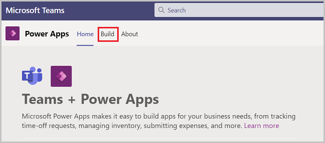
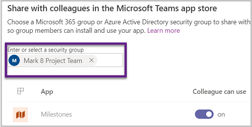
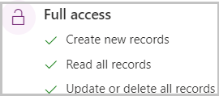
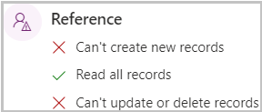
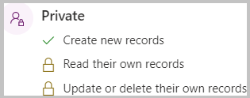
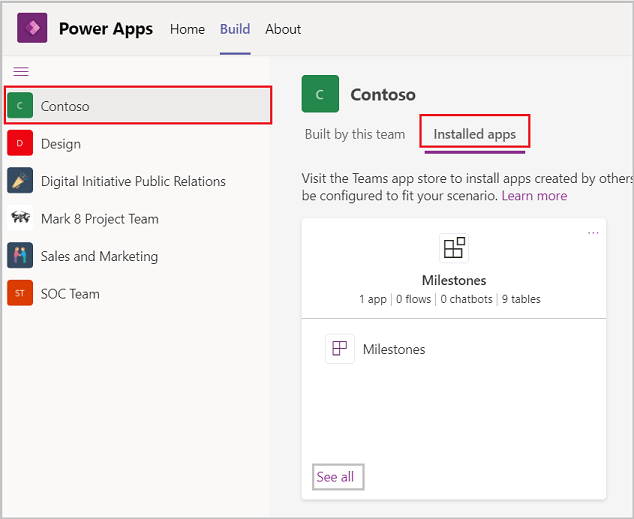
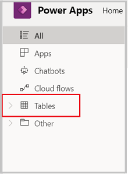
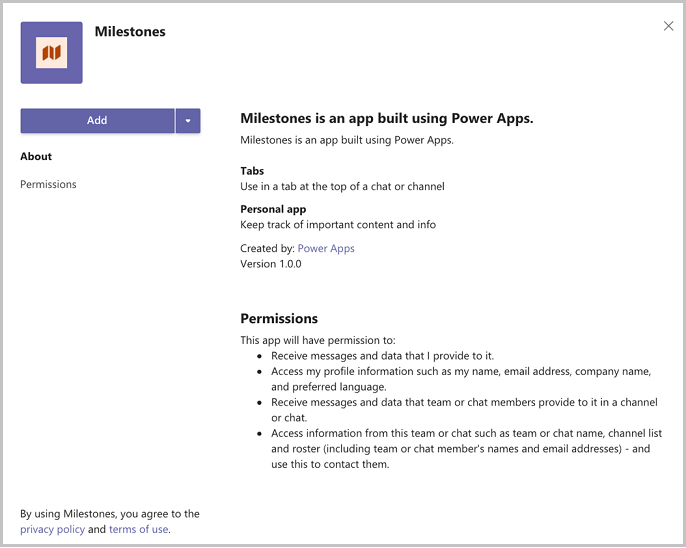

# How to deploy Milestone apps as broad distribution app

The Milestones app template is designed to make it easy to manage project work items based on Milestones and track them through completion

The app addresses the following personas:

-   Project creator: This user sets up the project and defines the milestones, project members, and work items

-   Project reviewer This user reviews project work item status and progress through project milestones

-   Project team member: This user completes and updates work items

In using the app, the creator and reviewer should be members of the team in which the app is installed. For project team members and people outside of the project team, we want to share the app with them without them having to be a member of the team where the app is installed. In this lesson we will walk through the process of sharing the milestones app for broad distribution.

## Prerequisites 

You must be an owner of the Team in which the app is installed to share the app.

## Limitations

As of the time when these instructions were written, you can only enter one Security Group (Team)

## Action required to share an app with colleagues for broad distribution:

1.  Share the app with Colleagues

2.  Grant security permissions to the tables used in the app.

## Sharing App with Colleagues

This process begins by opening the app in **Power Apps** in Microsoft Teams. You can also right click on the Power Apps logo and pin the app to the Teams app bar.

1.  In Microsoft Teams, select the **…** button from the left menu.

2.  Type **Power Apps** in the search field.

3.  Select the Power Apps app from the list to open the app. Power Apps will open inside of Microsoft Teams.

4.  It is recommended that you “pop out” Power Apps so that if you need to navigate somewhere else in Microsoft Teams you won’t lose your app configuration. To pop out the Power Apps app, right mouse click on the Power Apps logo and select **Pop out app**.

1.  Right click on the **Power Apps** logo and select **Pin** to lock the app to the side menu so it is easy to get to in the future.

1.  Now that you have loaded the Power Apps app, select **Build**.

6.This screen will show all the teams that have Power Apps installed in them. Select the team that contain the app you want to share. Select **Share with
colleagues**.

7.  Enter an AD security group or a different team with which you would like to share access to the app.
    
8.  Set the **on/off** toggle to **on** for Milestones.

## Understanding table permissions

Understanding and assigning permissions to tables are vital to ensure proper security of your shared data. Here are the four permissions available for use.

-   Full Access – Allows end users to see and edit all records in the table.

    

-   Collaborate – Allows end users to see all records, but they can only edit their own records.
    
    
    
-   Reference – Provides a read-only view of data for end users.

    

-   Private – Allows end users to only view and edit their own data.

    

## Granting Permissions to the tables

By default, all of the table permissions for colleagues not in the Team are set to **none.** If you leave it that way, colleagues that you share the app with
will not be able to use the app, as they won’t have permission to the tables in the app. Follow these steps to set permissions for the tables in the app for
colleagues outside of the team:

1.  In Microsoft Teams, open the **Power Apps** app.

2.  Select the **Build** tab.

3.  Select the team that contain the app you want to share.

4.  Select **Installed apps.** This will show all apps installed in the Team.

5.  Select **See All** in the **Milestones** tile.

6.  Select **Tables** from the solution components bar.

7.  Select the tables listed individually then **Manage Permissions.**

8.  Select the security group with which the app was shared. The initial
    permission will show none. Select the desired permission and select **Save.**

9.  Repeat step 8 for each additional table in the app.

    

The following is recommended table permissions:

| Table                      | Permission                                                                                                                                                                                                                      |
|----------------------------|---------------------------------------------------------------------------------------------------------------------------------------------------------------------------------------------------------------------------------|
| Color                      | We want users to be able to read color records so that the app can display the appropriate colors on work item categories and milestones, so they should have reference privilege on the Color table.                           |
| Project                    | We want colleagues outside of the team to be able to complete work items, but projects should be read only, so we should give them reference privilege on the Project table.                                                    |
| Project Milestone          | We want colleagues outside of the team to be able to view the project milestones for projects to which they have been assigned, but not modify them, so we should give them reference privilege on the Project Milestone table. |
| Project Team Member        | Colleagues outside of the team will be project team members, but they should not add or remove project team members from projects, so we should give them reference privilege on the Project Team Member table.                 |
| Project User Setting       | Colleagues outside of the team need to be able to set their preferences, so they will need to have collaborate privilege on Project User Setting table so that they can edit their Project User Setting record.                 |
| Project Work Item          | Colleagues outside of the team need to be able to update the work items to which they have been assigned, so we should give them collaborate privilege on the Project Work Item table.                                          |
| Project work Item Category | Colleagues outside of the team should not be able to modify work item categories, so we should give them reference privilege on the Project Work Item Category table.                                                           |
| Project Work Item Priority | Colleagues outside of the team should not be able to modify work item priority, so we should give them reference privileges on the Project Work Item Priority table.                                                            |
| Project Work Item Status   | Colleagues outside of the team should be able to associate statuses with work items, but not modify the status options. So we should give them reference privilege on Project Work Item Status table.                           |

# Accessing shared apps

So now that you have shared Milestones with colleagues outside of your team, here is how they will acquire the app.

1.  In Microsoft Teams, select the elipses (…) button on left.

2.  Select **More apps**.

3.  Select **Built for your org**.

4.  When the app information screen appears, select **Add** to add the app to the main teams app menu.
    
    
    
5. After adding the app to the Microsoft Teams app menu, select the icon for the app to open it full screen in Microsoft Teams.

6. If you want to make the app always appear in the app menu so you can easily find it, right click on the Milestones button on the app menu and select
   **Pin**.

   

7. If you would prefer to add the app to another team, select the drop-down located by the **Add** button and select **Add to a team**.

   