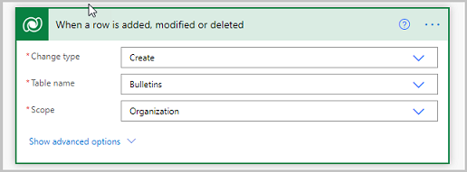
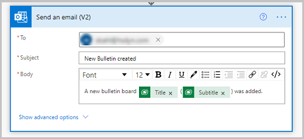
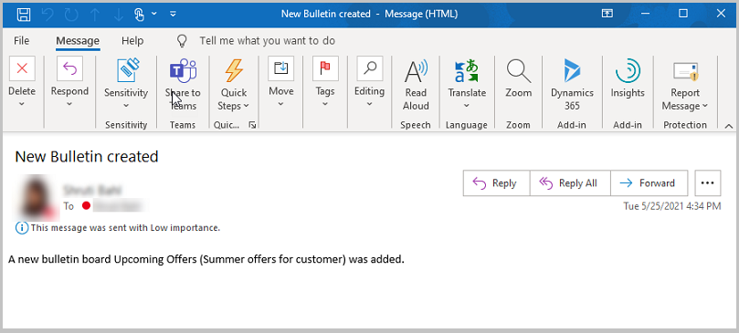

# Send an alert when a new bulletin is posted

The Bulletins sample app for Microsoft Teams provides a central location for all company communication such as broadcasts, memos, announcements, and company news. The app allows you to create, categorize, bookmark, search, and read bulletin posts.

Watch this video to learn how to send an alert when a new bulletin is posted:
> [!VIDEO https://www.microsoft.com/videoplayer/embed/RWLkvU]

The Bulletins app solution consists of two apps:

[Manage bulletins app](bulletins.md#manage-bulletins-app)

-   Manager experience for managing **Bulletins** app.

-   Allows managers to create, edit, and categorize posts read through the Bulletins app.

[Bulletins app](bulletins.md#bulletins-app)

-   Central location for all company communication such as memos, broadcasts, and news.
    
-   Shows bulletins, FAQs, links, and contacts created using the **Manage bulletins** app.

In this article, we'll learn how to send an email notification using Power Automate flow, when a new bulletin is created.

> [!NOTE]
> Before you proceed, review [customize Bulletins app](customize-bulletins.md).

## Prerequisites

To complete this lesson, we'd need the ability to log in into Teams that will be available as part of select Microsoft 365 subscriptions, and will also need to have the Bulletins Power Apps template for Teams installed. This app can be installed from <https://aka.ms/TeamsBulletins>.

## Create Power Automate flow to send email notification

We'll create a flow to send the email notification. Power Automate makes sending emails easy, and since a flow can be triggered automatically when records are created, the email will be sent whenever a bulletin is added.

1. Sign in to https://flow.microsoft.com.

1. On the top-right, select the environment with the same name as the team where the Bulletins app is installed.
    
1. Select **+ Create** from the left-pane.

1. Select **Automated cloud flow** under the **Start from blank** option.

1. Enter a flow name; such as "Send email notification when a new bulletin is added".

1. For the trigger, find and select **When a new row is added, modified, or deleted (Microsoft Dataverse)**.

1. Select **Create**.

1. In the trigger box, select **Change type** as **Create**.

1. Select **Table name** as **Bulletins**.

1. Select **Scope** as **Organization**.

    

1. Select **+ New** step.

1. Search for and select the action as **Send an email (V2) (Office 365 Outlook)**.

1. In the **To field**, enter the email address you would like to send notifications to. For example, if you want all people in a team to be notified, you could create an email with the address for the team channel. To find this email address, select the three dots by the team channel and select **Get email address.** 

    

1. In the **Subject** field, enter **New Bulletin created**.

1. In the **Body**, we can display any details we would like to. For example:

    ```
    A new Bulletin board {select Title from dynamic content} ({select Subtitle from dynamic content}) was added.
    ```

    

    > [!NOTE]
    > You can also add a hyperlink to the Bulletin app by selecting the team in which Bulletins is installed, open the app tab, then select the pop  out button to open the app in a new window. The URL of the app is in URL field for this window, and you can use this as a hyperlink in your email.

## Test the app

1. Log in Teams and go to Team where the Bulletins app is installed.
    
1. Select the **Manage Bulletins** tab on the top.

1. Go to the **Bulletins** tab.

1. Select **New Bulletin** on the top-right corner to open new bulletin screen.

1. Select the Category for which you want the bulletin created.

1. Enter a title in the Add title text box, such as "Upcoming Offers".

1. Enter a subtitle in the Add subtitle text box, such as "Summer offers for customers"".

1. Enter a description in the large text box, such as "This Bulletin will list all the upcoming summer offers for customers".
    
1. Select **Save**, and then select **Publish**.

In a few minutes, an email as shown in the image below should appear in the inbox of the email address provided in the Power Automate flow.



### See also

- [Understand Bulletins sample app architecture](bulletins-architecture.md)
- [Customize Bulletins app](customize-bulletins.md)
- [Sample apps FAQs](sample-apps-faqs.md)
- [Use sample apps from the Teams store](use-sample-apps-from-teams-store.md)

[!INCLUDE[footer-include](../includes/footer-banner.md)]