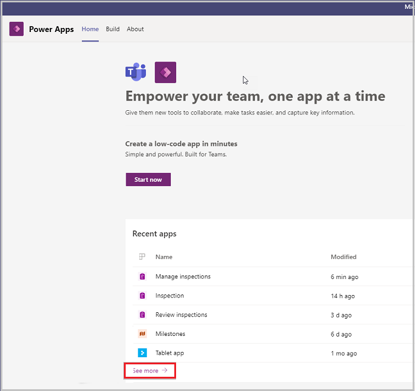
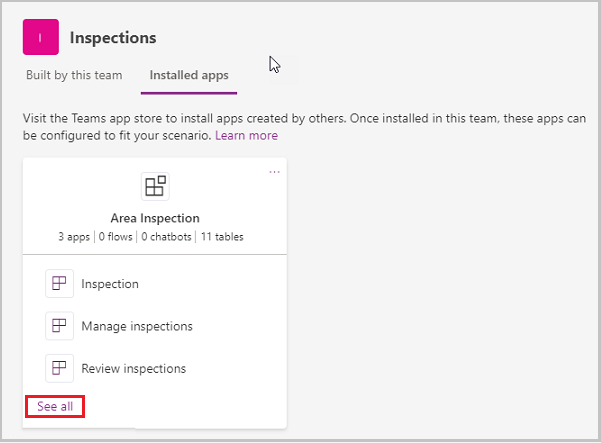
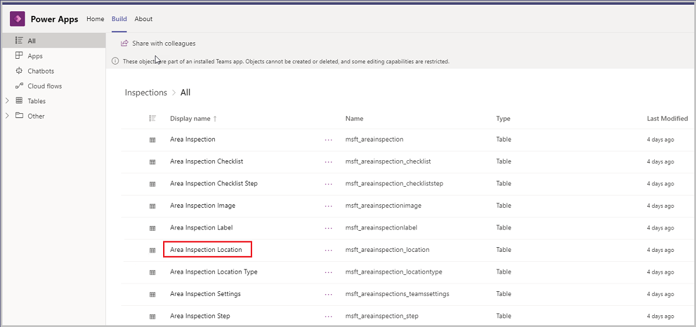
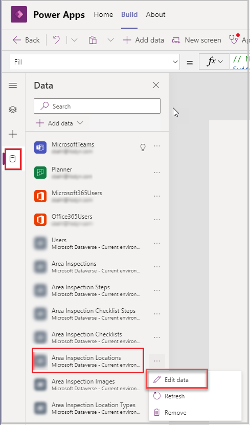
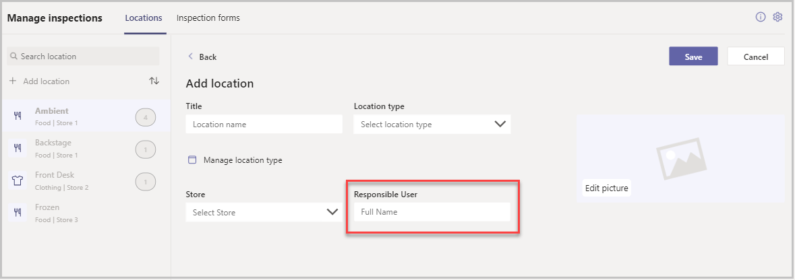
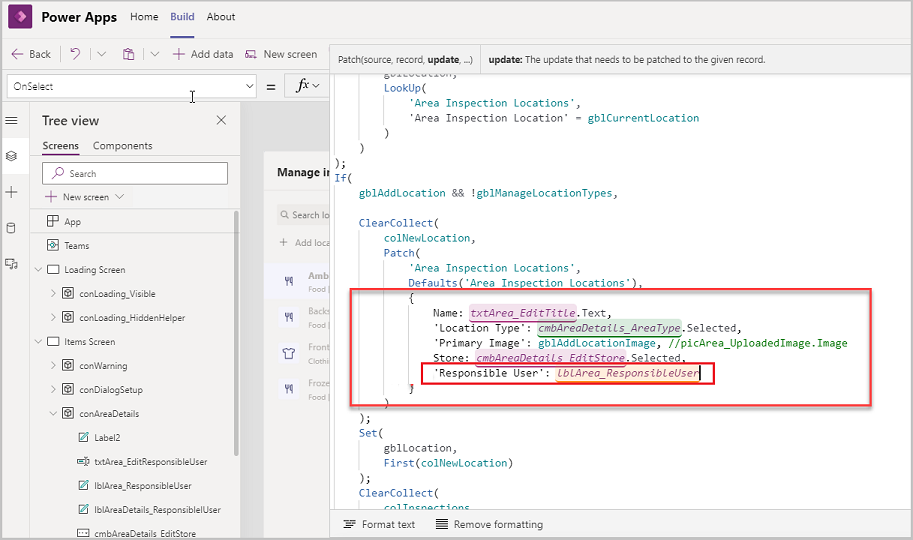
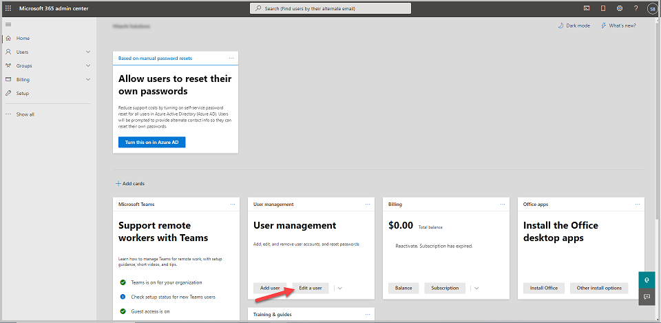
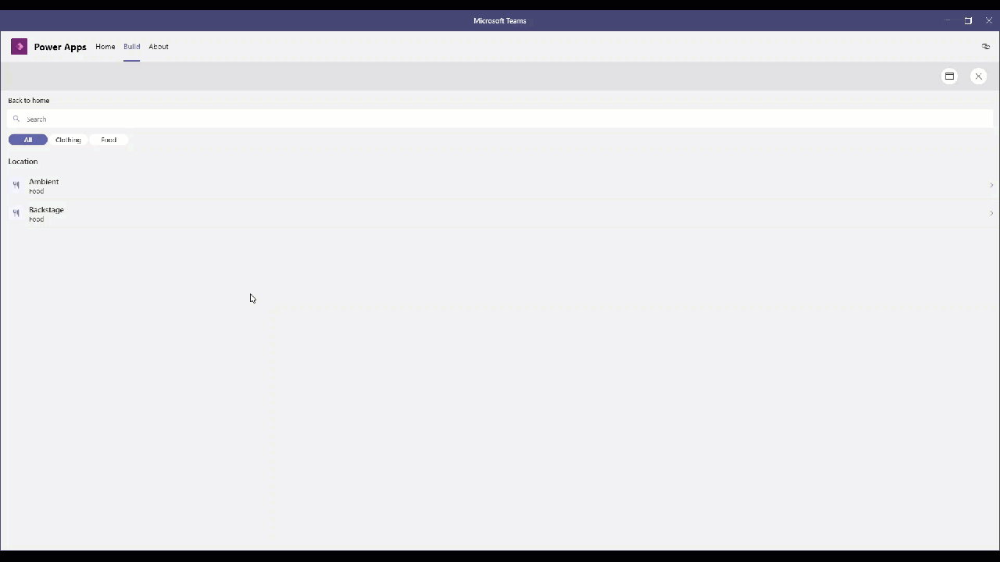
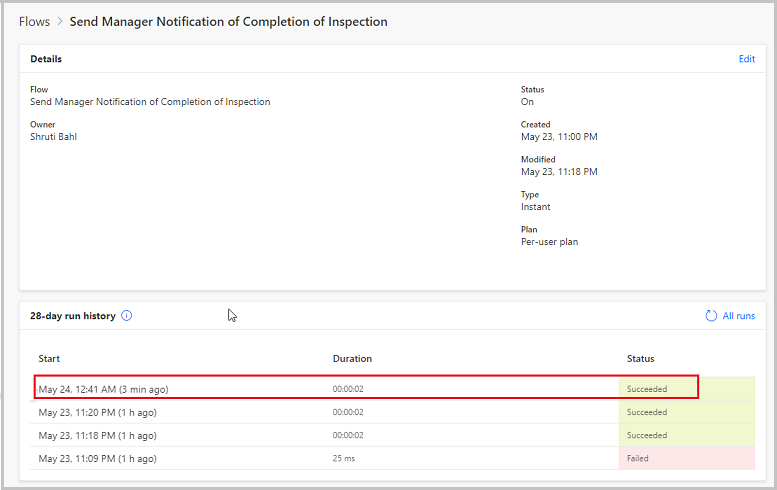
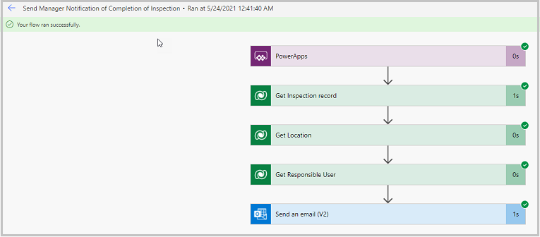

title: Notify Manager on completion of Inspection
description: Learn about the changes that would be required to notify the manager on completion of an inspection
author: sbahl10
ms.service: powerapps
ms.topic: conceptual
ms.custom: 
ms.date: 06/15/2021
ms.author: v-shrutibahl
ms.reviewer: tapanm
contributors:

- v-ljoel

# Inspections App – Notify manager on completion of Inspection

The Inspections Power Apps template allows users to create and perform inspections in the app. There are three apps, one per persona to perform,
manage, and review Inspections. The three apps are – Inspections, Manage Inspections and Review Inspections.

Let’s say you are using inspections to investigate a report of a problem in an area, and if you find the issue to still be unresolved, you want to notify the
manager of the person responsible for the area so that they can provide the employee with coaching. In this topic we will learn how to send a notification
to the manager of the person responsible for the location being inspected.

The outcome is that the inspection app can be used to verify that employees are maintaining an area and provide notification to management if there are issues. For example, the store manager may want to know if the supervisor of the electronics section of a store is properly maintaining the area of their store and if an issue is found, send their manager an email.

>  [!NOTE] Before starting this topic, please review **How to customize Inspections**

## Prerequisites

To complete this lesson, we would need the ability to login into Microsoft Teams which will be available as part of select Microsoft 365 subscriptions and will also need to have the Inspections Power Apps template for Microsoft Teams installed. This app can be installed from aka.ms/TeamsInspection.

## Login into the Manage Inspections app

1.  Login into Teams and select Power Apps from the left menu.

2.  Select Build from the top ribbon.

3.  Select Manage Inspections to open the app in the editor.


### Add a new field to the Locations table

Next, we will add a responsible person column to the location table so we can designate the responsible person for the area.

1.  On the Home screen, select See more under the Recent apps section.



2. Go to the Installed apps tab and select See all.



3. Select Area Inspection Location.



4. Select Add Column on the top left.
5. Enter the following details to create the new column and hit Done
   - Display name – Responsible User
   - Data type – Lookup
   - Related table – User


6. The Responsible User column gets created.

> [!NOTE] Users must log in to the app one time before they become able to be selected from the user table.

7. On the Build tab under Installed apps, select Manage Inspections.

8. Select databases from the left navigation menu, select Area Inspection Locations and then Edit data



9. The Responsible User ID column gets added to the Area Inspection Locations table – Update the Area Inspection Location with the Responsible User values.


### Add Responsible User field on the Items Screen – Locations table

Now that we have added the responsible user to the location, we will now display it on the Items screen.

1.  The Responsible User field needs to be added to the Display, Edit and New sections of the Items Screen.
    
2.  The controls for each of these are all on the same screen but their visibility is controlled by variables.
    
3.  Open the Items Screen by selecting it in the Tree view and select the container conAreaDetails.

4. Press down the Ctrl key and select the label Title.


5. Copy the Title label control by highlighting it and hitting Ctrl + C to copy it.

6. Then hit Ctrl + V to paste the label.

7. Update the properties of the new label
   - Text = “Responsible User”
   - X = txtArea_EditTitle.X+txtArea_EditTitle.Width+20
   - Y = If(gblEditLocation \|\| gblAddLocation, 107+150, 61+90)
8. Rename control to lblAreaDetails\_ResponsibleIUser.

9. Similarly, copy and paste the label that says Backstage and update the properties
   - Text = gblLocation.'Responsible User'.'Full Name'
   - X = txtArea_EditTitle.X+txtArea_EditTitle.Width+20
   - Y = If(gblEditLocation \|\| gblAddLocation, 136+150, 91+90)

10. Rename control to lblArea\_ResponsibleUser.

11. The screen then looks like this.


12. Now, press Alt and select the Edit label on the top right of the Items screen.

13. The Title label is same as created above.
14. Copy and paste the textbox that says Ambient and update the properties
    - Default = If(gblAddLocation, "", gblLocation.'Responsible User'.’Full Name’)
    - X = txtArea_EditTitle.X+txtArea_EditTitle.Width+20
    - Y = If(gblEditLocation \|\| gblAddLocation, 136+150, 91+90)
    - Hint Text = "Full Name"
15. Rename control to txtArea\_EditResponsibleUser.

16. The screen then looks like this.


17. Now, press Alt and select Cancel on the top right and then press Alt and select the Add location button on the top left of the Items screen.


18. Verify that the Responsible User label and the textbox show up while adding a new Location.

19. The screen then looks like this.



20. Select the Save button and on the OnSelect property, add the following formula to the Patch functions , 'Responsible User':
    txtArea_EditResponsibleUser in the two places shown below -




21. Thus, whenever a location is created or updated, the Responsible User value will also be captured and saved on the Location record.

### Publish the Manage Inspections app

1.  All the changes to the Manage Inspections app are completed.

2.  The app can now be published by selecting the Publish to Teams button on the top right.


## Edit the inspection app

Now that we have added the field to the Manage Inspections app, we will create a process to notify the manager of the responsible user when there is an issue.

1.  From the editor, after publishing the Manage Inspections app, select the Back button to go back to the Build -\> Installed Apps screen -\> Select Inspection.


2. The Inspection app opens.

### Add a Flow to send an Email to the Manager

1.  From the Tree View, select the Review Screen.

2.  Select the Continue Inspection (btnContinueSubmitInspection) button.

3.  Select the OnSelect property option and copy the entire formula from the formula bar and paste it in a notepad file to keep it handy
    
4.  Select the Continue Inspection button and select the 3 dots on top and then select Power Automate


5. Select the +Create a new flow option.

6. The new flow page opens in flow.microsoft.com.

### Create a Flow to send an email to the Manager of the Responsible User

1.  Select the PowerApps trigger from the list.

2.  Create the flow ‘Send Manager Notification of Completion of Inspection’ as shown below.
    
3.  Select the Ask in PowerApps option for the Get Inspection Record – Row ID step and for the Send an Email – To step.


4. Save the Flow.

5. Go back to the Power App editor in Teams.

6. Select this flow just created from the available flows list.

7. Most likely, the existing formula on the button will get erased out.

8. Update the Run Flow formula as shown below.

```
SendManagerNotificationofCompletionofInspection.Run(If(

!IsBlank(gblSelectedLocation.'Responsible User'.'Primary Email'),

Office365Users.ManagerV2(gblSelectedLocation.'Responsible User'.'Primary
Email').mail

),gblLastInspection.'Area Inspection');

```

9. Copy the old Continue button formula back from the notepad from Step 3 of the [preview section](#_Add_a_Flow) above/before the flow formula used in
   the last step.

10. Save the app.

### Publish the Inspection app

1.  All the changes to the Inspection app are completed.

2.  The app can now be published by selecting the Publish to Teams button on the top right.


## Verify that a manager exists for the Responsible User

1.  Open the link admin.microsoft.com.

2.  Select Edit a user.



3. Select a User and confirm that the user has a Manager assigned.

> [!NOTE] If you are working on your organization’s environment, then you would most likely not need this step. But if working from a trial environment, it is better to create another trial user and add that user as the manager to the Responsible user.

## Test the app

1.  Select the Welcome screen from the Tree view in the Editor.
2.  Hit the Preview button to run the app.


3. Select the Perform an Inspection button


4. Perform the inspection as shown below



5. The flow should run after the Submit Inspection button is selected.

6. The easiest way to confirm if the flow ran fine is by opening the Power Automate flow and checking the last run.





7. Confirm that the email was sent to the right address by clicking on and expanding the Send an email step from the flow results.

8. The email received is as shown below.


