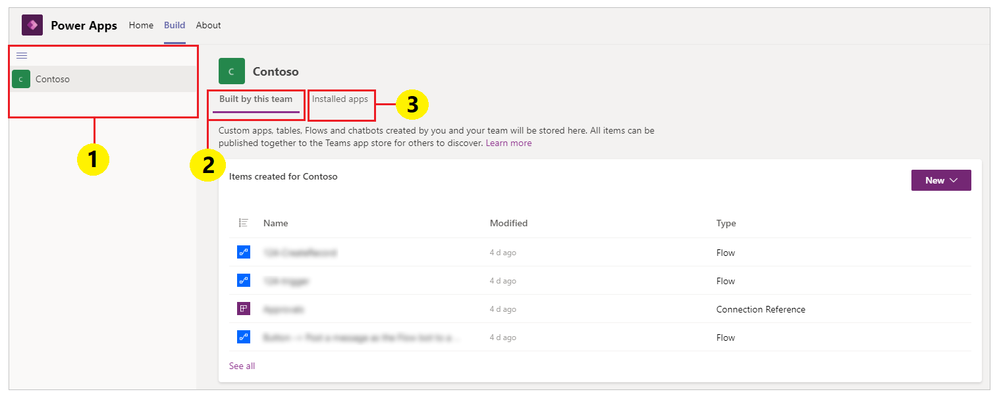
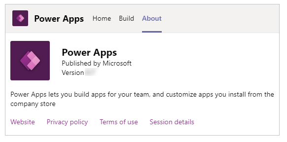
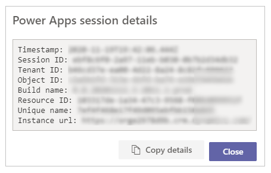

# Overview of the Power Apps app

You can use the Power Apps app to create and manage apps across the available environments for the applicable teams. Select the Power Apps app from the left pane in Microsoft Teams to open the Power Apps interface.

> [!NOTE]
> If **Power Apps** doesn't appear on the left pane, you can [install](install-personal-app.md) it. After you install the app, you need to [create your first app](create-first-app.md) to create an environment. More information: [About Teams environments](/power-platform/admin/about-teams-environment)

Three tabs are available: **Home**, **Build**, and **About**. You can start creating a new app by selecting **Create an app** on the **Home** tab.

Let's understand each tab in detail.

## Home

Your **Power Apps** experience in Teams starts with the **Home** tab. Use the **Home** tab to get started creating new apps with Power Apps. 

1. **Introduction Video**: Watch a one-minute video to find out what Power Apps in Teams is all about.

1. **Create an app**: Select **Create an app** to enter the Power Apps Studio integrated inside Teams and start building a Power Apps app. As you've learned from [Create your first app in Teams](create-first-app.md), a new environment is created for your team when you first create an app. Creating additional apps in the same team uses the environment that was already created for the team.

1. **Recent apps**: You'll find the apps that you have recently edited in this section. Select an app from this section to directly open the app inside the Studio. This section may be empty if you haven't edited any app yet.

1. **Sample apps**: This section shows available sample apps from the Teams store. You can try out these apps by selecting on these tiles and installing them for your team. More information: [Use sample apps](use-sample-apps-from-teams-store.md)

1. **Learn**: You'll find helpful articles in this section to get you started with Power Apps in Teams.

## Build hub

Select the **Build** hub to see the list of environments for each team that you're a member of, and the list of apps or objects that have been created or installed.

1. **Environments**: Each Microsoft Teams team with an environment that you have access to is listed here.

    If you have more than one team with environments created, select the team or environment you want from the left pane.

    

    Select  to collapse or expand the environment list.

    

    When you select an environment from the list, you'll see the recent resources built by the selected environment's team, or the apps installed in the selected environment on the right side of the screen.

1. **Built by this team**: This list shows all Power Apps objects such as apps, flows, and tables created in the selected environment (the Teams team). Select **New app** to create a new app. Select **See all** to open the solution explorer for the environment. More information: [Solution explorer](#solution-explorer)

    Select **See all** to view the all the components in the selected environment, and to create new apps or components.

    

    In the *Items created for* list, select an app, or a table to directly open the selection in the respective editor.

1. **Installed apps**: Shows a list of installed apps in the environment (Teams team) from the Teams app store.

    

    Select an app, or a table to directly open the selection in the respective editor.

## Solution explorer

When you select **See all** from the environment list on the **Build** hub, you'll see the Power Apps solution explorer with a tree view of the pages for the environment. To get started, select a page from the solution explorer on the left.

### All

Shows all available Power Apps objects such as apps, flows, and chatbots in the selected environment.

Select **New** to create new apps, flows, or tables.

### Apps

Shows the apps created with Power Apps. More information: [Manage your apps](manage-your-apps.md)

### Flows

Shows all the Power Automate flows in the selected team's environment. Power Automate is a service that helps you create automated workflows between your
favorite apps and services to synchronize files, get notifications, collect data, and more. Different types of flows are available. More information: [Get started with Power Automate](/power-automate/teams/overview.md)

### Tables

In Power Apps, a *table* defines information that you want to track in the form of records, which typically include properties such as company name, location,
products, email, and phone. You can then surface that data by creating an app that refers to the table. For more information about tables, go to [Tables overview](../maker/data-platform/entity-overview.md).

### Other - Connection references

Lists connections available to the environment. Data is stored in a data source, and you bring that data into your app by creating a connection. A Power Apps connection connects your app to such a data source. You can use several other types of connections to connect to the Dataverse for Teams environment within the team. More information: [Overview of canvas-app connectors](../maker/canvas-apps/connections-list.md)

### Other - Environment variables

Lists the environment variables for your selected team's environment. Apps and flows often require different configuration settings across environments.
You can use environment variables as configurable input parameters separately to manage data, rather than hard-coding values in your customization or using additional tools. More information: [Environment variables overview](../maker/data-platform/environmentvariables.md).

## About

Select the **About** tab to view the version of the installed Power Apps app.

You can get your current session details by selecting the **About** tab and then selecting **Session details**. The session details include
useful information that you can then share with others when investigating an issue or working with support teams.

- **Timestamp**: Date and time in Coordinated Universal Time (UTC).
- **Session ID**: Unique GUID representing the current Power Apps session.
- **Tenant ID**: Tenant ID of Teams and Power Apps.
- **Object ID**: Object ID of the user account in Azure Active Directory.
- **Build name**: Build and version details of the Power Apps app.
- **Resource ID**: ID of the resource.
- **Unique name**: Unique name of the Dataverse organization.
- **Instance url**: URL of the Dataverse instance.

> [!NOTE]
> Session details are only used when you reach out to Microsoft Support to investigate an issue.

## Canvas apps terminology reference and definitions

While creating canvas aps using Power Apps from the Teams interface, you need to understand the terms and definitions of various objects, options, and actions in an app. The following table defines these canvas app terms.

| **Component or action**                                                                                        | **Description**                                                                                                                                                                                              |
|----------------------------------------------------------------------------------------------------------------|--------------------------------------------------------------------------------------------------------------------------------------------------------------------------------------------------------------|
| [Power Apps Studio](../powerapps-overview.md#power-apps-for-app-makerscreators) | An application used to make or author a canvas app.                                                                                                             |
| [Canvas app](../maker/canvas-apps/getting-started.md)                           | An app that you can create from scratch or by using any available template through Power Apps Studio.                                                                                             |
| [Model-driven app](../maker/model-driven-apps/model-driven-app-overview.md)     | An application based on Dataverse forms, views, tables, columns, and other components.                                                                                                                     |
| [Connector](/connectors/connectors)                                                  | A connection object that connects an app with a data source. For example, a connector for SharePoint or a connector for OneDrive.                                                                                |
| [Control](../maker/canvas-apps/reference-properties.md#controls)                | An object that can be added on the canvas to provide certain app functionality.                                                                                                                              |
| [Property](../maker/canvas-apps/reference-properties.md#all-properties)         | Behaviors representing the controls available in an app.                                                                                                                                                     |
| [Function](../maker/canvas-apps/formula-reference.md)                           | Readily available functionality to extend the behavior of a control or app.                                                                                                                                      |
| [Formula](../maker/canvas-apps/formula-reference.md)                            | A combination of one or more functions to accomplish a certain task or action.                                                                                                                                 |
| [Screen](../maker/canvas-apps/add-screen-context-variables.md)                  | The visible area of an app enclosing available visible controls. An app can have multiple screens.                                                                                                               |
| [Component](../maker/canvas-apps/create-component.md)                           | Reusable combinations of controls that can be defined, saved, and used for new apps, as defined by the maker or user.                                                                                     |
| [Save an app](../maker/canvas-apps/save-publish-app.md#save-changes-to-an-app)  | Saving an app for the first time, or saving new changes to an app.                                                                                                                                           |
| [Publish an app](../maker/canvas-apps/save-publish-app.md#publish-an-app)       | Making an app available to the app store for general consumption.                                                                                                                                            |
| [Versions](../maker/canvas-apps/save-publish-app.md#identify-the-live-version)  | Each time an app is saved, a new version is created that you can [restore](../maker/canvas-apps/restore-an-app.md) by using functionality available at the time you save the app. |
| [Share an app](../maker/canvas-apps/share-app.md)                               | Allowing users or groups to use the app, as consumers or co-owners.                                                                                                                                          |

### See also

[Understand Power Apps Studio](understand-power-apps-studio.md)  
[Create your first app](create-first-app.md)

[!INCLUDE[footer-include](../includes/footer-banner.md)]