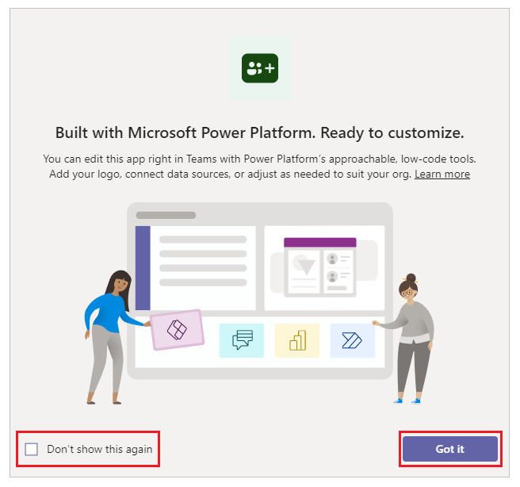
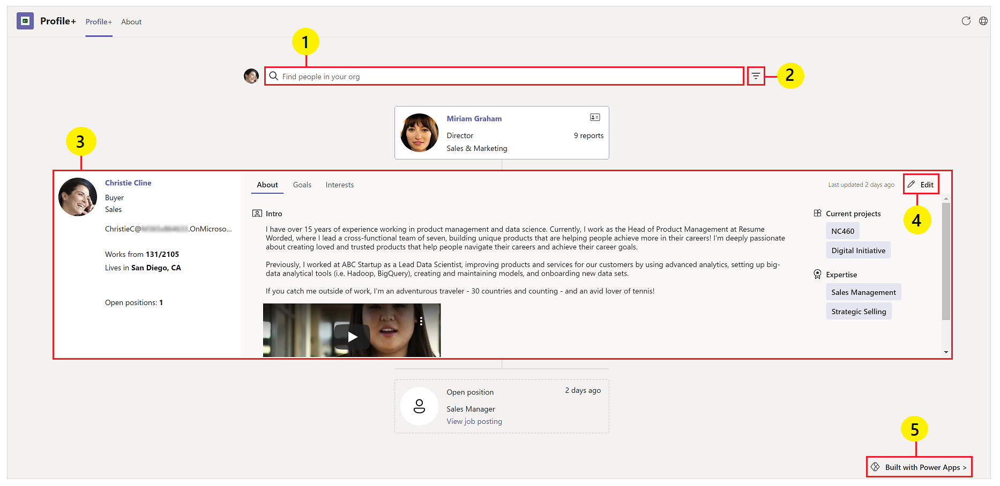

# Profile+ sample app (Preview)

[This article is pre-release documentation and is subject to change.]

In this tutorial, learn about the Profile+ sample app, and how to use the app effectively.

## Overview

The Profile+ sample app for Microsoft Teams provides a simple way to browse information about people in your organization and add more detail to your profile.

Benefits of using the Profile+ app:

- Browse your organization hierarchy.
- View contact information for employees and colleagues.
- Add additional information about goals, related projects, and expertise.
- Create and view open positions.

> [!NOTE]
> - Before you can use this app, you may be asked for your permissions to use the connection. More information: [Allow connections in sample apps](use-sample-apps-from-teams-store.md#step-1---allow-connections)
> - This app is available in three different Teams themes: Default, Dark and High contrast. When you [change the theme in Teams](https://support.microsoft.com/en-us/office/change-settings-in-teams-b506e8f1-1a96-4cf1-8c6b-b6ed4f424bc7), the app automatically updates to match the selected theme. More information: [Get the Teams theme using the Teams integration object](use-teams-integration-object.md#get-the-teams-theme)

## Prerequisites

Before using this app:

2. Install the app by sideloading the manifest in Microsoft Teams. You can download the manifest from https://aka.ms/TeamsProfilePlus..
3. Set up the app for the first use.

> [!IMPORTANT]
> - This is a preview feature.
> - [!INCLUDE[cc_preview_features_definition](../includes/cc-preview-features-definition.md)]

## Open the Profile+ app

To open the Profile+ app:

1. Sign-in to Teams.

1. Select the Team.

1. Select the channel where you installed the **Profile+** app.

1. Select the **Profile+** tab.

1. Select **Allow** if the app asks for your permissions to use the connectors.

1. You can learn more about extending app capability on the splash screen. Select **Got it** to close the screen, and go to the app. To hide this message while opening this app again, select **Don't show this again** before you select **Got it**.

    

## Understand the Profile+ interface

The Profile+ app gives you easy access to details about the people of your company, details about their goals, projects, and open positions.

1. **Search for people** - find people in your organization

1. **Filter profile** - filter profiles based on projects and areas of expertise.

1. **View your profile**

1. **Edit your profile**

    - Add details about your position such as social media and interests.
    - Add tags for projects in areas of expertise.
    - Define goals.
    - Add a video with more information about your role.

1. **Edit the app** in Power Apps Studio - Profile+ is built in Microsoft Power Apps. You can edit the app using Power Apps Studio in Microsoft Teams. When you select the **Built with Power Apps** button, the app launches Power Apps Studio for you to make changes to the app.

## Search for a person

To find a person in your organization:

1. Open Microsoft Teams and select the Team in which the Profile+ app is added.

1. Select the **Profile+** tab.

1. Select the search field.

1. Enter the name of the person you want to find.

1. People in your organization matching the search keywords will be displayed. Select a person you want.

1. The profile of the selected person will be displayed. From this screen you can see information about the person’s goals, interests, projects, and areas of expertise. You can also view information about the selected person’s manager, and others who report to the selected person, including any open positions.

## Filter by project or expertise

You can filter the list of people in your organization based on project and area of expertise. You can filter by project, expertise, or both project and expertise.

1. Select the filter button.

1. From the pop-up select project or expertise.

1. Select **Apply**.

    

1. People matching the selected filters will be displayed.

## Edit your information

You can edit your record to add additional information about your goals, projects, area of expertise, and interests.

1. On your profile, select **Edit** from the right-side of the screen.

1. Update details for areas such as **About**, **Goals**, **Interests**, and **Open Positions**.

1. Select **Save**.

## Add an open position

Open positions allow you to give visibility to positions needing to be filled, making it easy for others in your organization to learn about open positions.

1. Go to your profile.

1. Select **Edit** from the right-side of the screen.

1. Select the **Open Positions** tab.

1. Select **Add open position**.

1. Enter the **Job title**, **Job link**, and **Job description**.

1. Select **Save**.

    

Open positions now appear in Profile+ linked to the manager responsible for them.

## Edit the Profile+ app in Power Apps

1. In Microsoft Teams, go to the team in which Profile+ is added.

1. Open the Profile+ tab.

1. In lower right corner, select **Built with Power Apps**.

1. Select **Customize using Power Apps**.

    

1. Microsoft Teams desktop app opens Power Apps app interface.

1. Select **Profile+** app from the **Recent apps** section to edit the app using Power Apps Studio. If the app doesn't show up in **Recent apps** section, use the [Build hub](overview-of-the-power-apps-app.md#build-hub) to open the app in Studio.

### See also

- [Customize sample apps](customize-sample-apps.md)
- [Sample apps FAQs](sample-apps-faqs.md)
- [Bulletins (Preview) sample apps](bulletins.md)
- [Employee ideas sample app](employee-ideas.md)  
- [Issue reporting sample apps](issue-reporting.md)
- [Milestones (Preview) sample app](milestones.md)
- [Use sample apps from the Microsoft Teams store](use-sample-apps-from-teams-store.md)

[!INCLUDE[footer-include](../includes/footer-banner.md)]
