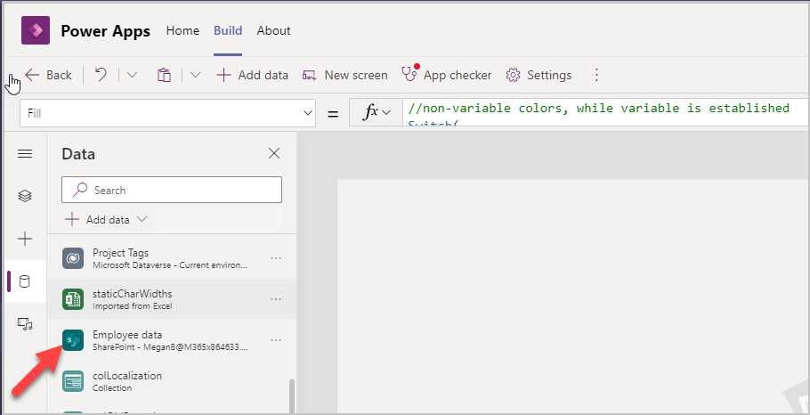
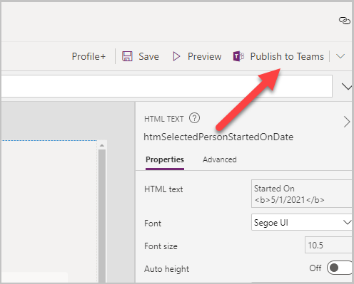

# Extend Profile + by adding additional org specific data

Profile+ solution helps you quickly look up colleagues, understand org structure and roles, and learn about open positions. You can update your profile right from within Teams and express your personality by adding an introduction and even a video. You can add additional information that will help colleagues to know you better – such as your current projects, areas of expertise, goals and interests. The ability to filter by project and expertise creates new opportunities for like-minded people to find one another and connect.

But what if you want to add data from another source that has additional information about the people in your organization? For example, you might have data in your accounting or HR system, and you can easily bring this data into the Profile + app.

In this topic we will learn how to capture data from a different data source and display in the app. Power Apps can connect to hundreds of different data sources using out of the box connectors. For the purpose of our example here, we will pull data from a SharePoint list containing information about your employees and display in the Profile+ app, but this could be any system that has employee data, such as your HR system or training database.

> [!NOTE]
>
> Before starting this topic, please review **How to customize Profile Plus**.

## Prerequisites

To complete this lesson, we would need the ability to login into Microsoft Teams, which will be available as part of select Microsoft 365 subscriptions and will also need to have the Profile+ Power Apps template for Microsoft Teams installed. This app can be installed from https://aka.ms/TeamsProfilePlus .

## Login into the Profile + app

1.  Select the Power Apps icon on the left and go to the Build tab.
2.  Select Installed Apps and select Profile + to open the app.
3.  The Profile+ app opens.

## Add the data file as a data source connection to the app

1.  Power Apps can connect to hundreds of different data sources.

2.  For the purpose of our example, we will use a SharePoint list that consists of Employee data.

1.  To add this SharePoint list as a data source connection to the Profile +     Power App, select Data from the left navigation menu > Add data -> Connectors > SharePoint > Add a connection (if SharePoint connection  does not already exist) > Select the option Connect directly \> select the button Connect
2.  The various SharePoint Sites available to connect will appear
3.  Select the site and then the SharePoint list that we would like to connect to
4.  The SharePoint list shows up in the list of data sources

## Add data from the data source to the app

1.  Select the Tree view from the left navigation menu.
2.  Select the Profile screen.
3.  The Profile screen appears as shown below.

1.  Notice the two HTML text controls **Works from**  and **Lives in**. 
2.  In our example, we will replicate the HTML text and populate it with the Started On date from the SharePoint List.
3.  Copy the HTML Text Works From and paste it (copying it so that all the other properties are copied as well).
4.  Update the following properties of the control:

    -  Name : htmSelectedPersonStartedOnDate

    -  Y Position : htmSelectedPersonResidence.Y + htmSelectedPersonResidence.Height – 5
        
    -  HTMLText : "Started On \<b\>" & Text(LookUp('Employee data', Title = locSelectedPerson.mail,'Start Date')) & "\</b\>"
    
5.  Thus, using the SharePoint connector and the Lookup function above, we were able to display data from the SharePoint List into the
    Profile + app.
    
6.  Data from any connector can be pulled into the App with the method shown above.

### Publish the Profile+ app

1.  All the changes to the Profile+ app are completed.

2.  The app can now be published by selecting the Publish to Teams button on the top right.

## Test the app

1.  On the Profile screen, once you make the change for the above listed scenario, hit the Preview button to run the app.
    
2.  Make sure to check for responsiveness by shrinking the size of the screen when testing in the Window mode.
