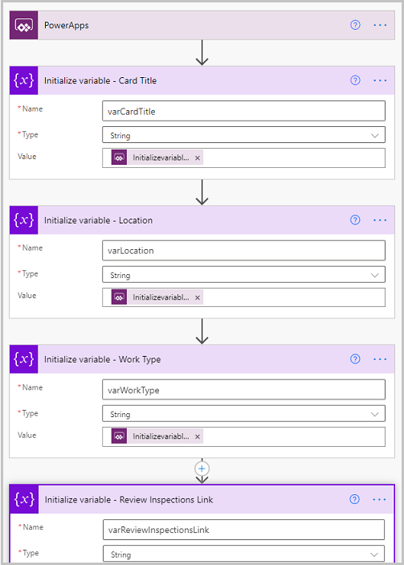
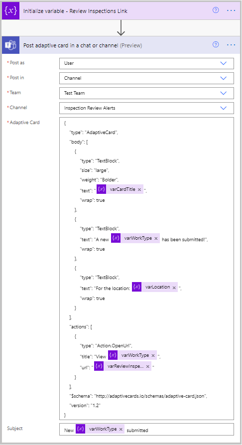
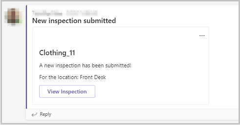

# Inspection app - Update inspection notification to use an adaptive card

In this topic, you will be changing the inspection notifications that come from the Inspections app from HTML-based messages in Teams to adaptive cards in Teams.

The reason you would want to do this is to make notifications more interactive. Posts to channels are great, but they are a one-way communication. Adaptive cards offer more interactive notifications, allowing more configurability of the message contents and the ability to hyperlink to the app or provide the ability to update the app data from the card.

## Prerequisites

You must have installed and configured [the Inspection sample apps](inspection.md) as well as proper permissions to edit the app in Teams.

## Create the Power Automate Flow to generate the adaptive card

Begin by opening the Power Apps for Teams personal app and locating the Inspection app. For ease of use, you can right click on the Power Apps logo in
Teams and select **Pop out app** to work with the Power Apps studio in its own window. Select the Inspection app to open the Power Apps studio in Teams and begin editing the app. In the top menu bar, select the vertical ellipsis to the right of the **Settings** option. This will reveal three options: **Power
Automate**, **Collections**, and **Variable**s.

Choose **Power Automate** to open the **Data** sidebar menu on the right. You will see any Flows that are available here.

Choose **Create a new flow**. This will launch the Power Automate studio in a separate browser window. Check to ensure that you are in the correct environment for the Team containing the app you are trying to change before continuing.

In the upper left-hand area, you will see that the Flow has a name of **Untitled**. Select that text to change the name to **Inspection Adaptive Card
To Teams**.

Add the Power Apps trigger. This will allow us to trigger the Flow from Power Apps as well as to add values to pass from Power Apps to Power Automate.

Next, add four **Initialize Variable** actions. These will be used to store information from Power Apps for and to store a link to the Review Inspections
app. Rename each of the actions as follows:

-   Initialize variable - Card Title

-   Initialize variable - Location

-   Initialize variable - Work Type

-   Initialize variable - Review Inspections Link



Set each of the Type values to String and add a name for each: varCardTitle, varLocation, varWorkType, and varReviewInspectionLink, respectively.

For the Card Title, Location, and Work Type actions, select the Value field area to reveal the Dynamic content menu. Select **Ask in Power Apps**. This will
create a variable in the Power Apps trigger to allow passing data from the app to Power Automate.

For the Review Inspections Link action, we will the link to the tab the app is in. Open the Review Inspections app in the Teams channel, and select the button in the upper right corner to pop out the app to its own window. From there you can copy the direct URL to the app. Navigate back to the Power Automate studio. Right-click on the Value field area in the Review Inspection Link action and Paste the link.

> NOTE: you can make the hyperlink deep link to a specific record using the instructions here:
> <https://docs.microsoft.com/microsoftteams/platform/concepts/build-and-test/deep-links>.

Add a **Post adaptive card in a chat or channel** action. Set the **Post as** value to *User* and the **Post in** value to *Channel*. In the **Team** and **Channel** fields, select the Team and Channel that you would like to post the adaptive card to.

You can generate your adaptive card json by going to <https://adaptivecards.io>. In the **Adaptive Card** field, copy and paste the following:

```
{

"type": "AdaptiveCard",

"body": [

{

"type": "TextBlock",

"size": "large",

"weight": "Bolder",

"text": "@{variables('varCardTitle')}",

"wrap": true

},

{

"type": "TextBlock",

"text": "A new @{variables('varWorkType')} has been submitted!",

"wrap": true

},

{

"type": "TextBlock",

"text": "For the location: @{variables('varLocation')}",

"wrap": true

}

],

"actions": [

{

"type": "Action.OpenUrl",

"title": "View @{variables('varWorkType')}",

"url": "@{variables('varReviewInspectionsLink')}"

}

],

"\$schema": "http://adaptivecards.io/schemas/adaptive-card.json",

"version": "1.2"

}
```

In the Subject field, copy and paste the following:

```
New @{variables('varWorkType')} submitted
```



This will set the adaptive card’s characteristics and use the variables from Power Apps in the adaptive card.

Save and Test the Flow to ensure it works properly. Selecting Manually from the Test Flow sidebar will allow you to enter the Card Title, Location, and  Work Type variables.

## Add the Flow to the Inspection app

Once you have verified that the Flow is working properly, you can add it to the Inspection app.

Navigate back to the Power Apps studio where the Inspection app was being edited. In the Tree View on the left-hand side, select the Review Screen. Next, select the Submit inspection button (named btnContinueSubmitInspection in the Tree View). We will add the Power Automate Flow we just created to this button.


First, we will copy the code currently in the OnSelect property of the button. One issue with adding Power Automate Flows to controls in Power Apps is that any existing code on the control will be removed. To work around this, paste the copied code into a text editor, such as Notepad, and edit it to paste back in the OnSelect property when done. After pasting the code, ensure that all the code was added.

With the button still selected, select the vertical ellipsis to the right of the Settings in the upper menu bar. Select Power Automate, which will reveal the
**Data** sidebar. You should now see the **Inspection Adaptive Card To Teams** Flow in the Available flows section. Select it to add it to the button.

You will now need to edit the pasted code. Find and remove the following text:

```
MicrosoftTeams.PostMessageToChannelV3(

gblPlannerGroupId,

gblRecordSettings.'Parameter (Notification Channel Id)',// gblParamChannelId,

{

content: Concatenate(

With(

{

varDefault: "A new " & Lower(gblWorkType) & " has been submitted!",

varOOBTextId: "\_translateCommon\__" & gblWorkType & "Submitted"

},

With(

{

varLocalizedText: LookUp(

colLocalization,

OOBTextID = varOOBTextId,

LocalizedText

)

},

Coalesce(

varLocalizedText,

varDefault

)

)

),

//"A new " & Lower(gblWorkType) & " has been submitted!",

"\<br\>\</br\>",

"\<b\>" & With(

{

varDefault: "For the Location:",

varOOBTextId: "\_translateCommon\_\_InspectionForLocation"

},

With(

{

varLocalizedText: LookUp(

colLocalization,

OOBTextID = varOOBTextId,

LocalizedText

)

},

Coalesce(

varLocalizedText,

varDefault

)

)

) & " " & "\</b\>",

//"\<b\>For the Location: \</b\>",

gblLastInspection.Location.Name

),

contentType: "html"

},

{subject: gblLastInspection.Name}

)
```

Where the removed text was, put the following:

```
InspectionAdaptiveCardToTeams.Run(gblLastInspection.Name,
gblLastInspection.Location.Name, Lower(gblWorkType))
```

This contains the reference to the Flow we just added as well as the variables to pass to Power Automate.

Copy the entirety of the text that was just edited and paste it back into the OnSelect property of the Submit inspection button. Verify that there are no
errors on the button.

Select the Welcome Screen from the Tree View, preview the app, and input a test inspection to verify that the Flow is posting the adaptive card to the Team channel that you defined in the Flow.


