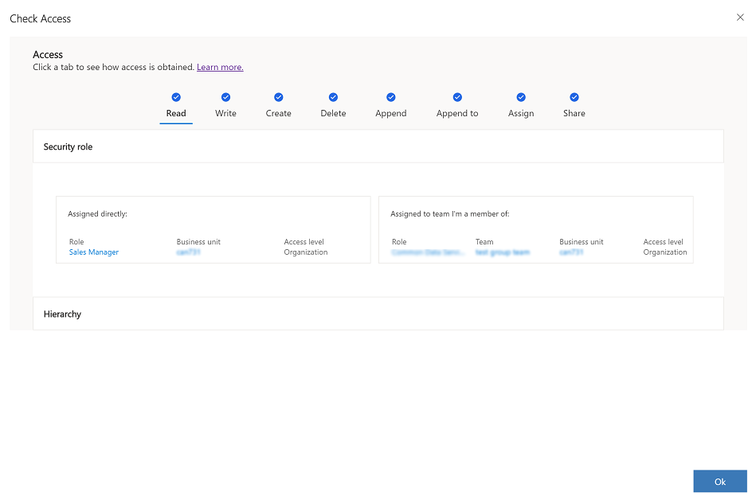
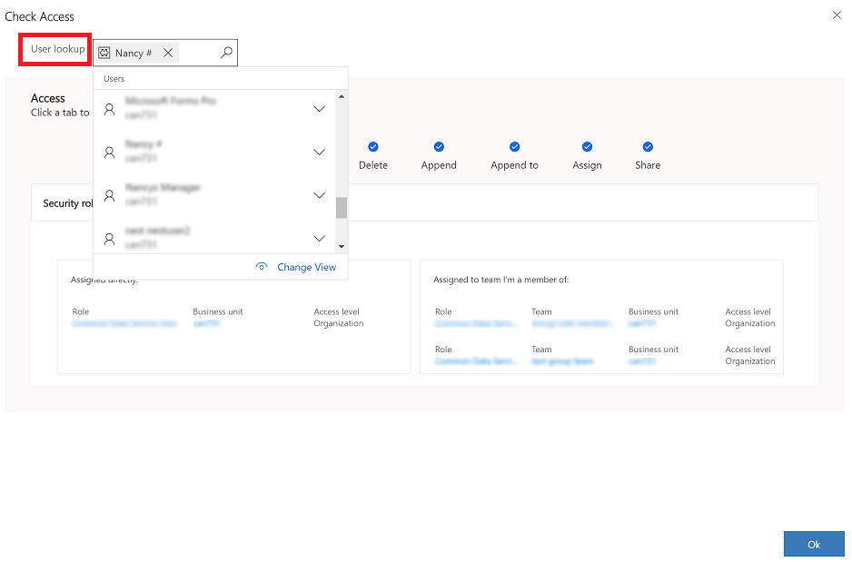

# Check your user access to a row

To perform an action on a row, a user needs to have the required privilege assigned through a security role or the user must be a member of a team that has a security role with assigned privileges.

To perform actions on a row, the system checks your privileges and if the privilege check passes, then the system performs an access check. The access check verifies that you have the required rights to perform actions on a row such as read, write, create, delete, append, append to, share, and assign.

You can have access rights to perform an action on a row through ownership, role access, shared access, or hierarchy access.

|Access type|Description|  
|---------------|-----------------|  
|**Ownership**| User owns the row or belongs to a team that owns the row.|  
|[**Role access**](/power-platform/admin/how-record-access-determined#role-access)|User has access to perform an action on a row because of their security role.|  
|[**Shared access**](/power-platform/admin/how-record-access-determined#shared-access)| The row is shared with a user, team, or organization by a user that has appropriate share rights.|  
|[**Hierarchy access**](/power-platform/admin/how-record-access-determined#hierarchy-access)|Hierarchy access only takes place if hierarchy security management is turned on for the organization and the table. The user also needs to be a manager.

For more information on how privileges and access checks work, go to [How access to a row is determined](/power-platform/admin/how-record-access-determined).

## Check your access to a row

1. Select a row and then select **Edit** on the command bar.

    > [!div class="mx-imgBorder"]
    > 
  
2. On the open row, select **Check Access** on the command bar.
3. The **Check Access** dialog box will appear and display your access information.

    > [!div class="mx-imgBorder"]
    > 
    
Contact your administrator if you don't have the required access. Only an administrator can edit your security role and privileges. To find your administrator, go to [Find your administrator or support person](./find-admin.md).

## Check another user's access to a row

If you're an administrator, you can check the access another user has to a row.

1. Open a row, select **Check Access** on the command bar.
2. In the **User Lookup** field select or enter a user name to search for the user.

   > [!div class="mx-imgBorder"]
   > 
  
3.   The **Check Access** dialog box will appear and display the user's access information.

## Check all users who have access to a row

[!INCLUDE [cc-beta-prerelease-disclaimer](../includes/cc-beta-prerelease-disclaimer.md)]

The admin, owner of the record, or users who have access to a row can share the row with other users for collaboration. 

To see who has access to a row and their respective access level, complete the following steps.

1. Select a row and then select **Edit** on the command bar.

    > [!div class="mx-imgBorder"]
    > 
  
2. Select **Check Access** on the command bar.
3. In the **Check Access** window, select **Who has access**.

  :::image type="content" source="../media/who-has-access.png" alt-text="Select who has access":::

> [!NOTE]
> The manager list from [heirarchy and position security](/power-platform/admin/hierarchy-security.md#manager-hierarchy-and-position-hierarchy-security-models) is not shown under **Who has access** as this list can be long.

[!INCLUDE[footer-include](../includes/footer-banner.md)]
