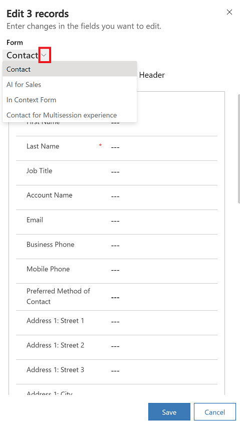

 # Edit multiple rows
 
 [!INCLUDE [cc-beta-prerelease-disclaimer](../includes/cc-beta-prerelease-disclaimer.md)]
 
You can edit multiple rows in model-driven apps and quickly update several columns of data accross multiple rows in a single action. This is useful in scenarios when you need to update the same column for multiple rows.

When you edit multiple rows you can select the form that that you want to edit. Columns such as timeline wall, quick view forms, reference panel, and etc. aren't available when you're editing multple rows.

1. To edit multiple rows, go to view page with the list of rows and select two or more rows.
2. On the command bar, select **Edit**.

   

The **Edit (number of rows) records** dialog opens with the default form for the table.

> [!div class="mx-imgBorder"]
> 

Legend

1. Shows the number of rows that you're editing.
2. Shows the form title. 
3. All the data is available on the form, including columns that are on other tabs. Select a tab to edit the columns on the form. The header column is always listed on the last tab. 
4. If you changed the data for a required column, it needs to contain data otherwise you won't be able to save your changes.
5. Shows the details of the form that you can edit.
6. Save or cancel your changes. Saved changes are saved for all selected rows.

## Switch forms

When you're in edit mode, you an easily switch from the default form to another form. To switch forms, select the chevron icon and then select the form you want to edit.

> [!div class="mx-imgBorder"]
> 

