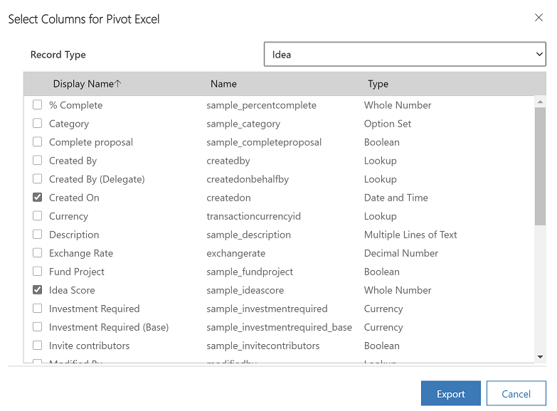

# Export to an Excel PivotTable

You can export app data to an Office Excel PivotTable to see patterns and trends in data. An Excel PivotTable is a great way to summarize, analyze, explore, and present your app data. You can export up to 100,000 rows at a time.  
  
The option to export data to an Excel PivotTable isn’t available in all row types. If you don’t see the option, it’s not available for that row.  
  
1. On the left nav, select a table.
2. On the command bar select the **Export to Excel** menu, and then select **Dynamic PivotTable**.  

   > [!div class="mx-imgBorder"] 
   > 
  
3. In the **Select Columns for Pivot Excel** dialog box, select the column settings and then select **Export**.

   > [!div class="mx-imgBorder"] 
   > 

  
   By default, the **PivotTable Column List** includes only columns that are displayed in the **Select Columns for Pivot Excel** list.  
  
3. Select **Save** and then save the .xlsx file. Make note of the location where you saved the file.  
  
   > [!NOTE]
   > If you’re going to edit the data file later, it’s recommended that you save the file before you open it. Otherwise, you might get this error message: **Excel cannot open or save any more documents because there is not enough available memory or disk space.**  
   > 
   > To fix the issue:  
   > 
   > 1. Open Excel and go to **File** > **Options** > **Trust Center**.  
   > 2. Select **Trust Center Settings** and then select **Protected View**.  
   > 3. Under **Protected View**, clear the check boxes for all three items.  
   > 4. Select **OK** > **OK**.  
   > 
   > We still strongly recommend that you save and then open the data file rather than disabling protected view, which might put your computer at risk.  
  
4. Open Excel and then open the .xlsx file you saved in the previous step.  
  
5. If you see the security warning **External Data Connections have been disabled**, select **Enable Content**.  

   > [!div class="mx-imgBorder"] 
   > 
 
  
7. Drag the columns from the PivotTable Column List to the PivotTable. For more information, see [Excel Help](https://support.microsoft.com/excel).  
  
## Tips  
  
- In Power Apps, currency values are exported to Excel as numbers. After you complete the export, see the Excel Help topic “Display numbers as currency" to format the data as currency.
  
- The date and time values that you see in the app show up only as Date when you export the file to Excel, but the cell actually shows both the date and time.  
  
- If you’re going to make changes and import the data file back into the app, remember that secured, calculated, and composite columns (such as Full Name) are read-only and can’t be imported into the app. You’ll be able to edit these columns in Excel, but when you import the data back into the app, these columns won’t be updated. If you want to update these columns, such as a contact’s name, it’s recommended that you use that view to export your data, update it in Excel, and import it back to the app for changes.  
  
 

[!INCLUDE[footer-include](../includes/footer-banner.md)]
