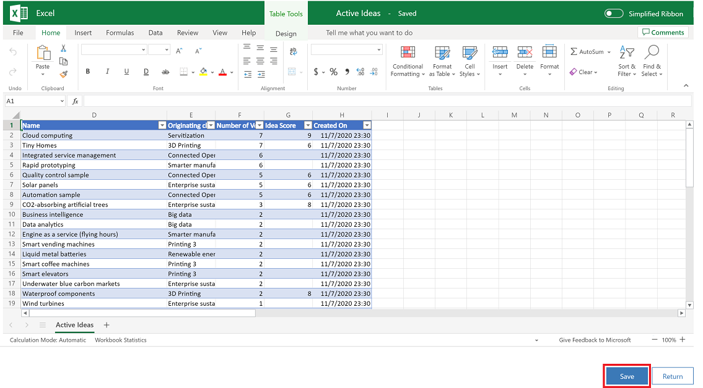

# Update your app data using Excel Online 

Open your app data in Excel Online to make quick edits or do a ad-hoc analysis of your app data. You can make changes to the app data in Excel Online and then save the updated information to your app. 

Remember to keep the existing format of the Excel cells to prevent problems during import. Any information added to the spreadsheet, such as graphs, charts, or colors, will not be saved. Updated data in an app isn't immediately be reflected in Excel Online if the same view was opened in the last two minutes in Excel Online. After that time frame, any updated data should show in Excel Online.

The option to open data in Excel Online isn’t available for all tables. If you don’t see the option for a table then it’s not available for that table.
  
 > [!NOTE]
   > - This feature requires that you have an Office 365 subscription or a subscription to an online service such as SharePoint Online or Exchange Online and a Microsoft account.    

1. From the left nav, select a table.

3. On the command bar select the **Export to Excel** menu and then select **Open in Excel Online**. 

   > [!div class="mx-imgBorder"] 
   > 

3. When Excel Online open make your edits and when you're done select **Save**.

   > [!div class="mx-imgBorder"] 
   > 
   
4. You're changes are submitted for import. To track the progress of the import, select **Track Progress**.

   > [!div class="mx-imgBorder"] 
   > 

### Tips

- The data for *ad-hoc* analysis with Excel Online is stored temporarily. Any additions, such as charts, calculations, and columns, won’t be saved back to the app from the ad-hoc analysis in Excel Online.  
- The file import might fail if you make a lot of changes. If you need to make a lot of changes to your data and import it back to the app, it’s recommended that you export the worksheet in Excel instead.  
- By design, you can’t do a **File** > **Save As** in Excel Online. If you do, you’ll get a **Can’t Save Workbook** error message.
   

  

 

[!INCLUDE[footer-include](../includes/footer-banner.md)]
